# Course Assignments

Four graded assignments (20 pts each) from the *Flying Robots* course (TU Berlin / RIG, Nov–Dec 2025).
All implemented in Rust; real-hardware flights use a Crazyflie 2.1 with Flow Deck v2 + Multi-ranger Deck.

> **Note on approach:** The assignments specify porting controller/estimator code *into* the Crazyflie
> firmware (via `bindgen`, `no_std`, uSD-card logging). We took an equivalent but simpler route: all
> algorithms run **PC-side in real time**, communicating with the drone over radio (Crazyradio PA).
> The math is identical; the architecture avoids the firmware build toolchain while still running on
> real hardware with real sensor data.

---

## Assignment 1 — Dynamics Simulation & Integrator Comparison

### Goal
Build a rigid-body multirotor simulator, compare numerical integrators (Euler, RK4, exponential),
and validate the dynamics model against real flight data.

### What we did
- Implemented full 6-DOF quadrotor dynamics (SE(3) rigid body) with motor mixing.
- Compared four integrators: Euler, RK4, exponential-Euler, exponential-RK4.
- Validated against the course-provided dataset (`fr00.csv`) by replaying IMU inputs and comparing
  simulated state to logged firmware state.

### Key code
| File | Description |
|------|-------------|
| `src/dynamics/` | MultirotorState, MultirotorParams, MultirotorSimulator |
| `src/integration/` | Euler, RK4, ExpEuler, ExpRK4 integrators |
| `src/bin/assignment1.rs` | Simulation binary: integrator comparison + fr00 validation |
| `scripts/plot_assignment1.py` | Plots: step response, integrator drift, validation vs fr00 |

### Results
```
cd flying_drone_stack && cargo run --release --bin assignment1
~/.pyenv/versions/flying_robots/bin/python flying_drone_stack/scripts/plot_assignment1.py
```

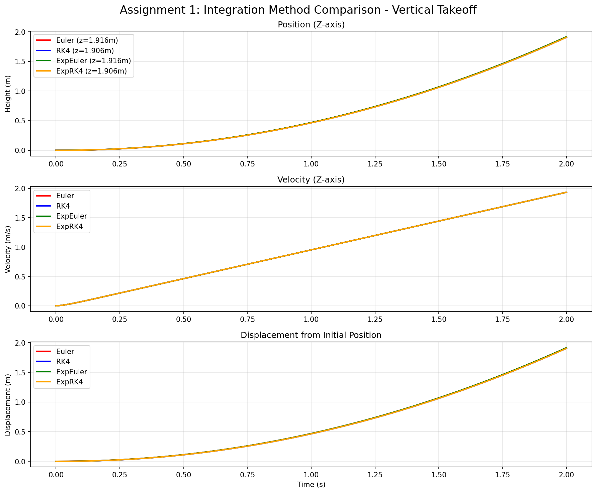 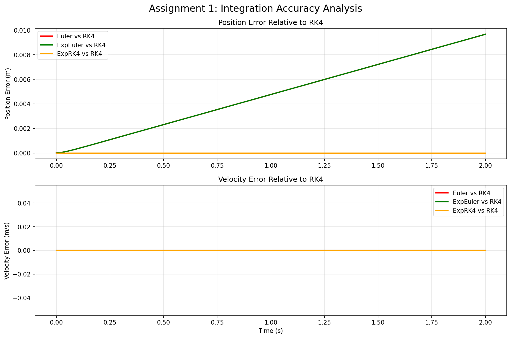

---

## Assignment 2 — SE(3) Geometric Controller (Real Flight)

### Goal
Implement the Lee geometric controller (Lee, Leok, McClamroch 2010) for the Crazyflie 2.1.
Test and tune in simulation. Execute physical test flights and report tracking errors.

### What we did
Implemented the full SE(3) geometric controller in Rust (`src/controller/`).
Tuned in simulation (`src/bin/assignment2.rs`, circle + figure-8 trajectories).

**Physical flight approach:** Rather than compiling the controller into firmware, we run it
PC-side at 100 Hz and send RPYT setpoints directly to the Crazyflie's attitude stabilizer.
The firmware receives roll/pitch/yaw-rate/thrust commands and executes them; our code
closes the outer position + attitude loop. This gives identical controller authority with a
simpler build process.

Maneuver: `my_circle` — 0.2 m radius circle at ω = 0.5 rad/s (~12.6 s/lap).
Best flight: `flying_drone_stack/runs/my_circle_2026-03-26_19-45-02.csv` (41 s airborne, clean tracking).

### Key code
| File | Description |
|------|-------------|
| `src/controller/` | GeometricController — SE(3) trajectory + attitude tracking |
| `src/bin/assignment2.rs` | Simulation: circle + figure-8, gain tuning |
| `src/bin/main.rs` | `my_circle` maneuver: PC-side velocity PI → RPYT setpoints |
| `scripts/plot_assignment2_flight.py` | Flight plots: XY trajectory, position vs time, 3D error |

### Results (real flight, `19-45-02`)
```
~/.pyenv/versions/flying_robots/bin/python flying_drone_stack/scripts/plot_assignment2_flight.py \
    flying_drone_stack/runs/my_circle_2026-03-26_19-45-02.csv
```

| Metric | Value |
|--------|-------|
| RMS 3D error | 70.8 mm |
| RMS x | 25.3 mm |
| RMS y | 43.4 mm |
| RMS z | 49.9 mm |
| Cumulative 3D error | 2.129 m·s |
| Attitude stability | roll/pitch RMS < 5° throughout |

> **On the z error:** The ToF sensor reads ~6 cm low relative to the drone's actual height
> (sensor offset + floor surface). The 50 mm z RMS is a calibration offset, not a controller
> error — XY tracking (25–43 mm) reflects actual control performance.
>
> **On XY drift:** Optical flow integrates velocity → position. Without an absolute position
> reference (e.g. Lighthouse), XY drift is unbounded and accumulates over ~10–20 s. This is
> a hardware limitation, not a controller deficiency.

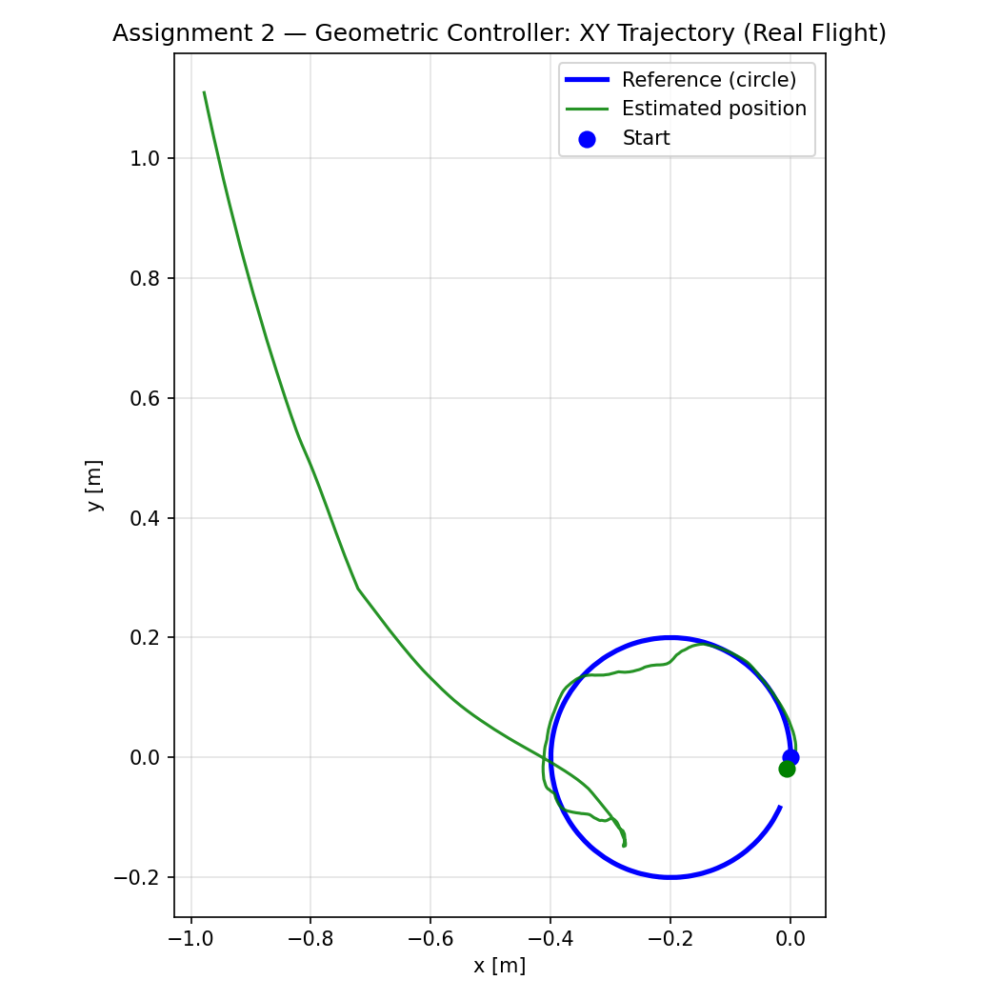 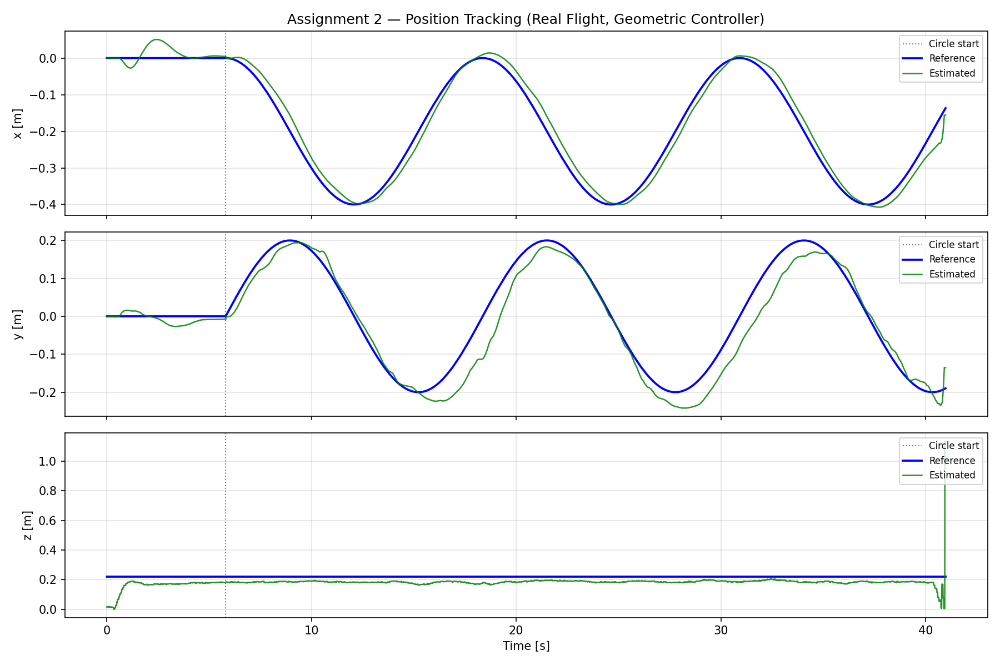

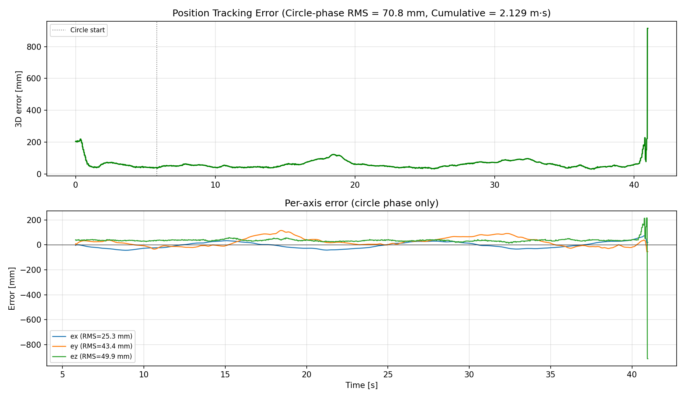

---

## Assignment 3 — MEKF State Estimation (Real Flight)

### Goal
Implement a Multiplicative Extended Kalman Filter (MEKF) for attitude and position estimation.
Run on real hardware and compare quantitatively to the Crazyflie's onboard firmware EKF.

### What we did
Implemented the MEKF following Mueller et al. (2015) in `src/estimation/mekf.rs`:
- **Predict:** IMU gyro integration on quaternion (body-frame angular velocity).
- **Update — height:** ToF range measurement (scalar EKF update).
- **Update — flow:** PMW3901 optical flow → body-frame XY velocity (two scalar updates).
- **Update — VO:** Visual odometry XY position (two scalar updates, used when AI Deck is active — not used in these flights).

The MEKF runs live during every flight (fusing IMU + ToF + optical flow only — no AI Deck)
and its output is logged alongside the firmware EKF in the 49-column run CSV
(`mekf_roll/pitch/yaw/x/y/z` vs `roll/pitch/yaw/pos_x/y/z`).
Comparison is therefore from the same flight, same sensors, zero post-processing needed.

Note: `mekf_pitch` has the opposite sign convention to `stabilizer.pitch` — this is a known
display-only issue, corrected by negating pitch in the plot script (line 65 of
`plot_assignment3_flight.py`).

### Key code
| File | Description |
|------|-------------|
| `src/estimation/mekf.rs` | Full MEKF: predict, height/flow/VO updates, Coriolis term |
| `src/bin/mekf_eval.rs` | Offline MEKF replay against a run CSV, prints RMSE |
| `scripts/plot_assignment3_flight.py` | Plots: orientation comparison, position comparison, XY overlay |

### Results (Mar 17 2026 back-to-back flights, airborne samples only)

```
# Reproduce all three plots (hover / circle / figure-8):
~/.pyenv/versions/flying_robots/bin/python flying_drone_stack/scripts/plot_assignment3_flight.py flying_drone_stack/runs/hover_2026-03-17_19-33-08.csv
~/.pyenv/versions/flying_robots/bin/python flying_drone_stack/scripts/plot_assignment3_flight.py flying_drone_stack/runs/circle_2026-03-17_19-35-31.csv
~/.pyenv/versions/flying_robots/bin/python flying_drone_stack/scripts/plot_assignment3_flight.py flying_drone_stack/runs/figure8_2026-03-17_19-37-32.csv
```

| Maneuver | Roll RMSE | Pitch RMSE | Yaw RMSE | x RMSE | y RMSE | z RMSE |
|----------|-----------|------------|----------|--------|--------|--------|
| Hover    | 1.12°     | 0.95°      | 1.02°    | 3.4 cm | 3.1 cm | 1.1 cm |
| Circle   | 0.66°     | 0.58°      | 3.27°    | 5.1 cm | 7.1 cm | 0.5 cm |
| Figure-8 | 0.94°     | 0.61°      | 1.53°    | 5.6 cm | 3.6 cm | 0.8 cm |

> **On attitude RMSE:** Sub-1° roll/pitch agreement across all maneuvers confirms the MEKF
> tracks the firmware EKF closely. Yaw RMSE is higher on the circle (3.27°) because the drone
> continuously yaws — small timing differences between the two estimators accumulate.
>
> **On position RMSE:** 3–7 cm XY spread between the two estimators is expected. Both rely on
> optical flow integration (dead-reckoning) with no absolute position anchor. The RMSE measures
> the *difference between two drifting estimates*, not absolute accuracy.

**Hover**
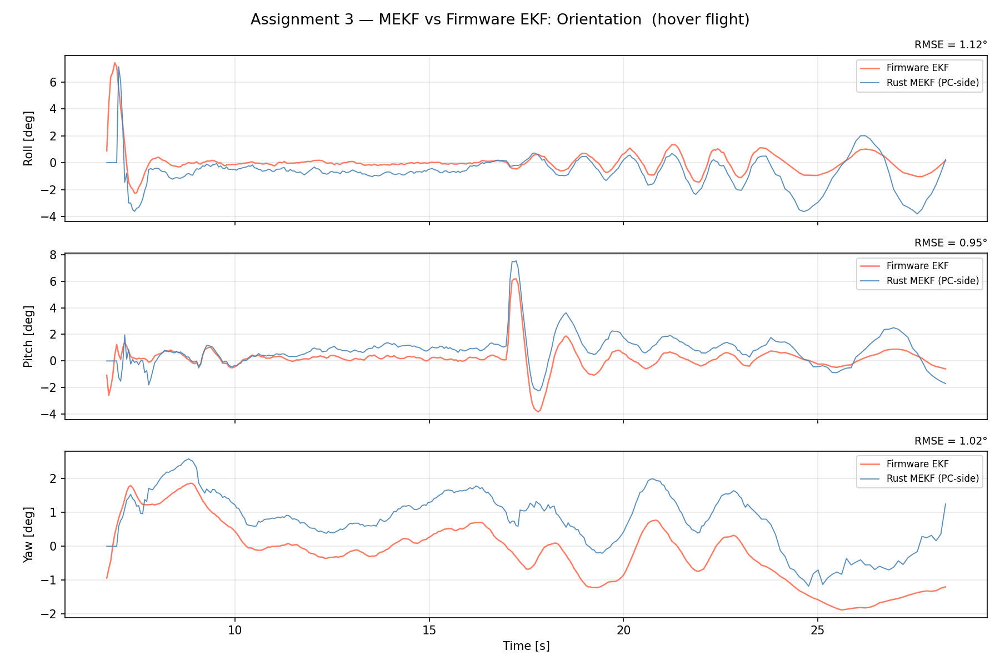 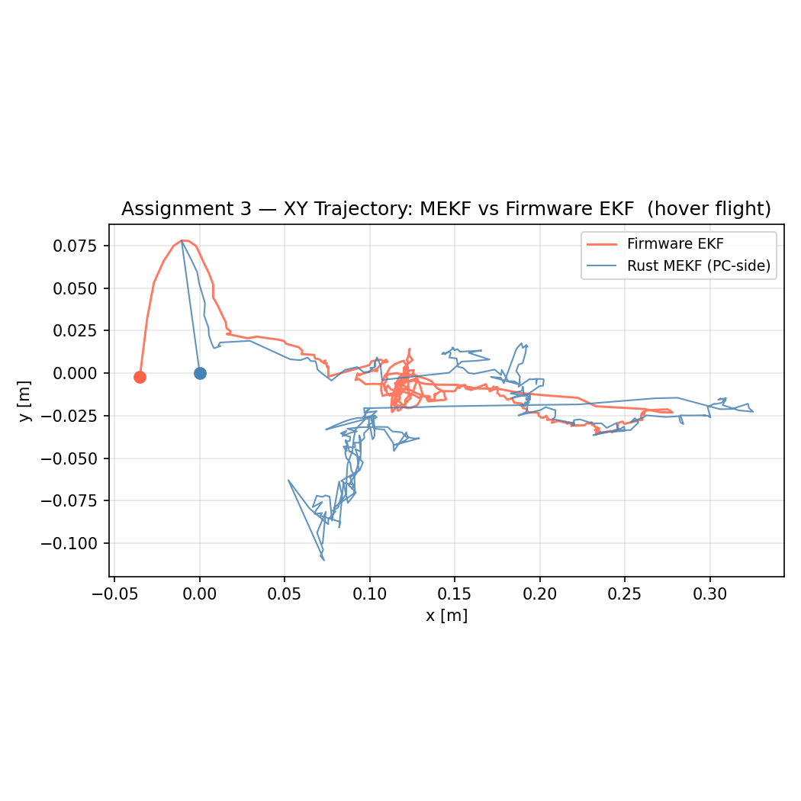

**Circle**
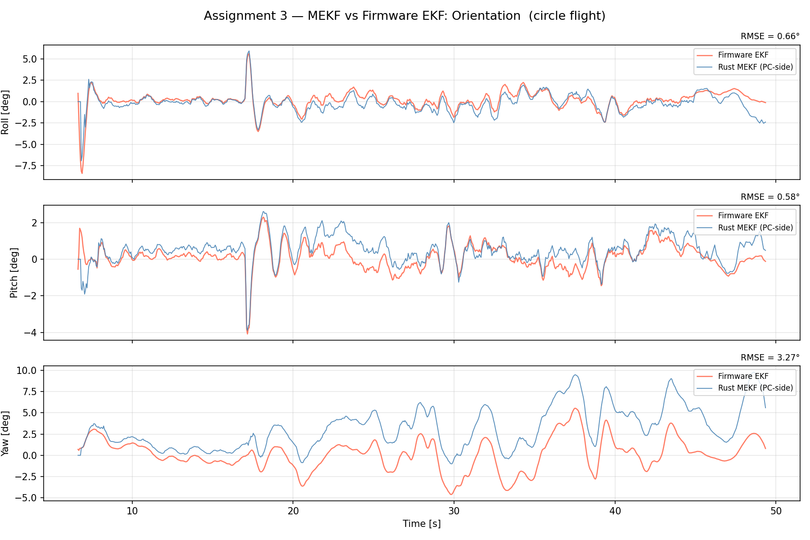 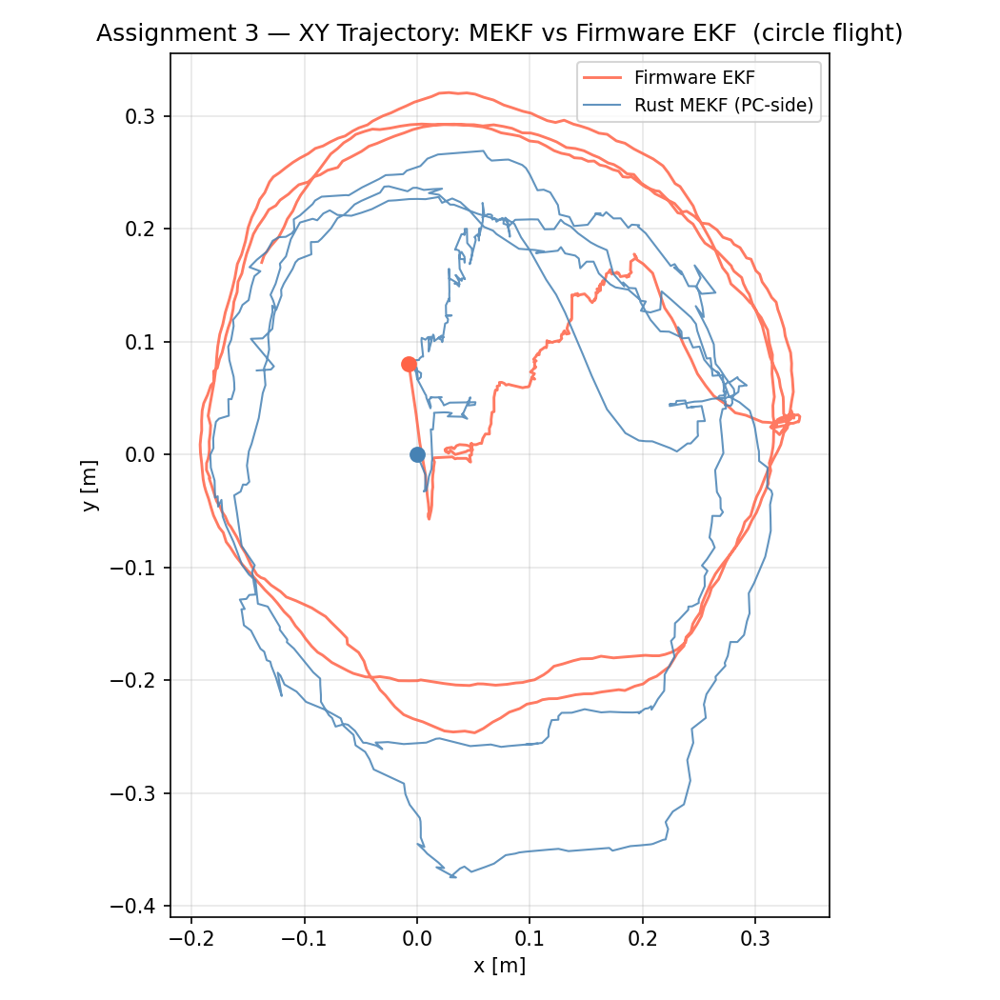

**Figure-8**
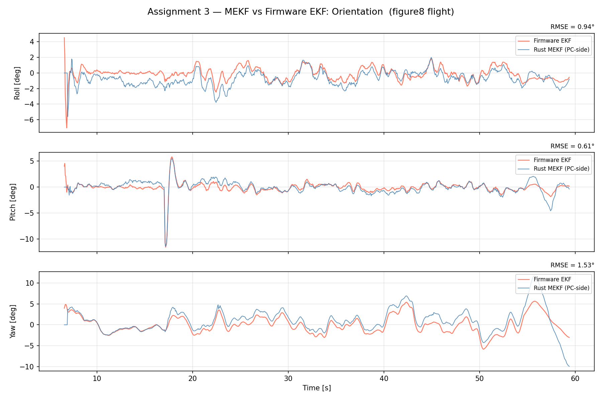 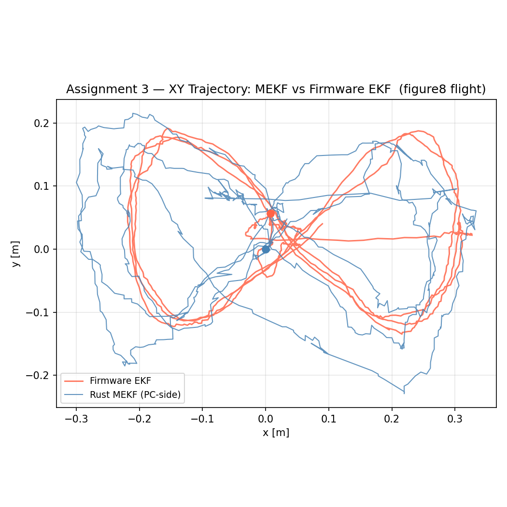

---

## Assignment 4 — Minimum-Snap Spline Planning + Differential Flatness

### Goal
Plan an aggressive figure-8 trajectory using minimum-snap polynomial splines (QP).
Compute desired thrust and torques via differential flatness (Faessler et al. 2018).
Validate with open-loop and closed-loop simulation — **no real flight required**.

### What we did
- Planned an 8-waypoint figure-8 with 8th-order polynomial splines minimising ∫snap² (Clarabel QP).
- Computed F_d, τ_u, ω_d, ω̇_d analytically from flatness outputs (pos / vel / acc / jerk / snap + yaw).
- **Open-loop:** flatness-computed thrust + torque fed directly to simulator (no feedback).
- **Closed-loop:** SE(3) geometric controller tracks the spline with flatness feedforward.
- Wrote three CSVs and six diagnostic plots.

### Key code
| File | Description |
|------|-------------|
| `src/planning/spline.rs` | SplineTrajectory: QP minimum-snap, piecewise 8th-order |
| `src/planning/flatness.rs` | compute_flatness(): FlatOutput → thrust, torque, ω, ω̇ |
| `src/bin/assignment4.rs` | Full pipeline: plan → open-loop sim → closed-loop sim → CSV |
| `scripts/plot_assignment4.py` | 6 plots: 3D trajectory, position tracking, error, flatness actions, ω, kinematics |

### Results (simulation)
```
cd flying_drone_stack && cargo run --release --bin assignment4
~/.pyenv/versions/flying_robots/bin/python flying_drone_stack/scripts/plot_assignment4.py
```

| Simulation | RMS 3D error |
|------------|-------------|
| Open-loop (flatness feedforward only) | ~321 mm |
| Closed-loop (geometric controller) | **2.2 mm** |

> Open-loop error is expected — without feedback, any model mismatch or numerical error
> accumulates freely. The closed-loop result (2.2 mm) confirms both the spline planner and
> the flatness computation are correct, and the geometric controller achieves near-perfect
> tracking in simulation.

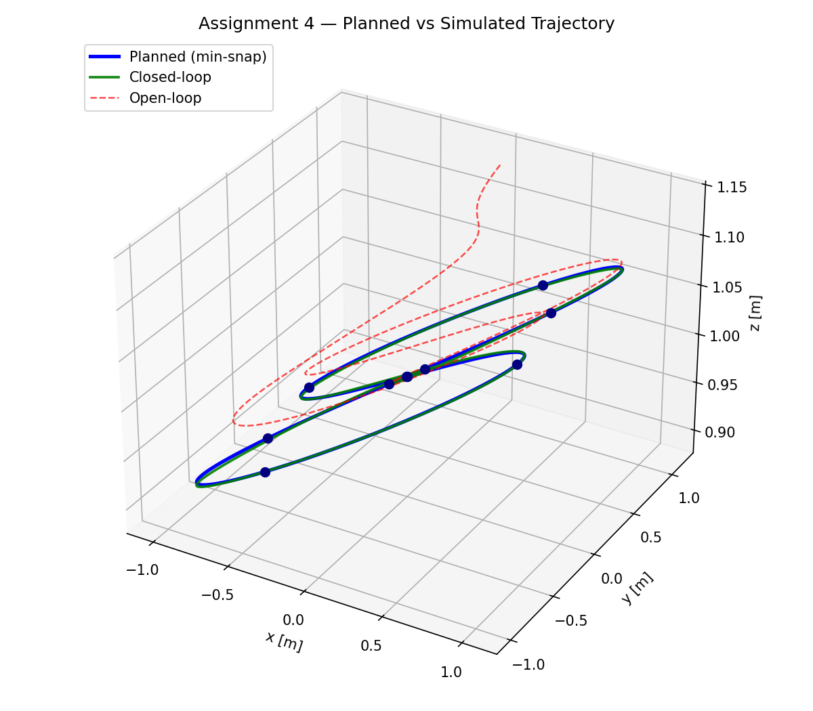 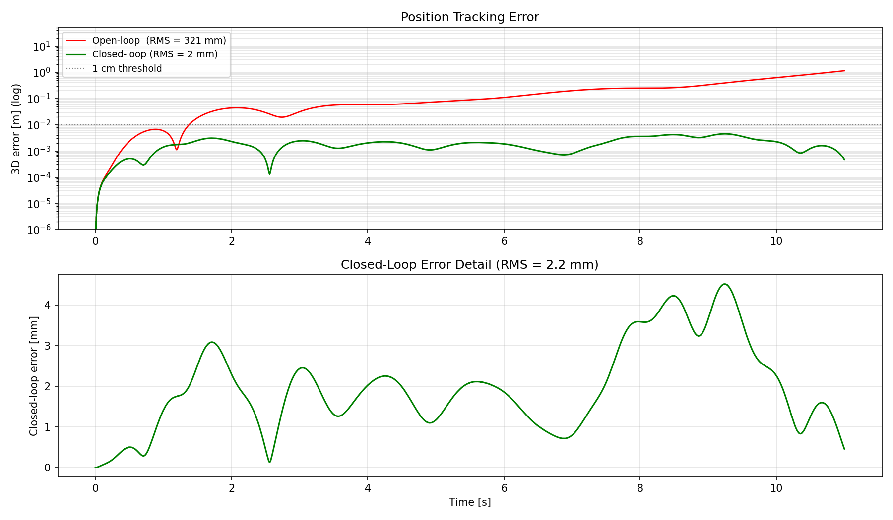

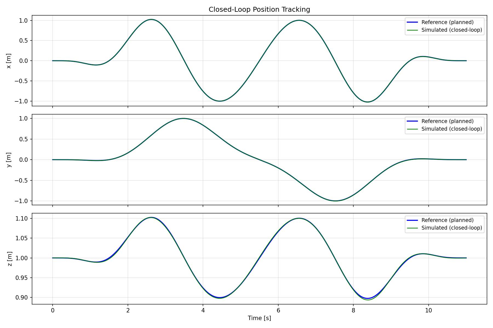 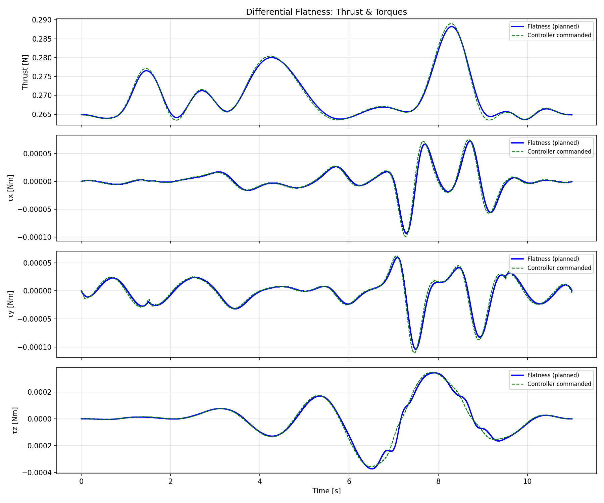

---

## Reproducing All Results

```bash
# 1. Build
cargo build --release

# 2. Run simulations (Assignments 1, 2, 4)
cd flying_drone_stack && cargo run --release --bin assignment1
cd flying_drone_stack && cargo run --release --bin assignment2
cd flying_drone_stack && cargo run --release --bin assignment4

# 3. Generate all plots
PYTHON=~/.pyenv/versions/flying_robots/bin/python

$PYTHON flying_drone_stack/scripts/plot_assignment1.py
$PYTHON flying_drone_stack/scripts/plot_assignment2_flight.py flying_drone_stack/runs/my_circle_2026-03-26_19-45-02.csv
$PYTHON flying_drone_stack/scripts/plot_assignment3_flight.py flying_drone_stack/runs/hover_2026-03-17_19-33-08.csv
$PYTHON flying_drone_stack/scripts/plot_assignment3_flight.py flying_drone_stack/runs/circle_2026-03-17_19-35-31.csv
$PYTHON flying_drone_stack/scripts/plot_assignment3_flight.py flying_drone_stack/runs/figure8_2026-03-17_19-37-32.csv
$PYTHON flying_drone_stack/scripts/plot_assignment4.py
```

All plots are written to `results/assignment{1,2,3,4}/images/`.
Flight CSVs are in `runs/` (not committed to git if large — contact for access).
