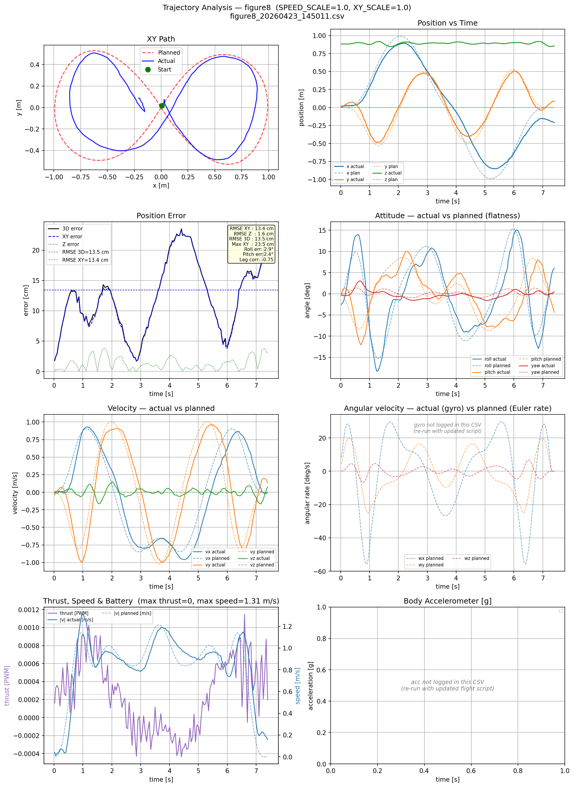
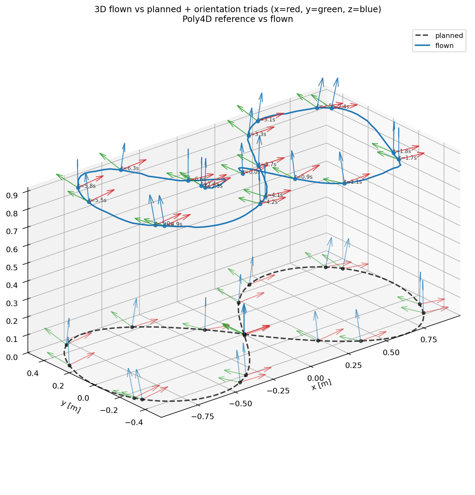
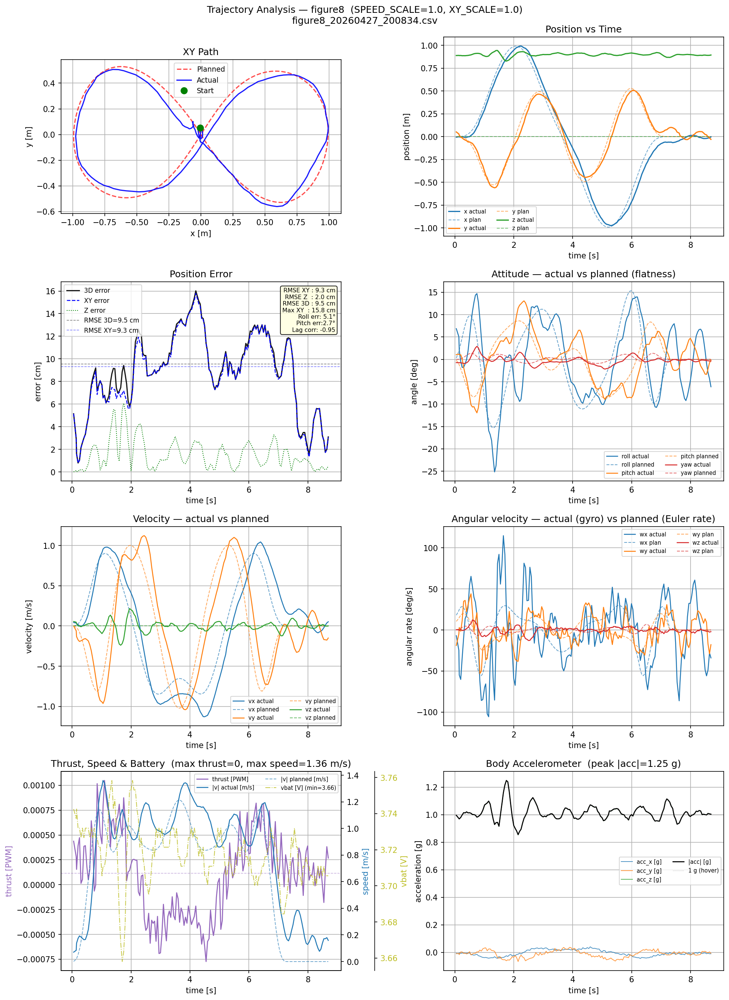
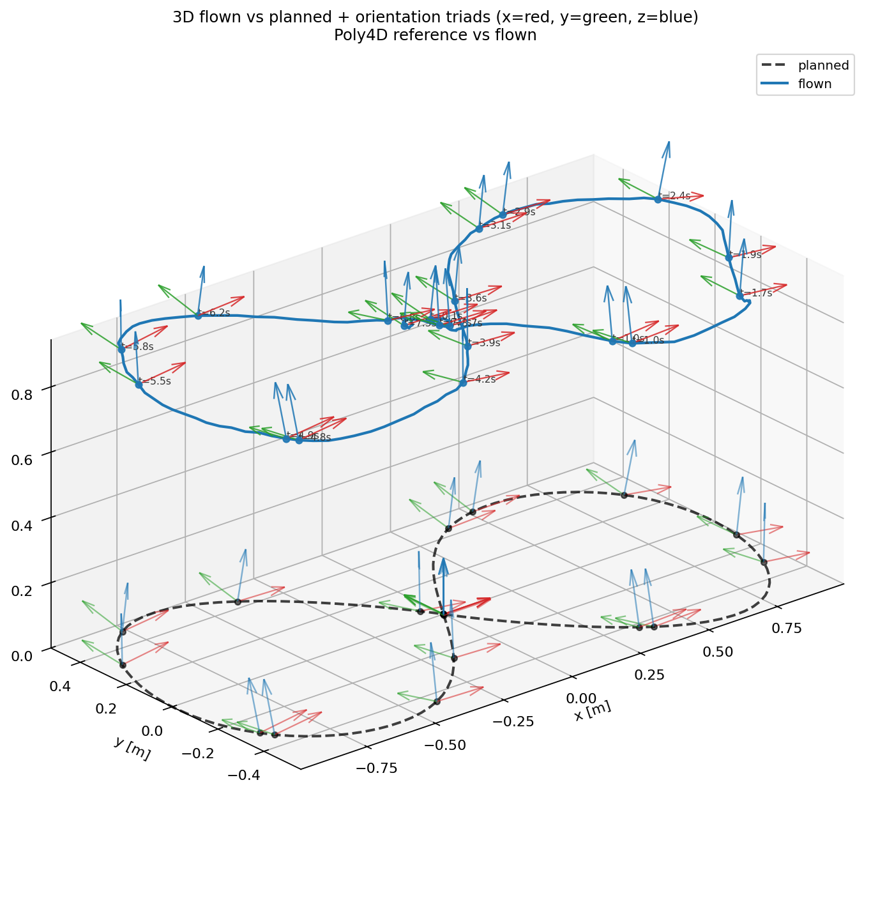
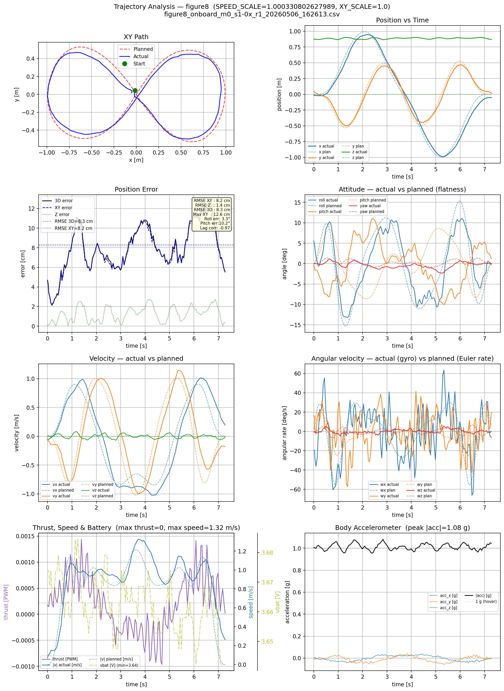
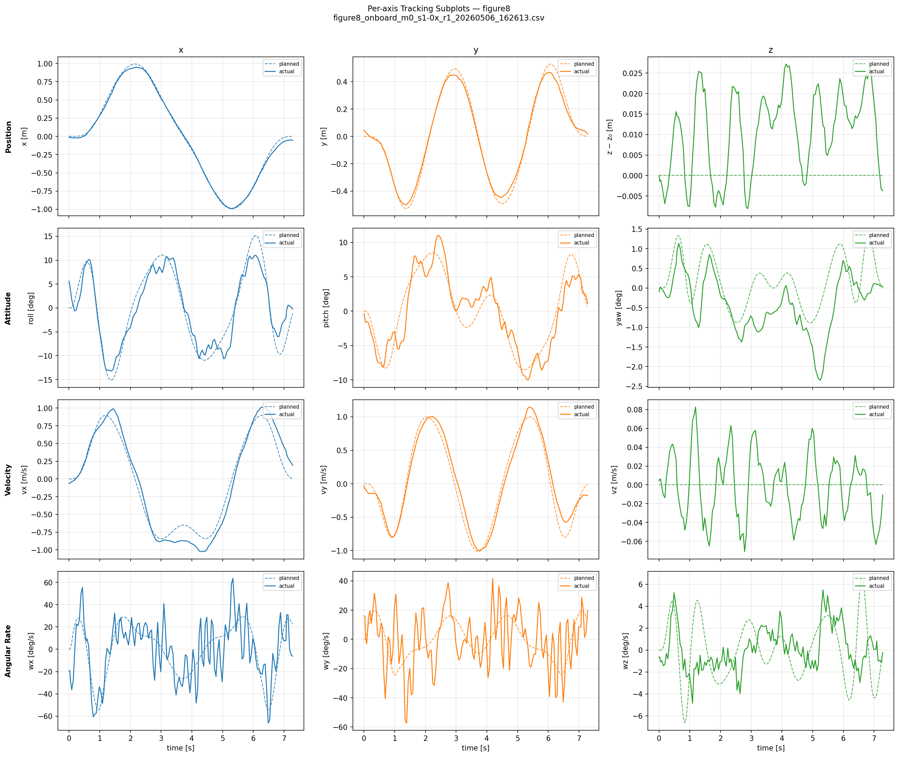
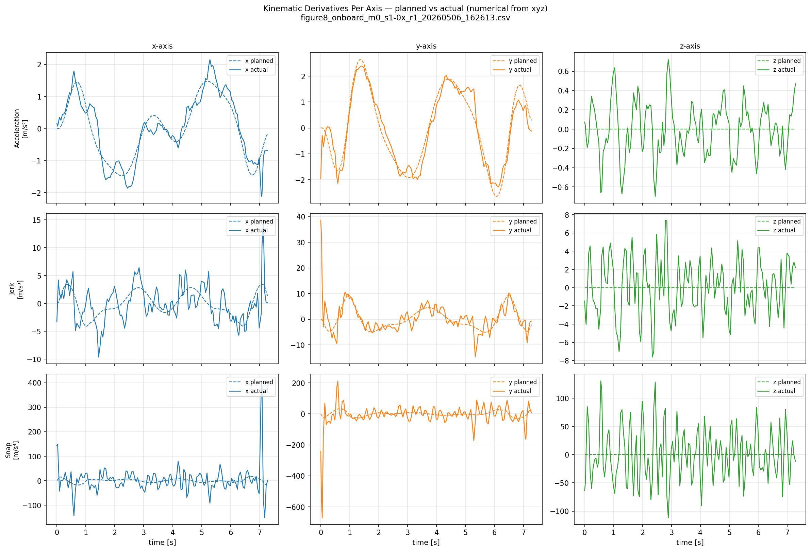
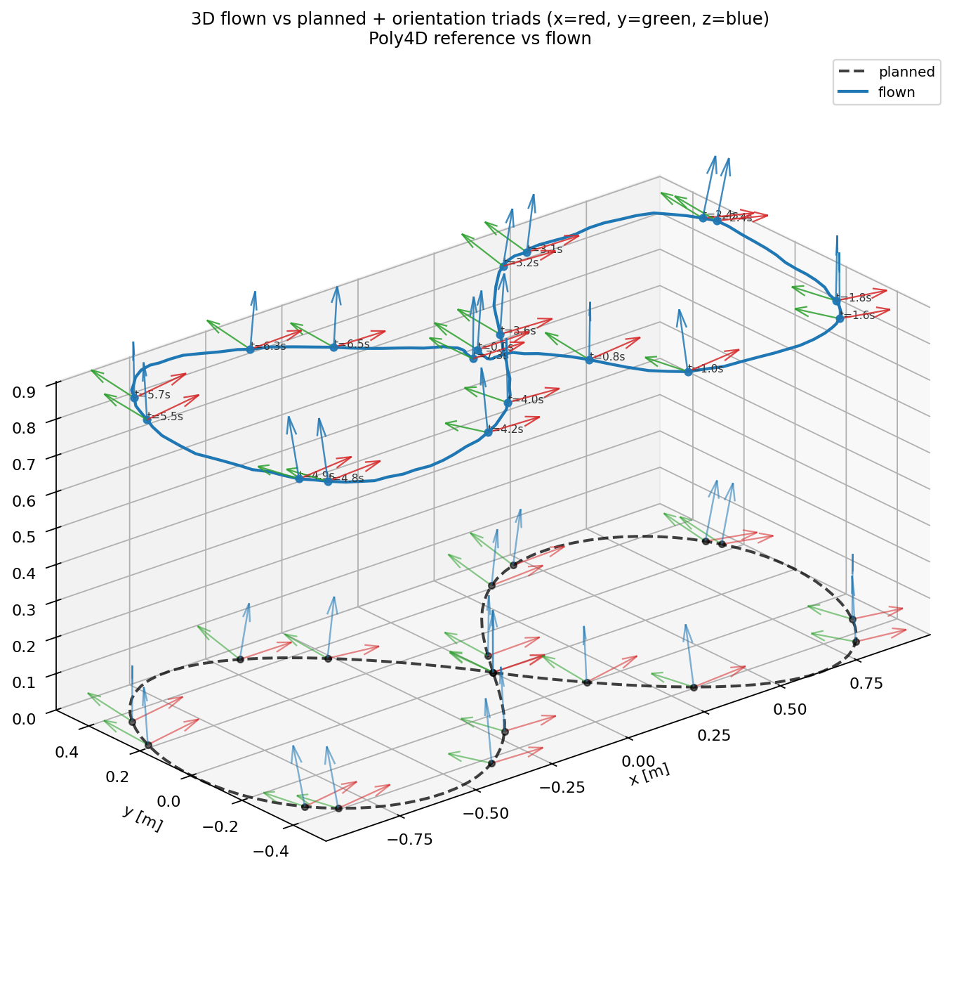
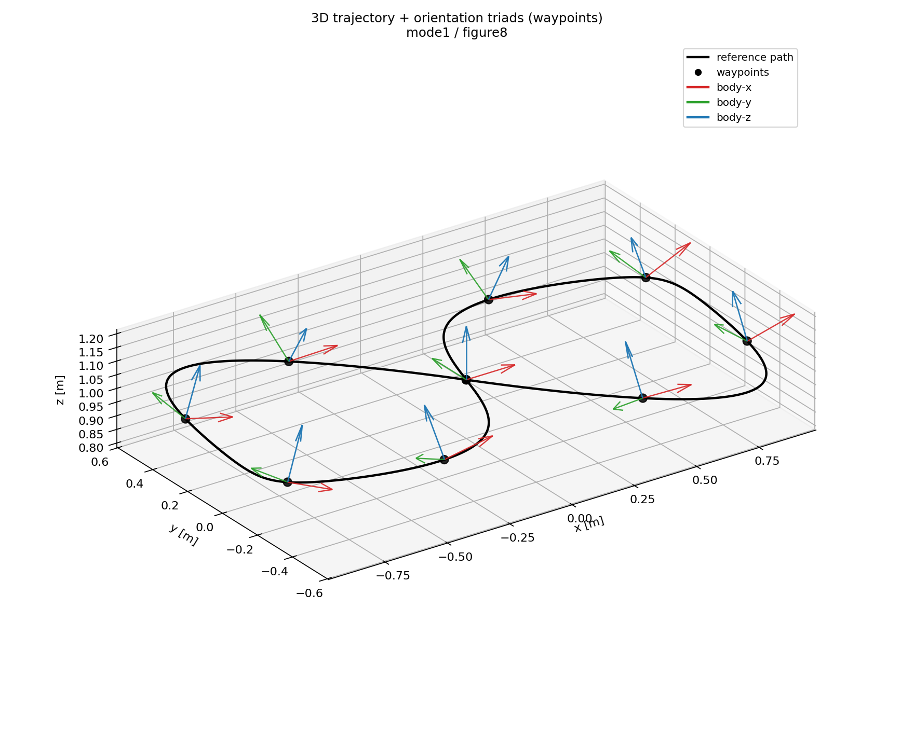
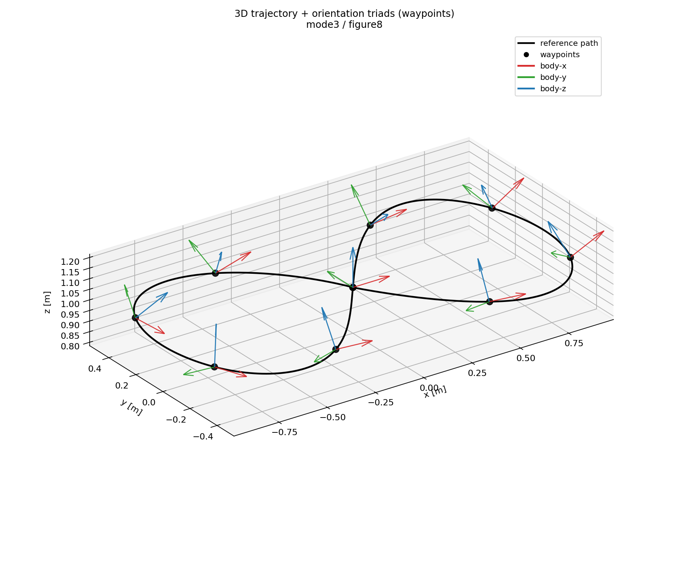

# Advanced Flying Robots - INDI: Current Progress Presentation #1 (CW3)

## Geometric Controller On Hardware

### Results of geometric controller ran on crazyflie 2.1 with optical flow sensor

#### 1) Initial State: `figure8_20260423_145011.csv`

#### 2) Intermediate Improvement: `figure8_20260427_200834.csv`

#### 3) One of the best Results Yet (Geo Controller + Onboard Rust): `figure8_onboard_m0_s1-0x_r1_20260506_162613.csv`

---

## Motion Planning: Figure-8 Across Modes (0-3)

| Mode | Core Idea | Attitude Source | Time Scaling | Figure-8 Evidence |
|---|---|---|---|---|
| 0 | Base spline trajectory | Flatness-derived | Manual/basic | Full reference plot set |
| 1 | Richter-like minimum-snap with time allocation | Flatness-derived | `k_t`-based | Full reference plot set |
| 2 | Explicit SE(3): authored attitude + position | Uploaded/explicit | Timing from Richter, SE(3) solve | Full reference plot set |
| 3 | Paper-faithful flat-output planning with stronger timing coupling | Flatness-derived | Iterative/paper-style | Full reference plot set |

### Concise Implementation Notes

- Modes 0/1/3 use the same minimum-snap spline backbone: 8th-order polynomials with one small QP solved per axis (`x`, `y`, `z`, `yaw`) and then combined into a multi-axis trajectory. This keeps the implementation robust, debuggable, and fast enough for iteration.
- The current per-axis QP design is sufficient because cross-axis physics is handled downstream through differential flatness, controller logic, and planning-side feasibility checks. A larger joint QP would mainly become valuable if hard coupled constraints (tilt cones, corridor constraints, actuator limits) must be enforced inside the optimizer itself.
- Mode 1 timing is allocated from one aggressiveness knob:
  $$
  v_{avg}=0.5+1.5\sqrt{k_t}, \qquad
  T_i=\max\left(\frac{\lVert p_{i+1}-p_i\rVert}{v_{avg}},\ 0.15s\right)
  $$
- Mode 3 is the same Richter-family planner with iterative time redistribution enabled:
  $$
  T_i^{target}=T_{total}\frac{J_i}{\sum_j J_j}, \qquad
  T_i \leftarrow T_i + 0.5(T_i^{target}-T_i)
  $$
  where `J_i` is the segment snap cost.
- Mode 2 still uses the spline/minimum-snap stack for position, but attitude comes from explicit quaternion/SO(3) interpolation and is uploaded as attitude polynomials for onboard evaluation.
- Feasibility plots and limits dashboards are planning-side model/proxy checks. They are useful for comparing modes and spotting risk, but hardware saturation claims still need closed-loop logs or actuator telemetry.

### Mode 0 (SplineTrajectory) — Figure-8

- Description: baseline piecewise polynomial trajectory with fixed segment durations.
- Formulation: minimum-snap polynomial solve with waypoint + continuity constraints.
- QP view: solve quadratic cost over polynomial coefficients with equality constraints.
- Core objective:
  $$
  \min \sum_{s}\int_{0}^{T_s}\left\lVert \frac{d^4 p_s(t)}{dt^4} \right\rVert^2 dt
  $$
- Canonical QP form:
  $$
  \min_{\mathbf{c}} \frac{1}{2}\mathbf{c}^\top \mathbf{Q}\mathbf{c} + \mathbf{q}^\top\mathbf{c}
  \quad \text{s.t.} \quad \mathbf{A}_{eq}\mathbf{c} = \mathbf{b}_{eq}
  $$
- Continuity constraints: position/velocity/acceleration/(higher derivatives, mode-dependent) continuity across segment boundaries.
- Attitude: derived via differential flatness from planned `x,y,z,yaw` (flat outputs converted to attitude/thrust/rates for feasibility and control references).
- Code references:
  - planner core: `flying_drone_stack/src/planning/mod.rs`, `flying_drone_stack/src/planning/spline.rs`
  - simulation/reference: `flying_drone_stack/src/bin/planning_sim.rs`, `flying_drone_stack/scripts/plot_planning_reference.py`, `flying_drone_stack/scripts/plot_planning_sim.py`
  - onboard/controller/analytics: `flying_drone_stack/src/bin/onboard_*.rs`, `flying_drone_stack/firmware_app/src/lib.rs`, `Controls/analyze_flight.py`

### Mode 1 (RichterTrajectory) — Figure-8

- Description: Richter-style minimum-snap with automatic segment timing from `k_t`.
- Formulation: same polynomial/QP structure as mode 0, with time allocation coupled via aggressiveness.
- QP view: reduced derivative-parameterized minimum-snap system (Richter family implementation path).
- Core objective:
  $$
  \min \sum_{s}\int_{0}^{T_s}\left\lVert \frac{d^4 p_s(t)}{dt^4} \right\rVert^2 dt
  $$
- Canonical QP form:
  $$
  \min_{\mathbf{c}} \frac{1}{2}\mathbf{c}^\top \mathbf{Q}\mathbf{c} + \mathbf{q}^\top\mathbf{c}
  \quad \text{s.t.} \quad \mathbf{A}_{eq}\mathbf{c} = \mathbf{b}_{eq}
  $$
- Time allocation: segment durations depend on geometry and aggressiveness parameter `k_t`.
- Attitude: differential-flatness-derived; no explicit attitude waypoint authoring.
- Code references:
  - planner core: `flying_drone_stack/src/planning/mod.rs`, `flying_drone_stack/src/planning/richter.rs`
  - simulation/reference: `flying_drone_stack/src/bin/planning_sim.rs`, `flying_drone_stack/scripts/plot_planning_reference.py`, `flying_drone_stack/scripts/plot_planning_sim.py`
  - onboard/controller/analytics: `flying_drone_stack/src/bin/onboard_*.rs`, `flying_drone_stack/firmware_app/src/lib.rs`, `Controls/analyze_flight.py`

### Mode 2 (Se3Trajectory) — Figure-8

- Description: explicit SE(3) trajectory generation with authored attitude path capability.
- Formulation: position/timing baseline from Richter-like durations, then SE(3) attitude construction and derivatives.
- QP view: not the same flat-only reduced QP path as modes 0/1/3; attitude is explicitly represented.
- Time allocation: timing from Richter-like allocation, then SE(3) solve/parameterization.
- Attitude: explicit (uploaded/authored) SE(3) orientation pipeline.
- Code references:
  - planner core: `flying_drone_stack/src/planning/mod.rs`, `flying_drone_stack/src/planning/se3_traj.rs`, `flying_drone_stack/src/planning/richter.rs`
  - simulation/reference: `flying_drone_stack/src/bin/planning_sim.rs`, `flying_drone_stack/scripts/plot_planning_reference.py`, `flying_drone_stack/scripts/plot_planning_sim.py`
  - onboard/controller/analytics: `flying_drone_stack/src/bin/onboard_*.rs`, `flying_drone_stack/firmware_app/src/lib.rs`, `Controls/analyze_flight.py`

### Mode 3 (Paper / PaperRichterTrajectory) — Figure-8

- Description: paper-faithful flat-output minimum-snap planning with stronger timing coupling behavior.
- Formulation: flat-output polynomial minimum-snap with continuity/endpoint constraints and iterative timing refinement.
- QP view: Richter-family constrained QP structure with paper-style timing redistribution emphasis.
- Core objective:
  $$
  \min \sum_{s}\int_{0}^{T_s}\left\lVert \frac{d^4 p_s(t)}{dt^4} \right\rVert^2 dt
  $$
- Canonical QP form:
  $$
  \min_{\mathbf{c}} \frac{1}{2}\mathbf{c}^\top \mathbf{Q}\mathbf{c} + \mathbf{q}^\top\mathbf{c}
  \quad \text{s.t.} \quad \mathbf{A}_{eq}\mathbf{c} = \mathbf{b}_{eq}
  $$
- Time allocation: segment durations depend on geometry and aggressiveness parameter `k_t`, with stronger paper-style iterative timing redistribution behavior.
- Attitude: emergent from differential flatness (not explicitly authored in waypoints).
- Code references:
  - planner core: `flying_drone_stack/src/planning/mod.rs`, `flying_drone_stack/src/planning/richter.rs` (`plan_paper` path)
  - simulation/reference: `flying_drone_stack/src/bin/planning_sim.rs`, `flying_drone_stack/scripts/plot_planning_reference.py`, `flying_drone_stack/scripts/plot_planning_sim.py`
  - onboard/controller/analytics: `flying_drone_stack/src/bin/onboard_*.rs`, `flying_drone_stack/firmware_app/src/lib.rs`, `Controls/analyze_flight.py`
