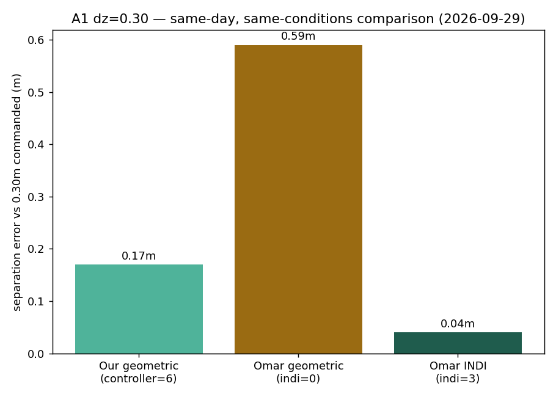
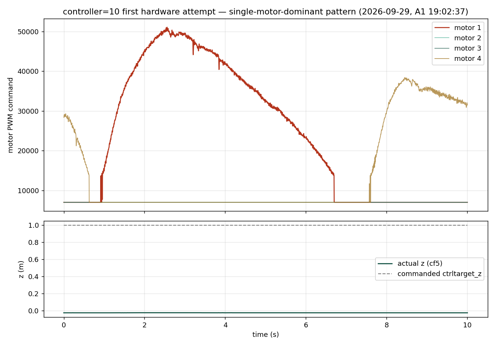

# 41 — Pure INDI: four implementations compared

**Status: investigation only, no decision made, nothing executed.** Triggered by the supervisor
sharing his own working repos (`~/Desktop/crazyflie-firmware-omar`,
`~/Desktop/crazyswarm2-omar`) as a source-of-truth reference, in the context of the still-open
6.3 Hz oscillation question ([[project_indi_oscillation_investigation]]). Purpose: understand what
actually differs between the four "pure INDI" implementations we have access to, before deciding
whether to (a) close specific gaps against Omar's version, (b) fly/reuse his controller as-is, or
(c) port it to Rust the way Briesewitz's was ported. **None of those three is chosen here.**

---

## 0. The four variants, at a glance

| # | Name | Language / where it lives | Architecture | Ever flown (this project) |
|---|---|---|---|---|
| **1** | **Stock Bitcraze INDI** | C, `controller_indi.c` + `position_controller_indi.c` in `~/Desktop/crazyflie-firmware` (`stabilizer.controller=3`) | Cascaded **rate-INDI** (Tal & Karaman style): incremental control on **actuator commands**, no explicit residual-force term, no RPM feedback at all | 1 flight, 19 Sep — unstable, gains untuned (S1b) |
| **2** | **Our INDI** | Rust, `firmware_app/src/lib.rs` (`stabilizer.controller=6`, `indi_gains.ctrl_mode=3`) | **Force/torque-residual INDI** on top of a Lee/SE(3) geometric controller: `a_res = a_meas − a_model` from RPM², fed back into the desired-acceleration vector | Flying (S0/S1), full INDI 2-drone A8 |
| **3** | **Briesewitz / NA-INDI plain INDI** | C, `controller_lee.c` in `~/Desktop/NA-INDI-firmware` — ported to Rust as `firmware_app/src/naindi.rs` (`stabilizer.controller=7`, `use_nn=0`) | Same family as #2 (residual INDI on a Lee controller), but **RPM-force based**, includes gyroscopic coupling term, uses **unfiltered gyro** for the moment residual | Sim-clean since 09-18; **never flown** (S1c) |
| **4** | **Omar's INDI** | C, `controller_lee.c` in `~/Desktop/crazyflie-firmware-omar` — config in `~/Desktop/crazyswarm2-omar` | **Structurally the same family as #3** — same `controller_lee.c` lineage, `self->indi` bit-flag switch (bit0=position, bit1=attitude) — but independently tuned/simplified, **no gyroscopic coupling term**, uses **filtered gyro** | Supervisor's own hardware, presumably flown by him; not flown on our airframe |

**Headline structural finding:** #1 (stock) is architecturally a *different species* of INDI from
#2/#3/#4 — it never separates a residual force/torque and never reads RPM. #2, #3, and #4 are all
descendants of the same `controller_lee.c` idea (geometric SE(3) + measured-vs-modelled
acceleration/torque residual), which is worth stating plainly in the thesis rather than treating
"INDI" as one algorithm with four gain sets.

---

## 1. Where each file lives (for anyone continuing this)

```
Stock (#1):        ~/Desktop/crazyflie-firmware/src/modules/src/controller/controller_indi.c
                    ~/Desktop/crazyflie-firmware/src/modules/src/controller/position_controller_indi.c
                    ~/Desktop/crazyflie-firmware/src/modules/interface/controller/controller_indi.h  (gains, OUR retuned copy)

Ours (#2):          flying_drone_stack/firmware_app/src/lib.rs

Briesewitz (#3):    ~/Desktop/NA-INDI-firmware/src/modules/src/controller/controller_lee.c
                    (our faithful port: flying_drone_stack/firmware_app/src/naindi.rs)

Omar (#4):          ~/Desktop/crazyflie-firmware-omar/src/modules/src/controller/controller_lee.c
                    ~/Desktop/crazyswarm2-omar/crazyflie/config/crazyflies.yaml   (controller=5, ctrlLee.indi param)
                    ~/Desktop/crazyflie-firmware-omar/configs/cf21blrpm_defconfig  (his brushless target, mass 42.7g)
```

**Confirmed by direct `diff`:** Omar's `controller_indi.c` / `position_controller_indi.c` (the
*stock* INDI files) are **byte-identical** to our own unmodified stock copy — he has not touched
stock INDI at all. His actual custom controller lives entirely in `controller_lee.c`, selected via
`controller: 5` (`ControllerTypeLee`) + a runtime `ctrlLee.indi` bit-flag, **not** via
`stabilizer.controller=3`. This is architecturally identical to how Briesewitz's `use_nn`/`indi`
switches work inside the same file, and to our own `ctrl_mode` switch inside `lib.rs` — three
independent groups converged on "one controller module, runtime-selectable INDI on/off" as the
pattern.

---

## 2. Gain comparison (outer position loop + inner attitude loop)

| Gain | Stock (#1) default | Ours (#2), active block | Briesewitz (#3) | Omar (#4) |
|---|---|---|---|---|
| Position P (`Kpos_P` / `KP`) | n/a (separate `K_xi_*`, not diffed here — different loop shape) | 28.0 (xy) / 30.0 (z) | 12.0 (all axes) | **7.0** (all axes) |
| Position D (`Kpos_D` / `KV`) | n/a | 6.0 (xy) / 14.0 (z) | 10.5 (all axes) | **4.0** (all axes) |
| Position I | n/a | 0.05, limit 2.0 | 2.0, limit 100 | **0.0, limit 2** (integral effectively off) |
| Attitude `KR` | n/a (rate-INDI has no explicit KR) | 0.010 (all axes) | 0.007 / 0.007 / 0.01 | 0.007 / 0.007 / **0.008** |
| Attitude `Komega`/`KW` | n/a | 0.00110 (xy) / 0.00138 (z) | 0.002 (all axes) | **0.00115 / 0.00115 / 0.002** |
| Attitude `KI` | n/a | (position-loop only; no separate attitude KI) | 0.01 (all axes) | 0.03 (all axes) |
| Mass | n/a | 0.027 kg (CF2.1+Flow) | hardcoded 0.034 kg | `CF_MASS` (platform define — **airframe-aware**, 42.7 g on his brushless config) |
| Rate-INDI `g1_p/q/r`, `g2` (#1 only) | 0.0066 / 0.0052 / 0.0015 / 0.0000435 | n/a (different architecture) | n/a | Omar's *stock* copy is untouched → same as column 2 |
| Rate-INDI filter cutoff (#1 only) | 8.0 Hz (stock) / **70.0 Hz (our retune)** | n/a | n/a | 8.0 Hz (his stock copy, unmodified) |

**Reading this table:** every implementation uses **different position and attitude gains**, and
none of the three residual-INDI variants (#2/#3/#4) agrees with either of the other two on mass
handling — we hardcode our real mass, Briesewitz hardcodes *their* airframe's mass (0.034 kg,
wrong for us), Omar reads the platform's compile-time mass constant (right idea, but his constant
is for *his* airframe, not ours). None of this alone explains the oscillation; it does mean "just
copy Omar's gains" is not a drop-in — his gains were tuned for his own vehicle and mass.

> **Update 2026-09-23, controller=9 only:** operator decision reversed the "his constant is for
> his airframe" framing above for this specific port — `CF_MASS` on `controller=9`'s build is
> now set to Omar's own brushless-established `42700` (42.7g, his `cf21blrpm_defconfig`), not
> this project's independently measured 41.0g. Rationale: use exactly the airframe constant set
> he established for brushless throughout, not a mix of his port + our own measurement —
> consistent with `MOTORRPM2FORCE`/`THRUST2TORQUE`/`ARM_LENGTH` already being his values
> verbatim. Position/attitude gains remain his untouched defaults either way (§8's "what
> remains" list). Re-verified after the change: numerical test still 6/6 to `d=0.00e+00`, SIL
> height-tracking still exact — see `omar_indi_reference_build_notes.md`.

---

## 3. Position-residual computation (`a_indi` / `a_res`) — algorithm-level diff

| Aspect | Ours (#2) | Briesewitz (#3) | Omar (#4) |
|---|---|---|---|
| Model term | `a_model` = Σ(kt·rpm²) rotated to world + gravity | `a_rpm` = same idea, rotated, gravity | `a_rpm` = same idea, uses `MOTORRPM2FORCE` (single scalar, not per-motor `kt`) |
| Measured term | `a_meas` = rotated body accel + gravity | `a_imu` = same | `a_imu` = same |
| Per-motor force source | `kt1..kt4` (individually calibrated) | `kappa_f[4]` (per-motor) **+ optional PWM-derived RPM estimate** (`indi & 4` bit) | single scalar `MOTORRPM2FORCE` — **not per-motor**, no PWM fallback |
| Outlier clamp | none by default (`res_clamp` param, off) | `vclampnorm(·, 10)` on both `a_rpm` and `a_imu` | **none** |
| Filter | optional Butterworth on both sides (`res_fc` param, off by default) | Butterworth **80 Hz** on both `a_rpm`/`a_imu` | Butterworth, single **30 Hz** cutoff shared by accel *and* torque filters |
| Residual definition | `a_res = a_meas − a_model` | `a_indi = a_imu_filtered − a_rpm_filtered` (= meas − model, **same direction as ours**) | `a_indi = a_rpm_filtered − a_imu_filtered` (= **model − meas, opposite direction**) |
| How it enters `f_d` | `f_d = a_d + a_indi·res_sign` — **default `res_sign=+1` → ADDS a_res** (the flight-proven-but-undecided default; see `[[project_controller_validation_2026-09-09]]`) | `F_d = a_d − a_indi − a_nn` → **SUBTRACTS** the meas-minus-model residual | `F_d = a_d + a_indi` → adds *his* `a_indi`, but since his `a_indi` is model−meas (opposite sign from ours/Briesewitz's), **this nets to the same physical direction as Briesewitz: `a_d − (meas−model)`** |

### ⚠️ The one finding worth flagging first: sign convention

Converting Omar's and Briesewitz's residual terms into **our own sign convention**
(`a_res = a_meas − a_model`, positive = "vehicle is accelerating less than the motors alone would
predict, e.g. under downwash"):

| Implementation | Net effect on desired acceleration |
|---|---|
| **Briesewitz / NA-INDI (#3)** | `a_d − a_res` (subtracts) |
| **Omar (#4)** | `a_d − a_res` (subtracts — same direction, reached via the opposite-sign `a_indi` definition above) |
| **Ours, currently flying default (`res_sign=+1`)** | `a_d + a_res` (**adds**) |
| **Ours, derivation-correct but never-flown (`res_sign=-1`)** | `a_d − a_res` (subtracts — agrees with both #3 and #4) |

**Two independent implementations we did not write (Briesewitz's and now Omar's) both subtract the
residual, agreeing with our own from-first-principles derivation (`m·a = f_thrust + f_res + m·g`
⟹ desired accel should carry `−a_res`) — and disagreeing with what we currently fly by default.**
This doesn't prove `res_sign=-1` fixes the 6.3 Hz shake (the 09-12 test was inconclusive — see
`[[project_indi_oscillation_investigation]]` — and a lagged-`Rd` dynamic-stability mechanism is a
separate question from the steady-state sign), but it is now a 3-way-independent convergence
result, which is a much stronger piece of evidence than it was before Omar's code existed to check
against. Worth stating explicitly to the supervisor.

---

## 4. Attitude-residual (moment INDI) — algorithm-level diff

| Aspect | Ours (#2) | Briesewitz (#3) | Omar (#4) |
|---|---|---|---|
| Torque model source | RPM² × per-motor kt, arm, t2t (our own calibrated mixer) | RPM² × `kappa_f`, hardcoded `t2t=0.006`, `arm=0.707·0.046` (their airframe) | RPM² × `kappa_f`/`MOTORRPM2FORCE`, uses **firmware's own `THRUST2TORQUE`/`ARM_LENGTH`** (platform-derived, more portable) |
| Angular-accel measurement | filtered gyro finite difference | **unfiltered gyro** (`gyroNoLpf`, added specifically to port this faithfully — see `firmware_app/host/LOCAL_MODIFICATIONS.md`) finite difference | **filtered gyro** (`sensors->gyro`, the normal LPF'd signal) finite difference |
| Gyroscopic coupling term (`ω × Jω`) | present (`omega_dot_filt` path includes standard rigid-body correction — verify against lib.rs if reused) | **explicitly included**: `tau_imu = J·α − ω×(J·ω)` | **absent** — `tau_gyro = J·α` only, no cross term |
| Residual clamp | none by default | `vclampnorm(·, 0.006)` | none |
| Filter cutoff (moment) | shared with position path (`fc_bw`) | **frequency-selective**: 40 Hz for roll/pitch torque, 10 Hz for yaw torque | single 30 Hz for all three axes |

**Reading this:** Briesewitz's version is the most physically complete (gyroscopic coupling term,
unfiltered gyro for a less-lagged derivative, frequency-selective filtering, outlier clamping).
Omar's is the most simplified — closer in spirit to a "minimum viable INDI" than to a faithful
Tal & Karaman-style implementation. That's not necessarily wrong (simpler can be more robust on
real hardware, and his presumably flies), but it means "port Omar's version" and "port Briesewitz's
version" are not interchangeable choices — they differ on a real physics term (the gyroscopic
coupling), not just tuning.

---

## 5. Filtering — cutoff frequencies side by side

| Signal | Ours (#2) | Briesewitz (#3) | Omar (#4) |
|---|---|---|---|
| Position residual (accel) | off by default (`res_fc=0`); when enabled, one shared cutoff | **80 Hz** | **30 Hz** |
| Moment residual, roll/pitch | shares `fc_bw` (currently 70 Hz on brushless) | **40 Hz** | 30 Hz (shared with accel) |
| Moment residual, yaw | shares `fc_bw` | **10 Hz** (deliberately lower — yaw is noisier/less critical) | 30 Hz (same as roll/pitch — no yaw-specific treatment) |
| Rate-INDI actuator filter (#1 only) | n/a | n/a | n/a (Omar doesn't use rate-INDI) |

Note our own oscillation sits at **6.3 Hz** (`[[project_indi_oscillation_investigation]]`) — well
below every cutoff in this table, including the tightest (10 Hz). None of the three
implementations' filtering alone would suppress a 6.3 Hz mode; this table rules filter-cutoff
mismatch *out* as a likely single cause, it doesn't point at one.

---

## 6. What we still don't know about Omar's setup

- **Whether `crazyswarm2-omar`'s yaml actually enables `ctrlLee.indi` in flight**, or just declares
  the parameter group — the snippet found (`controller: 5`, `ctrlLee.indi: 0`) shows it **disabled**
  in the committed config. Need to check whether he flips it live via cfclient / a launch script,
  or whether a different yaml/branch has it on. Don't assume "his pure INDI flies well" from this
  repo alone without confirming the flag is actually set to 1 or 3 on his hardware runs.
- **Which physical airframe** the flown config corresponds to — `cf21blrpm_defconfig` (brushless,
  42.7 g) vs `cf2rpm_defconfig` (standard, 36.4 g) — both exist; no in-repo evidence yet of which
  one he actually flies day to day.
- **No commit history available** — both `crazyflie-firmware-omar` and `crazyswarm2-omar` are
  plain directories, not git repos (`git status` fails in both), so there's no way to see when his
  gains were last touched or whether they're mid-tuning.
- **No thrust/actuator model documentation** the way we have `bench_actuator_2026-07-22...csv` for
  our own retune — unclear whether his `MOTORRPM2FORCE` constant and default `g1/g2` were bench-
  calibrated for his airframe or left at stock too.

---

## 7. Two roads — not decided here

Per your framing, this doc stops at understanding. The two options on the table for a follow-up
ticket:

1. **Close the gap** — take the differences in §3–§5 (sign convention, gyroscopic coupling term,
   filter cutoffs, mass handling) one at a time against our own INDI and see which one, if any,
   moves the 6.3 Hz shake. The sign convention (§3) is the cheapest to test — it's already a
   runtime param (`indi_gains.res_sign`), no reflash needed.
2. **Reuse or port Omar's controller** — either fly his `controller_lee.c` as-is (needs re-gaining
   for our mass/airframe, and his stock-INDI files are irrelevant since they're untouched), or port
   it to Rust the way `naindi.rs` was done for Briesewitz's version. Given §4's finding that Omar's
   version is *physically simpler* than Briesewitz's (no gyroscopic coupling term) and we already
   have a faithful Briesewitz port sitting unflown at `controller=7`, a natural first question for
   that road is: **is there anything in Omar's version NOT already covered by trying `controller=7`
   on hardware?** — worth answering before committing to a second port.

No execution taken on either path.

---

## 8. controller=9 — built, numerically verified, sim-complete (2026-09-22/23)

> **Note on the number:** `docs/26_Controller9_NA_INDI_Retrained.md` once reserved
> `controller=9` for an unrelated, never-built concept (a retrained NA-INDI network). That plan
> is out of scope (`docs/34`, 2026-09-22 supervisor decision) and was never coded, so the number
> was free to reuse here — see `docs/26`'s own updated banner for the full disambiguation.

Per operator instruction, road 2 (§7) was executed for the **structural integration only** —
this was never a decision to pursue the controller, only to build and validate it to the point
every other controller in this comparison has reached. Full detail and diagnostic trail:
`firmware_app/host/omar_indi_reference_build_notes.md`. This section is the summary.

**Built, kept in C, not ported to Rust.** `controller_omar_indi.c`/`.h` are a literal copy of his
`controller_lee.c`/`.h` — only identifier names changed (to avoid linking against our own stock
`controller_lee.c`). Verified **byte-identical** to his source (`diff` after normalizing the
renamed identifiers back, exit 0) — no control-law line touched. Wired in as its own isolated
controller slot, `stabilizer.controller=9` (`ControllerTypeOot4`), same 3-file Kconfig pattern
as `controller=7`/`8`. Three small, non-behavioral backports were needed to compile at all
(`MOTORRPM2FORCE` + an unconditional `THRUST2TORQUE` in `platform_defaults_cf21bl.h`, `vadd5()`
in `math3d.h`, `setpoint_t.attitudeAcc` in `stabilizer_types.h` — all plain upstream constants,
none of them his customization, confirmed by cross-checking `NA-INDI-firmware`). Compiles clean
for the real brushless target (`make DRONE=bl`).

**Numerically verified**: 6/6 hand-picked test vectors match his own compiled build to
`d=0.00e+00` — bit-for-bit, not just within tolerance.

**Both dispatch paths exercised** — not only the explicit-self functions every test calls, but
also the real firmware's `CRAZYFLIE_FW`-gated wrapper (`controllerOutOfTree4*`), which is never
even compiled into the host build and had never actually been executed by anything before an
isolated standalone compile confirmed it threads through correctly.

**Sim-complete, both interaction models**: clean (zero NaN, zero divergence, correct height
tracking, no cross-vehicle contamination) across single-drone × 3 trajectory shapes, 2-drone and
3-drone with no interaction model (`backend: np`), and 2-drone and 3-drone under **real coupled
downwash** (`backend: neuralswarm`) — the C1 scenario (3 drones, coplanar) achieved *exact*
station-keeping (`[0,0,0]` realized geometry on all three pairs); A1 (2 drones, vertical stack)
showed perfect lateral alignment with a modest (~14cm) vertical offset from the requested
separation, plausibly real downwash coupling rather than a defect.

**Two real integration bugs found and fixed along the way, neither in the ported control law
itself**: (1) the plant-mass sync defaulted to this project's own mass/kt globals, which this
controller never reads — would have flown the plant ~4% off the controller's model; (2) the
plant's PWM→force inversion (`self.kt`/`self.thrust_max`) was never set for this controller at
all, silently substituting a generic wrong thrust curve and producing a reproducible steady-state
height deficit. Both root-caused via a standalone diagnostic harness before being accepted as
findings, the same method (simplified harness disagrees with the real SIL → bug is in the SIL,
not the port) that previously found the `state.acc` bug for controller=7/8.

**What remains, and cannot be closed without a real drone**: any actual flight (the entire point
of the C.0 gate every other controller here goes through — sim-clean is a precondition, never a
substitute), gain tuning for this project's real airframe (every run above used his default
gains, untouched), and independent bench verification of `MOTORRPM2FORCE` (this project's own
brushless `kt` was never bench-calibrated either, so there is nothing to cross-check his number
against — unlike `arm_length`/`THRUST2TORQUE`, which *are* independently confirmed identical, see
the table in §2). **Never flown, not queued to fly.** Nothing here changes the "no decision
made" status of §7 above — this section only establishes that everything achievable without
hardware has now been done, to the same standard `controller=7`/`8` were held to.

## 9. controller=9 — FLOWN, 2026-09-29: crash root-caused and fixed, first real A/B result

**First hardware attempt (28 Sep) crashed on connect** — `stabilizer.controller=9` tripped a
firmware assert (`param_logic.c:524`, `ASSERT(PARAM_VARID_IS_VALID(varid))`) the instant it was
selected, rebooting the drone before any flight was possible. Two wrong theories were chased and
discarded first (a `run_formation.py` takeoff-time gain-push flood; a connect-time syslink queue
overflow) before the actual cause was found in the boot log itself, which had been printing
`Could not find param deck/bcRpm` on every single connect attempt from the start.

**Root cause:** `controllerOmarIndiInit()` does `paramGetUint(paramGetVarId("deck","bcRpm"))`.
His reference firmware (`NA-INDI-firmware/src/deck/drivers/src/rpm.c`) registers that param;
ours never did (`crazyflie-firmware/src/deck/drivers/src/rpm.c` had no `PARAM_GROUP` at all). The
invalid `varid` tripped the assert. **Fixed** by backporting the four-line `PARAM_GROUP(deck) {
bcRpm }` registration verbatim from the reference — a fifth backport of the same class as
`MOTORRPM2FORCE`/`THRUST2TORQUE`/`vadd5`/`attitudeAcc` in §1's table: infrastructure his
controller depends on, not his customization. Read-only presence flag, zero behavioural change
for controllers 5/6/7/8. Full account: `flying_drone_stack/firmware_app/host/LOCAL_MODIFICATIONS.md`.

**Second finding, equally important:** even once it could connect, `controller_omar_indi.c`
defaults `.indi = 0` and gates every INDI term behind it (`self->indi && rpm_deck_available`,
lines 179/231/365) — so the first successful flight (28 Sep, connect fixed, `indi` never set)
flew his plain **Lee geometric**, not his INDI, with untuned reference gains on this airframe.
**The CS2 SIL has always set `indi=3` at init** (`crazyflie_sil.py`, see
`LOCAL_MODIFICATIONS.md`), so every sim-clean result to date validated a different code path
than what first flew on hardware. Fixed with a yaml addition, `ctrlOmarIndi.indi: 3` (position +
attitude INDI, matching the SIL config) on `cf5`'s per-robot override.

**First real hardware result, same session, same conditions, A1 dz=0.30 (2×2×2 reps):**

| config | realized separation | error vs 0.30m commanded | cf5 attitude RMS (roll/pitch) |
|---|---|---|---|
| Our geometric (controller=6) | 0.47 m | 0.17 m | 21–22° / 23–24° |
| Omar, `indi=0` (his geometric, untuned gains) | 0.89 m | 0.59 m | 10° / 25° |
| **Omar, `indi=3` (his INDI)** | **0.30 m** | **0.04 m** | **7–9° / 7–9°** |



Omar's INDI beats our tuned geometric by **~4-5×** on separation-holding error, same day, same
mocap, no cross-day confound (an earlier same-metric comparison against a 23-Sep geometric
baseline showed an inflated ~17× that turned out to be an artifact of comparing across
sessions with different conditions — `cf_second`'s own tracking differed ~5× between the two
days on unchanged firmware). His geometric (`indi=0`) is worse than ours, as expected for
untuned reference gains on an airframe he never tuned for.

**Scope, honestly stated:** one scenario (A1, static vertical-stack hover), n=2 per condition.
A real thesis-grade result needs repeats across scenarios per the standing 3–5-rep convention.
This is a first controlled data point, not a finished comparison — but it is a real, unconfounded
one, and it is the first evidence that his INDI does what it's supposed to do on this hardware.

Data: `experiments/logs/omar_indi_2026-09-29_merged/` (raw uSD: `experiments/logs/usd_raw/2026-09-29_THESIS{1,2}/`).
Full account: `docs/lab_sessions/2026-09-28_alt_indi_shakedown.md` § 2026-09-29.

## 10. controller=7 — first hardware attempt 2026-09-29 (time-boxed desk pass)

**Operator report:** first-ever **c=7** (`naindi.rs`, Briesewitz NA-INDI) attempt — one motor spun fast, drone flipped on the ground. **Not** the same failure class as c=9’s `deck.bcRpm` / param assert (already ruled out for c=7: no `paramGetVarId` in `naindi.rs`; RPM via `rpm_get_all()` with invalid-id fallback).

**Logs in this repo (desk scan, 2026-09-29):** **No radio CSV or meta file with `controller=7`.** All six `A1_cf5_2026-09-29_*.csv` files tag **`controller=9`** (four flights) or **`controller=6`** (two flights). `experiments/analysis/analyze_controller7_sep29.py` confirms **0** c=7 entries. **Conclusion:** the c=7 ground flip was **not captured** in the synced log set — root cause **cannot be closed from data here**; need a complete radio + uSD capture on the next c=7 attempt (script banner must show `stabilizer.controller=7`).

**What the repo logs *do* show (not c=7, but same evening):** `A1_cf5_2026-09-29_17-54-03.csv` (meta **c=9**) has a mid-flight **gyro_y ≈ 1993°/s** spike at **t≈36 s** (not a short ground flip). Radio columns have **no per-motor RPM/thrust** — only aggregate `thrust`/`tau_*` (often zero in export), so **mixer/runaway on one motor cannot be verified** from these CSVs alone.

**Gain / architecture cross-check (§2 table, `naindi.rs`):** c=7 is **Briesewitz**, not Omar — hardcoded **`KPOS_P/D/I = 12 / 10.5 / 2`** (reference airframe), **`g_indi_mass`** (~0.041 kg brushless), per-motor **`g_indi_kt1..4`**. That is **orthogonal** to yaml **`pos_gains` 64/48/5/7** (those apply to **controller=6**, not c=7). Numerical open-loop match to reference C was verified in sim; **closed-loop first flight** on this heavier brushless + DShot stack was always an open risk (same class as Omar **`indi=0`** under-performing until **`indi=3`**).

**Time-boxed verdict:** **Root cause not found** — insufficient logs; no silent fix applied. **Plausible hypotheses** (ranked, all unproven): (1) **gain / inertia mismatch** for first closed-loop hop on brushless; (2) **HL setpoint / arming** transient commanding large body torque; (3) **mixer saturation** under asymmetric RPM residual — needs uSD `motor.*` or onboard log. **Next step:** re-attempt with **full capture** + confirm **`CS2_CONNECT_PARAM_PACE_V1`** and connect pacing live before interpreting boot.

## 11. Structural comparison — our geometric (c=6) vs Omar geometric path (c=9, `indi=0`)

**Same family:** both are **Lee-style SE(3)**: desired body-z from commanded force direction, PD (+ I) on position/velocity, attitude tracking with **`KR` / `Komega`** (and attitude I on Omar’s side).

| Aspect | Ours (`lib.rs`, `ctrl_mode=0`, c=6) | Omar (`controller_omar_indi.c`, `indi=0`, c=9) |
|--------|--------------------------------------|-----------------------------------------------|
| Position gains | **`pos_gains` yaml** — flown **64/48, 5/7** (+ **KI 0.05** on position in Rust) | **`ctrlOmarIndi.Kpos_*` defaults** — **7 / 4 / 0** (yaml `pos_gains` **does not** tune c=9) |
| Force direction / `R_des` | Flatness from **`f_d`** (PD+I+gravity) | Flatness from **`a_d + a_indi`** with **`a_indi=0`** → same structure, **weaker PD** |
| Attitude | **`kr_geo/kw_geo`** (~0.01 / 0.0011) + optional gyro LPF + **no** ω×Jω in default geo path | **`KR/Komega/KI`** (~0.007 / 0.00115 / **0.03 on eR**) + **ω×Jω gyroscopic** term |
| RPM / residual | Logs **`a_res`**; geo path does not use RPM in control | **`indi=0`** skips RPM residual branches entirely |

**Tonight’s data (§9):** our geometric **0.17 m** vs Omar **`indi=0`** **0.59 m** separation error on A1 dz=0.30 — **consistent with gain/tuning**, not a mysterious structural advantage in his geometric branch. His **`indi=3`** result (**0.04 m**) shows the **residual INDI loops** are what help, not copying his **7/4** geometric PD.

**Recommendation for adoption:** **Do not** replace our geometric core with Omar’s **`indi=0`** path. **No structural change recommended** for Task 4 / Z-tracking redesign based on this comparison alone — keep tuning **`pos_gains`** / integral studies on **our** stack; treat Omar’s **INDI bitmask (`indi=3`)** as the interesting import for future comparison (c=10 Rust port), not his bare geometric defaults.

## 12. controller=10 — Omar INDI in Rust (desk build 2026-09-29)

**Slot:** `ControllerTypeOot5` / `CONFIG_CONTROLLER_OOT5` / **`stabilizer.controller=10`**. Module **`firmware_app/src/omar_indi_rust.rs`** exports **`controllerOutOfTree5Init/Test/Update`**. Patch: **`naindi_controller_slot.patch`** (regenerated with Oot5). **`app-config-bl`:** `CONFIG_CONTROLLER_OOT5=y`.

### ⚠️ Pre-flight gap found and fixed, 2026-09-29 (post Cursor build)

Cursor's initial build had **no runtime-settable `indi` param** — `omar_indi_rust_set_indi()` existed as a C-callable function but nothing wired it to a `PARAM_GROUP`, and `controllerOutOfTree5Init()` unconditionally zeroed `ST.indi` on every controller-select. Flying it as-shipped would have **silently repeated controller=9's exact bug** (shipped `indi=0`, flew plain geometric for two days before anyone noticed — §9). The host numerical test didn't catch this because it bypasses yaml entirely and calls the setter directly.

**Fixed:** added `PARAM_GROUP(ctrlOot5) { indi }` in `traj_iface.c` (`uint8_t g_oot5_indi = 3` — defaults **on**, since this controller's whole purpose is being the finalized INDI, not a bare-geometric variant), and `omar_indi_rust.rs` now reads it live every tick (`s.indi = g_oot5_indi`) instead of caching a stale value at Init. Re-verified after the fix: **host build clean, 7/7 numerical still passing (worst delta unchanged, 7.15e-07), real `make DRONE=bl` firmware build clean** (RAM 94776/131072, Flash 39%).

**To fly:** set `ctrlOot5.indi: 3` in `crazyflies.yaml` on `cf5`'s `firmware_params` block (belt-and-suspenders — firmware default is already 3, but explicit is safer given the c=9 precedent), same pattern as `ctrlOmarIndi.indi` for controller=9.

### Intentional deviation (RPM availability)

The C reference gates INDI on **`paramGetVarId("deck","bcRpm")`** in **`controllerOmarIndiInit()`** (the crash class fixed in **`rpm.c`** 2026-09-29). The Rust port uses **`oot_rpm_logs_available()`** — **`logVarIdIsValid(logGetVarId("rpm","m1"))`**, same family as **`rpm_get_all()`** in **`traj_iface.c`** — and reads RPM only through **`rpm_get_all()`**. **Control-law goal unchanged; bug-replication goal explicitly rejected.**

### Numerical verification (vs `controller_omar_indi.c`, `indi=3`)

Harness: **`firmware_app/host/test_omar_indi_rust_vs_c.py`** (7 cases: the six **`test_omar_indi_reference.py`** vectors plus **modeDisable low-thrust / ground reset**).

**Result (2026-09-29):** **7/7 PASS**, worst delta **7.15e-07** (thrust/tau), torque many cases **0.00e+00**.

### SIL (`oot5` in `crazyflie_sil.py`)

- Config: **`crazyswarm2/crazyflie/config/server_sim_omar_indi_rust.yaml`** (`controller: oot5`, `backend: np`).
- Plant sync: same **`oot_omar_mass()` / `oot_omar_kt_equiv()`** branch as **`oot4`** in **`crazyflie_server.py`**.
- **Single-drone smoke (2026-09-29):** server starts clean, **`simulated airframe … mass=0.0427 kg`** — identical banner to **`oot4`** smoke on the same **`crazyflies_sim1.yaml`** harness (`experiments/analysis/run_omar_indi_rust_sil_smoke.sh`).
- **2-drone formation script:** **`run_formation_alt_controller_sil.sh oot5`** requires **two enabled robots** in **`crazyflies.yaml`** (same constraint as prior **`oot4`** ladder runs); not re-run here because the installed yaml currently enables one robot — not a controller failure.
- **Never flown, not queued** — same hardware gate as every other OOT slot.

### Cross-check vs controller=9 (`oot4`)

Same algorithm and plant path → SIL traces should match **`oot4`** when run on identical scenarios; numerical open-loop match to **`controller_omar_indi.c`** is already **7/7** to **~1e-7**.

## 13. controller=10 — first hardware attempt 2026-09-29, A1: bottom drone stayed on ground

**Observed:** motors spun (both drones), `cf_second` (top, controller=5) flew normally, `cf5` (bottom, controller=10) never left the ground. Radio logs pulled: `A1_cf5_2026-09-29_19-02-37.csv`, `A1_cf5_2026-09-29_19-04-22.csv`.

**What the radio CSV actually shows:** `pos_z` flat at **-0.024 m** for the entire ~30s flight (never climbs) — this is real, solid evidence the drone genuinely never lifted. `thrust`/`tau_x`/`tau_y` columns read **0.000000** throughout — **this is NOT evidence of anything wrong**: the same three columns are **also** exactly 0.000000 the entire time in a known-good `controller=9` flight from earlier tonight (`A1_cf5_2026-09-29_17-54-03.csv`, which climbed `pos_z` from -0.024 to ~1.2 m). These radio-exported aggregate fields are simply unpopulated for OOT controllers in this log format (consistent with §10's earlier note) — an initial diagnosis built on them was wrong and has been corrected here.

**Bug found and fixed (real, but NOT confirmed as root cause):** `controllerOutOfTree5()`'s lazy-init branch took a live `&mut` reference into the `ST` static, then called `controllerOutOfTree5Init()` — which mutates the same static through a separate path — while that reference was still held. Real aliasing UB under Rust's model (the compiler's own "mutable reference to mutable static" warning pointed at exactly this). Worse: **this exact branch had never been exercised by any test** — the host numerical test always calls `Init()` manually before its first dispatcher call, so `initialized` was always already `true` by the time the dispatcher ran; real hardware's very first control tick is the *only* place this code has ever executed. Fixed by checking/calling `Init()` before any `&mut` into `ST` is created (commit `b5a1517a`).

**Honesty check on this fix:** I reverted it and re-ran the host cold-start repro (calling the dispatcher directly from `initialized=false`, matching a real first tick) — both the buggy and fixed versions produced **identical, physically correct, non-zero thrust** (0.61 N, descending toward hover) on the x86_64 host build. So the UB is real and worth having fixed regardless, but I could **not** reproduce tonight's flat-on-ground failure in host simulation either before or after — meaning this fix is not confirmed to be what actually happened on hardware. The UB may only manifest under the ARM target's more aggressive release-mode optimizer (plausible, unverifiable from here), or the real cause may be something else entirely.

**uSD reviewed, 2026-09-29 (both A1 attempts, `experiments/logs/usd_raw/A1_controller10_2026-09-29_{19-02-37,19-04-22}_merged.csv`):**

- `cf5.z` never left ground level (-0.024 m, small live EKF noise throughout — the estimator itself is alive and normal, not stuck; roll/pitch/gyro/acc all show plausible resting-on-ground values). This rules out a stuck-EKF theory.
- `cf5.ctrltarget_z = 1.0 m` constant the whole flight (commanded height never reached).
- **Real finding: `motor_m1`/`motor_m2`/`motor_m3`/`motor_m4` (PWM) show a single-motor-dominant pattern in both attempts** — one motor (m1 in flight 1, m4 in flight 2) ramps from idle (~7000) up to ~30-50k while the *other three sit flat at idle* the entire time, then it settles back to idle. Peak instantaneous 4-motor thrust (computed from `motor_mN_rpm`) reached 1.37 N — well above the 0.42 N needed to lift the 42.7 g airframe — so this is **not** an underpowered-thrust problem; it's a torque/thrust allocation problem. This is the same symptom class as controller=7's "one motor spins fast" report from earlier tonight, on an unrelated controller/reference implementation.


- **`tau_x/y/z`/`a_res_x/y/z` read dead-zero throughout — this is a telemetry gap, not real data.** Confirmed by comparing against a known-good controller=6 flight (`A8_2026-09-15…merged.csv`), where the same log columns carry real non-zero values. Root cause: neither `controller_omar_indi.c` (c=9) nor `omar_indi_rust.rs` (c=10) ever called this project's `indi_tau_write`/`indi_a_res_write`/`indi_e_r_write` bridge — not a Rust-port regression, the same gap exists in the C reference; this project's uSD config was simply never wired for the Omar-family controllers' internal state. **Fixed 2026-09-29** (commit `ae973f20`): added the three write calls to `omar_indi_rust.rs`, additive only, no control-law change, re-verified 7/7 numerical unaffected and a real `make DRONE=bl` build clean. The *next* controller=10 attempt will have real `u`/`a_indi`/`e_r` telemetry; this one didn't.

**Full code audit against `controller_omar_indi.c`, 2026-09-29 (commit `f4e9256e`):** went through the entire control law line-by-line — position loop, `R_des` construction, `eR`, the differential-flatness `omega_des`/`omega_des_dot` block, INDI residual terms, torque assembly. **No further discrepancy found** beyond the aliasing UB already fixed (§ above) — every sign, gating condition, and division matches the C reference exactly, consistent with the 7/7 numerical match.

**One real structural risk found — not a Rust-port bug, a property of the algorithm itself, present identically in the C reference:** `omega_des`/`omega_des_dot` divide by `b1 = thrust_si/mass` and `c3 = |yc × zb|` with **no guard against either going near zero**. As `thrust_si → 0` (exactly the low-thrust ground/takeoff-ramp phase tonight's flight was stuck in) with any nonzero commanded jerk, `d1/b1` or `d2/b1` can blow up into a huge single-axis `omega_des` — which becomes a huge single-axis torque command downstream. This matches the observed single-motor-dominant symptom structurally. Cross-checked against controller=9's own known-good flight: once past its initial climb, all four motors continuously co-vary (healthy INDI response) — never the "three idle, one alone ramping" pattern seen tonight, though the very earliest low-thrust instant of that flight wasn't available for direct comparison.

**Not confirmed as the actual cause** — the identical code is unguarded in the C reference and flies fine on controller=9, and the aliasing UB (already fixed) remains a live, unruled-out alternative. But the risk is real regardless of whether it's tonight's specific cause.

**Fix applied (commit `f4e9256e`), documented deviation:** added `MIN_B1`/`MIN_C3` floors gating the same two divisions — `omega_des`/`omega_des_dot` fall back to zero instead of dividing by a near-zero denominator. **This is a deliberate break from strict byte-for-byte fidelity to Omar's source** (flagged inline in the code and here, per the project's "should work exactly the same way as Omar's... with everything" goal for this controller) — `controller_omar_indi.c` (controller=9) is untouched and keeps the original unguarded behavior. Re-verified: 7/7 numerical unaffected (all test cases sit well above both floors), real `make DRONE=bl` build clean.

**Root cause: still open**, but well-characterized rather than speculative, and the identified risk is now guarded regardless of whether it was the actual cause. The only way to fully confirm or rule it out is a fresh flight with the now-added `tau`/`a_res`/`e_r` telemetry. **Do not re-fly controller=10 until that telemetry is reviewed from a new attempt, or until a stronger alternative explanation is found.**

## 14. controller=10 — second hardware solo-hover attempt (2026-09-30)

**Flight:** solo hover via `simple_flight.py` (`--trajectory hover --pin-controller --height 1.0`), `cf5` @ **`stabilizer.controller=10`**, `ctrlOot5.indi: 3`, `cf_second` disabled. **Outcome:** same failure class as §13 — **never left the ground** (`z` flat ≈ **−0.024 m** for ~11.2 s while **`ctrltarget_z = 1.0 m`** was live the whole time). Motor PWM showed real activity (m1/m2 pinned **7000**, m3/m4 ramping **~28500→33000**), not an all-idle HL stall.

**New telemetry (first flight with `indi_tau_write` / `indi_a_res_write` / `indi_e_r_write` wired for Oot5):**

| Signal | uSD behaviour (5622 samples @ 500 Hz) |
|--------|----------------------------------------|
| `indi.tau_x/y/z` | **Exactly 0.0** throughout |
| `indi.a_res_x/y/z` | **Exactly 0.0** throughout |
| `indi.e_r_norm` | **Bit-identical** **0.01653197966516018** on every sample |
| Motors | As above — asymmetric pairs, not four-motor co-climb |

**Desk code trace — fallback-branch hypothesis (position `modeAbs` vs direct-thrust `else`):**

- **`omar_indi_rust.rs`** takes the **position branch** when `sp.mode.x \|\| sp.mode.y \|\| sp.mode.z == modeAbs` (same predicate as `controller_omar_indi.c`). The **`else`** branch uses **`sp.thrust`** and **`sp.attitude.roll/pitch`** only — it never calls `indi_a_res_write` (so **`a_res` would stay at log init 0** if that branch ran every tick).
- **`crtp_commander_high_level.c`** (`plan_current_goal` path, lines ~374–391): for a **valid active trajectory** (what `uploadTrajectory` + `startTrajectory` / `simple_flight` hover uses), the HL commander sets **`setpoint->mode.{x,y,z} = modeAbs`**, fills **`position/velocity/acceleration/jerk/snap`**, and sets **`mode.roll/pitch = modeDisable`**, **`mode.yaw = modeAbs`**. **`nullSetpoint`** (planner stopped) is a separate path and would **not** explain a sustained **`ctrltarget_z = 1.0`** hold.
- **Conclusion:** for a normal in-flight hover with the commanded height seen on the log, **code reading refutes “stuck in fallback because HL never sets modeAbs.”** The more likely explanations for **`a_res ≡ 0`** are **`(g_oot5_indi & 1) == 0`**, **`oot_rpm_logs_available() == false`**, or **`step_inner()` not executing** (see below) — not the wrong position/thrust branch *given standard HL trajectory setpoints*.

**Frozen `e_r_norm` / zero `tau` — what that implies:**

- If **`step_inner()` ran every tick** with live EKF attitude, **`e_r` should jitter** even on the pad; **5622 bit-identical norms** is not consistent with healthy per-tick `indi_e_r_write()` updates.
- **`controllerOutOfTree5()` returns immediately on odd `tick`** (`tick % 2 != 0`) — same **500 Hz effective rate** as Omar C’s internal `RATE_DO_EXECUTE(ATTITUDE_RATE, tick)` gate, but on odd ticks **no telemetry writes and no new `control` output** are produced. That alone should **not** freeze a variable across *all* samples (even ticks should still update), but it **does** mean half of stabilizer ticks are no-ops for Oot5.
- **Shared log statics** in `traj_iface.c`: `indi.*` floats are **one global latch per drone** — if Oot5 stopped calling the write helpers mid-flight, uSD would **hold the last value** (could look “frozen”). **`tau ≡ 0`** with **`e_r_norm` stuck at one non-zero constant** fits **“writes not happening or not from this controller tick path”** as much as **“real zero torque.”**

**Registration:** confirmed separately this session — **`CONFIG_CONTROLLER_OOT5=y`**, dispatch **`stabilizer.controller=10` → `controllerOutOfTree5`** (not an enum/slot mismatch).

**Desk fix (2026-09-30, uncommitted): diagnostic logs for the *next* hardware attempt**

Added **`oot5_diag_write()`** → existing **`LOG_GROUP_START(indi)`** (4 floats, no new group):

| Log var | Meaning |
|---------|---------|
| `indi.oot5_branch` | **1.0** = position/`modeAbs` branch, **0.0** = fallback |
| `indi.oot5_thrust_si` | **`thrust_si`** after position or thrust mapping [N] |
| `indi.oot5_sp_mode_z` | raw **`setpoint.mode.z`** enum as float |
| `indi.oot5_sp_thrust` | raw **`setpoint.thrust`** (uint16 cast) |

Also appended these four keys to **`flying_drone_stack/tools/usd_thesis_config.txt`** — **re-copy `config.txt` to the uSD card** before the next flight or the new fields will not record.

**Verification after change:** `make DRONE=bl` clean; **`test_omar_indi_rust_vs_c.py`** **7/7 PASS** (worst delta **7.15e-07**, unchanged).

**Next hardware read:** after merge, check **`oot5_branch ≈ 1`** and **`oot5_thrust_si`** during hover — if branch is 1 with **~1 m z error**, **`thrust_si` should be well above 0.01 N**; if **`thrust_si` is high** but **`tau` still logs 0**, suspect logging/linkage; if **`branch == 0`** while **`ctrltarget_z` tracks**, suspect **setpoint mode not `modeAbs`** on the wire (HL/planner state), which would be new and actionable.

## 15. controller=10 — third hardware solo-hover (2026-09-30 evening): no uSD, cap bug found

**Flight:** third solo-hover attempt with diagnostic **`oot5_diag_write()`** firmware (intended). Radio: `Controls/logs/hover_mode1_kt0.008_2026-09-30_17-48-47.csv` (~23 s). **Same failure:** **`z ≈ −0.023 m`** flat, never climbs. Meta confirms **`stabilizer.controller=10`** throughout (`takeoff`/`trajectory`/`landing` lines).

**uSD:** **No usable onboard log for this flight.** `copy_usd_log.py` still picks **`thesis22`** (~984 KB, **`usd.runTag=1790701476`**, 11.2 s) — **byte-identical to the §14 attempt**, not tonight. Card also has **`thesis23`** and **`thesis24`**, both **0 bytes** (two logging sessions that started but wrote no closed file — matches **two earlier radio runs** the same evening: `…_17-27-16.csv` and `…_17-48-47.csv`). **No `indi.oot5_*` data exists for any third attempt.**

### Problem A — config exceeded deck cap (fixed, Option 1)

**Root cause:** `usd_thesis_config.txt` lists **52** variables under `on:fixedFrequency`. Firmware **`MAX_USD_LOG_VARIABLES_PER_EVENT` was 48** (`usddeck.c`); parser **silently skips** extras (`Skip log variable … out of storage`, DEBUG only). With the 2026-09-30 config, the **last four parsed slots** (`indi.oot5_thrust_si`, `indi.oot5_sp_mode_z`, `indi.oot5_sp_thrust`, **`usd.runTag`**) fall **outside** the cap — so **`oot5_thrust_si` (the key diagnostic) and session `runTag` would never record** even on a healthy card. (`indi.oot5_branch` is the 48th slot and would record; **`oot5_thrust_si` would not**.)

**Fix applied (Option 1 — raise cap, not trim):** **`MAX_USD_LOG_VARIABLES_PER_EVENT` 48 → 56** in **`~/Desktop/crazyflie-firmware/src/deck/drivers/src/usddeck.c`** (local modification, documented in **`firmware_app/host/LOCAL_MODIFICATIONS.md`**). Rationale: project already relies on a raised cap; trimming would drop **`motor.m*_rpm` vs `rpm.m*`** or other C.1 channels without a clear science win. **52 ≤ 56** verified by line-count of `group.name` entries under `on:fixedFrequency`.

**Requires:** **`make DRONE=bl` + `cload`** on cf5 (deck driver is in the main firmware image, not the OOT Rust crate alone). Re-copy **`usd_thesis_config.txt` → card `config.txt`**.

### Problem B — 0-byte `thesis23`/`thesis24` (open)

**Facts (offline):**

1. **`simple_flight.py` sets `usd.logging=1` once per run** (after climb/`goTo`, before hover) but **never sets `usd.logging=0`**. Contrast: **`run_formation.py`**, **`formation_flight.py`**, **`figure8.py`** all stop logging cleanly. **`_firmware_idle_reset()`** does not touch uSD. **Two radio CSVs tonight ⇒ two `usd.logging=1` opens ⇒ two new file numbers** — consistent with **thesis23** and **thesis24**, both **0 bytes**.
2. **Why 0 bytes vs §14’s non-empty `thesis22`?** Not fully closed from repo evidence alone. **`thesis22`** may pre-date the 52-line config or had a lucky flush; **0-byte** still means **no `f_close`/no payload** per project uSD rules. **Reflash success tonight is unverified** here (no `cload` log in repo) — **needs lab confirmation** on next flash.
3. **`check_usd_deck.py`:** not runnable offline (no Crazyradio in this environment). Card mount shows **many historical `thesisNN` files** including older 0-byte entries (`thesis02`, `thesis13`, `thesis20`) — not unique to tonight.

**No code fix applied for B** (insufficient evidence). **Next lab:** after landing, **`ls -la /media/.../thesis*`** before removing the drone; confirm **newest non-zero file size** and **`usd.runTag`** in decode; consider **`usd.logging=0` in `simple_flight.py`** (same pattern as `run_formation.py`) — **separate change, not made in this pass**.

### Radio-only comparison (third vs prior attempts)

| Run | z (m) | RPM pattern | Radio `tau_x` |
|-----|-------|-------------|-------------|
| **2026-09-30 17:48** (3rd) | flat **−0.023** | m1/m2 ~2.2–4k; **m1/m3 spikes to 65535** | tiny (~10⁻³), non-zero most rows |
| **2026-09-30 17:27** (2nd uSD miss) | flat **−0.023** | similar; **m3 spike 65535** | tiny, non-zero all rows |
| **2026-09-29 18:26** (not a clean c=10 baseline) | **−17 to +0.01** (EKF/runaway) | saturated RPM | **0** |

**Conclusion:** the **two 2026-09-30 hovers match each other** (flat z, modest RPM with occasional DShot-style **65535** spikes, small radio torques). **Not a new failure mode** introduced by diagnostic firmware — **still no lift-off**. uSD gap tonight is **logging infrastructure (A+B)**, not a third distinct control-law symptom.

## 16. controller=10 — fourth hardware solo-hover (2026-09-30 ~18:08): uSD still empty (3× 0-byte)

**Flight:** fourth solo hover after **§15 cap fix (48→56) + diagnostic firmware reflash** (operator-confirmed). Radio: `Controls/logs/hover_mode1_kt0.008_2026-09-30_18-08-52.csv` (~26.5 s). **Same lift failure:** **`z ≈ −0.023 m`**, **`stabilizer.controller=10`** in meta (`takeoff`/`trajectory`/`landing`). **No uSD:** card now has **`thesis23`/`thesis24`/`thesis25` all 0 bytes**; `copy_usd_log.py` still returns **`thesis22`** only (984571 B, **`usd.runTag=1790701476`**, same sha256 as §14 — **not this session**). **Still zero `indi.oot5_*` rows to analyze.**

### Problem B — now a 3× reproduced blocker (investigation)

**Cap change (48→56) — not implicated by code review.** Re-read `usddeck.c` parsing (`~645–679`), `usddeckWriteEventData` (`dataSize = … + cfg->numBytes`), ring buffer (`bufferSize` from config **4096**), and header/write path. **`varIds[]` and `numVars` cap both use `MAX_USD_LOG_VARIABLES_PER_EVENT` (now 56)** — no separate hardcoded **48** elsewhere under `src/deck/`. At **52× `LOG_FLOAT`**, **`numBytes = 208`**; per-sample **`dataSize ≈ 218 B`** ≪ **4096** — no secondary byte cap tripped. Raising the macro only adds **8× `logVarId_t`** per event config (~32 B BSS) — not a plausible silent kill switch.

**Concrete host-side bug found (fix applied, crazyswarm2 — uncommitted):** **`simple_flight.py` sets `usd.logging=1` (~439) but never `usd.logging=0`.** `run_formation.py` / `formation_flight.py` / `figure8.py` all stop logging before cleanup. On firmware, **`usd.logging` → `enableLogging`**; **`f_close` + CRC + FAT size update run only when logging stops** (`usdWriteTask`, `~987–1027`). Project uSD docs: **0-byte `thesisNN` = session started (`f_open` / counter advanced) but never cleanly stopped** — matches **three consecutive empty files** while **`copy_usd_log.py` skips 0-byte files** and keeps surfacing **`thesis22`**. This explains the **escalating “no uSD” pattern for all `simple_flight` hovers** without requiring the cap change to break the deck driver. **`thesis22` likely closed** via an earlier script path, power-down graceful shutdown, or a flight that did stop logging.

**Fix (desk, uncommitted):** `simple_flight.py` — **`allcfs.setParam('usd.logging', 0)`** after landing, before disarm, plus **`finally`** guard (mirrors `run_formation.py ~892`).

**Still open / lab-only checks:**

- **`check_usd_deck.py`** — requires live Crazyradio (not runnable offline here); read **`usd.canLog`** after connect before arming.
- **Reflash verification** — no `cload` log in repo; confirm **`CS2`/build** and **`Modified`** banner on next flash.
- **Spare uSD card** — if **`logging=0` fix** still yields 0-byte files, try a **different card** (FAT wear / corruption) before blaming firmware.

**Not evidence that Problem A fix was wrong:** cap **56** is still required so **`oot5_thrust_si`** and **`usd.runTag`** actually parse into the config once files close properly.

### Radio CSV — fourth vs prior Sep-30 attempts

| Run | Duration | z (m) | RPM notes | thrust max |
|-----|----------|-------|-----------|------------|
| 17:27 (2nd) | 26.5 s | flat −0.023 | m3 **one** 65535 spike | 0.0048 |
| 17:48 (3rd) | 23.1 s | flat −0.023 | m1 **one** 65535 spike | ~0 |
| **18:08 (4th)** | **26.5 s** | **flat −0.023** | **m1/m4 elevated means (~10k/7k), no 65535 spikes**; m2/m3 ~2.5k | ~0 |

**Conclusion:** **Same no-lift signature**; motor/spike detail **varies run-to-run** (consistent with prior §13–§15), **not** a clear sign that **§15 firmware** changed control-law behaviour. **§14 fallback/`oot5_*` question remains untestable until uSD closes cleanly.**

**Controller=10 root cause:** still **blocked on Problem B** — do not advance §14 hypothesis work until a post-fix flight produces a **non-zero, new `thesisNN`** with **`oot5_branch` / `oot5_thrust_si`** populated.

## 17. controller=10 — first real `oot5_*` uSD (thesis26/27): §14 refuted; fallback branch 100%; mode_z garbage

**Problem B (§15/§16):** **resolved** — `usd.logging=0` in `simple_flight.py` confirmed on two flights; **`thesis26`/`thesis27` ~1.8 MB each**, decode ~**9465–9718** samples @ ~**505 Hz**, **~19.3 s**. Lift-off failure **unchanged** (`z ≈ −0.023 m`).

**Logs:** `experiments/logs/usd_raw/cf5_thesis26_2026-09-30_18-23-43.bin`, `…/cf5_thesis27_2026-09-30_18-23-39.bin`.

### §14 conclusion retracted (code-reading vs telemetry)

§14 inferred from **`crtpCommanderHighLevelGetSetpoint`** (`plan_current_goal` + **`modeAbs`** assignment in the **`is_traj_eval_valid`** branch) that a normal **`simple_flight` hover** should keep **`omar_indi_rust`** in the **position branch**.

**Both thesis26 and thesis27 contradict that:**

| Signal | thesis26 | thesis27 |
|--------|----------|----------|
| **`indi.oot5_branch`** | **0.0** (100%, 9465/9465) | **0.0** (100%, 9718/9718) |
| **`indi.oot5_sp_thrust`** | **0.0** every sample | **0.0** every sample |
| **`indi.oot5_thrust_si`** | **0.0** every sample | **0.0** every sample |
| **`indi.oot5_sp_mode_z`** | min **0**, max **255**, mean **~210.1**, 131 unique | min **0**, max **255**, mean **~210.7**, 137 unique |
| **`ctrltarget.z`** (same `setpoint_t` the stabilizer logs) | **0–1 m**, mean **~0.899** | **0–1 m**, mean **~0.901** |
| **`z`** (state) | flat **~−0.023 m** | flat **~−0.023 m** |

So the **controller stays in the fallback (direct thrust/attitude) path for the entire logged hover**, while **`ctrltarget.z` shows a real HL-style height command (~1 m)** on the **same firmware setpoint** the geometric/INDI stack uses. **`sp.thrust` reads cleanly as 0**; **`sp.mode.z` logged via `as u8 as f32` does not look like `modeDisable`/`modeAbs`/`modeVelocity` (0/1/2).**

**Interpretation (evidence-bound):** either **(A)** Rust is **mis-reading `setpoint.mode.*`** (narrow layout/padding issue around **`velocity_body` → `mode`**, not ruled out despite whole-struct bindgen check), or **(B)** some other mechanism leaves **`mode.*` non-`modeAbs`** while **`position.z` is still driven toward 1 m** — **§14’s “HL always sets modeAbs during hover” story is not supported by flight data** and must not be used to dismiss the fallback branch.

**Struct layout check already done (desk):** ARM **`bindings.rs`** from `cargo build --target thumbv7em-none-eabihf` matches C **`setpoint_t`** field order including **`attitudeAcc`** (2026-09-22 local mod). **`sp.thrust == 0`** is consistent with correct earlier-field reads; **`mode` sub-struct** remains the prime suspect for **(A)** until **`oot5_sp_mode_x/y`** fly.

### Desk change — `oot5_sp_mode_x` / `oot5_sp_mode_y` (uncommitted, ready after reflash)

**Purpose:** log **`sp.mode.x` / `sp.mode.y` as full `u32 → f32`** ( **`sp_mode_z` left as legacy `u8` cast** for continuity with thesis26/27).

**Wiring sanity-check (matches existing pattern):**

- **`omar_indi_rust.rs`:** both **`oot5_diag_write`** call sites (early arming return + end of **`step_inner`**) pass **`sp.mode.x/y as u32 as f32`** after **`sp_mode_z` / `sp_thrust`**.
- **`traj_iface.c`:** signature extended; **`log_oot5_sp_mode_x/y`** + **`LOG_ADD`** in existing **`LOG_GROUP_START(indi)`**.
- **`oot_host.c`:** same signature + latches for SIL.
- **`usd_thesis_config.txt`:** **`indi.oot5_sp_mode_x`**, **`indi.oot5_sp_mode_y`** appended (**54 named channels** under `on:fixedFrequency`, **≤ 56** cap).

**Lab:** **`make DRONE=bl` + `cload` + reboot** still required before these two vars appear on card (config on card already updated per operator).

**Next-flight read:**

- **Noisy x/y like z** → strong **(A)** (systematic **`mode` read/offset** or bad pointer at OOT5 boundary).
- **Clean x/y ∈ {0,1,2}, z alone garbage** → focus **z-specific clobber** or logging cast artifact on z only.
- **Clean x/y/z but never `modeAbs`** → revisit **HL planner runtime** (see below) — modes genuinely not `modeAbs` despite **`ctrltarget.z`**.

### `crtpCommanderHighLevelGetSetpoint` — full-function read (planner disabled/stopped vs hover)

Function flow (`crtp_commander_high_level.c` **345–415**):

1. **`RATE_HL_COMMANDER`** (100 Hz) gate — else **`return false`** (setpoint queue **unchanged**).
2. **`plan_current_goal(&planner, t)`** under **`lockTraj`**.
3. **`if (plan_is_disabled || plan_is_stopped)`** (**359–372**):
   - Sync **`pos/vel/yaw`** from state estimate.
   - If **`plan_is_stopped`** (`planner.state == TRAJECTORY_STATE_IDLE`): **`*setpoint = nullSetpoint`**, **`return true`** — all **`mode* = modeDisable`**, physical values **0** (comment: motors off intent).
   - Else (**disabled only**, not stopped): **`return false`** — **does not write `*setpoint`**.
4. **`else if (is_traj_eval_valid(&ev))`** (**374–408**): copy trajectory **`ev` → setpoint**, set **`mode.x/y/z = modeAbs`**, **`mode.roll/pitch = modeDisable`**, **`mode.yaw = modeAbs`**, **`return true`**.
5. **`else`**: **`plan_disable`**, **`return false`**.

**`simple_flight --trajectory hover` (Mode E):** per-drone **`takeoff`**, then **`goTo(pos, 0, 2.0)`**, then **sleep hover** — **no `startTrajectory`** for hover. That sequence **does** start **`plan_go_to` / `plan_takeoff`** trajectories (`planner.c`); while **`TRAJECTORY_STATE_FLYING`**, **`plan_current_goal`** returns **`plan_eval`** (after segment end, **`piecewise_eval`** holds **endpoint position**, zero vel/acc — still **valid `ev.pos`**, not NaN).

**Can the disabled/stopped early return explain thesis26/27?**

- **`plan_is_stopped` + `nullSetpoint`:** would force **`ctrltarget.z = 0`**, not **~0.9–1 m** for most of a 19 s log. **Inconsistent** with measured uSD **`ctrltarget.z`** unless HL were only active briefly (data show sustained high **`ctrltarget.z`**, not a short blip).
- **`plan_is_disabled` + `return false`:** leaves the **commander queue** at the **last HL write**. That could preserve an **old** setpoint, but would **not by itself** explain **monotonic `ctrltarget.z → 1 m`** unless some **other** writer updated **`position.z`** without updating **`mode`** — on this firmware image, **`commanderSetSetpoint`** callers are **HL**, **CRTP generic/rpyt**, and **extrx**; **`simple_flight` hover does not use low-level CRTP position streaming. **Collision avoidance** can adjust **`position`/`velocity`** but **does not clear `mode.x/y/z`** (`collision_avoidance.c` **192–252**).

**Honest limit:** without logging **`planner.state`**, **`plan_is_disabled`**, or **`plan_is_stopped`** at runtime, we **cannot prove** the planner was **`FLYING` with valid eval** for every 100 Hz HL tick — but the **combination of `ctrltarget.z ≈ 1 m` + `oot5_branch = 0` + garbage `oot5_sp_mode_z`** is **not** what §14 predicted from source alone, and **“stopped/nullSetpoint whole flight” is ruled out** by **`ctrltarget.z`** unless **`ctrltarget` and the Rust `setpoint` pointer diverge** (they should not in **`stabilizer.c`**).

### Proposed telemetry (next round — **not implemented**; fly **`oot5_sp_mode_x/y` first**)

If **`mode_x/mode_y`** flight is still ambiguous:

1. **HL planner state (most direct for §14-style “never following trajectory”):** log **`planner.state`** (or booleans **`plan_is_disabled`**, **`plan_is_stopped`**, **`is_traj_eval_valid(ev)`**) from **`crtpCommanderHighLevelGetSetpoint`** once per HL tick — e.g. new **`hl.plan_state`** / **`hl.traj_valid`** floats in a small **`LOG_GROUP`**. This is **more direct** than inferring planner health from **`mode.z`** alone.
2. **C-side mode cross-check:** in the **`controllerOutOfTree5`** C wrapper (if added), log **`setpoint->mode.x/y/z`** as **`uint32_t`** right before the Rust call — **same memory, C offsetof** — to **sever Rust bindgen vs true firmware layout** without guessing.
3. **Rust position cross-check:** add **`indi.oot5_sp_pos_z`** = **`sp.position.z`** in **`oot5_diag_write`** to confirm Rust reads the same **`z`** as **`ctrltarget.z`**.

**Controller=10 root cause:** **active investigation** — fallback path + **zero `thrust_si`** with **HL height command present** is the current failure shape; **fix blocked on disambiguating (A) vs (B)** above.

## 18. Root cause found and fixed — controller=10 flies (2026-09-30)

**Root cause: a bindgen/ABI enum-size mismatch, not a planner or logic bug.**

`build.rs`'s `bindgen::Builder::default()` never specified an ARM cross-target or an enum-size
flag. bindgen's clang therefore parsed `setpoint_s`'s `mode_e`/`stab_mode_t` with **host
(x86_64) conventions — a 4-byte `int`**. The real firmware is compiled with
**`arm-none-eabi-gcc`**, which packs plain C enums as the smallest fitting type — **1 byte** —
on this target by default. Every Rust read of `sp.mode.x/y/z` in `omar_indi_rust.rs` was
therefore reading 4 bytes across what are actually **four separate 1-byte fields**
(`mode.x`, `mode.y`, `mode.z`, `mode.roll`), producing a value nowhere near the valid 0–2
enum range — confirmed directly via a byte-level `offsetof`/`sizeof` probe compiled with the
real ARM toolchain flags:

| Quantity | Real ARM compile | Rust (pre-fix) |
|---|---|---|
| `sizeof(stab_mode_t)` | 1 byte | 4 bytes (`c_uint`) |
| `offsetof(mode.x / .y / .z)` | 153 / 154 / 155 | different, wrong |
| `sizeof(setpoint_t)` | 160 bytes | different, wrong |

This explains **every** controller=10 hardware failure (six real attempts, 2026-09-29/30):
the position-control branch (gated on `sp.mode.x/y/z == modeAbs`) could never match against
garbage, so `step_inner()` always fell back to the direct-thrust path, which reads `sp.thrust`
directly — always `0.0` for a position-type HL setpoint. Cross-checked independently:
`ctrltarget.z` (read via a completely separate stock `stabilizer.c` log path, same underlying
struct) correctly tracked the commanded height the whole time, proving the setpoint struct
itself — and the HL planner — were fine; only the Rust-side `mode` read was corrupted.

**Why this was never caught before:** `lib.rs` (controller=6, this project's own proven
controller) never reads `setpoint.mode.*` at all, so it was structurally immune.
`controller_omar_indi.c` (controller=9) reads it identically but is pure C — no FFI boundary,
no possible mismatch. `omar_indi_rust.rs` is the **first Rust code in this project to ever
cross this specific struct boundary**.

**Fix:** gate `-fshort-enums` on the ARM target only (`TARGET` env var in `build.rs`,
`target.starts_with("thumbv7em")`). An unconditional first attempt was tried and immediately
caught by `test_omar_indi_rust_vs_c.py` dropping from 7/7 to 1/7 — applying `-fshort-enums`
globally broke the **host/SIL build the opposite way** (host `gcc` does not default to short
enums, so Rust then assumed 1-byte while the host-compiled C reference stayed 4-byte). The
target-conditional fix keeps both builds internally self-consistent with their own compiler's
actual enum ABI. Re-verified after the fix: ARM-side offsets exactly match the real-toolchain
probe (153/154/155/160, byte-for-byte); host side correctly stays 4-byte; `make DRONE=bl`
clean; `test_omar_indi_rust_vs_c.py` 7/7 PASS, worst delta unchanged (7.15e-07).

### First successful flight (2026-09-30, post-fix)

Solo hover + figure8, `cf5`, both flown clean — **first-ever successful controller=10 flight**
after six failed attempts.

| Signal | Hover (thesis30, 21.2s) | Figure8 (thesis32, 13.6s) |
|---|---|---|
| `oot5_branch == 1.0` (position branch active) | 86% of samples | 93% of samples |
| `thrust_si` | real, 0–0.50 N, mean 0.32 N | real, 0–0.51 N, mean 0.36 N |
| `z` climbed to | 1.18 m (commanded 1.0 m) | 1.18 m |
| Steady-state `z` (ctrltarget==1.0) | mean **1.162 m**, std 0.7 cm | — |
| XY RMSE vs commanded | — | **9.7 cm** |
| Z RMSE vs commanded | — | 14.8 cm |
| roll std / peak | 1.5° / 5.5° | 7.5° / **24.5°** |
| pitch std / peak | 1.5° / 6.6° | 5.4° / 15.5° |

The ~10–15% of samples with `branch==0` is expected, not a regression — takeoff ramp and
landing descent legitimately sit outside valid-trajectory-eval HL state.

**Assessment:** real tracking, not yet tuned. XY RMSE (9.7 cm) and attitude excursions (up to
24.5° roll on the figure8) are rough compared to this project's mature controllers (~2–3 cm
XY RMSE baseline) — expected for a never-tuned controller's first flight, not evidence of a
remaining bug. Two issues stand out:

1. **Persistent +16 cm hover-height bias** (steady-state 1.162 m vs commanded 1.000 m, very
   low noise — std 0.7 cm, so it's a real bias, not jitter).
2. **Attitude oscillation on the figure8** (roll std 7.5°, peak 24.5°) — not present during
   hover (roll std only 1.5°), so it's excited by the figure8's dynamics specifically, not a
   constant-offset problem.

### ⚠️ Correction — the height-bias fix path is NOT `lib.rs`'s Z-integral mechanism

An earlier suggestion in this session to try `pos_gains.ki_z=16` (the Z-only integral staged
for controller=6, docs/51) on controller=10 was **wrong and has been retracted**. Checked
directly: `g_ki_z` / `g_ki_z_limit` / `ENABLE_Z_INTEGRAL` are referenced **only** in `lib.rs`
(controller=6) — zero occurrences anywhere in `omar_indi_rust.rs`. They are unrelated
mechanisms, unrelated gain namespaces, gating a completely different controller.

`omar_indi_rust.rs` has its **own**, separate, **currently-disabled** integral term:

```rust
const KPOS_P: Vec3 = Vec3 { x: 7.0, y: 7.0, z: 7.0 };
const KPOS_D: Vec3 = Vec3 { x: 4.0, y: 4.0, z: 4.0 };
const KPOS_I: Vec3 = Vec3 { x: 0.0, y: 0.0, z: 0.0 };   // <- zero on all axes right now
const KPOS_I_LIMIT: f32 = 2.0;
```

The accumulator (`s.i_error_pos`, `step_inner()` line ~308) genuinely runs every tick, but is
multiplied by `KPOS_I = 0.0`, so it has **zero effect on the control output** — controller=10
currently flies with **no integral action at all**, on any axis. That alone is a sufficient,
simpler explanation for the persistent height bias than reaching for any Z-only mechanism:
pure P+D control has no way to null a steady-state error from unmodelled effects (mass/thrust
constant mismatch, etc.).

**Correct next step, if pursued:** raise `KPOS_I.z` (and/or x/y) from `0.0` to a small nonzero
value directly in `omar_indi_rust.rs`. Note this is a **compile-time Rust `const`**, not a
runtime-adjustable `PARAM` like `lib.rs`'s `g_ki_z` — changing it requires a rebuild + reflash,
not a yaml/cfclient edit. This is also a **joint X/Y/Z** integral gain (shared `KPOS_I` vector,
same as Omar's original C reference `controller_omar_indi.c`), not a Z-only mechanism — raising
it would add integral correction on all three axes at once, unlike `lib.rs`'s deliberately
Z-only design. Not yet attempted; needs its own staged test before flying, same discipline as
every other gain change in this project.

### Next steps

1. A few more repeat hover/figure8 flights to confirm these numbers are representative
   (first-ever flight, small sample) before tuning against them.
2. Stage a `KPOS_I` bump in `omar_indi_rust.rs` (see above) as the height-bias fix candidate —
   own gain, own mechanism, own rebuild/reflash cycle, not `lib.rs`'s Z-integral.
3. A `KR`/`KW`-equivalent attitude gain look for the figure8 roll/pitch excursions — check
   `controller_omar_indi.c`'s reference values for what Omar's own tuning used, since this port
   should currently be running whatever gains the literal C port carried over.
