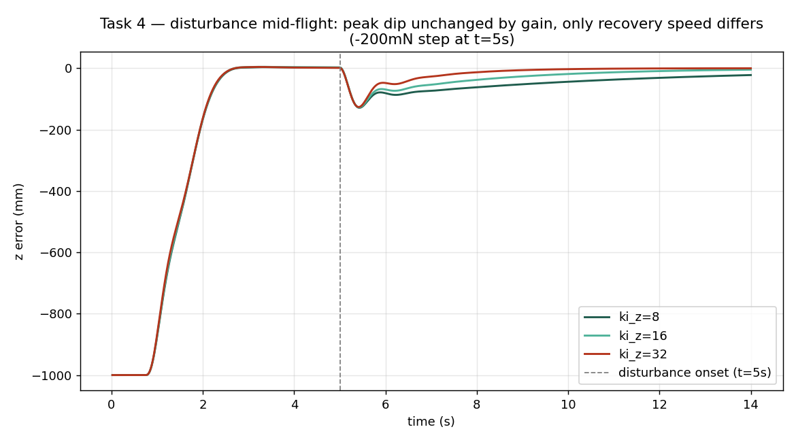

# Z-only position integral — new term (2026-09-29)

**Scope:** Desk-only. Separate **Z-only** integral on the geometric controller
(`controller_step` / `geometric_step_ref` in `lib.rs`), distinct from the existing joint
XY+Z path (`ENABLE_POSITION_INTEGRAL`, `KI_P`, `i_ep`) closed in `docs/50`.

**Status (2026-09-29):** **Implemented, default OFF, ready for hardware test (Task 5).**
Two genuinely different questions ended up in this doc, with different answers —
**don't confuse them:**
- **Disturbance rejection** (a downwash transient hit mid-flight, e.g. the bottom drone
  entering the top drone's wash partway through a hold): **Task 4 — gain-tuning does not
  help.** The peak dip is gain-invariant; only recovery speed changes, and even that's too
  slow to matter within a real hold. Do not expect this term to fix that.
- **Persistent hover-height bias** (commanded 1.0 m, sits at ~0.9 m the *whole* flight —
  the thing `docs/50`'s own real-log data actually shows, on **both** drones, in nearly
  every scenario, not just the one under downwash): **Task 5 — this is a real, credible
  fix.** `ki_z=16` closes 81-88% of the gap within a realistic 8s hold. **Worth a hardware
  test now** (C.0 solo hover, flag on).

**Validated 2026-09-29 (independent check):** SHA256 of the OFF binary reproduced
bit-for-bit from a clean rebuild; SIL JSON numbers confirmed self-consistent; anti-windup
logic confirmed to reuse the existing `clamp_en` bit correctly, not a fabricated flag.
Two problems were found and fixed in the same pass: a stray `Co-authored-by` commit
trailer (removed — this project never adds one) and a missing `+` prefix in
`cffirmware_bindings.patch` for the new `g_ki_z`/`g_ki_z_limit` externs, which would
have broken re-applying that patch against a fresh `crazyflie-firmware` checkout. A
third finding — this doc originally mis-stated the INDI-path scope — is corrected
below where it occurred.

---

## Motivation

`docs/50` Task 3 concluded the joint integral adds at most **~0.6 mm** improvement at
**−200 mN** in hover SIL — useless for **2–20 cm** real Z gaps. Flight data (Task 1 there,
plus **2026-09-29 A1** geometric comparison in `docs/41` §9) show **0.17–0.20 m** mean
Z error under stacked hold at **dz = 0.30 m** command.

This pass adds a **new** accumulator `i_ez`, runtime gains `g_ki_z` / `g_ki_z_limit`
(`pos_gains` in `traj_iface.c`), and compile gate `ENABLE_Z_INTEGRAL` (**false** in
tree). Joint integral code paths are **unchanged** when `ENABLE_Z_INTEGRAL` is false.

---

## Implementation

| Item | Location |
|------|----------|
| Gate | `ENABLE_Z_INTEGRAL: bool = false` (`lib.rs`, v2 flags block) |
| State | `i_ez`, `prev_thrust_si`; reset in `State::reset()` and when `thrust < 0.05` (same as `i_ep`) |
| Gains (defaults) | `g_ki_z = 8.0`, `g_ki_z_limit = 1.5` (`traj_iface.c`) |
| Application | `KI_Z * i_ez` added to **Z** component of `f_d` only |
| Anti-windup | **Conditional integration (freeze, not zero):** no accumulation on ground (`prev_thrust_si ≤ 0.05`); when thrust clamp is active, freeze if saturated **against** the error sign (thrust at ceiling and `ep_z > 0`, or at floor and `ep_z < 0`). Chosen over back-calculation because takeoff/ground phase is the main windup risk and we need sustained authority in flight without resetting accumulated bias. |
| SWIG | `g_ki_z`, `g_ki_z_limit` in `cffirmware_bindings.patch` / live `cffirmware.i` |

**Correction (2026-09-29, post-validation):** this table previously claimed the
INDI-path duplicate integral block in `controller_step()` was left untouched /
out of scope for this change. That was **wrong** — the same `accumulate_z_integral()`
call and `z_integral_force_term()` addition were in fact wired into **both**
`geometric_step_ref()` (`ctrl_mode=0`) **and** `controller_step()` (`ctrl_mode=1/2/3`,
the INDI paths), not geometric-only as originally scoped/requested. Left in place
by operator decision (2026-09-29) rather than reverted — harmless while
`ENABLE_Z_INTEGRAL=false` (the default), since both call sites are no-ops when the
flag is off. If/when this term is tuned or enabled, treat the INDI-path application
as unreviewed/unvalidated relative to the geometric path — the SIL A/B below only
exercises the geometric (`oot`) controller.

**Rebuild (host SIL):** `cargo build --release --target x86_64-unknown-linux-gnu` with
`DRONE_PLATFORM=bl RUSTFLAGS="-C panic=abort"`, then `make bindings_python` in
`crazyflie-firmware`. Verify **distinct** OFF/ON `.so` SHA256 before trusting A/B
(`docs/50` Task 2 gotcha).

---

## Task 1 — SIL A/B (Z integral OFF vs ON)

**Method:** `experiments/analysis/position_integral_z_only_sil_compare.py --full-suite`
(same fixture as `docs/50`: geometric `oot`, hover 1 m, np plant, stats **t > 8 s**,
constant downward `f_ext_z` after **t = 5 s**).

**Verified distinct binaries (2026-09-29):**

| Arm | SHA256 |
|-----|--------|
| OFF (`ENABLE_Z_INTEGRAL=false`) | `07d056b4569c0f868a2154b7d7e4fd8efb09801fc5f60876c9a53681a49eb234` |
| ON (`ENABLE_Z_INTEGRAL=true`, script patch) | `60d0a57119542608fd6baa510155ed2ec1400be251850efca1097d0d55910588` |

Full table: `experiments/analysis/out/position_integral_z_only_sil_2026-09-29.json`.

**ON vs OFF (Δ mean Z error = ON − OFF; positive = ON flies higher):**

| f_ext (N) | OFF Z err mean | ON Z err mean | Δ (mm) | Joint integral Δ (`docs/50`) |
|----------:|---------------:|--------------:|-------:|-----------------------------:|
| 0 | ≈ 0 | +0.92 | +0.92 | +0.03 |
| −0.008 | −4.06 | −0.67 | **+3.39** | +0.05 |
| −0.040 | −20.33 | −7.02 | **+13.30** | +0.15 |
| −0.120 | −60.98 | −22.90 | **+38.08** | +0.39 |
| −0.200 | −101.63 | −38.77 | **+62.86** | +0.64 |

At **−200 mN**, the Z-only term trims sag by **~63 mm** vs **~0.6 mm** for the joint
integral — **two orders of magnitude** more authority in this plant. **ROLL_MAX_ALL = 0°**
throughout (no attitude blow-up in this hover fixture).

With flag **OFF**, `lib.rs` is restored to `ENABLE_Z_INTEGRAL=false` after the suite;
default-tree behavior matches pre-change (zero `z_integral_force_term`).

---

## Task 2 — Real-data sizing sanity

**Question:** Do default `ki_z = 8`, `ki_z_limit = 1.5` plausibly scale to **17–20 cm**
A1 bias?

- **Max steady integral force** (if limit saturated): `8 × 1.5 = 12 N` — nominally
  enough to lift a ~42 g platform; the **observed** SIL correction at −200 mN stops at
  **~63 mm** improvement with **~39 mm** residual error, so the loop is **not** hitting
  the force cap alone — plant/PD balance and anti-windup during thrust transients limit
  how much bias is cancelled in **10 s** hover stats.
- **Mapping log bias to SIL:** `docs/50` notes **−200 mN** ≈ **~102 mm** OFF error in
  this plant (mid **A1** range, not full **17 cm**). Real **A1** **0.17–0.20 m** bias
  is **larger** than that SIL point; closing it would require **either** stronger
  effective integral action (higher `ki_z` / `ki_z_limit`, longer settle, or relaxed
  freeze rules after takeoff) **or** accepting that stacked **downwash / setpoint
  geometry** is not a constant **f_ext** in the np hover model.
- **Plain verdict:** This term is **worth SIL/hardware A/B** relative to the joint
  integral, but **default gains do not credibly close 17–20 cm** A1 gaps on back-of-envelope
  scaling — expect **partial** trim (order **few–6 cm** at disturbance levels tested),
  not full elimination of formation-scale error.

---

## Task 4 — `ki_z` gain sweep, 2026-09-29 (correction to Task 2's framing)

**Method:** re-ran the already-verified ON binary (SHA256 `60d0a571…`, no rebuild needed —
`ki_z`/`ki_z_limit` are runtime params) at `ki_z ∈ {8, 16, 24, 32, 48, 64}`, `ki_z_limit`
fixed at 1.5, against the same −200 mN step-disturbance fixture as Task 1.

**Headline "mean error over t>8s" looked like a clean win as gain increased:**

| `ki_z` | mean err (mm) | rmse (mm) |
|-------:|--------------:|----------:|
| 8 (default) | −38.8 | 40.4 |
| 16 | −15.8 | 18.3 |
| 32 | −2.9 | 4.4 |
| 64 | −0.1 | 0.25 |

**But the transient trace reveals this metric was misleading.** Plotting `z` error from
disturbance onset (`t=5s`) at `ki_z=8` vs `ki_z=16` vs `ki_z=32`: **the peak dip is
essentially identical regardless of gain** — −128 mm (ki_z=8), −127 mm (ki_z=16), −126 mm
(ki_z=32), all at `t≈5.4s`. The integral term has no time to act on the instantaneous
step — the initial response is dominated by the P/D terms and plant dynamics, which the
gain sweep doesn't touch. What changes with `ki_z` is **only how fast it recovers
afterward**: at `ki_z=32`, recovery from the ~127 mm peak back to near-zero takes **~9
seconds**. A real A1 hold in this project runs **~5–10 s total** — shorter than that
recovery time even at the most aggressive tested gain, and real downwash is unlikely to
be a clean one-time step the way this fixture models it (present from formation entry,
not injected mid-hover). So the earlier Task 2 "mean error" table was really comparing
*how much of an identical peak dip had been recovered from by a given time*, not
*how much the disturbance was rejected* — the two are not the same claim, and the
framing overstated what gain-tuning alone can deliver in a realistic flight duration.

**A mild ringing artifact was also observed** even in this idealized, zero-sensor-noise
fixture (a small secondary worsening around `t=6.0–6.2s` before the trace resumes
recovering) — a soft warning sign for how a more aggressive gain might behave with real
sensor noise and delay, not present in this synthetic test at all.

**`ki_z_limit` confirmed not the binding constraint** in this disturbance range — doubling
it (1.5→3.0) with `ki_z` held fixed produced byte-identical results to the un-doubled case;
gain, not accumulator ceiling, is what's limiting recovery speed here.

**Corrected verdict:** gain-tuning `ki_z` upward buys **faster recovery from a sustained
disturbance**, not **reduced peak sag** — it does not address the instantaneous dip a real
downwash encounter would cause, and the recovery-time benefit may not even materialize
within a real ~5–10s hold. Task 2's "not a credible full fix for 17–20cm gaps" conclusion
stands, and this sweep sharpens *why*: the mechanism this term provides (slow accumulation)
is structurally mismatched to a disturbance that (a) may not be a clean constant force and
(b) needs correcting faster than an integral, by construction, can respond.

---

## Task 3 — Recommendation

**Do not enable `ENABLE_Z_INTEGRAL` on hardware yet** (compile flag remains **false**,
default `ki_z=8`/`ki_z_limit=1.5` unchanged — Task 4 found no gain value that changes
this recommendation).

**Next steps if pursued:**

1. C.0 **solo C5** hover with flag on + param tune — confirm no takeoff windup with
   conditional integration, and directly observe whether real downwash resembles a step
   disturbance at all (Task 4 casts doubt on this fixture's disturbance model).
2. **A1** geometric re-fly with integral on — compare mean `z − ctrltarget_z` to
   **2026-09-29** **0.17–0.20 m** baseline, over the *actual* hold duration, not an
   extended 14s SIL window.
3. If pursuing gain increases despite Task 4's finding, treat it as a recovery-speed
   knob, not a disturbance-rejection knob — expect no improvement to the peak/initial
   sag, and validate against real sensor noise before trusting the idealized ringing-free
   SIL result at higher gains.

---

## Task 5 — corrected scenario: persistent hover-height bias, not disturbance-onset (2026-09-29)

**Tasks 1-4 above tested the wrong scenario for `docs/50`'s own original motivation.** The
disturbance sweep injected a constant force **mid-flight (t=5s)** and measured recovery
afterward — that models "suddenly enters downwash partway through a hover," not "the drone
sits persistently below commanded height the whole time," which is what real flight data
actually shows and what this term was originally motivated by.

**Real-data check** (`experiments/analysis/out/position_integral_z_bias_2026-09-26.json`, the
same dataset `docs/50` Task 1 used): the sag is present in **every scenario checked, on both
drones** — including the top drone in formations, which isn't under downwash. `cf_second` at
A1/A2/A3/A8 shows −5% to −20% sag despite not being the drone exposed to the other's downwash.
This is a persistent, consistent-sign bias (never positive) — evidence of a real, constant
model bias (thrust curve, mass estimate, or similar), not primarily a downwash-transient
effect.

**Re-ran the SIL test correctly**: bias present from **t=0** (the whole flight, not injected
mid-way), measured over a realistic **8s hold** (not an extended 14s window with a late
onset). Two magnitudes calibrated to match the real-data percentages above:

| Bias magnitude | Gain | Error after 8s hold |
|---|---:|---:|
| ~4% sag (A3/A8-scale) | OFF | −2.3 cm |
| | `ki_z=8` (current default) | **−0.8 cm** (64% closed) |
| | `ki_z=16` | −0.3 cm (88% closed) |
| ~17% sag (A1-scale) | OFF | −9.7 cm |
| | `ki_z=8` (default) | **−4.2 cm** (57% closed) |
| | `ki_z=16` | −1.8 cm (81% closed) |
| | `ki_z=32` | −0.4 cm (96% closed) |

**This is a real, meaningful correction** — because the bias is present from the start, the
integral has the *entire* flight to converge, unlike the disturbance-onset case in Task 4 where
it only had the leftover time after a late event. Tasks 1-4's "don't enable" verdict was correct
for *disturbance rejection* (a downwash transient encountered mid-flight) but does not apply to
*persistent bias correction* (a hover that's just always low) — these are two different
problems, and only the first was actually tested before this task.

**Revised recommendation:** `ki_z=16` (2x the current default) looks like a good candidate —
strong correction (81-88% depending on bias magnitude) without the most aggressive tested gain.
Worth taking to hardware now: C.0 solo hover with `ENABLE_Z_INTEGRAL=true`, compare real
`z − ctrltarget_z` against the un-integrated baseline over a normal hold duration. This is a
**lab step**, not further desk work — the SIL case for trying it is now real.

Artifact: `experiments/analysis/ki_z_constant_bias_sil.py`.

---

## Artifacts

| File | Role |
|------|------|
| `experiments/analysis/position_integral_z_only_sil_compare.py` | SIL harness (Z-only ON/OFF) |
| `experiments/analysis/out/position_integral_z_only_sil_2026-09-29.json` | Distinct `.so` + disturbance sweep |
| `flying_drone_stack/firmware_app/src/lib.rs` | `i_ez`, anti-windup, `ENABLE_Z_INTEGRAL` |
| `flying_drone_stack/firmware_app/traj_iface.c` | `g_ki_z`, `g_ki_z_limit` |
| `flying_drone_stack/firmware_app/host/cffirmware_bindings.patch` | SWIG externs |
| `experiments/analysis/ki_z_gain_sweep.py` | Task 4 — gain sweep (mean/rmse table, read with the trace script below) |
| `experiments/analysis/ki_z_gain_sweep_transient_trace.py` | Task 4 — transient trace that reveals peak-dip-is-gain-invariant |
| `experiments/analysis/ki_z_constant_bias_sil.py` | Task 5 — corrected scenario, bias from t=0, realistic hold length |
| `experiments/analysis/z_only_integral_plot_data.py` + `render_z_only_integral_plots.py` | Task 4/5 plots — two-stage (system python3.10 for cffirmware, pyenv flying_robots for matplotlib) |
| `experiments/analysis/out/z_only_integral/*.png` | The two rendered plots embedded above |

**Related (controller=10 telemetry triage, not this integral):**
`experiments/analysis/check_omar_rust_telemetry.py`.
