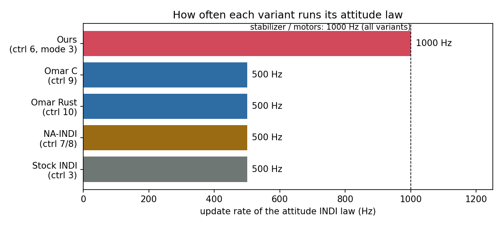
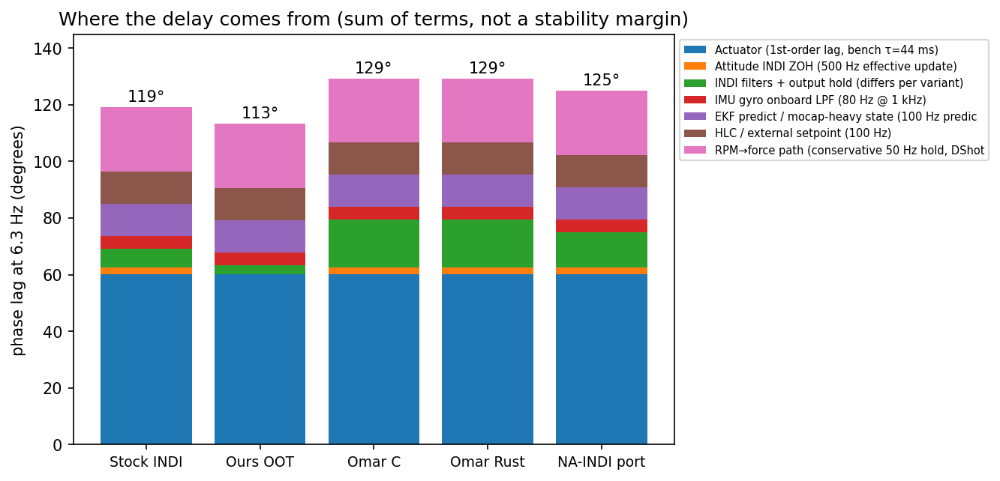
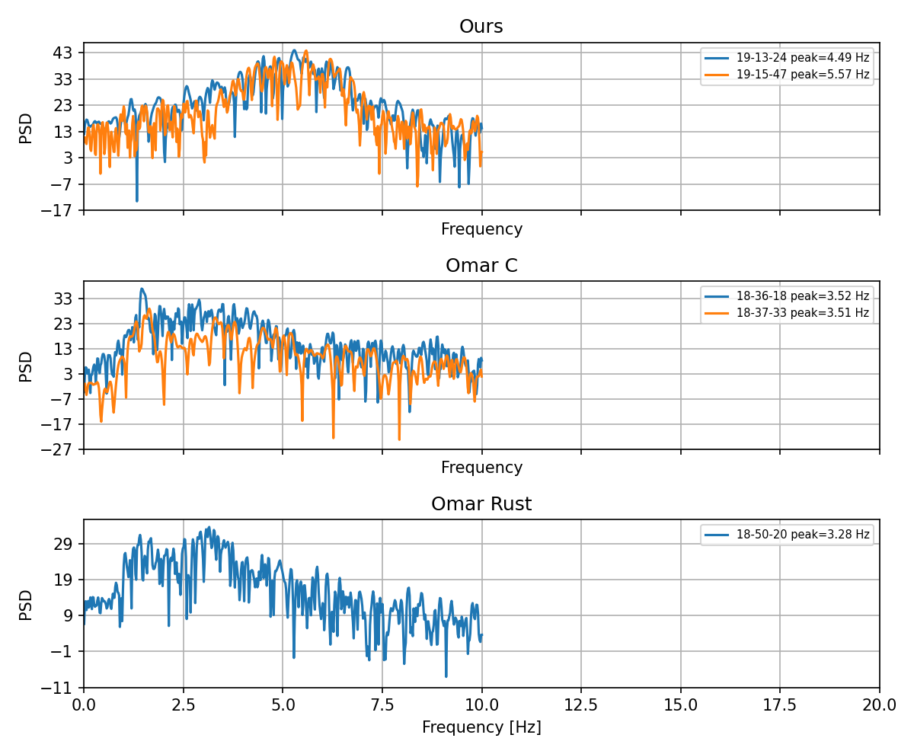

# 53a — INDI loop rates: simple overview (numbers, tables, plots)

Short summary of [`53_INDI_Loop_Rates_and_Oscillation_Ledger.md`](53_INDI_Loop_Rates_and_Oscillation_Ledger.md) (full details, file:line evidence).
Question: do the INDI variants run their loops at different rates in a way that could explain our attitude oscillation (6.3 Hz, worst on A1)?
Status 2026-10-04: code comparison done and checked; **flight check is inconclusive** (see §4); follow-up analysis pending.

## 1. Short answer

- Only **one real rate difference**: our INDI runs the attitude law at **1000 Hz**, all others at **500 Hz**.
- Everything else on the platform is **the same for every variant**: stabilizer and motors 1000 Hz, estimator predict 100 Hz, setpoint 100 Hz, motor lag τ ≈ 44 ms.
- On paper the rate difference is **small** (about 0.5 ms of lag) and ours has **less** total lag than the others.
- So **timing alone does not explain** why ours oscillates most. It is **not ruled out** together with gains or the torque model.
- Firmware default in ours: filters designed for 500 Hz but run at 1000 Hz (known since 2026-09-10). **The flown yaml already corrects this** (`filt_dt_us=1000`, prewarp on, `fc_bw=206`), so it is not active in flight.

## 2. Rates per variant (from the code)

| | Ours (6, mode 3) | Omar C (9) | Omar Rust (10) | NA-INDI (7/8) | Stock INDI (3) |
|---|---|---|---|---|---|
| Attitude INDI law | **1000 Hz** | 500 Hz | 500 Hz | 500 Hz | 500 Hz |
| Output on the skipped tick | — (runs every tick) | held (early return) | held (early return) | held (early return) | written every tick |
| Filters on angular acceleration | 206 Hz, designed at 1000 Hz (flown yaml) | 30 Hz | 30 Hz | 40 Hz (yaw 10 Hz) | 70 Hz |
| Stabilizer / motors | 1000 Hz | 1000 Hz | 1000 Hz | 1000 Hz | 1000 Hz |
| Estimator predict, setpoint (HLC) | 100 Hz | 100 Hz | 100 Hz | 100 Hz | 100 Hz |
| Flown on A1 (2026-10-02) | yes | yes | yes | no | no |

Same for all: IMU gyro low-pass 80 Hz, accelerometer low-pass 30 Hz, motor command every 1 ms.

## 3. Delay at 6.3 Hz

| Variant | Total phase lag at 6.3 Hz | vs Omar |
|---|---:|---:|
| Ours | 113° | −16° |
| Stock INDI | 119° | −10° |
| NA-INDI | 125° | −4° |
| Omar C / Omar Rust | 129° | 0 |

- The motor lag alone is **60°** in every variant (measured on the bench).
- The variants differ only in the **filters and the update rate**. Omar's 30 Hz filters add the most lag; ours add almost none.
- This is a **sum of terms, not a stability margin**. Three terms are assumptions (low confidence): estimator age, setpoint hold and the rotor-speed (RPM) path. They are the same for every variant, so they do not change the comparison.
- Caveat: `filt_dt_us`, `notch_en` and `filt_prewarp` are **not recorded** in the flight meta. The calculation uses the flown yaml values (`filt_dt_us=1000`, prewarp on) and assumes the notch is off.

## 4. Flight data (A1, cf5, 2026-10-02) — weak evidence

Source: radio logs at about 20 Hz, with sample times that jitter by 7–10 ms. 6.3 Hz is close to the 10 Hz limit of such a log, so the peak frequencies below are **not reliable**.

| Variant | Flights | gyro_x peak (Hz) | Peak power (relative) |
|---|---:|---:|---:|
| Ours | 2 | 4.5 – 5.6 | 6 × 10⁵ |
| Omar C | 2 | 3.5 | 1.3 × 10⁴ |
| Omar Rust | 1 | 3.3 | 1.1 × 10⁴ |

- Ours has much more oscillation power. But the ours flights also have large height excursions, so this shows instability, not a cause.
- "All variants log at the same rate" is trivial: all come from the same radio link. It is **not** evidence about the hypothesis.
- Stock INDI and NA-INDI were not flown on A1.
- A proper test needs the **500 Hz card logs** paired to these flights (next step).

## 5. What was already tried (short)

| Idea | Result |
|---|---|
| Change `fc_bw`, notch near 7 Hz | notch was not at 7 Hz (filter design rate), lower `fc_bw` hurt tracking |
| Attitude gains `kr` / `kw` | limit cycle appears from about kr 500 and above |
| Position INDI off (`ctrl_mode` 3 → 2) | no change to the shake |
| Position integral | refuted as a fix |
| DShot vs optical rpm | DShot broke INDI early on, optical was fine |
| Bench motor test | motor lag τ ≈ 44 ms (first order) |
| Filter design rate | default mismatch confirmed; corrected in the flown yaml (stage 2b); lowering `fc_bw` to 100 made things worse (stage 2c) |
| Stock INDI, NA-INDI on brushless hardware | **never flown** |

Full ledger: doc 53 §5.

## 6. Next steps

1. Pair the 500 Hz card logs with the five Oct-02 A1 flights and check for a real 6.3 Hz peak per variant.
2. Test in the host simulator with the motor-lag plant: notch on/off and the control rate (needs a corrected harness, see doc 54 validation). The filter design rate is already corrected in the flown yaml.
3. Prepare a patch so flights record `filt_dt_us`, `filt_prewarp`, `notch_en`, `fc_bw`, `dt_usec` (prompt for Cursor is prepared; not yet run).

_Data and plots: `experiments/analysis/out/indi_loop_rates/` · scripts `indi_loop_rates_*.py`, `indi_loop_overview_plots.py`._
