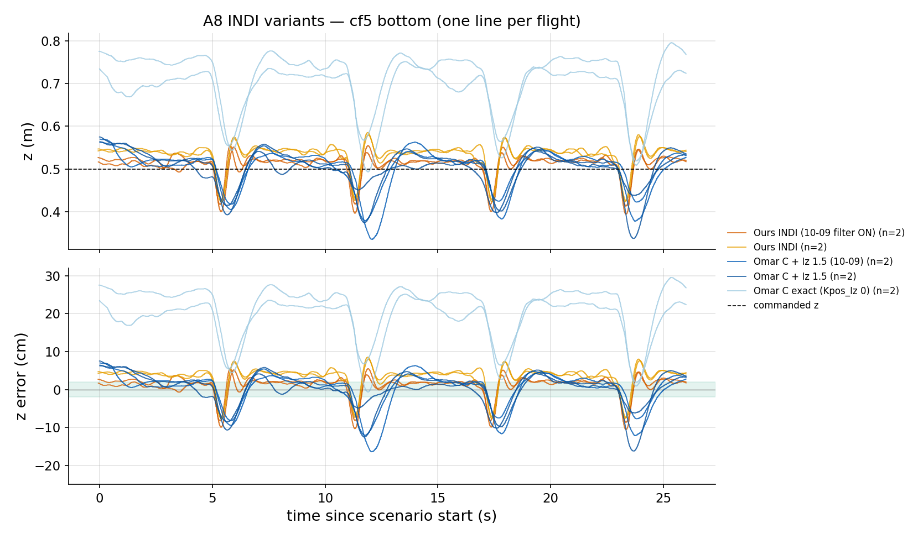
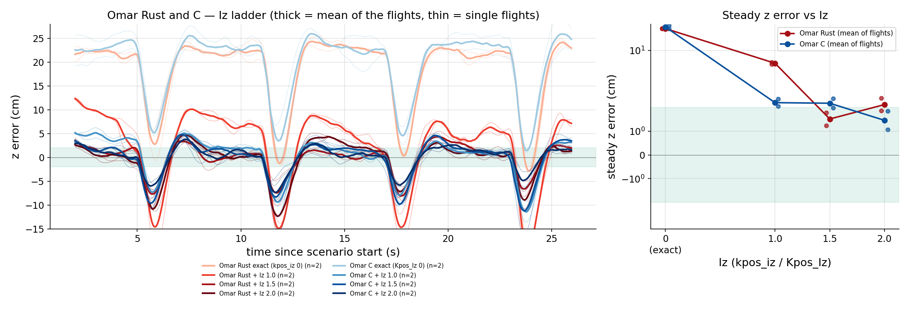
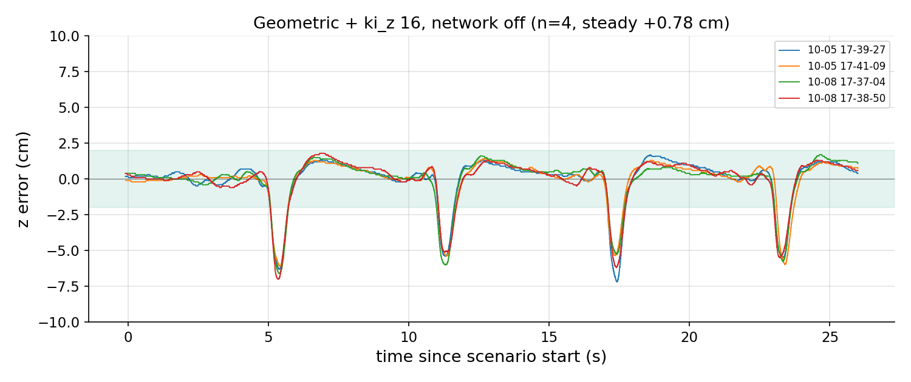
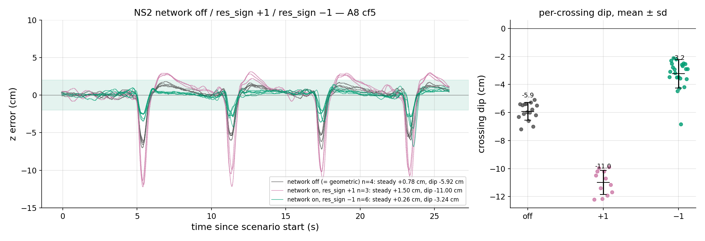
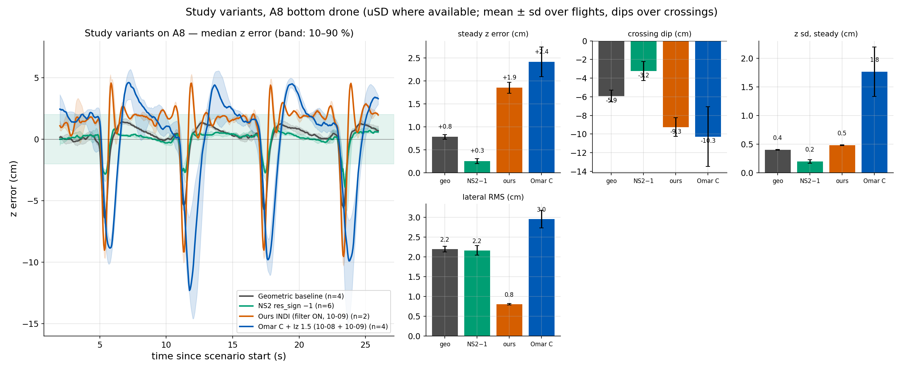
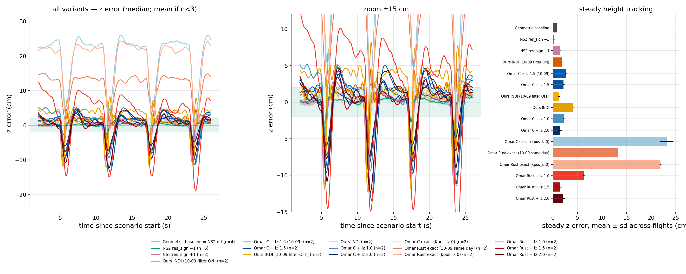

# 71 — A8 variant comparison (2026-10-09)

**Question:** On scenario A8 (cf5 bottom, dz=0.5 m, height 0.5 m, 4 passes, 26 s), how well does each controller track commanded height, and how do variants differ? Crossing dips are reported but are not the primary ranking criterion.

## Method
- Window `W`: from first `z>0.3 m` + 6 s to last airborne − 4 s. Steady set = `W` minus ±1.5 s around each of 4 crossings (`a8_crossings.zero_crossings`: zero crossings of `y` with hysteresis, 4 expected 6 s apart; 3 if a radio log ends early).
- `e_z = (z − z_sp)·100` cm; uSD preferred (`ctrltarget_z`), radio fallback (`z_sp=0.5 m`).
- Every flight verified against `A8_<date>_<stamp>.meta.json`; Iz values for 10-08 Omar flights assigned by flight order (docs/69/70), not stored in meta. NS2 `rnn.en` / `res_sign` from session yaml where absent in meta.

## Summary table

| variant | n | source | steady mean ± sd (cm) | pooled steady sd | rms_z | max abs z (worst flight) | dip abs mean ± sd | dip rel. to steady | lat_rms (m) | roll / pitch p99 (deg) | gyro_x sd | PWM-ceiling frac | vbat min |
|---|---:|---|---|---:|---:|---:|---|---:|---:|---|---:|---:|---:|
| Geometric baseline | 4 | usd | +0.78 ± 0.04 | 0.41 | 1.44 | 7.2 | -5.92 ± 0.61 | -6.70 | 0.022 | 21 / 8 | 50 | 0.000 | 3.48 |
| NS2 off (= geometric) | 4 | usd | +0.78 ± 0.04 | 0.41 | 1.44 | 7.2 | -5.92 ± 0.61 | -6.70 | 0.022 | 21 / 8 | 50 | 0.000 | 3.48 |
| NS2 res_sign −1 | 6 | mixed | +0.26 ± 0.05 | 0.21 | 0.83 | 6.8 | -3.24 ± 1.00 | -3.48 | 0.022 | 21 / 7 | 51 | 0.000 | 2.52 |
| NS2 res_sign +1 | 3 | usd | +1.50 ± 0.04 | 0.87 | 2.67 | 12.2 | -11.00 ± 0.83 | -12.50 | 0.024 | 22 / 8 | 57 | 0.000 | 3.57 |
| Ours INDI (10-09 filter ON) | 2 | usd | +1.85 ± 0.08 | 0.49 | 2.60 | 10.3 | -9.25 ± 0.95 | -11.10 | 0.008 | 7 / 4 | 49 | 0.009 | 3.43 |
| Omar C + Iz 1.5 (10-09) | 2 | usd | +2.64 ± 0.11 | 2.00 | 4.50 | 16.4 | -10.66 ± 2.84 | -13.30 | 0.031 | 22 / 12 | 72 | 0.001 | 3.62 |
| Omar C + Iz 1.5 | 2 | usd | +2.18 ± 0.19 | 1.61 | 3.53 | 12.5 | -9.88 ± 3.32 | -12.06 | 0.028 | 14 / 8 | 58 | 0.011 | 3.21 |
| Ours INDI (10-09 filter OFF) | 2 | usd | +1.28 ± 0.23 | 0.74 | 3.06 | 13.4 | -12.04 ± 1.82 | -13.31 | 0.008 | 8 / 5 | 87 | 0.037 | 3.15 |
| Ours INDI | 2 | usd | +4.17 ± 0.03 | 0.56 | 4.34 | 8.5 | -7.41 ± 0.30 | -11.58 | 0.009 | 7 / 4 | 30 | 0.007 | 3.48 |
| Omar C + Iz 1.0 | 2 | usd | +2.21 ± 0.16 | 1.38 | 3.26 | 10.2 | -9.05 ± 2.15 | -11.26 | 0.031 | 14 / 8 | 52 | 0.009 | 3.27 |
| Omar C + Iz 2.0 | 2 | usd | +1.46 ± 0.39 | 1.36 | 2.54 | 8.9 | -6.06 ± 1.55 | -7.52 | 0.031 | 17 / 7 | 60 | 0.001 | 3.54 |
| Omar C exact (Kpos_Iz 0) | 2 | usd | +23.16 ± 1.30 | 2.59 | 21.33 | 27.6 | +3.47 ± 2.53 | -19.69 | 0.026 | 26 / 9 | 103 | 0.003 | 3.63 |
| Omar Rust exact (10-09 same day) | 2 | usd | +13.29 ± 0.23 | 1.07 | 12.34 | 15.4 | +2.06 ± 2.49 | -11.24 | 0.034 | 20 / 7 | 73 | 0.001 | 3.50 |
| Omar Rust exact (kpos_iz 0) | 2 | usd | +21.88 ± 0.15 | 2.29 | 20.22 | 25.5 | -0.38 ± 2.67 | -22.26 | 0.031 | 26 / 10 | 95 | 0.014 | 3.39 |
| Omar Rust + Iz 1.0 | 2 | usd | +6.29 ± 0.23 | 2.72 | 7.33 | 18.1 | -15.94 ± 3.50 | -22.23 | 0.032 | 21 / 10 | 67 | 0.010 | 3.48 |
| Omar Rust + Iz 1.5 | 2 | usd | +1.52 ± 0.27 | 1.72 | 2.99 | 10.2 | -7.61 ± 1.79 | -9.13 | 0.030 | 16 / 7 | 60 | 0.001 | 3.57 |
| Omar Rust + Iz 2.0 | 2 | usd | +2.13 ± 0.26 | 1.76 | 3.81 | 15.6 | -9.94 ± 2.76 | -12.07 | 0.032 | 16 / 10 | 58 | 0.004 | 3.39 |

## Figures (traces: time since scenario start, every flight aligned on its first crossing = 5.0 s; radio flights drop the takeoff part, everything stops at 26 s)

## Cross-checks (tolerance 0.3 cm; reference = independent re-runs of `omar_iz_a8_2026_10_08.py`, `omar_c_iz_a8_2026_10_08.py` and the radio NS2 analysis with the same robust detector; NS2 −1 reference is radio-only, the table mixes 3 radio + 1 uSD)
- Omar Rust Iz 1.0: got +6.29 expected +6.29 → reproduced
- Omar Rust Iz 1.5: got +1.52 expected +1.52 → reproduced
- Omar Rust Iz 2.0: got +2.13 expected +2.13 → reproduced
- Omar C Iz 1.0: got +2.21 expected +2.21 → reproduced
- Omar C Iz 1.5: got +2.18 expected +2.18 → reproduced
- Omar C Iz 2.0: got +1.46 expected +1.46 → reproduced
- Omar Rust exact (older meeting-doc value, other window): got +21.88 expected +19.00 → differs by 2.88 cm
- Omar C exact (older meeting-doc value, other window): got +23.16 expected +22.00 → differs by 1.16 cm
- NS2 off dips 10-08: got -5.93 expected -5.92 → reproduced
- NS2 +1 dips: got -11.00 expected -10.97 → reproduced
- NS2 −1 dips: got -3.24 expected -3.41 → reproduced

## Factual reading (A8 cf5, this dataset; updated 2026-10-09 evening)
**Study variants** (final configurations, uSD): geometric baseline, NS2 `res_sign −1`, ours INDI (filter ON, unified firmware), **Omar C + Iz 1.5 (the only Omar variant of the study, decision 2026-10-09)**. The other rows are reference / history.
- **Steady z error:** geometric +0.8 cm, NS2 −1 +0.3, ours INDI +1.9, Omar C + Iz 1.5 +2.2 (10-08) and +2.6 (10-09; four flights over two days: +2.4). All within ≈ 2.6 cm of the command.
- **Ours INDI vs Omar C + Iz 1.5:** same level, but ours is much tighter — z sd 0.5 vs 1.6–2.0 cm, lateral RMS 0.8 vs ≈ 3 cm, roll p99 7° vs 14–22° — and its crossing dips are ≈ 1.5 cm shallower (−9.3 vs −10.7 cm; relative −11.1 vs −13.3). Omar C + Iz 1.5 reproduces across days (+2.2 → +2.6 cm). Ours is weak on A1 (saturation, oscillation) — not part of this table.
- **Geometric and NS2 are the tightest in z** (dips −5.9 cm and −3.2 cm).
- **Omar without the integral:** the offset is not fixed — +21.9 (Rust, 10-02), +23.2 (C, 10-02), +13.3 (Rust, 10-09 same-day baseline, fresh battery); with the integral +1.5…+2.6 cm. History only, no longer a study variant.
- **Ours INDI, filter OFF vs ON (same day):** same level and dips within the battery confound (OFF #2 sagged to 3.15 V); the 10-02 level (+4.2 cm) is 2.3 cm higher than both 10-09 groups (docs/lab_sessions/2026-10-09.md).
- **Dip columns:** the absolute dip of the "exact" Omar variants is positive/small because their level sits +13…+23 cm high; compare variants with "dip rel. to steady". Dips are negative numbers, shallower is better.
- **Network off = geometric:** the NS2 "network off" cohort IS the geometric baseline (same controller, `rnn.en 0`), so both rows are identical by construction.

## Excluded flights
- 10-02 18-57-49 ((explicit)): pre-fix ki_z 16 on ours INDI path
- 10-02 18-59-17 ((explicit)): pre-fix ki_z 16 on ours INDI path
- 10-02 18-22-05 ((explicit)): dz 0.25 in meta
- 10-03 13-15-00 (Geometric baseline): max_tilt=150° in scenario window
- 10-02 19-08-13 (Ours INDI): abort/crash check: short airborne 12.9s tilt=18
- 10-03 13-10-32 (Ours INDI): abort/crash check: ok tilt=102
- 10-05 17-59-30 (c6/m0): candidate not used
- 10-05 18-01-01 (c6/m0): candidate not used
- 10-05 18-02-38 (c6/m0): candidate not used
- 10-05 18-18-58 (c6/m0): candidate not used
- 10-05 18-34-10 (c6/m0): candidate not used
- 10-09 17-28-52 (c6/m0): candidate not used

Notes: 10-03 `13-15-00` is a genuine tumble on both logs (radio roll up to 180°, z error +43 cm in the window), not a gate artefact; 10-02 `19-08-13` ours INDI was an early abort (airborne ≈ 13 s); 10-03 `13-10-32` ours INDI ended in a crash after ≈ 12 s; the 10-05 flights listed as "candidate not used" are the crash / pose-swap attempts of that session.

## Caveats
- Different days and firmware builds (10-02/03 vs 10-05 vs 10-08); the "Omar exact" baselines are not same-session as the "+Iz" flights (a same-session baseline is planned for the next lab day).
- n is small: ours INDI n = 2, Omar variants n = 2 each, geometric n = 4, NS2 n = 3–4; "± sd across flights" with n = 2 is only a spread indicator.
- Omar Iz values (1.0/1.5/2.0) are assigned from the flight order (docs/69, docs/70); the meta files do not store them.
- NS2 `res_sign −1` mixes three radio-only flights (cf5 uSD lost on 10-08 17-16-27, 17-22-13, 17-24-54) with one uSD flight; radio samples at ≈ 20 Hz and set-point 0.5 m, so the radio dips are shallower by ≈ 0.2–0.6 cm than uSD would give (compare +1: radio −10.35 vs uSD −11.00). Lateral RMS and PWM-ceiling are uSD-only.
- 10-08 17-16-27 had a cf5 battery sag (vbat min ≈ 2.5 V) — kept, flagged.
- The 10-05 geometric/NS2 uSD files are matched by `usd_run_tag` (card stamp ≠ radio stamp).
- The PWM-ceiling fraction in the table is taken inside the window W; docs/69 and docs/70 quote it over the whole airborne time (takeoff and landing included), which is higher.
- Crossings: all 29 flights use `a8_crossings.zero_crossings` (uSD crossing times 5.01/11.05/17.02/23.05 s since liftoff, sd ≤ 0.05 s); radio logs that end before pass 4 contribute 3 crossings. The older minima-of-|y| detector mislocated a crossing in 8 of 29 flights and is no longer used.
- Observational comparison: battery, tracker and day effects are not separated; the top drone is geometric in all flights.

## Artifacts
Script: `experiments/analysis/a8_variant_comparison.py`  
Outputs: `experiments/analysis/out/a8_compare_2026-10-09/`
