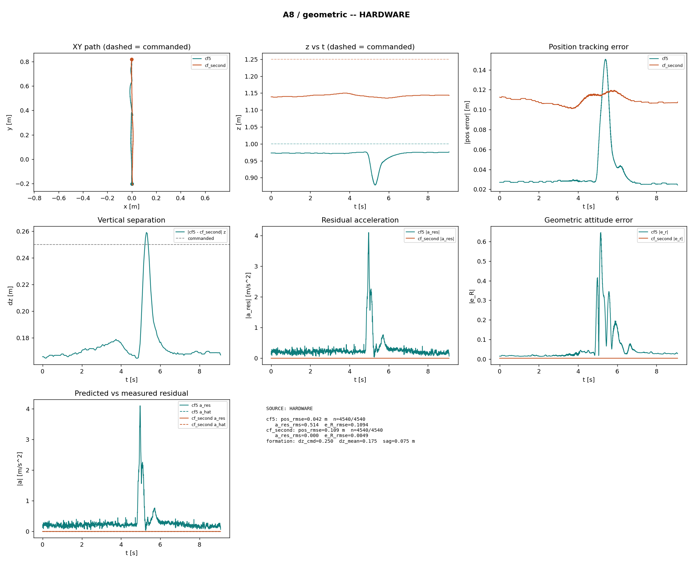

# Meeting prep — Monday 21 September 2026

**Thesis deadline:** **26 February 2027** — **~23 weeks left**

---

## Done since last meeting

- **Two-drone crossing flights** — stock Lee, our geometric, our full INDI.
  - SD logging on both drones; merged logs, plots, and metrics pipeline working.
  - **Quirk:** some logs cut off early — often only **one** crossing visible though the scenario has **two**.
  - **Clocks:** each drone aligned to its own radio trace, then merged; 
- **Switched from mixed drone types to both brushless.**
- **Switched to DShot for RPM readings.**
- **Issues resolved**
  - **Mocap:** wrong marker tracking → restored **four-point** marker layout on each drone.
  - **Broken study drone** — replaced with a spare; won’t fly on our controllers; root cause not found yet.
- **Neural-Swarm2 training pipeline** — model matches firmware; training scripts updated; **needs real flight logs before training can start.**
- **Plotting scripts** for merged flight logs.
- **Rust firmware ports** of Briesewitz **pure INDI** and **NA-INDI** — built, not yet validated in flight on our stack.
- **Stock INDI tried once** — unstable, could be an outlier.

---

## Next steps

- **Neural-Swarm2 flight data** — **geometric on cf5**, Lee on top, uSD both; **A4 mandatory.**
- **Finalize INDI baseline** — Omar / established INDI; stock INDI; Briesewitz pure INDI vs ours.
- **FBL controller** — desk follow-up.
- **Comparative study** — start slowly once INDI is chosen
- *Side note:* controller 7/8 — single-drone hover first, then 2-drone A8 if time.

---

## Plots

**Dashboard — geometric**

- **z vs t:** flown height vs commanded — vertical trajectory tracking through the crossing.
- **Position tracking error:** \|e\| vs time.
- **Attitude error \|e_R\|:** attitude vs time on each drone — downwash on the bottom trace.

**Dashboard — full INDI**

- **z vs t:** same as geometric — compare dip/spike at the crossing.
- **Position tracking error:** same metric — compare bottom-drone curve to geometric.
- **Attitude error \|e_R\|:** same — compare bottom-drone roll/pitch excursion.

---

## Questions

- **NA-INDI strategy:** retrain the network on **our downwash flight data**, use Briesewitz **as-is** with weights from their **payload** training and compensation setup, or **both**?
