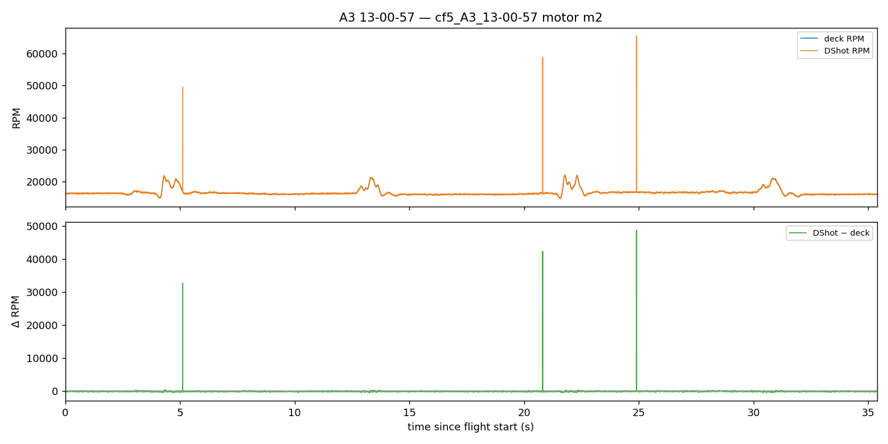
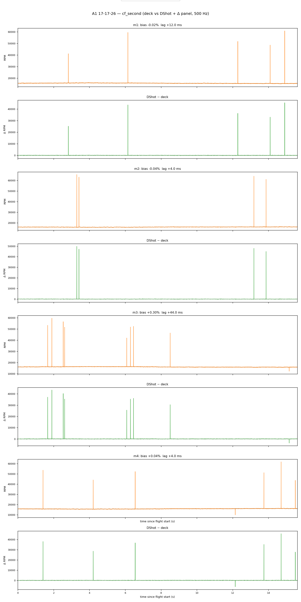

# Meeting prep — Monday 28 September 2026

**Thesis deadline:** **26 February 2027** — **~22 weeks left**

---

## Done since last meeting

- **Data collection — scenarios flown:** A1, A2, A3, A7, C5. Only **A4 ×4** remains.
  - **A1** — vertical stack hover, nothing moves (baseline: any displacement is interaction, not tracking error).
  - **A2** — vertical stack tracking, constant separation while both drones move.
  - **A3** — static top drone, bottom drone sweeps through its wash.
  - **A7** — dynamic merge, one continuous sweep from far to close separation.
  - **C5** — single drone, near-ground pass (ground effect only, no second drone).
  - **A4** (still to fly) — offset stack, partial overlap, the hardest case to model.
  - 24 training merges now banked. uSD tag-based pairing now standard.
- **RPM dual-source check** — deck vs DShot readings compared on every successful flight.
  - **How:** for each motor, each flight, line up deck and DShot readings on the same clock and compare over the whole flight — see plot below.
  - **Result:** agreement is good — median bias ~0.1%, median lag ~3ms (a couple samples at 500Hz).
- **26 Sep — facility mocap fault.** Not our software. **Blocks all flying.**
- **Neural-Swarm2 (Strategy 2) — fully closed out at the desk.**
  - Trained, tested, and validated — predictions and sim behavior both look correct.
  - Onboard RAM problem fixed (weights now stored in flash).
  - **Nothing more to do at a desk — next step needs a real flight.**
- **Position-integral (Z bias) investigation** — done in sim only. Real hardware validation could not happen, mocap-blocked.
- **Omar's pure INDI** — built and sim-validated. Hardware testing could not happen either, same mocap block.

---

## Plots

**Metric definitions:**
- **Bias** — average % (and RPM) difference between DShot and deck, same motor, same flight, over the whole flight duration.
- **Lag** — the time-shift that best lines up the two sensors' full traces, one number per motor.
- **Delta panel** — the two raw RPM traces sit almost on top of each other at full scale (bias is sub-1%), so each plot below also shows `DShot − deck` on its own small-scale axis underneath, to make that tiny difference actually visible.

**Deck vs DShot, full flight, one representative motor (with delta panel)**

- Typical case — top: both raw traces; bottom: their difference over time.

**All 4 motors, the flight with the largest lag we saw**

- Each motor gets two full-width rows: deck+DShot overlaid together on top, delta below. Even the worst case (44ms on one motor) stays a small, bounded delta.

**Across all 27 successful flights (A2 excluded, covered separately):**

| | Mean \|bias\| | Mean Δ (RPM) | Mean \|lag\| | Max \|lag\| |
|--|--:|--:|--:|--:|
| Mean | 0.125% | 19.7 | 3.6 ms | 11.2 ms |
| Median | 0.115% | 18.2 | 3.0 ms | 8.0 ms |
| Std | 0.045% | 6.7 | 2.0 ms | 10.4 ms |

---

## Next steps

- **Facility mocap fix** — not ours to do; blocks everything else.
- **Once fixed:** confirm software fixes fly clean, then close **A4 ×4**.
- **After A4:** retrain on the complete dataset, then fly NS2 once mocap is fixed.
- **Finalize INDI for the comparative study.**
- **Start the comparative study.**
