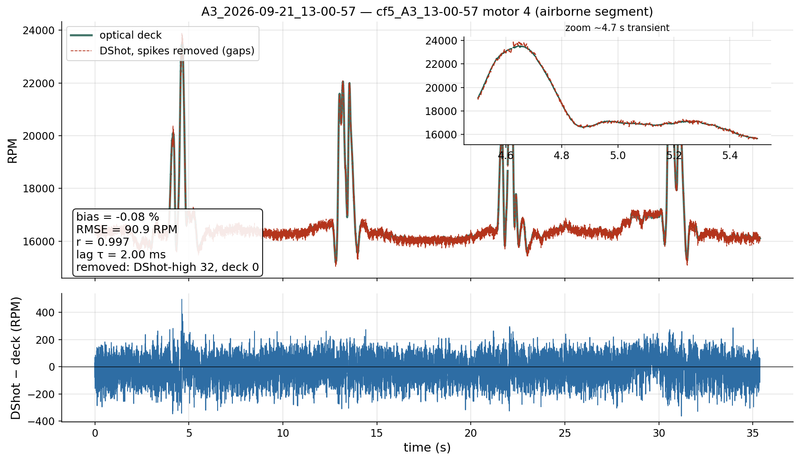
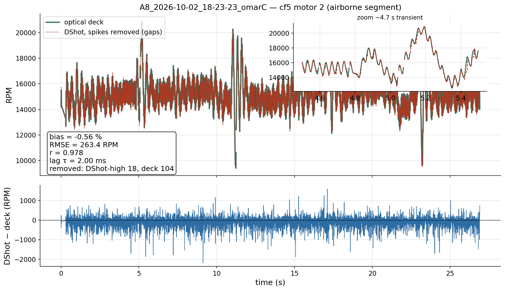

# Meeting prep — 2026-10-03

**Since last meeting:** 2026-09-28 · **Deadline:** 26 Feb 2027 (~21 weeks)

---

## 1. Pure INDI variants — Ours vs Omar C vs Omar Rust
- Flew all three back-to-back on the same two scenarios: **A1** (two drones stacked, hovering) and **A8** (two drones swap sides).
- Metric: **z error = measured z − commanded z** of the bottom drone (`cf5`), per flight, in the steady part of the flight; reported as **mean z error** and **max |z error|**.
- Summary (mean z error of clean flights, radio logs, steady window; per-flight table with mean and max |z error| in `experiments/analysis/out/meeting_2026-10-03/table_indi_z_error.md`):
  - **A8:** Ours **+3.6 cm**, Omar C **+19…+23 cm**, Omar Rust **+19…+20 cm**.
  - **A1:** Ours **−17…−19 cm** (full INDI has to run with `ki_z=0`), Omar C **+2…+4 cm**, Omar Rust **−7…−11 cm**.
  - **Max |z error| (A8 / A1):** Ours ≈ 8 / 29–38 cm, Omar ≈ 25–28 / 6–18 cm.
  - → no variant is best everywhere; both Omar variants are ~20 cm too high on A8.
- Fixed on the way: Omar Rust compiler bug (flies now); our full-INDI liftoff tumble (`ki_z=16` + full INDI → use `ki_z=0`).
- **Plot:** bottom-drone z over time (and z error underneath), one representative clean flight per variant, commanded z dashed:

- **Need your call:** which one is "Strategy 1"?

---

## 2. Z tracking of the geometric controller (with Z-integral)
- Geometric controller + Z-integral (`ki_z=16`): z is held within **≈ 2 cm of the commanded z** through the steady part of every flight.
- Steady window: start (hover: first z ≥ 0.8 m; formation: liftoff) + 6 s … start of the landing; only clean flights.

| Scenario | n flights | mean z error | max \|z error\| |
|---|---|---|---|
| Hover (solo `cf5`) | 3 | +0.15 cm | 2.0 cm |
| Figure-8 (solo `cf5`) | 2 | +0.68 cm | 1.9 cm |
| A1 (top drone `cf_second`) | 5 | −1.65 cm | 2.3 cm |
| A8 (top drone `cf_second`) | 8 | −1.66 cm | 2.4 cm |

- The first seconds after takeoff show the integral converging (visible in the hover/figure-8 panels).
- Formation rows are the **top drone** (`cf_second`), because the bottom drone `cf5` crashed or ran full INDI in those flights.
- Known side effect: the Z-integral makes full INDI tumble → never `ki_z=16` with full INDI.

---

## 3. RPM dual-source: optical deck vs DShot (2nd iteration)
- Question: how well do the two RPM sources agree, and which one is faster?
- **Result:** the two traces are nearly identical; the **deck is faster by ≈ 2 ms (0–4 ms, i.e. 0–2 samples at 500 Hz)**. DShot is used for control because it is reliable (the deck showed zero on 2 of 4 motors in a real 2-drone flight), not because it is faster.
- **Spikes:** DShot sometimes reports impossible values (up to 28 000–59 000 RPM while the true value is 12–17 000), a few ticks long, in every flight → **removed before computing anything below**, and **blocked in the firmware** (they were leaking into the control signal).
- **How samples are removed:** a sample is dropped from **both** series if the difference Δ = DShot − deck jumps out of its local range (|Δ − local median of 21 samples| > max(600 RPM, 6·1.4826·MAD)), or |Δ| > 10 000 RPM, or DShot ≥ 60 000. Only airborne samples with both motors running are used.
- **Metrics — deck `d` vs spike-free DShot `s`, same motor, same flight, 500 Hz, full airborne flight:**
  - **Bias** = mean(`s − d`) in RPM; **bias %** = 100 · mean(`s − d`) / mean(`d`).
  - **RMSE** = √( mean( (`s − d`)² ) ) in RPM.
  - **Correlation r** = Pearson correlation of `d` and `s` (1 = identical shape).
  - **Lag τ** = time shift that best lines the two traces up = the shift (−50 … +50 ms) that maximises the cross-correlation of the mean-removed traces; **τ > 0 means DShot is later than the deck**.
- **Over all clean flights (101 motor-rows):** bias **−0.24 %** (IQR −0.29…−0.17), RMSE **94 RPM** (IQR 90–105), r **0.98** (IQR 0.94–0.99), lag **2 ms** (IQR 0–2).
- **Plots:** two full flights, deck vs DShot with difference underneath — a calm hover-type flight (A3) and a flight with strong oscillations (A8, Omar C).

---

## 4. NS2 (residual network) on the real drone — status
**What we did**
- Trained and validated the network in simulation; it matches the architecture of the official Neural-Swarm code (their drone firmware is private).
- Ported it into our flight controller; moved the weights into flash (RAM problem).
- First real flights (A8 ×2): `cf5` crashed both times, `cf_second` flew clean.
- Found and fixed in our implementation: network ran every 1 ms instead of ~100 Hz → now 100 Hz with timing log; stack overflow; neighbour-velocity bugs (zeroed, then frozen after a dropout); ghost neighbour.
- Built a bench-first lab plan, cheat sheet and preflight checker.

**Where we are stuck**
- **Why `cf5` tumbled first** is unknown (`ki_z=16`, processor load from the network, the crossing, low battery) — needs clean lab tests.
- After the flip the mocap system assigns `cf_second`'s position to `cf5` (consequence of the crash, not the cause) — needs a marker/tracker fix.
- Real network timing on the drone is not measured yet; the original call rate is not public, ours is inferred.

**Next steps**
1. Lab, bench only: default firmware → 100 Hz build + timing → tracker flip test (motors off).
2. A8 predict-only flight (`rnn.en=0`), check predictions respond to the neighbour.
3. Default-firmware test `ki_z` 16 vs 0.
4. Only then `rnn.en=1`.

---

## 5. Questions
- Which variant is the thesis "Pure INDI"?
- If 100 Hz is still too slow: smaller network or off-board evaluation?
- Tracker fix: distinct marker layouts or a software guard?

## 6. Next
- [ ] Lab session (bench first, see NS2 next steps).
- [ ] After your decision: freeze gains, start the comparison flights.
- [ ] Writing: fill INDI / Z tracking / RPM results now, NS2 after the lab.

Details: `docs/lab_sessions/2026-10-03.md`, `docs/41`, `docs/43`, `docs/51`, `docs/52`.
