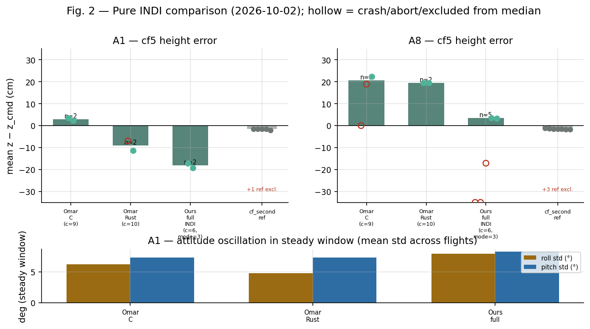
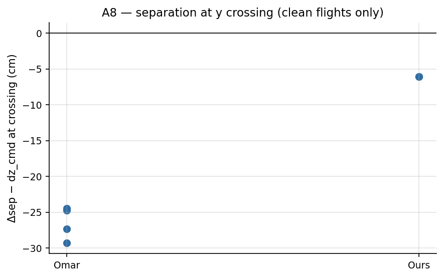
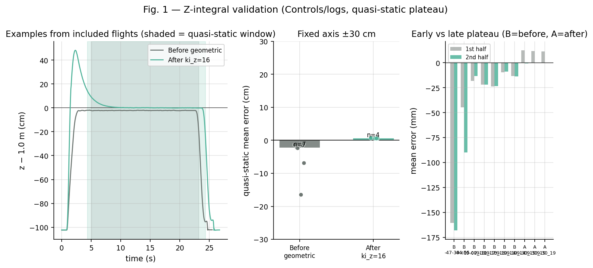
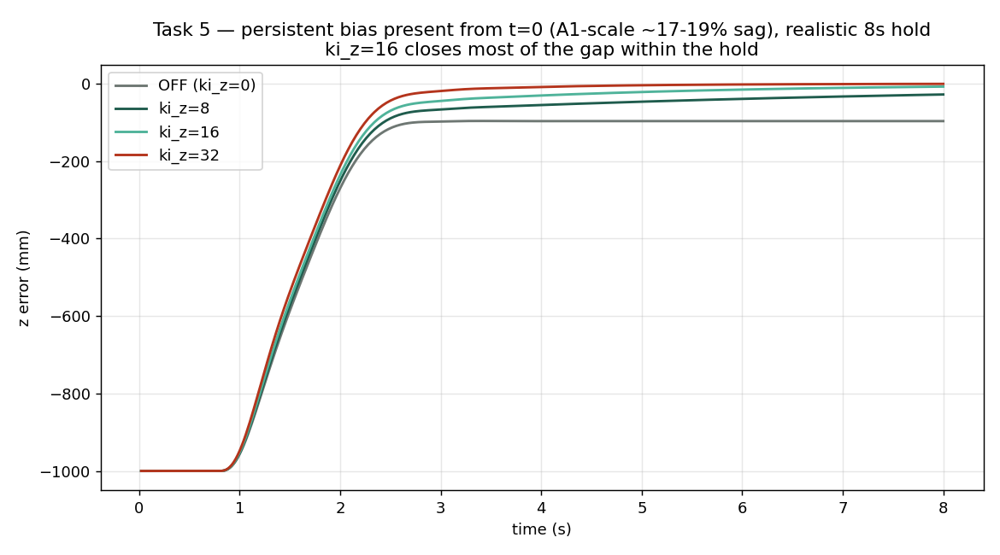
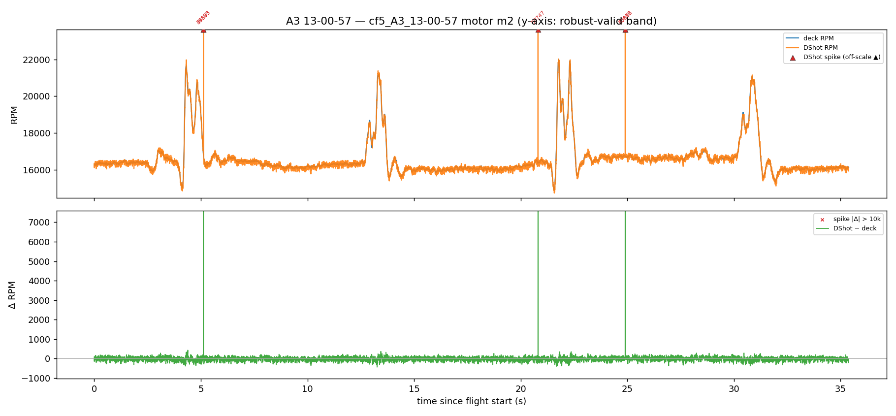
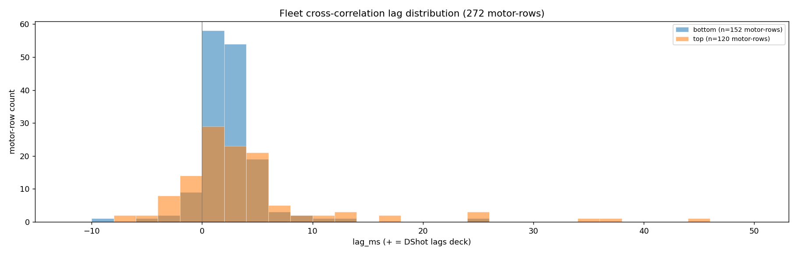
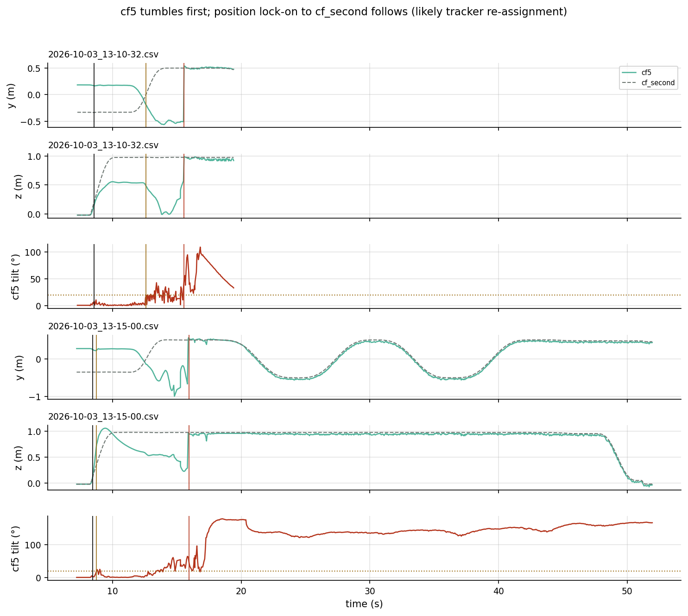

# Meeting prep — 2026-10-03

**Since last meeting:** 2026-09-28 · **Deadline:** 26 Feb 2027 (~21 weeks)

---

## 1. Pure INDI variants — flown and compared
- Flew all usable variants back-to-back (A1 stacked hover, A8 crossing): Omar C, Omar Rust, ours.
- **A8:** ours **+3 cm**, Omar C +19…+22 cm, Omar Rust +19 cm.
- **A1:** ours **−20 cm** (full INDI must run with `ki_z=0`), Omar C +1…+4 cm, Omar Rust −8…−12 cm.
- **Separation at the A8 crossing** (commanded 0.5 m): Omar variants **−25…−29 cm** too close, ours **−6 cm** (n = 4 vs n = 1, radio positions).
- → no variant is best everywhere; Omar's two ports fail the same way on A8 (scenario, not port bug).
- Fixed on the way: Omar Rust compiler bug (flies now); our full-INDI liftoff tumble (`ki_z=16` + full INDI → use `ki_z=0`).
- **Need your call:** which one is "Strategy 1"?

---

## 2. Z-integral (geometric controller) — height tracking
- Z-integral (`ki_z=16`) validated on hardware: hover error **converges to ≈0 (±1 mm) in the second half** of every validated hover.
- Before: geometric hovers median **−2 cm** (up to −16 cm); stock-Lee hovers −8…−12 cm; 2-drone flights below command in 27/27.
- Side effect: tumbles with full INDI → never `ki_z=16` with full INDI.
- Open: does `ki_z` also explain the old geometric liftoff tumbles? (test planned)

- Simulation backing: with a persistent bias from t=0, `ki_z=16` closes 81–88 % of the sag.

---

## 3. RPM dual-source analysis (2nd iteration)
- **Optical deck is faster; DShot lags ~0–5 ms.** DShot is used for control because it is reliable (deck had zero on 2 of 4 motors), not because it is faster.
- Agreement good: bias ~0.1 %, robust RMSE ~128 RPM (38 flights, 272 motor-rows).
- **Spikes:** DShot sometimes reports 28–59k RPM (true 12–17k) — 2 121 spikes, every flight/motor/scenario, ~2 ticks long; likely decode glitches (not confirmed).
- They were leaking into live control (~6× jump in the residual signal) → **fixed with a firmware sanity filter**.

---

## 4. NS2 on the real drone — still in work, main issues
- First flights (A8 ×2) **did not validate**: `cf5` crashed, `cf_second` clean.
1. **Network ran 10× too often** (1 kHz; paper's cost only fits ~100 Hz) → fixed (100 Hz, bigger stack, static buffers, timing log); **not yet measured on the drone**.
2. **Why `cf5` tumbled first is open** (`ki_z=16`, processor load, crossing, low battery) → needs a clean lab test.
3. **Mocap tracker mixes up the drones after a flip** (consequence of the crash, not the cause) → needs marker/tracker fix.
4. Input bugs fixed (neighbour velocity zeroed/frozen, ghost neighbour).
5. Call rate in the original NS2 is not public (private firmware) → ours is inferred.
- Ready: bench-first lab plan, cheat sheet, preflight checker.

---

## 5. Questions
- Which variant is the thesis "Pure INDI"?
- If 100 Hz is still too slow: smaller network or off-board evaluation?
- Tracker fix: distinct marker layouts or a software guard?

## 6. Next
- [ ] Lab: bench tests first (default firmware → 100 Hz build + timing → tracker flip test → A8 predict-only → `ki_z` 16 vs 0), then NS2 `rnn.en=1`.
- [ ] After your decision: freeze gains, start comparison flights.
- [ ] Writing: fill INDI / Z-integral / RPM results now, NS2 after lab.

Details: `docs/lab_sessions/2026-10-03.md`, `docs/41`, `docs/43`, `docs/51`, `docs/52`.
