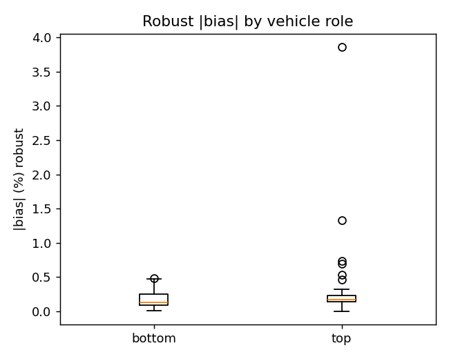

# Meeting prep — 2026-10-03 (draft)

**Since last meeting:** 2026-09-28
**Thesis deadline:** 26 February 2027 — **~21 weeks left**

---

## 1. Summary (headlines)

- **Pure INDI:** all usable variants flown and compared on the same scenarios — **ours best on the crossing scenario (A8), but worst height offset on the stacked hover (A1)**; Omar's two ports degrade on A8. **Need your call on which one is "Strategy 1".**
- **Z-integral (geometric controller):** closes the long-standing hover-height error on hardware (≈10 cm → 2–3 mm). One side effect found and fixed (full INDI).
- **RPM dual-source:** second, cleaner analysis done — optical deck is the *faster* channel, DShot spikes understood and filtered out of the live control path.
- **NS2 on a real drone:** first attempt did **not** validate. Several real implementation problems found and fixed; one important question still open (why `cf5` tumbled first). Next lab session is bench-first.

---

## 2. Topic 1 — Pure INDI controller variants: flown, data, comparison

- **What:** the thesis's "Strategy 1" identity was open (our own full INDI vs Omar's separate port). Instead of waiting, flew **all usable variants back-to-back** on the same scenarios, same day, same airframe:
  - Omar's **C port** (controller 9), Omar's **Rust port** (controller 10), **ours** (controller 6, full INDI).
  - Scenarios: **A1** (stacked hover) and **A8** (vertical swap / crossing). Reference drone `cf_second` on our geometric controller tracked 1.4–2.2 cm throughout → trustworthy reference.
- **Result (mean height error of `cf5` vs commanded, steady window, per flight — verified from the radio logs):**
  - **A1 (stacked hover):** Omar C **+1 … +4 cm**, Omar Rust **−8 … −12 cm**, **ours −20 … −23 cm** (full INDI has to run with `ki_z=0`, so no integral term removes the usual sag).
  - **A8 (crossing):** Omar C **+19 … +22 cm**, Omar Rust **+19 cm**, **ours +3.3 … +3.5 cm** (after the `ki_z=0` fix).
  - Both of Omar's independent ports degrade the same way on A8 → points at the crossing scenario, not a port bug. Ours is the opposite: best on A8, worst on A1.
  - A1 attitude: all three variants oscillate, roll/pitch std ≈ 5–8° (ours highest) — not unique to ours.
  - Caveat: n = 2 flights per cell (A8 ours: 2 clean + 1 aborted + 2 pre-fix crashes shown separately); Omar Rust A1 had one 63° tumble.
- **Along the way (two real fixes):**
  - Omar's Rust port was failing because of a **compiler enum-size mismatch** (every `setpoint.mode.*` read was corrupted) — root-caused, fixed, flew (hover + figure-8). Further gain tuning around Omar's values showed no effect → **closed**.
  - Our full INDI had a **liftoff tumble**: caused by the Z-integral gain (`ki_z=16`) in combination with full INDI. `ki_z=0` for full INDI only → **5/5 clean flights**.
- **Deliberately not flown:** stock Bitcraze INDI (no RPM source, cannot measure the residual we need) and Briesewitz's NA-INDI (excluded by you in September).
- **Decision needed:** which variant is the thesis "Pure INDI". Trade-off: ours exposes the RPM-based residual signal and is best on the crossing (A8), but has the largest A1 height offset and an attitude oscillation there; Omar C is best on A1 but 20 cm high on A8. Neither is uniformly best.
- **Figure (10-02 hardware, mean height error per variant; hollow = crash/abort, excluded from the median):**

---

## 3. Topic 2 — Z-integral for the geometric controller: height-tracking error

- **Problem:** a consistent height sag (below command) on **both drones in nearly every scenario** — a constant model bias (thrust curve / mass), not a disturbance (`cf5` flew below its commanded height in 27/27 earlier flights).
- **Fix:** a **Z-only position integral** in the geometric controller (`ki_z=16`, with anti-windup).
- **Hardware result (09-30, solo hovers + figure-8s, `ki_z=16`):** the height error **converges to 0 ± 1 mm in the second half of every validated hover** (3 hovers, +20 mm in the first half → ≈0 in the second half = the signature of the integral working) and the 2 clean figure-8s hold height; one figure-8 tumbled (assessed as an outlier, not confirmed). Plateau mean including the initial convergence is **+0.6 cm**.
- **Before the integral** the hover height offset varied flight to flight (**≈ −12 … +5 cm**, battery/thrust-model dependent; four clean pre-fix hovers sit at **−8 … −12 cm**, the geometric one at −9.5 cm). So the integral removes a *variable* offset, not just a fixed one. Re-flown 10-02 under plain geometric: tight height tracking (`cf_second`, geometric + `ki_z=16`: 1.4–2.2 cm RMS across the 2-drone A8/A1 runs).
- **Simulation backing:** with a persistent bias present from t=0, `ki_z=16` closes **81–88 %** of a 4–17 % sag (plot below). Not a disturbance-rejection tool (peak dip unchanged) — different question, kept separate.
- **Side effect found and fixed:** with **full INDI** the same integral causes a violent liftoff tumble → set `ki_z=0` for full INDI only (direct A/B on the same drone/session). Rule: *never `ki_z=16` with full INDI.*
- **Open:** whether `ki_z=16` also explains the old geometric liftoff tumbles on `cf5` — the clean test (default firmware, 16 vs 0) is planned.
- **Figures:** SIL persistent-bias plot below; **hardware before/after plot is being corrected** — the first version dropped exactly the sagging flights through its selection rule (see Plan).

---

## 4. Topic 3 — RPM dual-source analysis, 2nd iteration (spikes, lag, which source is faster)

- **Why reopened:** your feedback on the first write-up — speed claim unclear, metrics unclear, spikes unexplained. All three addressed.
- **Which is faster:** the **optical deck is the lower-latency channel; DShot lags it by ~0–5 ms** (typically 2–5 ms, on a 2 ms grid at 500 Hz). DShot is used for control for **reliability** (the deck reported exactly zero on 2 of 4 motors in real 2-drone flight), **not** for speed.
- **Agreement:** bias ≈ 0.1 %; spike-robust RMSE **≈ 128 RPM (median)** over **38 merged flights / 272 motor-rows** — replaces the old raw RMSE (~800 RPM) that was dominated by 0.08 % of samples.
- **Spikes (the new finding):**
  - DShot occasionally reports physically impossible values (**~28 000–59 000 RPM** while the deck stays at the true ~12–17 000): **2 121 spike samples, in all 38 flights, all four motors, all scenarios**; bursts of ~2 ticks (2–4 ms).
  - Best-fit cause: intermittent decode glitches in bidirectional-DShot telemetry (not confirmed hardware mechanism; not deck dropout, not single-motor).
  - **They were leaking into live control:** the filtered residual signal jumped ~6× at spike ticks. **Fixed:** firmware sanity filter in `rpm_get_all()` (absolute cap 28 000 RPM + slew check, hold-last-good). Policy unchanged (DShot stays the control source).
- **Figures:** lag distribution, bias by role, and a zoomed deck-vs-DShot trace below.

---

## 5. Topic 4 — NS2 on the real drone (still in work): the most important issues

- **Where it stands:** onboard network trained, validated in sim, and matches the **official Neural-Swarm architecture** (public code `aerorobotics/neural-swarm`; their drone firmware is private). **First real flights (A8 ×2, 10-03) did not validate** — `cf5` crashed both times, `cf_second` flew clean.
- **Most important issues, ranked:**
  1. **Network was run 10× too often.** We evaluated it every 1 ms; the paper's ≈550 µs per network only works at ≈100 Hz. Led to processor overload suspicion, a stack overflow and radio-queue asserts. **Fixed:** 100 Hz with hold, bigger stack, static buffers, timing log. *Not yet measured on the drone.*
  2. **Why `cf5` tumbled first is still open.** Suspects: `ki_z=16` (matches the old geometric liftoff tumbles), processor overload, the 0.5 m crossing, low battery. Only a clean lab test (default firmware, `ki_z` 16 vs 0) can separate them.
  3. **Mocap tracker confuses the two drones after a flip.** The position "mix-up" (cf5 suddenly reporting cf_second's position) is a *consequence* of the crash, seen in earlier flips too; needs a marker/tracker fix before more close-crossing flights. (Earlier theory "ID/backend problem" was wrong and retracted.)
  4. **Input handling bugs found and fixed:** neighbour velocity was zeroed 9 of 10 ticks, then could freeze after a dropout; empty-slot "ghost neighbour". Network math itself unchanged.
  5. **The NS2 call rate is inferred, not documented** (private firmware) — we say so openly.
- **Figure (10-03, both A8 flights):** `cf5` tumbles first with its own correct position; ≈15.5–16 s later its position jumps onto `cf_second`'s (lock-on) while it flips.

- **Preparation done:** bench-first lab plan (flash default → 100 Hz build + timing → mocap flip test → A8 predict-only → `ki_z` A/B → only then `rnn.en=1`), single cheat sheet, preflight config checker, patches for all local firmware edits, 10 rounds of independent validation.

---

## 6. Questions / decisions needed

- **Pure INDI:** which variant is "Strategy 1" for the thesis (ours vs Omar C vs Omar Rust)?
- **NS2 contingency:** if 100 Hz still doesn't fit the processor — smaller retrained network, or evaluate off-board?
- **Tracker fix:** distinct marker layouts on the two drones, or a software guard on position jumps?
- **Timeline:** Ch. 6–9 content depends on NS2 hardware results — acceptable to run bench steps first and fly NS2 only after they pass?

---

## 7. Plan / action items

- [ ] **Lab (next session, bench-first):** batteries + `fsck` card; flash default build → `/cf5/pose` clean; flash 100 Hz build → timing; mocap flip test (motors off); A8 predict-only; `ki_z` 16 vs 0 on default firmware; then `rnn.en=1` only if all pass.
- [ ] **Plots for this meeting:** NS2 tumble → lock-on timeline **done** (above); (a) hardware before/after Z-integral height error — **not in this meeting** (the first versions had a selection bias; corrected version follows); (b) 10-02 Pure-INDI A1/A8 comparison — **done** (above).
- [ ] **Supervisor:** decide "Pure INDI" variant; then freeze gains and start the comparison flights.
- [ ] **Writing:** Ch. 6–9 skeletons exist; fill results for INDI comparison + Z-integral + RPM now, NS2 after lab.

Details: `docs/lab_sessions/2026-10-03.md`, `docs/41`, `docs/43`, `docs/51`, `docs/52`.
