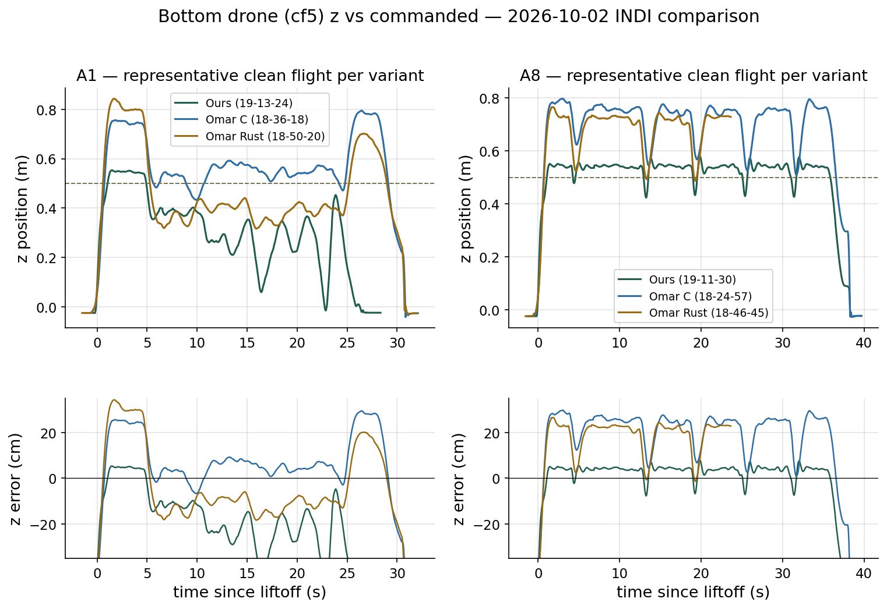
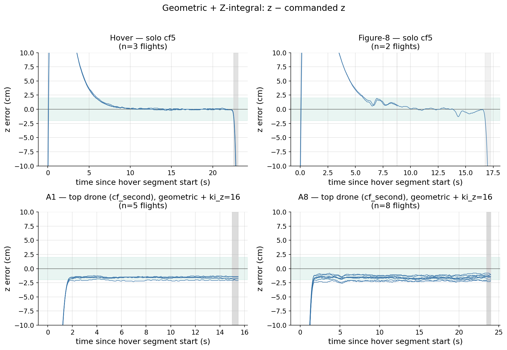
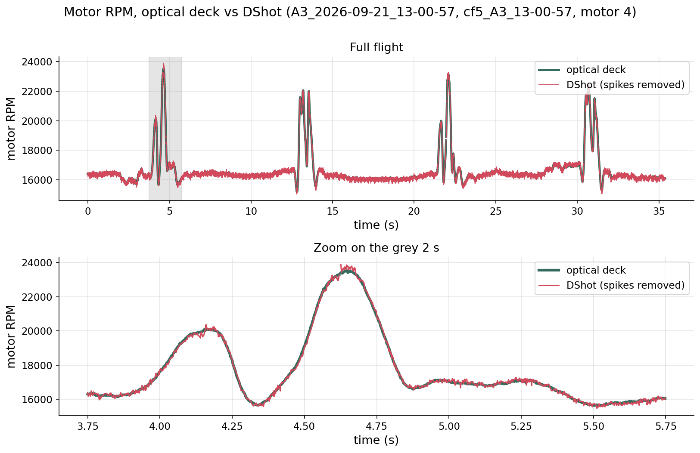
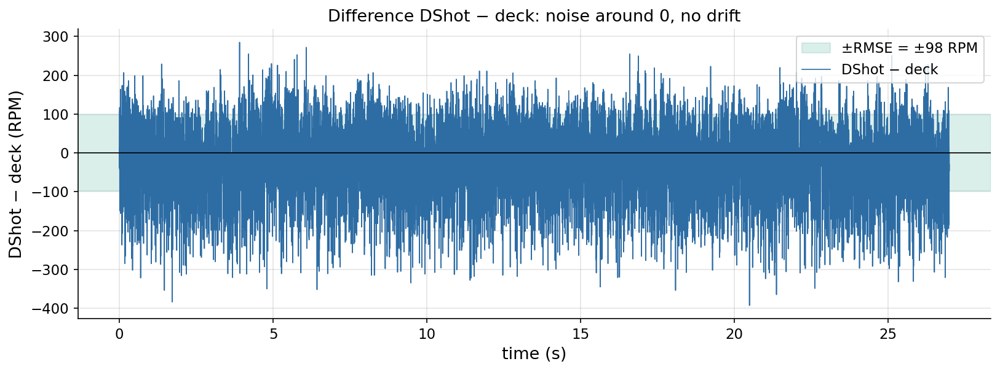

# Meeting prep — 2026-10-03

Since 2026-09-28 · deadline 26 Feb 2027 (~21 weeks)

## Overview
- **Pure INDI variants (Ours, Omar C, Omar Rust):** flown on A1 and A8 → no clear winner (Ours best on A8, worst on A1) → **your decision**.
- **Z tracking (geometric + Z-integral):** height stays within ≈2 cm of the command in steady flight.
- **RPM dual source (deck vs DShot):** same signal, DShot 2 ms later; DShot spikes are filtered out.
- **NS2 on the real drone:** first flights crashed; implementation bugs fixed, cause of the tumble open → lab bench tests next.

Notation used below: `z` = measured height, `z_cmd` = commanded height, `e_z = z − z_cmd` (positive = too high). A1 = two drones stacked, hovering. A8 = two drones swap sides (4 crossings).
Every formula has a plain-text line under it.

---

## 1. Pure INDI variants

**Goal:** compare three full-INDI controllers (Ours, Omar C, Omar Rust) on height holding.

**Setup:** bottom drone `cf5`, flights of 2026-10-02, scenarios A1 and A8.

**Metric** (steady window = from 6 s after liftoff until the landing starts; N samples):

$$
\bar e = \frac{1}{N}\sum_{i=1}^{N} e_{z,i} \qquad e_{max} = \max_i |e_{z,i}|
$$

> mean error = average of `e_z`; max error = largest `|e_z|`.

**Result** (cm, mean / max):

| | A1 | A8 |
|---|---|---|
| **Ours** | −17…−19 / 29–38 | +3.4 / ~8 |
| **Omar C** | +2…+4 / 6–9 | +22 / 30 |
| **Omar Rust** | −11 / 18 | +19 / 26 |

- Ours: best on A8, worst on A1.
- Both Omar variants are ~20 cm too high on A8 → a scenario effect, both ports agree.
- None is best everywhere.

**Caveats**
- 1–2 clean flights per cell.
- Ours only works with `ki_z=0` (full INDI + Z-integral tumbles at liftoff).
- 2 radio logs stop early (truncated), not plotted.

*One flight per variant. Dashed line = commanded height. Lower panels = `e_z`.*

---

## 2. Z tracking, geometric controller with Z-integral

**Goal:** show that the Z-integral keeps the height at the command.

**Setup:** `controller=6`, `ctrl_mode=0` (geometric). The Z-integral adds a force term that grows while the height error persists:

$$
F_z \;\mathrel{+}=\; k_i \int e_z\,dt, \qquad k_i = 16
$$

> thrust correction = 16 × (accumulated height error), so a constant offset is pushed to zero.

**Metric:** same mean error and max error as Topic 1. Window = 6 s after takeoff until the landing starts (height drops >5 cm below its plateau; bottom drone: >10 cm below command; A1: end of the hold).

**Result:**

| | flights | mean error | max error |
|---|---|---|---|
| Hover (1 drone) | 3 | +0.15 cm | 2.0 cm |
| Figure-8 (1 drone) | 2 | +0.68 cm | 1.9 cm |
| A1 (top drone) | 5 | −1.65 cm | 2.3 cm |
| A8 (top drone) | 9 | −1.65 cm | 2.4 cm |
| A8 (bottom drone) | 2 | +0.13 cm | 8.3 cm |

- All steady-flight errors stay within ≈2 cm of the command (green band).
- Bottom drone in A8: the average is fine, but it dips 7–8 cm at each of the 4 crossings (downwash from the top drone) and recovers.

**Caveats**
- Bottom drone: only 2 clean flights (its other A8 flights were INDI, crashes or NS2); none for A1. Its `k_i = 16` is taken from the session yaml.
- Never use `k_i = 16` with full INDI (tumbles).

*One line per flight, `e_z` over time since takeoff. Green band = ±2 cm.*

---

## 3. RPM dual source: optical deck vs DShot

**Goal:** check that the two motor-RPM sources agree, and which one to trust.

**Setup:** top drone `cf_second` only (geometric, no downwash), 8 flights × 4 motors = 32 motor-rows, airborne part only, 500 Hz. Deck = `d`, DShot = `s` (RPM), `Δ = s − d`.

**Spike filter.** DShot sometimes jumps to 28 000–59 000 RPM while the true value is 12 000–17 000. Sample `i` is removed from **both** traces if

$$
|\Delta_i - \operatorname{med}_{21}(\Delta)_i| > \max\!\big(600,\; 6\cdot 1.4826\cdot \operatorname{MAD}_{21}(\Delta)_i\big)\quad\text{or}\quad |\Delta_i| > 10^4\quad\text{or}\quad s_i \ge 6\cdot 10^4
$$

> Spike = DShot differs from the deck by more than ≈600 RPM above the local level (6× the normal noise); median and MAD are taken over the 21 samples around `i`. Also removed: differences >10 000 RPM and DShot ≥ 60 000 RPM.

- Removed: 254 of 434 000 samples (0.06 %), at most 14 per motor per flight.
- The firmware has its own sanity filter, so spikes no longer reach the controller.

**Metrics** (on the remaining N samples):

$$
\text{bias}\,[\%] = 100\,\frac{\frac1N\sum (s_i - d_i)}{\frac1N\sum d_i}
$$

> average DShot − deck, as a percentage of the average deck RPM.

$$
\text{RMSE} = \sqrt{\frac1N\sum_i (s_i - d_i)^2}
$$

> typical size of the difference, in RPM.

$$
r = \frac{\sum (d_i-\bar d)(s_i-\bar s)}{\sqrt{\sum (d_i-\bar d)^2}\,\sqrt{\sum (s_i-\bar s)^2}}
$$

> Pearson correlation: 1 = same shape.

$$
\tau = -\frac{1}{f_s}\,\arg\max_{|k|\le 25}\; \sum_n \tilde d_{n+k}\,\tilde s_n, \qquad f_s = 500\ \text{Hz},\ \ \tilde x = x-\bar x
$$

> lag = the shift (within ±25 samples = ±50 ms) that lines DShot up best with the deck (cross-correlation, `numpy.correlate`); removed samples are interpolated first. `τ > 0` = DShot later. Resolution = 1 sample = 2 ms.

**Result** (median of 32 motor-rows): bias −0.22 %, RMSE 104 RPM, `r` = 0.92, `τ` = 2 ms.

- Same signal; DShot is 2 ms (1 sample) later.
- `r` < 1 mainly in calm flights: the real RPM barely moves there, so the ~100 RPM sensor noise dominates.
- DShot is used for control because it is reliable (the deck once read zero on 2 of 4 motors), not because it is faster.

*Calmest flight (`cf_second` A8, motor 3). Top: full flight. Bottom: 2 s zoom. Green = deck, red = DShot after spike removal.*

*`Δ = s − d` per sample: scatter around 0 (green = ±RMSE), no drift, no spikes left.*

---

## 4. NS2 on the real drone (status, no plot)

**What it is:** NS2 = Neural-Swarm2, a small neural network that predicts the extra force a neighbouring drone causes (downwash); 19 297 weights in flash, run onboard, output added to the controller.

**Done**
- Trained, validated in simulation, same architecture as the original code; weights in flash.
- First real flights (A8 ×2): `cf5` crashed both times, `cf_second` clean.
- Fixed: network ran at 1 kHz (reference ≈100 Hz) → now 100 Hz + timing log; stack overflow; neighbour-velocity bugs; ghost neighbour.
- Lab bench plan, cheat sheet and preflight checker ready.

**Stuck**
- Why `cf5` tumbled first: `ki_z=16`, processor load, the crossing or low battery — unknown.
- After a flip the mocap assigns `cf_second`'s position to `cf5` (a consequence, not the cause).
- Real network run time on the drone not measured; original call rate not public.

**Next**
1. Lab, motors off: default firmware → 100 Hz build + timing → tracker flip test.
2. A8 predict-only (`rnn.en=0`), then default-firmware `ki_z` 16 vs 0.
3. Only then `rnn.en=1`.

---

## Questions
- Which variant is the thesis "Pure INDI"?
- If 100 Hz is still too slow: smaller network or off-board evaluation?
- Tracker fix: different marker layouts or a software guard?

## Next
- [ ] Lab session (bench first).
- [ ] After your decision: freeze gains, start comparison flights.
- [ ] Writing: INDI / Z tracking / RPM results now, NS2 after the lab.

Files: tables in `experiments/analysis/out/meeting_2026-10-03/`; details in `docs/lab_sessions/2026-10-03.md`, `docs/41`, `docs/43`, `docs/51`, `docs/52`.
