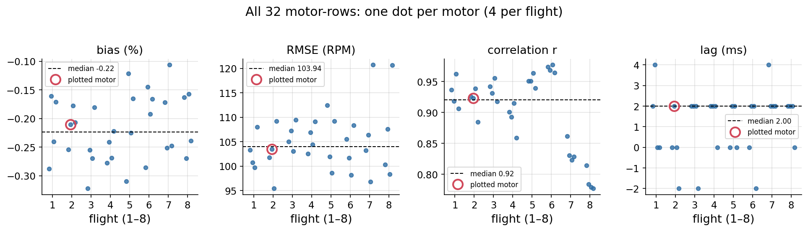

# Meeting Document — 2026-10-05

Deadline: 26 Feb 2027 (~21 weeks left)

## Overview
- **INDI variants comparison (George, Omar C, Omar Rust (C version implemented '1:1' in rust)):** flown on A1 (static hover, bottom holds position under top drone) and A8 (swap positions with constant seperation dz)→ no clear winner (Ours best on A8, worst on A1).
- **Z tracking improvement (geometric + Z-integral):** height stays within ≈2 cm of the commanded z-position in steady flight (significant improvement compared to previous version z-error around 10cm).
- **RPM dual source analysis (rpm deck vs DShot):** same signal, DShot theoretically 2 ms later; DShot has rpm spikes which are filtered out above specific rpm value.
- **Neural Swarm2 on the real drone:** First flights crashed - likely cause found and will be tested next lab session.

Notation used below: `z` = measured height, `z_cmd` = commanded height, `e_z = z − z_cmd` (positive = too high). A1 = two drones stacked, hovering. A8 = two drones swap sides (4 crossings).

---

## 1. Pure INDI variants

**Goal:** compare three INDI controller variants (George Rust, Omar C, Omar Rust) on A1 (2 drones stacked, hovering) and A8 (2 drones swap sides).

**Metric** (steady window = from 6 sec after liftoff until the landing starts; N samples):

$$
\bar e = \frac{1}{N}\sum_{i=1}^{N} e_{z,i} \qquad e_{max} = \max_i |e_{z,i}|
$$

> mean error = average of `e_z`; max error = largest `|e_z|`.

**Result:**

| Variant | Scenario | Mean z error (cm) | Max z error (cm) |
|---|---|---:|---:|
| **George Rust** | A1 (2 drones stacked, hovering) | −17…−19 | 29–38 |
| **Omar C** | A1 (2 drones stacked, hovering) | +2…+4 | 6–9 |
| **Omar Rust** | A1 (2 drones stacked, hovering) | −11 | 18 |
| **George Rust** | A8 (2 drones swap sides) | +3.4 | ~8 |
| **Omar C** | A8 (2 drones swap sides) | +22 | 30 |
| **Omar Rust** | A8 (2 drones swap sides) | +19 | 26 |

*One flight per variant. Dashed line = commanded height. Lower panels = `e_z`.*

---

## 2. Z tracking, geometric controller with Z-integral

**Goal:** Show that the new Z-integral gain value improves the z-error (before around 10cm - now <2cm).

**Result:**

| | flights | mean error | max error |
|---|---|---|---|
| Hover (1 drone) | 3 | +0.15 cm | 2.0 cm |
| Figure-8 (1 drone) | 2 | +0.68 cm | 1.9 cm |
| A1 (2 drones stacked, hovering), top drone | 5 | −1.65 cm | 2.3 cm |
| A8 (2 drones swap sides), top drone | 9 | −1.65 cm | 2.4 cm |
| A8 (2 drones swap sides), bottom drone | 2 | +0.13 cm | 8.3 cm |

- All steady-flight errors stay within ≈2 cm of the command (green band).
- Bottom drone in A8 (swap sides): the average is fine, but it dips 7–8 cm at each of the 4 crossings (downwash from the top drone) and recovers.

*One line per flight, `e_z` over time since takeoff. Green band = ±2 cm.*

---

## 3. RPM dual source: rpm deck vs DShot

**Goal:** Check whether the two motor-RPM sources (rpm deck, DShot) agree, and how much do they differ.

Deck = `d`, DShot = `s`, difference `Δ = s − d` (RPM).

**Spike filter.** DShot sometimes jumps to 65 535 RPM (the 16-bit maximum = invalid reading) or briefly dips to ~10 000 RPM while the true value is 15 000–17 000. Normal difference `Δ` between the sources is < 500 RPM, spikes are > 5000 RPM off. Rule: remove sample `i` from **both** traces if

$$
|\Delta_i| > 2000\ \text{RPM}
$$

> In words: DShot and deck differ by more than 2000 RPM. Any limit between 500 and 5000 RPM removes exactly the same samples.

- Removed: 254 of 434 000 samples (0.06 %).

**Metrics** (on the remaining N samples):

$$
\text{bias}\,[\%] = 100\,\frac{\frac1N\sum (s_i - d_i)}{\frac1N\sum d_i}
$$

> average DShot − deck, as a percentage of the average deck RPM.

$$
\text{RMSE} = \sqrt{\frac1N\sum_i (s_i - d_i)^2}
$$

> typical size of the difference, in RPM.

$$
r = \frac{\sum (d_i-\bar d)(s_i-\bar s)}{\sqrt{\sum (d_i-\bar d)^2}\,\sqrt{\sum (s_i-\bar s)^2}}
$$

> Pearson correlation: 1 = same shape.

$$
\tau = -\frac{1}{f_s}\,\arg\max_{|k|\le 25}\; \sum_n \tilde d_{n+k}\,\tilde s_n, \qquad f_s = 500\ \text{Hz},\ \ \tilde x = x-\bar x
$$

> lag = the shift (within ±25 samples = ±50 ms) that lines DShot up best with the deck (cross-correlation, `numpy.correlate`); removed samples are interpolated first. `τ > 0` = DShot later. Resolution = 1 sample = 2 ms.

**Result** (median of 32 motor-rows): bias −0.22 %, RMSE 104 RPM, `r` = 0.92, `τ` = 2 ms.

- Same signal; DShot is 0–2 ms (≤ 1 sample) later.

*One motor, A8 (2 drones swap sides). Green = deck, red = DShot (spikes removed). Top: whole flight, bottom: 2 s zoom.*

*DShot − deck, same flight. Small noise around 0 (green band = ±RMSE)*

**Is the plotted motor typical?** The plots show 1 of 32 motors. Check over all 32:

*One dot per motor (4 per flight, 8 flights). Dashed = median, red ring = plotted motor.*

- **Bias, RMSE: same for all motors.** Bias −0.11…−0.32 %, RMSE 95–121 RPM (plotted: −0.21 %, 104 RPM).
- **Correlation r: varies, plotted motor is typical.** Range 0.78–0.98, median 0.92 (plotted: 0.92). Lowest in the calm A8 (2 drones swap sides) flights 7–8: the RPM barely changes there, so noise dominates.
- **Lag: only roughly.** Measured in 2 ms steps (1 sample); values −2…4 ms, 18 of 32 at 2 ms → DShot is ≈0–2 ms later.

---

## 4. Neural Swarm2 on the drone

- Tried to run it onboard on A8 (2 drones swap sides): bottom drone with ns2 controller crashed each time. 
- Flashing, controller start and weight upload work.
- Likely cause: the network ran at 1 kHz → overloads the processor leading to the crash.
- Fix: rate reduced to 100 Hz, tested in simulation.
- Next (lab): test on the drone whether 100 Hz fixes the crashes.

---

## Questions:
- Which indi variant shall we use for comparative study?
  - Depending on which scenarios we want to inlcude in comparative study. 
  - Only scenarios with temporary downwash affecting drone george's indi seems better suited. 
  - If scenarios with constant downwash affect shall be included omar's indi is better again.
- Is 100hz rate for neural network all right (assuming it fixes the crashes) or should we try higher rate if possible?

## Next Steps:
- Test NS2 lower rate (100hz) for neural network in lab and see if crashes still happen. 
- Decide which INDI variant to use. Depending on which INDI variant we use small follow up tasks are likely. 
  -  Fix constant z position error for Omars c/rust version. 
  - Look another time into george's indi for cause for oscillation issue (unlikely to find something).
- Decide on scenarios we want to include in comparative study (influences decision on indi selection).
- Around 2 weeks since last email regarding FBL-Controller, we should follow up later this week perhaps. 

