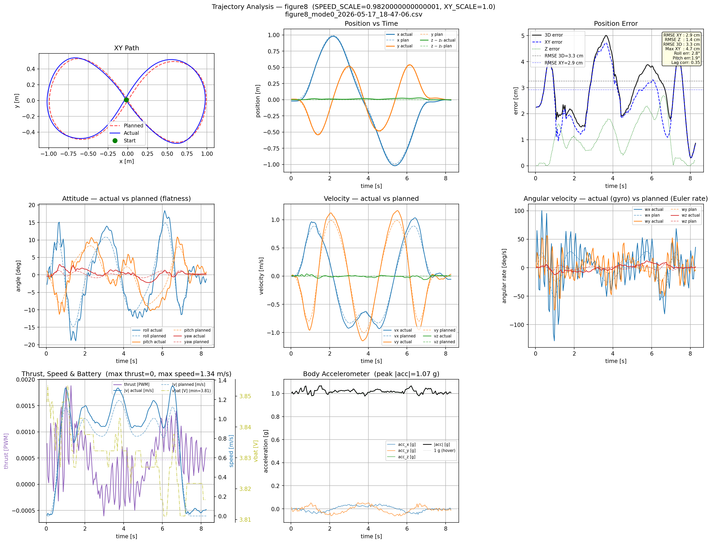
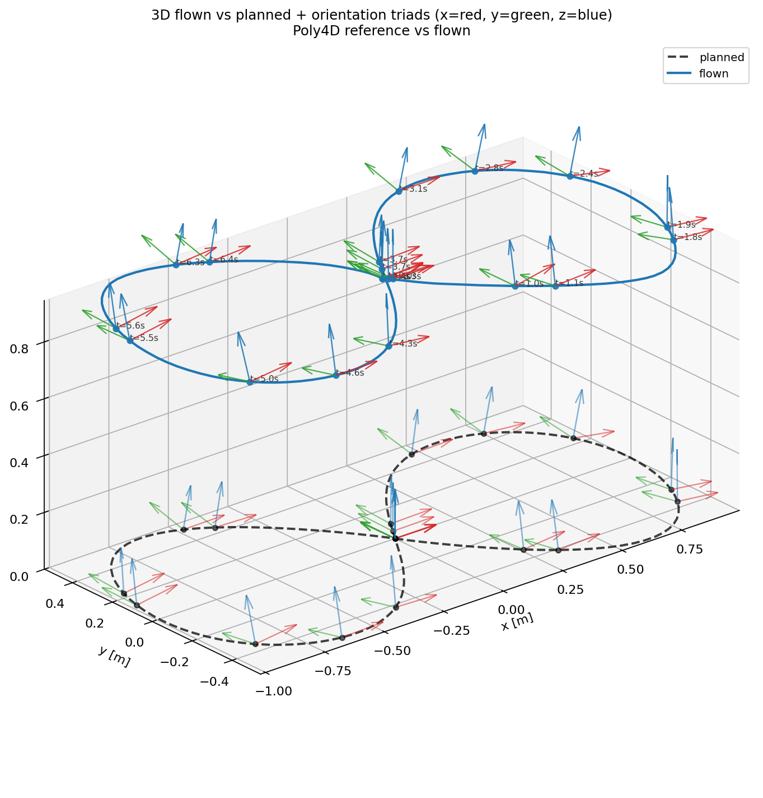
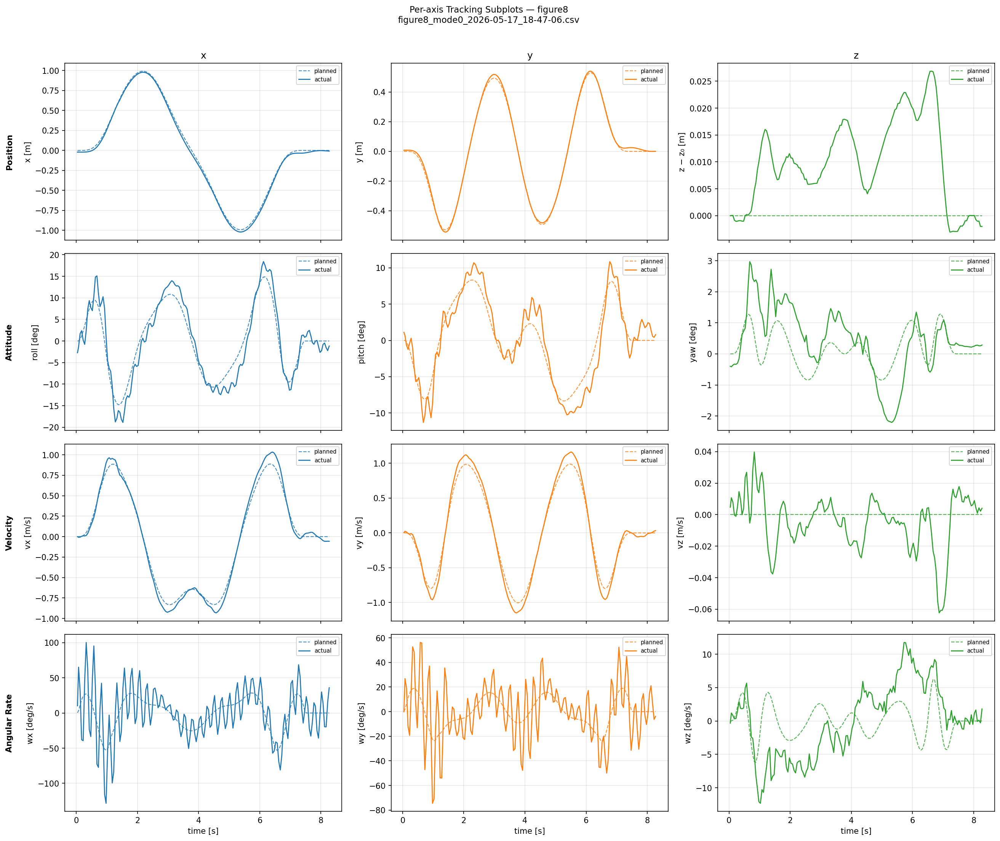
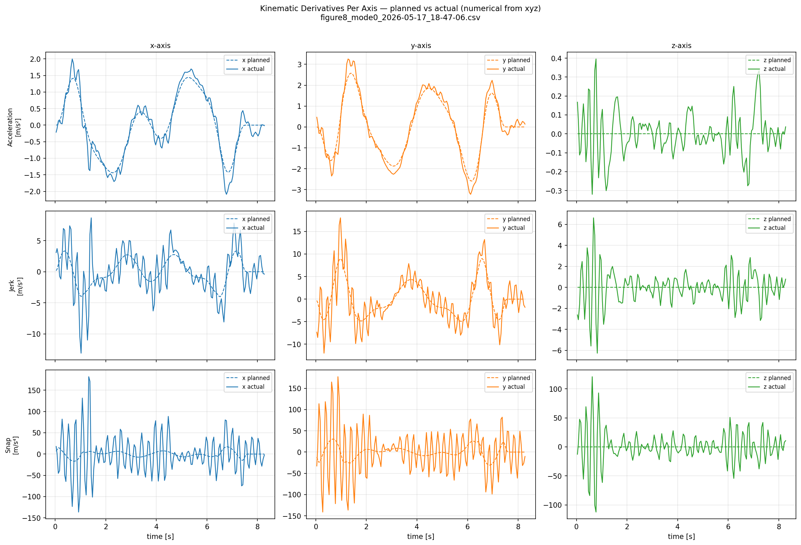

# Cascaded INDI — Theory & Target Architecture - CW21 (T-9 Weeks)

**Inner + outer INDI loops (Smeur 2018)** — paper notation, no firmware.

| Field | Content |
|-------|---------|
| **Scope** | Theory, math, ideal cascaded architecture, theoretical Rust pseudo-code |
| **Papers** | Smeur 2016 → Smeur 2018 cascade; Lee 2010 position loop (context); Tal 2020 flatness (optional) |

## Suggested reading order

1. **§0** Geometric controller and mocap baseline (figure-8 plots)
2. **§1** Physical model and SO(3) error
3. **§2** Incremental INDI principle (Smeur 2016); optional §2.5 Tal flatness
4. **§3** Inner-loop α_meas filtering (IIR, Butterworth, cutoff)
5. **§4** Gyroscopic output structure
6. **§5** Inner-loop stability
7. **§6–§8** Cascaded architecture, both loops, stability; §8.4 single vs cascade
8. **§9–§10** References and symbol glossary

## 0. Geometric controller and mocap baseline (not INDI)

### 0.1 Flight overview

Planned vs flown pose, thrust, and attitudes.



### 0.2 3D path and orientation

Planned vs flown figure-8 with orientation triads.



### 0.3 Per-axis tracking

Position and velocity errors in x, y, and z.



### 0.4 Kinematics

Speed, acceleration, and flatness-related quantities along the path.




## Study path at a glance

```text
Position (Lee 2010) — not INDI
        │  Rd, ω_ff
        ▼
┌───────────────────────────────┐
│ OUTER INDI — attitude (2018)  │  ν_att = −KR_cas·eR
│ η̇_meas ≈ ω  (no filter)       │  δω → ω_des_prev → ω_ref
└───────────────┬───────────────┘
                │ ω_ref
                ▼
┌───────────────────────────────┐
│ INNER INDI — rate (2016)      │  ν_rate = −KW_cas·eω
│ α_meas = IIR(dω/dt)           │  τ_current+δτ → τ_out+ω×Jω (RPM)
└───────────────┬───────────────┘
                ▼
           Motor mixer
```

---

## 1. Physical model and attitude error

### 1.1 Rotational dynamics

Newton-Euler equation for rigid body rotation:

```
J · ω̇ = τ_control + τ_disturbance − ω × (J·ω)
```

**Variables:**
- `J` — inertia tensor [kg·m²], diagonal for symmetric quadrotor: diag(Jxx, Jyy, Jzz)
- `ω` — angular velocity in body frame [rad/s]: [p, q, r] = [roll rate, pitch rate, yaw rate]
- `ω̇` — angular acceleration [rad/s²]
- `τ` — control torque vector [Nm]
- `ω × (J·ω)` — gyroscopic term (couples axes at high angular rates)


### 1.2 Attitude on SO(3)

We represent attitude as a rotation matrix R ∈ SO(3) (3×3, orthonormal).

**Attitude error** between desired Rd and current R (from Lee et al. 2010):

```
eR = ½ · (Rd^T · R − R^T · Rd)^∨
```

**Variables:**
- `eR` — SO(3) attitude error vector [rad]
- `R` — current attitude rotation matrix
- `Rd` — desired attitude rotation matrix
- `(^∨)` — vee map from a skew-symmetric matrix to a 3-vector

The `^∨` (vee) operator extracts the vector of a skew-symmetric matrix:

```
[  0  -a3   a2 ]^∨     [a1]
[ a3   0   -a1 ]    =  [a2]
[-a2   a1   0  ]       [a3]
```

This is the geometrically correct attitude error on SO(3) — it has no singularities (no gimbal lock) and is valid for arbitrarily large rotations.

#### Theoretical Rust — SO(3) attitude error

*Pseudo-code for eR vee map used by the outer loop.*

```rust
/// SO(3) attitude error eR = ½(Rd^T R − R^T Rd)^∨  (Lee 2010 / Smeur 2018 outer loop)
fn attitude_error_vee(rd: Mat3, r: Mat3) -> Vec3 {
    let s = rd.transpose() * r - r.transpose() * rd;
    0.5 * vee(s) // extract [s32, s23, s13] from skew-symmetric s
}

fn vee(s: Mat3) -> Vec3 {
    Vec3::new(s.m32, s.m23, s.m13)
}
```


### 1.3 Position reference loop (not INDI — context only)

The trajectory outer loop (Lee et al. 2010) maps position/velocity errors to desired thrust, desired attitude Rd, and flatness feedforward ω_ff:

```
F_d = m · (ẍ_des + KP·ep + KV·ev + KI·∫ep + g·ẑ)
thrust = F_d · (R·ẑ)
Rd = f(F_d, yaw_des)
ω_ff = flatness(jerk, snap, …)     [optional feedforward into cascade]
```

**Variables:**
- `F_d` — desired force in world frame [N]
- `m` — vehicle mass [kg]
- `ep` — position error (`p_des - p`) [m]
- `KP, KV, KI` — position-loop gains [SI-consistent units]
- `ẍ_des` — desired translational acceleration [m/s²]
- `thrust` — scalar thrust command [N]
- `Rd` — desired attitude
- `ω_ff` — feedforward body-rate from flatness [rad/s]

Cascaded INDI sits **below** this layer: it takes Rd and produces torque via outer + inner INDI loops.

## 2. Incremental INDI — the principle (Smeur 2016)

### 2.1 Taylor expansion

Write angular acceleration as a function of state ω and input τ:

```
ω̇ = f(ω, τ)
```

**Variables:**
- `ω̇` — angular acceleration [rad/s²]
- `ω` — angular velocity [rad/s]
- `τ` — applied control torque [Nm]
- `f(·)` — nonlinear rotational dynamics map [rad/s²]

Taylor-expand around the current operating point (ω₀, τ₀):

```
ω̇ ≈ f(ω₀, τ₀) + ∂f/∂τ · (τ − τ₀) + ∂f/∂ω · (ω − ω₀) + higher-order terms
```

**Variables:**
- `(ω₀, τ₀)` — operating point for local linearization
- `∂f/∂τ` — control sensitivity term (= `B`) [rad/s²/Nm]
- `∂f/∂ω` — state sensitivity term [1/s]

**Two simplifications at high sample rate:**
1. We are at the current operating point: (ω − ω₀) = 0
2. For small Δt, the term ∂f/∂ω · Δω is negligible

This leaves:

```
ω̇ ≈ ω̇₀ + B · (τ − τ₀)
```

**Variables:**
- `ω̇₀` — measured baseline acceleration at current point [rad/s²]
- `B` — control effectiveness matrix [rad/s²/Nm]
- `(τ - τ₀)` — incremental torque input [Nm]

where:
```
B = ∂f/∂τ = ∂ω̇/∂τ = J⁻¹     [control effectiveness matrix, rad/s²/Nm]
```

`ω̇₀` is the angular acceleration that *was* happening at the previous operating point — we measure it directly from the gyro.

**Critically, `ω̇₀` already contains everything:** from Euler's equation, `J·ω̇ = τ − ω×(Jω)`, so the measured angular acceleration is:

```
α_meas = ω̇ = J⁻¹·τ − J⁻¹·(ω×Jω) = J⁻¹·τ + f(ω)/J
```

The gyroscopic term `f(ω) = −ω×(Jω)` is embedded in `α_meas`. NDI must cancel f(ω) explicitly using a model (and fails if J is wrong). INDI does not model-cancel it: `α_meas` reflects the true physical acceleration (including gyroscopic effects), so the increment `J·(α_ref − α_meas)` only corrects the acceleration *error*; the explicit `gyro_comp` at the mixer output is described in §4.1.

### 2.2 INDI control law

We want to achieve a desired angular acceleration α_ref. From the Taylor expansion:

```
α_ref = ω̇₀ + B · (τ − τ₀)
```

**Variables:**
- `α_ref` — desired angular acceleration [rad/s²]
- `ω̇₀` — measured baseline acceleration [rad/s²]
- `B` — control effectiveness matrix [rad/s²/Nm]
- `τ, τ₀` — new and previous torque commands [Nm]

Solving for τ:

```
τ = τ₀ + B⁻¹ · (α_ref − ω̇₀)
  = τ_prev + J · (α_ref − α_meas)
```

**Variables:**
- `τ_prev` — previous torque command / integrator state [Nm]
- `B⁻¹ ≈ J` — inverse effectiveness (inertia-domain mapping) [Nm/(rad/s²)]
- `(α_ref - α_meas)` — acceleration tracking error [rad/s²]

**In words: new torque = previous torque + increment to fix the angular acceleration error.**

The virtual control `α_ref` is generated by a proportional-derivative law on the attitude error:

```
α_ref = −KR_std · eR − KW_std · eω          [rad/s²]
```

**Variables:**
- `KR_std` — attitude-error gain in acceleration domain
- `KW_std` — rate-error gain in acceleration domain
- `eω` — angular-rate error (`ω - ω_ref`) [rad/s]

and the torque increment is:

```
δτ = J · (α_ref − α_meas)                   [Nm]
```

**Variables:**
- `δτ` — torque increment command [Nm]
- `J` — inertia tensor [kg·m²]

**Gyroscopic term (see also §4.1):** Because `α_meas` already contains the *actual physical* gyroscopic acceleration, the INDI increment does not need to cancel it explicitly (unlike NDI). The explicit `gyro_comp = ω × (Jω)` is added only at the mixer output because the motor mixer expects *net torque* commands. Net effect: the gyroscopic term passes through transparently.

#### Theoretical Rust — core INDI increment

*Smeur 2016 τ = τ_prev + J·(α_ref − α_meas); optional Tal α_des in α_ref.*

```rust
/// Generic INDI torque increment (Smeur 2016, acceleration domain)
/// τ = τ_prev + J · (α_ref − α_meas)
fn indi_torque_increment(
    alpha_ref: Vec3,
    alpha_meas: Vec3,
    tau_prev: Vec3,
    j_diag: Vec3, // diag(Jxx, Jyy, Jzz)
) -> Vec3 {
    let delta = vec3_mul(j_diag, alpha_ref - alpha_meas);
    tau_prev + delta
}

/// Virtual control (standard PD on attitude + rate), optional Tal & Karaman feedforward:
/// α_ref = α_des − KR_std·eR − KW_std·eω   [rad/s²]
fn alpha_ref_from_errors(
    e_r: Vec3,
    e_omega: Vec3,
    alpha_des: Vec3,
    kr_std: f32,
    kw_std: f32,
) -> Vec3 {
    alpha_des - kr_std * e_r - kw_std * e_omega
}
```


### 2.3 NDI vs INDI

| | NDI | INDI |
|---|---|---|
| **Torque law** | `τ = J·ω̇_des + ω×(Jω)` | `τ = τ_prev + J·(α_ref − α_meas)` |
| **What it needs** | Full model: J, all nonlinear terms | Only B = J⁻¹, measured ω̇ |
| **Disturbance rejection** | Via model cancellation | Via measurement subtraction |
| **Model error effect** | Directly corrupts output | Only corrupts increment (small Δt → small error) |
| **Sample rate dependency** | None | Critical — must be high |
| **Robustness** | Fragile | Inherently robust |

### 2.4 When the incremental assumption holds

The approximation is valid when the Taylor linearization is accurate:

```
Δt  small  →  higher-order terms negligible
```

For smooth flight maneuvers, angular accelerations change slowly — the assumption holds well.  
For **aggressive maneuvers** (flips, impacts, sudden gusts), the assumption can break down briefly, but the controller recovers within a few Δt because the measurement updates every sample.

### 2.5 Tal & Karaman — flatness feedforward (optional)

Tal & Karaman (2020) extend Smeur 2016 by feeding desired angular acceleration from **differential flatness** into the inner-loop virtual control.

**Acceleration domain (Smeur notation):**

```
α_ref = α_des − KR_std·eR − KW_std·eω          [rad/s²]
δτ    = J·(α_ref − α_meas)
```

**Variables:**
- `α_des` — flatness feedforward angular acceleration [rad/s²]
- `α_ref` — total commanded angular acceleration [rad/s²]
- `δτ` — torque increment [Nm]

**Equivalent form with torque virtual control (J in gains):**

```
v_des = J·α_des − KR·eR − KW·eω                [Nm]
δτ    = v_des − J·α_meas
      = J·(α_des − α_meas) − KR·eR − KW·eω
```

**Variables:**
- `v_des` — virtual torque command [Nm]
- `KR, KW` — torque-domain gains [Nm/rad] and [Nm/(rad/s)]

The term `J·(α_des − α_meas)` drives angular-acceleration tracking **before** large attitude/rate errors build up. Setting `α_des = 0` recovers plain Smeur 2016.

**Flatness chain (feeds the cascade):**

| Derivative | Maps to | Used in |
|------------|---------|---------|
| jerk `x⃛` | `ω_ff` [rad/s] | outer: `ω_ref = ω_des + ω_ff` |
| snap `x⁽⁴⁾` | `α_des` [rad/s²] | inner: via `α_ref` or `v_des` |

> Tal & Karaman also use RPM-measured torque (no `τ_prev` accumulator) — the **RPM-deck / Mode 2** approach recommended for this project’s inner loop (§7.2).

## 3. Inner loop — measuring angular acceleration

### 3.1 Why differentiation is hard

Angular acceleration is not measured directly. We must differentiate the gyro to get ω̇.

**Naive finite difference:**
```
α_raw[k] = (ω[k] − ω[k−1]) / Δt
```

**Variables:**
- `α_raw[k]` — discrete raw acceleration estimate [rad/s²]
- `ω[k]` — gyro sample at step `k` [rad/s]
- `Δt` — sample period [s]

Problem: gyro noise is amplified by differentiation. If gyro noise is σ_gyro ≈ 0.01 rad/s,  
then at 500 Hz: σ_α = σ_gyro / Δt = 0.01 / 0.002 = 5 rad/s² — completely swamps the signal.

### 3.2 Low-pass filtering before differentiation

The solution is to **filter then differentiate** (or equivalently, use the raw difference but immediately low-pass filter the result):

```
α_raw  = (ω[k] − ω[k−1]) / dt    [noisy finite difference]
α_meas = k·α_raw + (1−k)·α_meas   [first-order IIR low-pass]
```

**Variables:**
- `α_meas` — filtered acceleration used by INDI [rad/s²]
- `k` — IIR blend factor in `(0,1)` [dimensionless]

### 3.3 First-order IIR on α_meas

Many embedded implementations use a 1st-order RC low-pass on the finite difference:

```
RC = 1 / (2π · fc)           [time constant at cutoff fc]
k  = Δt / (Δt + RC)          [blend coefficient]

α_meas[k] = k · α_raw[k] + (1 − k) · α_meas[k−1]
```

**Variables:**
- `fc` — low-pass cutoff frequency [Hz]
- `RC` — equivalent time constant [s]

Rolloff: −20 dB/decade. Low state cost (one history sample per axis). Typical for hardware inner loops at high sample rate.


#### Theoretical Rust — 1st-order IIR

*Pseudo-code for §3.3; not project firmware.*

```rust
/// First-order IIR low-pass on α_meas (inner loop sensing)
/// α_meas[k] = k·α_raw[k] + (1−k)·α_meas[k−1]
fn iir_first_order_alpha(
    alpha_raw: Vec3,
    alpha_meas_prev: Vec3,
    dt: f32,
    fc_hz: f32,
) -> Vec3 {
    let rc = 1.0 / (2.0 * PI * fc_hz);
    let k = dt / (dt + rc);
    k * alpha_raw + (1.0 - k) * alpha_meas_prev
}

fn alpha_raw_from_gyro(omega: Vec3, omega_prev: Vec3, dt: f32) -> Vec3 {
    (omega - omega_prev) / dt
}
```


### 3.4 Second-order Butterworth (bilinear transform)

A 2nd-order Butterworth low-pass has a **maximally flat passband** and **−40 dB/decade** rolloff — stronger noise rejection than 1st-order IIR, at the cost of **more group delay** (two states per axis).

Discretised via bilinear transform (pre-warped at cutoff fc):

```
τ     = 1 / (2π·fc)                        [time constant]
denom = τ² + √2·τ·Δt + Δt²

b0 = Δt² / denom   (b1 = 2b0, b2 = b0)     [feed-forward]
a1 = 2·(Δt² − τ²) / denom                  [IIR feedback 1]
a2 = (τ² − √2·τ·Δt + Δt²) / denom          [IIR feedback 2]

α_meas[n] = b0·α_raw[n] + 2b0·α_raw[n−1] + b0·α_raw[n−2]
            − a1·α_meas[n−1] − a2·α_meas[n−2]
```

**When to use which (inner loop only — outer loop does not differentiate ω):**

| Filter | Rolloff | States / axis | Phase lag | Typical use |
|--------|---------|---------------|-----------|-------------|
| 1st-order IIR | −20 dB/dec | 1 | Lower | Simple embedded, 500 Hz+ |
| 2nd-order Butterworth | −40 dB/dec | 2 | Higher | Simulation, aggressive tracking, offline analysis |

For the cascaded **inner** INDI loop, filter choice on α_meas is the main sensing design knob; the **outer** loop reads η̇_meas ≈ ω directly and needs no differentiation filter.

#### Theoretical Rust — 2nd-order Butterworth

*Pseudo-code for §3.4 bilinear coefficients; not project firmware.*

```rust
/// 2nd-order Butterworth on α_meas — bilinear transform (inner loop)
struct Butterworth2State {
    x1: Vec3,
    x2: Vec3,
    y1: Vec3,
    y2: Vec3,
}

fn butterworth2_coeffs(dt: f32, fc_hz: f32) -> (f32, f32, f32) {
    let tau = 1.0 / (2.0 * PI * fc_hz);
    let denom = tau * tau + SQRT_2 * tau * dt + dt * dt;
    let b0 = dt * dt / denom;
    let a1 = 2.0 * (dt * dt - tau * tau) / denom;
    let a2 = (tau * tau - SQRT_2 * tau * dt + dt * dt) / denom;
    (b0, a1, a2)
}

fn butterworth2_alpha(
    alpha_raw: Vec3,
    st: &mut Butterworth2State,
    dt: f32,
    fc_hz: f32,
) -> Vec3 {
    let (b0, a1, a2) = butterworth2_coeffs(dt, fc_hz);
    let y = b0 * alpha_raw
        + 2.0 * b0 * st.x1
        + b0 * st.x2
        - a1 * st.y1
        - a2 * st.y2;
    st.x2 = st.x1;
    st.x1 = alpha_raw;
    st.y2 = st.y1;
    st.y1 = y;
    y
}
```


### 3.5 Filter cutoff trade-off

| fc too HIGH | fc too LOW |
|---|---|
| Gyro noise passes through | Significant phase delay in α_meas |
| INDI sees noise as "disturbance to correct" | INDI reacts to stale information |
| → high-frequency oscillation | → sluggish, or low-frequency instability |

Example at sample rate fs = 500 Hz, cutoff fc = 60 Hz:
- Frequencies up to 60 Hz pass (the relevant attitude dynamics)
- Frequencies above 60 Hz are attenuated
- Phase lag at 60 Hz for 1st-order IIR ≈ 45° (this is the inherent cost — it limits how high fc can go before lag causes instability)

**Practical tuning rule:**
- High-frequency oscillation (> 20 Hz) → lower fc (try 40 Hz)
- Sluggish response or low-frequency wobble → raise fc (try 80 Hz)

## 4. Gyroscopic feed-forward at the output

### 4.1 Why gyro_comp is not stored in the integrator

The gyroscopic term `ω × (J·ω)` is a **feed-forward correction**, not a state.  
If you stored it in `τ_prev`, the next iteration would subtract it via `J·α_meas` (which already captures the gyroscopic effect physically), and then the previous gyro_comp would be re-subtracted — **double-counting the correction**, causing instability at high angular rates.

The correct architecture is:
```
τ_base = τ_prev + δτ          [classic accumulator; RPM: τ_cmd = τ_current + δτ — §7.2]
τ_out  = τ_base + gyro_comp   [output: add gyroscopic feed-forward; use τ_cmd with RPM]
τ_prev ← τ_base               [store state without gyro_comp; skip when using RPM]
```

> **Summary:** `α_meas` already includes physical gyroscopic acceleration, so the INDI increment does not explicitly cancel ω×(Jω) (unlike NDI). `gyro_comp` is added only at the output for net torque at the mixer — see §2.2.


#### Theoretical Rust — gyro_comp output structure

*τ_base accumulates INDI only; ω×(Jω) added at output (§4.1).*

```rust
fn apply_gyro_feedforward(tau_base: Vec3, omega: Vec3, j_diag: Vec3) -> Vec3 {
    let j_omega = vec3_mul(j_diag, omega);
    tau_base + omega.cross(j_omega)
}

fn inner_accumulate_tau(tau_prev: Vec3, delta_tau: Vec3, clamp: f32) -> Vec3 {
    clamp_vec3(tau_prev + delta_tau, -clamp, clamp) // store this as tau_prev — NOT tau_out
}
```


**Geometric controller** computes the gyroscopic term `ω × (Jω)` from a model of J.  
If J is wrong by 10%, the cancellation is wrong by 10% → residual disturbance.

**INDI** measures `α_meas` directly from the gyro. This measurement includes:
- The real gyroscopic coupling (regardless of J accuracy)
- Any aerodynamic disturbance
- Any payload change
- Any prop damage

They are all automatically subtracted out. The controller only needs to produce the *increment* to fix the remaining angular acceleration error — and that increment is small (Δt is small), making the Taylor approximation valid.

## 5. Inner-loop stability (single-loop rate INDI)

### 5.1 τ integrator and 3rd-order dynamics

INDI outputs a torque **increment** and accumulates:

```
τ[k] = τ[k−1] + δτ[k]     where    δτ = ν_rate − J·α_meas
```

**Variables:**
- `τ[k]` — inner torque command/integrator state at sample `k` [Nm]
- `ν_rate` — inner virtual control [Nm]

With rigid-body dynamics `J·ω̇ = τ`, the inner loop is **3rd-order** (integrator + double integrator from rate → attitude kinematics when viewed in cascade context).

Characteristic polynomial (single-axis, small-angle proxy):

```
J·s³ + KW·s² + KR·s = 0     →     s · (J·s² + KW·s + KR) = 0
```

**Variables:**
- `s` — Laplace variable
- `KR, KW` — equivalent single-loop gains for characteristic form

- Pole at `s = 0` from the τ integrator (structural in all INDI implementations)
- Remaining roots from `J·s² + KW·s + KR = 0` — stable for J > 0, KW > 0, KR > 0 (Routh)

**Design note:** inner gains KW_cas and KR (in single-loop form) must yield well-damped rate tracking before closing the outer cascade.

## 6. Why cascade — limit of single-loop INDI

In single-loop INDI, one control law mixes attitude error and rate error into a single virtual control:

```
v_des = −KR·eR − KW·eω     [Nm, both errors combined]
```

**Variables:**
- `v_des` — single-loop virtual torque command [Nm]
- `eR, eω` — attitude and rate errors [rad], [rad/s]

This conflation has two consequences:

**1. No independent bandwidth tuning.** KR sets the attitude tracking speed and KW sets the rate damping, but they enter the same 3rd-order characteristic polynomial (§5.1). You cannot tune attitude and rate response independently — raising KR also changes the rate loop's effective behaviour.

**2. Disturbances propagate through the full loop before rejection.** If a motor responds late or a propeller is damaged, the resulting angular acceleration error propagates through the combined attitude+rate loop before being corrected. The attitude error builds while the INDI integrator accumulates.

Cascaded INDI (Smeur et al. 2018) solves both by splitting into two nested INDI loops, each with its own virtual control, measurement, and integrator.

## 7. Target architecture — cascaded INDI (Smeur 2018)

### 7.1 Full stack diagram

```
 Position reference (x_des, ẋ_des, ẍ_des, x⃛_des, x⁽⁴⁾_des)
          │
          ▼
 ┌────────────────────────────────────────────────────────────────┐
 │  POSITION LOOP — Geometric (Lee 2010)  [unchanged]             │
 │  ep, ev → F_d → thrust, Rd                                     │
 │  compute_flatness(acc, jerk) → ω_des_ff                        │
 └──────────────────────┬─────────────────────────────────────────┘
                        │  Rd ∈ SO(3),  ω_des_ff [rad/s]
                        ▼
 ┌────────────────────────────────────────────────────────────────┐
 │  OUTER INDI LOOP — Attitude  (Smeur 2018)                      │
 │  Rate: 500 Hz (same as inner, or sub-rate e.g. 100 Hz)         │
 │                                                                │
 │  eR       = ½(Rd^T·R − R^T·Rd)^∨         [SO(3) vee map, rad]│
 │  η̇_meas   ≈ ω                              [gyro directly]    │
 │  ν_att    = −KR_cas · eR                  [rad/s]             │
 │  δω_des   = ν_att − η̇_meas               [rate increment]    │
 │  ω_des    = clamp(ω_des_prev + δω_des, ±ω_max)                │
 │  ω_des_prev ← ω_des                       [outer integrator]  │
 │  ω_ref    = ω_des + ω_des_ff              [add FF from flatness]│
 └──────────────────────┬─────────────────────────────────────────┘
                        │  ω_ref [rad/s]  (desired angular rate for inner loop)
                        ▼
 ┌────────────────────────────────────────────────────────────────┐
 │  INNER INDI LOOP — Angular Rate  (Smeur 2018)                  │
 │  Rate: 500 Hz                                                  │
 │                                                                │
 │  eω      = ω − ω_ref                      [rate error, rad/s] │
 │  α_raw   = (ω − ω_prev) / dt                                  │
 │  α_meas  = k·α_raw + (1−k)·α_meas        [1st-order IIR]     │
 │  ν_rate  = −KW_cas · eω                  [Nm]                 │
 │  δτ      = ν_rate − J·α_meas             [torque increment]   │
 │  τ_cmd   = τ_current(RPM) + δτ   [recommended] or τ_prev+δτ│
 │  τ_out   = τ_cmd + ω×(Jω)                [gyro feed-forward]  │
 └──────────────────────┬─────────────────────────────────────────┘
                        │  thrust [N],  torque [Nm]
                        ▼
                   Motor mixer → drone dynamics
```

Two separate integrators: `ω_des_prev` (outer) and inner torque state via `τ_prev` **or** measured `τ_current` from the RPM deck (recommended). Each loop applies the incremental principle to its own plant.

### 7.2 Inner INDI loop — angular rate

**Plant:**
```
J·ω̇ = τ − ω×(Jω)    →    ω̇ = J⁻¹·τ + disturbances
G1_inner = ∂ω̇/∂τ = J⁻¹    [rad/s²/Nm]
```

**Variables:**
- `G1_inner` — inner-loop control effectiveness matrix [rad/s²/Nm]
- `disturbances` — aggregated unmodeled torques/effects [Nm equivalent]

**Per-cycle algorithm (500 Hz):**
```
① Rate error:        eω    = ω − ω_ref                    [ω_ref from outer loop]
② Virtual control:   ν_rate = −KW_cas · eω                [Nm, J absorbed into gain]
③ Alpha measure:     α_raw  = (ω − ω_prev) / dt
                     α_meas = k·α_raw + (1−k)·α_meas      [IIR, k = dt/(dt+RC)]
④ Increment:         δτ     = ν_rate − J·α_meas           [Nm]
⑤ Torque command:    τ_cmd = τ_current(RPM) + δτ            [recommended]
                     or τ_base = clamp(τ_prev + δτ, ±CLAMP) [classic Smeur]
                     τ_prev ← τ_base                       [classic only, NO gyro_comp]
⑥ Gyro feed-fwd:     τ_out  = τ_cmd + ω×(Jω)                [or τ_base + ω×(Jω) classic]
⑦ Update:            ω_prev ← ω
```
**With RPM deck (recommended for this project):** Instead of using the `τ_prev` accumulator alone, compute the *actual* torque being produced each cycle from measured motor RPMs:

```
τ_current = G(Ω) · [Ω₁², Ω₂², Ω₃², Ω₄²]    [Nm from measured RPM²]
τ_cmd     = τ_current + δτ                   [no accumulator drift]
τ_out     = τ_cmd + ω×(Jω)
```

**Variables:**
- `Ωi` — measured motor RPM of motor `i`
- `G(Ω)` — RPM-to-body-torque mapping matrix
- `τ_current` — current torque estimate from measured RPM [Nm]

This eliminates actuator lag drift between estimated and true motor torque and matches Tal & Karaman (2020). The `τ_prev` accumulator path in the per-cycle algorithm remains valid Smeur 2016 theory when RPM feedback is unavailable.


#### Theoretical Rust — inner INDI loop (rate → torque)

*Steps ①–⑦ from §7.2; uses 1st-order IIR on α_meas.*

```rust
/// Inner cascaded INDI — rate → torque (Smeur 2016 applied to rate loop)
struct InnerIndiState {
    tau_prev: Vec3,
    omega_prev: Vec3,
    alpha_meas: Vec3, // or Butterworth2State per axis filter bank
}

fn inner_indi_rate_step(
    omega: Vec3,
    omega_ref: Vec3,
    j_diag: Vec3,
    kw_cas: f32,
    tau_clamp: f32,
    dt: f32,
    fc_hz: f32,
    st: &mut InnerIndiState,
) -> Vec3 {
    // ① Rate error
    let e_omega = omega - omega_ref;
    // ② Virtual control [Nm] (J absorbed into KW_cas in Nm-domain variant)
    let nu_rate = -kw_cas * e_omega;
    // ③–④ Measure α and INDI increment
    let alpha_raw = (omega - st.omega_prev) / dt;
    let alpha_meas = iir_first_order_alpha(alpha_raw, st.alpha_meas, dt, fc_hz);
    st.alpha_meas = alpha_meas;
    let delta_tau = nu_rate - vec3_mul(j_diag, alpha_meas);
    // With RPM deck (recommended for this project):
    // let tau_current = compute_tau_from_rpm(measured_rpms); // G(Ω)·[Ω₁²,…]
    // let tau_cmd = tau_current + delta_tau;                 // no τ_prev accumulator
    // ⑤ Accumulate (NO gyro_comp in state) — textbook path when no RPM deck:
    let tau_base = clamp_vec3(st.tau_prev + delta_tau, -tau_clamp, tau_clamp);
    st.tau_prev = tau_base;
    let tau_cmd = tau_base;
    // ⑥ Gyro feed-forward at output only
    let gyro_comp = omega.cross(vec3_mul(j_diag, omega));
    let tau_out = tau_cmd + gyro_comp;
    // ⑦
    st.omega_prev = omega;
    tau_out
}
```


### 7.3 Outer INDI loop — INDI on angular rate

The outer loop in Smeur 2018 is precisely described as **INDI applied to angular rate dynamics** — it is not an attitude-to-torque controller. Its state is angular rate ω, its virtual control produces a **rate increment** δω, and its measurement is the gyro rate directly (no differentiation). This makes the outer loop structurally simpler than the inner loop.

The outer loop applies the incremental principle directly to the (approximately) integrator plant η̇ ≈ ω, with control effectiveness G1_outer ≈ I.

**Plant seen by the outer loop:**

The outer loop treats the inner loop as an ideal rate tracker. The "plant" it sees is the attitude kinematics: attitude integrates angular rate. In body frame for small angles:

```
η̇ ≈ ω    [attitude rate ≈ body rate, small angle approximation]
```

**Variables:**
- `η = [φ, θ, ψ]` — attitude parametrization (Euler angles)
- `η̇` — attitude-rate vector [rad/s]

Full expression via the Euler rate matrix T(φ,θ):
```
[φ̇]   [1   sinφ·tanθ   cosφ·tanθ] [p]
[θ̇] = [0     cosφ       −sinφ   ] [q]
[ψ̇]   [0   sinφ/cosθ   cosφ/cosθ] [r]
```

**Variables:**
- `[p, q, r]` — body angular rates (roll, pitch, yaw rates) [rad/s]
- `[φ̇, θ̇, ψ̇]` — Euler angle rates [rad/s]

For |φ|, |θ| < 20°: T ≈ I, so η̇ ≈ ω — valid throughout normal flight.

**Control effectiveness of the outer loop:**
```
G1_outer = ∂η̇/∂ω_des ≈ I    [attitude rate per rate command, dimensionless]
```

**Variables:**
- `G1_outer` — outer-loop effectiveness [dimensionless]
- `ω_des` — commanded body-rate from outer loop [rad/s]
- `I` — identity matrix

The outer loop's actuator is the rate command ω_des it sends to the inner loop. G1_outer is identity (commanding 1 rad/s more makes attitude rotate 1 rad/s faster).

**Measurement — gyro rate directly, no differentiation:**

The outer loop's INDI increment is `δω = ν_att − η̇_meas`. η̇_meas is taken directly from the gyro (η̇_meas ≈ ω) with **no differentiation and no filter needed**. This is the key structural difference from the inner loop, which differentiates ω → α_raw and needs the IIR filter to suppress noise. The outer loop avoids differentiation entirely.

**Per-cycle algorithm (500 Hz, same rate as inner or sub-rate):**
```
① Attitude error:    eR      = ½(Rd^T·R − R^T·Rd)^∨     [SO(3) vee map, rad]
② Virtual control:   ν_att   = −KR_cas · eR              [rad/s — desired angular rate]
③ Rate measure:      η̇_meas  ≈ ω                         [gyro directly, no filter]
④ INDI increment:    δω_des  = ν_att − η̇_meas            [rad/s — rate increment]
⑤ Accumulate:        ω_des   = clamp(ω_des_prev + δω_des, ±ω_max)
                     ω_des_prev ← ω_des                   [outer integrator]
⑥ Add flatness FF:   ω_ref   = ω_des + ω_des_ff          [pass to inner loop as reference]
```

**Structural parallel to the inner loop:**

| | Inner loop | Outer loop |
|---|---|---|
| **State** | ω (angular rate) | η (attitude angle) |
| **Virtual control** | ν_rate = −KW·eω [Nm] | ν_att = −KR·eR [rad/s] |
| **Measurement** | α_meas = IIR(dω/dt) [rad/s²] | η̇_meas ≈ ω [rad/s] — gyro directly |
| **Increment** | δτ = ν_rate − J·α_meas [Nm] | δω = ν_att − η̇_meas [rad/s] |
| **Integrator** | τ_prev [Nm] | ω_des_prev [rad/s] |
| **Filter needed?** | Yes — differentiates ω | No — reads ω directly |

**Note on SO(3) vs Euler angles:** eR is computed in SO(3) (no singularities). η̇_meas ≈ ω is taken in body frame. The mixed representation is consistent: eR gives the direction of the required rate correction, and ω gives the current rotation rate. No Euler angle extraction is needed.

#### Theoretical Rust — outer INDI loop (attitude → ω_ref)

*Steps ①–⑥ from §7.3; no gyro differentiation.*

```rust
/// Outer cascaded INDI — attitude → rate reference (Smeur 2018)
/// Plant: η̇ ≈ ω. Measurement: η̇_meas = ω (no differentiation).
struct OuterIndiState {
    omega_des_prev: Vec3,
}

fn outer_indi_attitude_step(
    rd: Mat3,
    r: Mat3,
    omega: Vec3,
    omega_ff: Vec3,
    kr_cas: f32,
    omega_max: f32,
    st: &mut OuterIndiState,
) -> Vec3 {
    // ① Attitude error on SO(3)
    let e_r = attitude_error_vee(rd, r);
    // ② Virtual control [rad/s]
    let nu_att = -kr_cas * e_r;
    // ③ Measurement
    let eta_dot_meas = omega;
    // ④ INDI increment on rate
    let delta_omega = nu_att - eta_dot_meas;
    // ⑤ Accumulate + clamp
    let omega_des = clamp_vec3(st.omega_des_prev + delta_omega, -omega_max, omega_max);
    st.omega_des_prev = omega_des;
    // ⑥ Flatness feedforward to inner loop
    omega_des + omega_ff
}
```


#### Theoretical Rust — full cascaded step

*Composes outer + inner for one control period (below Lee position loop).*

```rust
/// Full cascaded INDI step @ rate fs (theoretical stack below position loop)
struct CascadedIndiState {
    outer: OuterIndiState,
    inner: InnerIndiState,
}

fn cascaded_indi_step(
    rd: Mat3,
    r: Mat3,
    omega: Vec3,
    omega_ff: Vec3,
    j_diag: Vec3,
    kr_cas: f32,
    kw_cas: f32,
    omega_max: f32,
    tau_clamp: f32,
    fc_hz: f32,
    dt: f32,
    st: &mut CascadedIndiState,
) -> Vec3 {
    let omega_ref = outer_indi_attitude_step(
        rd, r, omega, omega_ff, kr_cas, omega_max, &mut st.outer,
    );
    inner_indi_rate_step(
        omega, omega_ref, j_diag, kw_cas, tau_clamp, dt, fc_hz, &mut st.inner,
    )
}
```


## 8. Cascade performance and stability

### 8.1 Why the cascade outperforms single-loop

**1. Independent bandwidth control**

| Loop | Gain | Units | Sets |
|------|------|-------|------|
| Inner (rate) | KW_cas | Nm/(rad/s) | Rate tracking bandwidth |
| Outer (attitude) | KR_cas | (rad/s)/rad = 1/s | Attitude tracking bandwidth |

In single-loop INDI, KR and KW enter the same characteristic polynomial. In the cascade, each loop has its own independent dynamics. Tune the inner loop first (rate-hold experiments), then close the outer loop with the inner already validated.

**2. Disturbance rejection before attitude is corrupted**

Suppose a motor responds late — the angular acceleration is wrong. In single-loop INDI, this error propagates through the combined loop before being corrected: attitude error builds, then the combined increment reacts. In the cascade:

```
Motor lag → α_meas ≠ α_ref → inner δτ corrects within 1–2 samples (2–4 ms)
                            → outer loop sees clean, well-tracked rate
                            → attitude never deviates
```

The disturbance is absorbed by the inner loop before it reaches attitude. This is the core benefit of the cascade.

**3. Cleaner integrator semantics**

- `τ_prev` (inner): accumulates rate error into torque — one physical meaning
- `ω_des_prev` (outer): accumulates attitude error into rate command — one physical meaning

In single-loop INDI, `τ_prev` accumulates a weighted sum of eR and eω — no single physical meaning.

### 8.2 Stability and bandwidth separation

**Inner loop:** same 3rd-order structure as §5.1 — stable for KW_cas > 0, J > 0.

**Outer loop:** with inner tracking idealized, attitude error dynamics are 1st-order:

```
ė_R + KR_cas · e_R = 0     →     pole at s = −KR_cas
```

**Variables:**
- `e_R` — small-angle attitude error proxy
- `KR_cas` — outer-loop convergence gain [1/s]

**Cascade separation (Khalil):** tune inner bandwidth first; require inner BW / outer BW ≥ 5.

```
ω_inner  ≈ KW_cas / J     [rad/s]
ω_outer  ≈ KR_cas         [rad/s]
```

**Variables:**
- `ω_inner` — approximate inner closed-loop bandwidth [rad/s]
- `ω_outer` — approximate outer closed-loop bandwidth [rad/s]
- `KW_cas, KR_cas` — inner/outer cascaded gains [Nm/(rad/s)] and [1/s]

When ω_inner ≫ ω_outer, the loops decouple and can be designed independently (Smeur 2018).

### 8.3 Tuning concept (paper procedure, generic)

| Phase | Loop | Fix | Tune |
|-------|------|-----|------|
| 1 | Inner (rate) | Hold ω_ref constant (rate hold) | KW_cas, fc until rate tracks cleanly |
| 2 | Outer (attitude) | Close outer with inner validated | KR_cas; require inner BW >> outer BW |

| Gain | Role | Typical units |
|------|------|----------------|
| KW_cas | Inner rate damping | Nm/(rad/s) |
| KR_cas | Outer attitude → rate command | (rad/s)/rad = 1/s |
| fc | IIR cutoff on α_meas | Hz |
| ω_max | Outer rate command clamp | rad/s |

**Separation principle:** design inner bandwidth first; outer bandwidth ≪ inner (ratio ≥ 5 in classical cascade theory).


## 9. Key references

1. Smeur et al. (2016) — incremental NDI / INDI law, Taylor expansion, adaptive G.
2. Smeur et al. (2018) — cascaded INDI: outer on attitude rate, inner on torque.
3. Lee et al. (2010) — geometric position loop (Rd, thrust); unchanged in cascade stack.
4. Tal & Karaman (2020) — α_des and ω_ff from differential flatness (optional extension).

## 10. Symbol glossary (cascade)

| Term | Meaning |
|------|---------|
| INDI | Incremental NDI — local linearization + measured increment |
| eR | SO(3) attitude error between Rd and R |
| eω | ω − ω_ref (inner rate error) |
| ν_att | Outer virtual control [rad/s] = −KR_cas·eR |
| ν_rate | Inner virtual control [Nm] = −KW_cas·eω |
| δω_des | Outer INDI increment [rad/s] = ν_att − η̇_meas |
| δτ | Inner INDI increment [Nm] = ν_rate − J·α_meas |
| ω_des_prev | Outer integrator state [rad/s] |
| τ_prev | Inner integrator state [Nm] (excludes gyro_comp); optional if using RPM deck |
| τ_current | Torque from measured RPM² via G(Ω) (RPM deck, recommended) |
| G(Ω) | Maps motor RPM² vector to applied torque [Nm] |
| η̇_meas | Measured attitude rate ≈ ω (gyro, no differentiation) |
| α_meas | Filtered angular acceleration from gyro [rad/s²] |
| α_des | Flatness feedforward angular acceleration (Tal 2020) |
| ω_ref | ω_des + ω_ff passed to inner loop |
| gyro_comp | ω×(Jω) added at output only |
| G1_inner | ∂ω̇/∂τ = J⁻¹ |
| G1_outer | ∂η̇/∂ω_des ≈ I |
| Separation ratio | (inner BW) / (outer BW) — should be ≫ 1 |

---

## Supervisor discussion questions

### 1. Limits of INDI and the incremental assumption

- What are the practical limits of Taylor linearization during aggressive maneuvers? When does it break down on a small quadrotor (e.g. Crazyflie)?
- How do you recognize in flight data that the incremental assumption is no longer valid?
- What is the most common failure mode when the incremental assumption is violated?

### 2. Control effectiveness G — fixed vs online estimation

- Smeur 2016 emphasizes online estimation of **G**. Why use fixed G ≈ J⁻¹ instead of the adaptive law on our platform?
- What are the practical differences and risks of fixed G vs online G estimation here?
- When would you recommend online G (payload changes, prop damage, different configurations)?

### 3. Loop rates in cascaded INDI

- What rate separation do you recommend between outer (attitude) and inner (rate) INDI? Is 1:1 (both at 500 Hz) acceptable, or should the inner loop run faster?
- Can or should the outer loop run slower than the inner loop?
- How do you tune KR_cas vs KW_cas for bandwidth separation and aggressive tracking?

### Bonus (if time allows)

- How does RPM-based τ_current change the inner loop vs the classic τ_prev accumulator?
- What are the biggest remaining limitations of cascaded INDI for very high-speed / high-acceleration flight?
