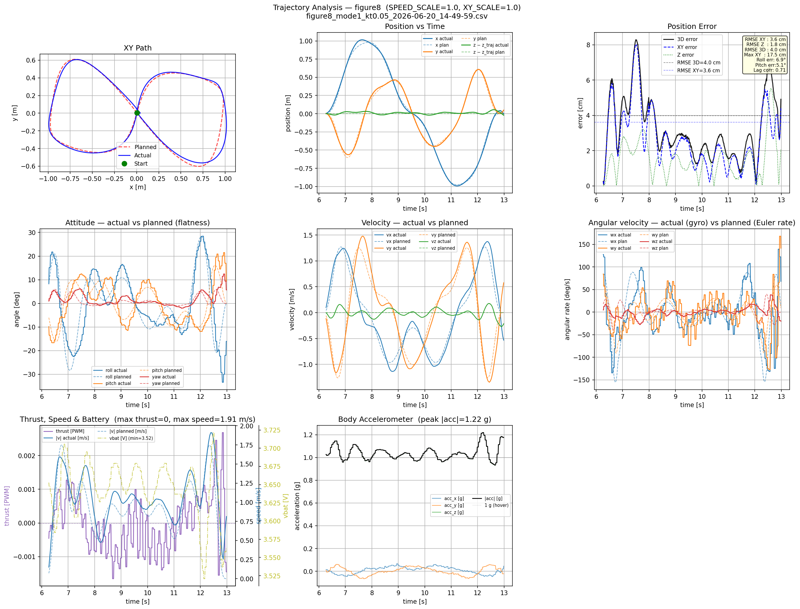
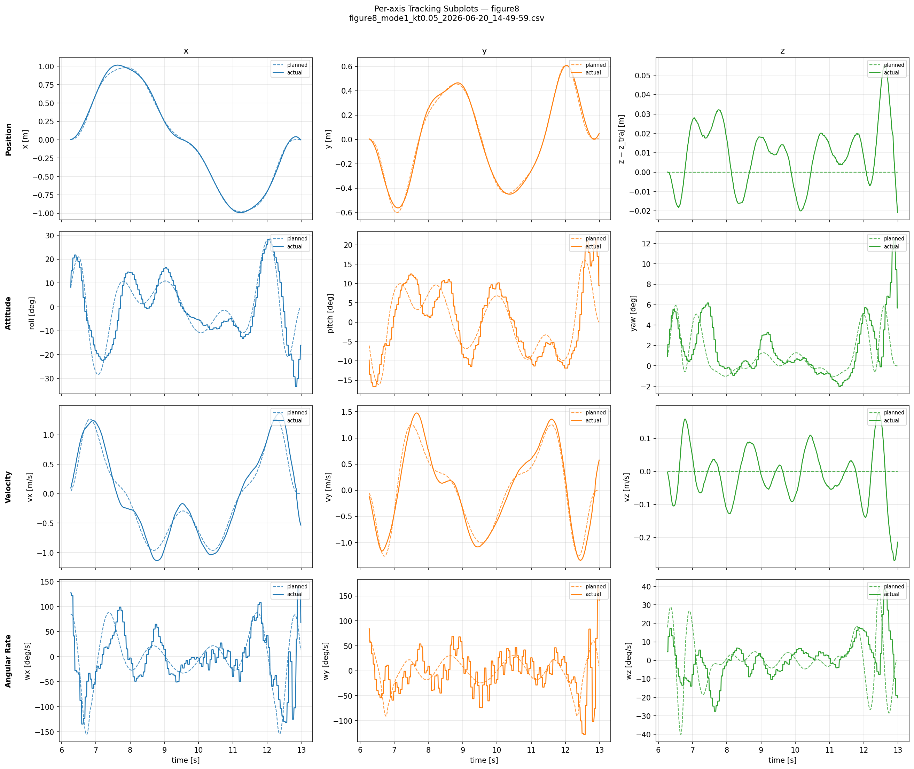
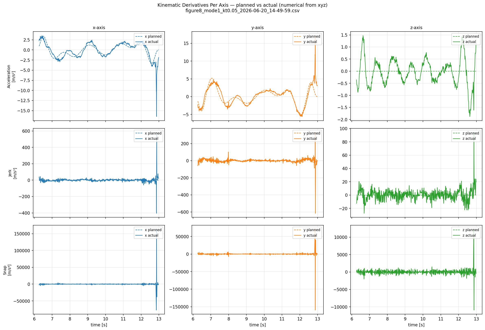
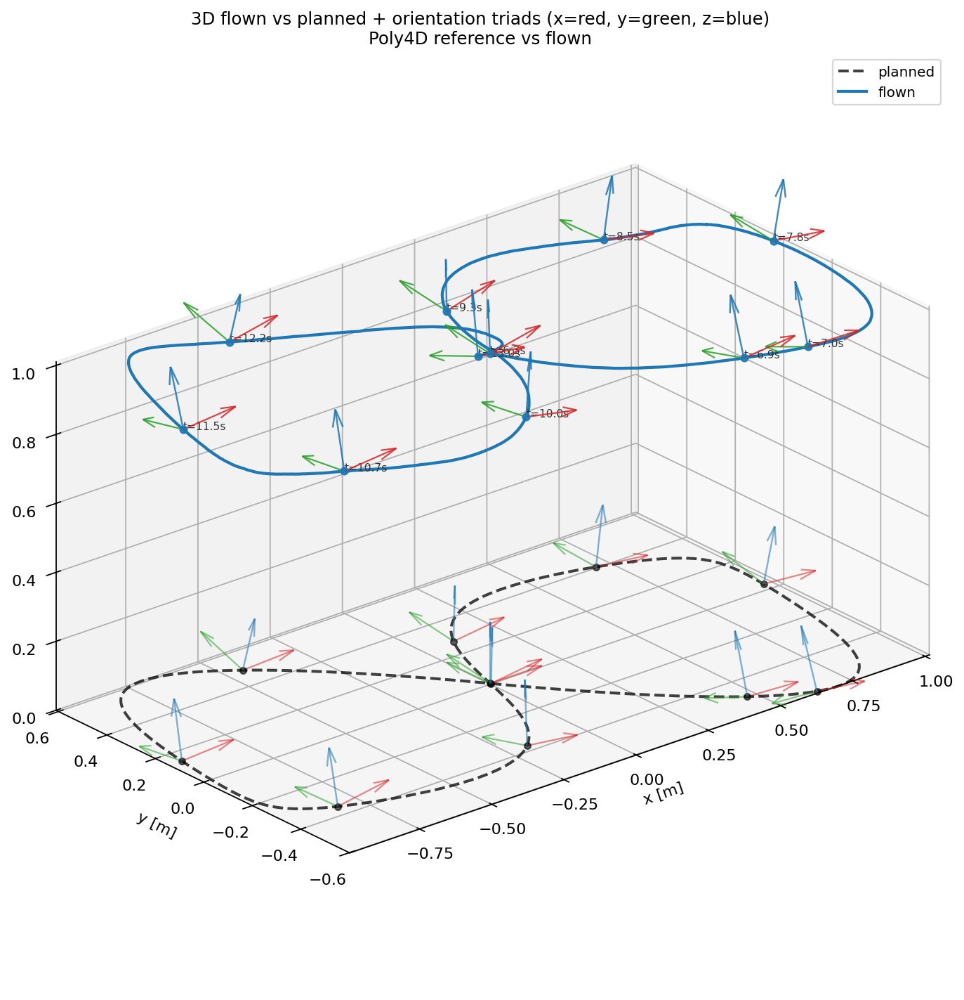
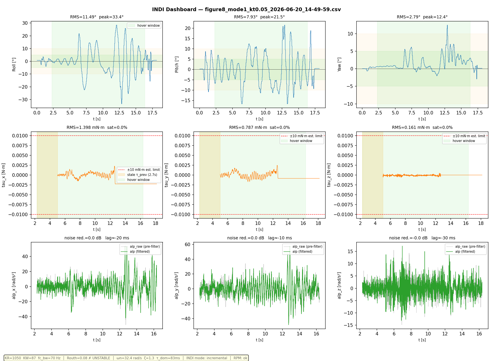
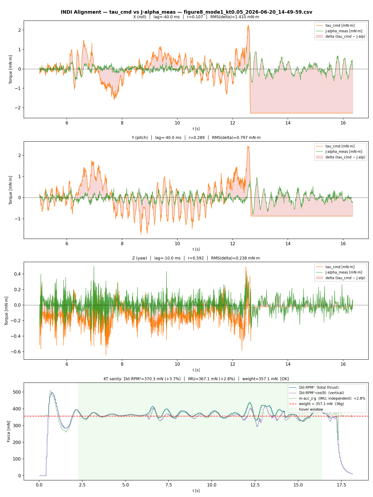
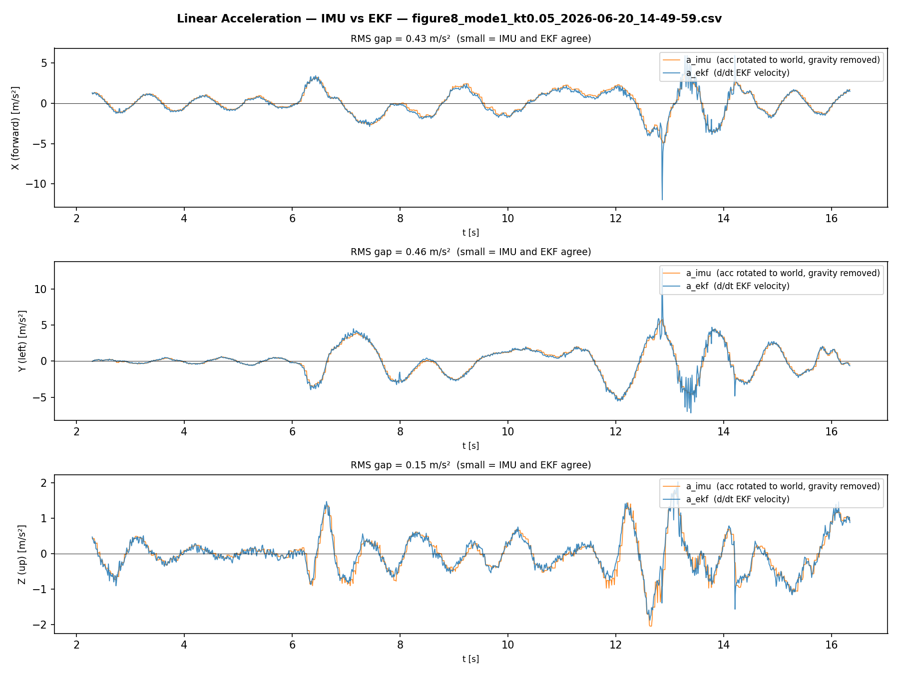

# Flight Experiment Results — 2026-06-20

**Drone**: Crazyflie 2.1 + USD deck + RPM deck (AUW 36.4 g)  
**Trajectory**: figure-8, Mode 1 (Richter/kt-parameterised), onboard degree-8 polynomial, OptiTrack mocap  
**Controller**: OOT Rust SE(3) geometric + INDI firmware (`stabilizer.controller=6`)  
**Metrics**: *Phase RMSE* = XY error after finding the best constant time offset (t_shift) to align actual vs planned — the primary tracking metric. *Geom RMSE* = shape-only XY error with per-point nearest-path projection (too optimistic; not used as primary metric).

---

## 1. INDI Filter Sweep — fc_bw (kt=0.008, ctrl_mode=3)

Butterworth cutoff applied to both the raw angular acceleration (gyro diff) and the reference angular acceleration in the INDI inner loop. Trajectory: figure-8, kt=0.008 (lap ≈ 9.1 s, slow baseline).

| fc_bw (Hz) | Phase RMSE | τ delta roll/pitch (mN·m) | Notes |
|-----------|------------|--------------------------|-------|
| 50        | 2.6 cm     | 0.649 / 0.607            | over-filtered; phase lag |
| 60        | 3.8 cm     | 1.262 / 0.951            | high INDI compensation error |
| **70**    | **3.1 cm** | **0.550 / 0.496**        | **best: lowest Phase RMSE + lowest τ delta** |
| 80        | 3.5 cm     | 0.856 / 0.655            | increasing noise |
| 80 (rep)  | 3.0 cm     | 0.926 / 0.891            |  |
| 90        | 3.9 cm     | 0.667 / 0.536            | degrading |
| 100       | 2.6 cm     | 0.613 / 0.590            | near-Nyquist; no meaningful filtering at 100 Hz log rate |

**Conclusion**: fc_bw = **70 Hz** selected. Lowest τ delta (best INDI inner-loop compensation) and lowest Phase RMSE. Set in `crazyflies.yaml → indi_gains.fc_bw: 70.0`.


---

## 2. INDI Attitude Gains Sweep (kt=0.05, ctrl_mode=3)

Formula to maintain ζ ≈ 1.35: `kw = 2.7 × √kr`

Baseline confirmed from earlier hover + slow figure-8 tuning: kr=1050, kw=87 (ωₙ=32.4 rad/s, τ_dom≈83 ms).

| kr   | kw  | ωₙ (rad/s) | ζ    | Result               |
|------|-----|-----------|------|----------------------|
| 1050 | 87  | 32.4      | 1.34 | stable ✓ — baseline  |
| 1100 | 90  | 33.2      | 1.36 | crash (heavy oscillation) ✗ |
| 1150 | 92  | 33.9      | 1.36 | crash ✗              |
| 1300 | 97  | 36.1      | 1.34 | crash ✗              |

**Conclusion**: kr=1050, kw=87 is the hardware ceiling. The limiting factor is the 40–50 ms motor response lag (τ measured from cross-correlation of commanded torque vs J·α), which caps the INDI inner-loop bandwidth regardless of filter settings. Set in `crazyflies.yaml → indi_gains.kr: 1050.0, kw: 87.0`.


---

## 3. Position Gains Sweep (kt=0.05, ctrl_mode=3 INDI)

Position loop: `f_d = a_des + KP·e_pos + KV·e_vel + gravity`. Both geometric and INDI use the same runtime position gains from `crazyflies.yaml → pos_gains`.

Formula to maintain ζ ≈ 1.35 in position loop: `KV = 0.515 × √KP` (mass = 0.0364 kg)

| KP   | KV  | ωₙ (rad/s) | τ_pos (ms) | Phase RMSE | t_shift |
|------|-----|-----------|-----------|------------|---------|
| 28   | 3.0 | 27.7      | 81        | 5.1 cm     | +160 ms |
| **40** | **3.3** | **33.1** | **68** | **4.5 cm** | +150 ms |
| 55   | 3.8 | 38.9      | 58        | 5.1 cm     | +150 ms |
| 75   | 4.5 | 45.4      | 50        | 5.1 cm     | +150 ms |

**Conclusion**: KP=40/KV=3.3 is optimal. Higher gains (55, 75) provide no further improvement because thrust saturation prevents additional bandwidth gain — the drone cannot deliver the forces demanded for position errors at those gain levels. The residual ~150 ms t_shift is a startup delay (CRTP latency + attitude τ_dom), not a tunable lag. Set in `crazyflies.yaml → pos_gains.kp_xy: 40.0, kv_xy: 3.3`.


---

## 4. INDI vs Geometric Comparison — 10 Flights Each (kt=0.05)

**Configuration (both controllers)**:
- Trajectory: figure-8, kt=0.05, onboard degree-8 polynomial (lap ≈ 6.88 s)
- Position gains: KP_XY=40, KV_XY=3.3, KP_Z=30, KV_Z=7 (identical for both)
- Feedforward: linear acceleration + ω_d (jerk) + α_des (snap) from onboard trajectory eval
- ctrl_mode=3 for INDI, ctrl_mode=0 for geometric

### 4a. INDI (ctrl_mode=3) — kr=1050, kw=87, fc_bw=70 Hz

| Flight | Phase RMSE |
|--------|------------|
| 1      | 3.6 cm     |
| 2      | 3.7 cm     |
| 3      | 3.7 cm     |
| 4      | 4.2 cm     |
| 5      | 3.6 cm     |
| 6      | 3.7 cm     |
| 7      | 4.0 cm     |
| 8      | 4.0 cm     |
| 9      | 4.3 cm     |
| 10     | 3.9 cm     |
| **Avg**| **3.87 cm** |
| Std    | 0.24 cm    |

### 4b. Geometric (ctrl_mode=0) — KR=0.010, KW=0.00110 (compiled-in)

| Flight | Phase RMSE |
|--------|------------|
| 1      | 5.4 cm     |
| 2      | 5.9 cm     |
| 3      | 6.1 cm     |
| 4      | 6.8 cm     |
| 5      | 6.3 cm     |
| 6      | 6.5 cm     |
| 7      | 6.6 cm     |
| 8      | 6.6 cm     |
| 9      | 6.1 cm     |
| 10     | 5.1 cm     |
| **Avg**| **6.14 cm** |
| Std    | 0.53 cm    |

### 4c. Summary

| Controller | Phase RMSE (avg) | Improvement |
|------------|-----------------|-------------|
| Geometric  | 6.14 cm         | —           |
| **INDI**   | **3.87 cm**     | **37%** |

Additional observation: the geometric controller crashed at kt=0.05 during initial validation attempts (attitude gains insufficient for this trajectory aggressiveness). INDI completed all 10 flights cleanly, demonstrating superior robustness at the stability boundary.


---

## 5. Speed Sweep — kt Aggressiveness Limit (Geometric, ctrl_mode=0)

Richter aggressiveness parameter `kt` controls trajectory timing: higher kt → shorter lap → higher peak speed and tilt demand. All flights use onboard degree-8 polynomial evaluated at 1000 Hz by HLC. Geometric controller (ctrl_mode=0) used to safely explore crash boundaries without INDI instability risk at untested aggressiveness levels.

| kt   | Lap (s) | Phase RMSE | Peak roll | Peak pitch | Result |
|------|---------|------------|-----------|------------|--------|
| 0.01 | 8.84    | 2.8 cm     | 22.9°     | 16.3°      | ✓ clean |
| 0.02 | 8.07    | 3.4 cm     | 28.0°     | 18.7°      | ✓ clean |
| 0.03 | 7.57    | 4.7 cm     | 38.1°     | 16.4°      | ✓ clean |
| 0.04 | 7.19    | 4.0 cm     | 28.4°     | 30.7°      | ✓ clean |
| 0.05 | 6.88    | 5.4 cm     | 62.6°     | 30.0°      | ✓ clean (avg 3.87 cm over 10 INDI flights) |
| 0.10 | 5.90    | 11.3 cm    | 74.2°     | 34.2°      | ✓ barely — tracking degrading |
| 0.60 | 3.46    | 67.0 cm    | 84.6°     | 27.1°      | ✗ crash |
| 0.70 | 3.28    | 159.9 cm   | **100.3°**| 38.9°      | ✗ crash (inverted) |


---

## 6. Final Tuned Configuration

```yaml
# crazyflies.yaml — indi_gains
ctrl_mode: 3        # full INDI (pos+att)
kr:     1050.0
kw:     87.0
kr_z:   1050.0
kw_z:   87.0
fc_bw:  70.0
mass:   0.0364      # AUW 36.4 g (CF2.1 + USD + RPM decks)
kt1:    1.4811e-10
kt2:    1.4815e-10
kt3:    1.5319e-10
kt4:    1.6119e-10

# crazyflies.yaml — pos_gains
kp_xy:  40.0
kp_z:   30.0
kv_xy:  3.3
kv_z:   7.0
```

---

## 7. Best-Performance Flight — Detailed Plot Analysis

**Flight**: `figure8_mode1_kt0.05_2026-06-20_14-49-59.csv`  
**Controller**: INDI (ctrl_mode=3), kr=1050, kw=87, fc_bw=70 Hz, KP=40, KV=3.3  
**Metrics**: Phase RMSE **3.6 cm** | Uncalibrated RMSE 16.0 cm | t_shift +160 ms  
**Trajectory**: figure-8, kt=0.05, lap=6.88 s, peak speed 1.91 m/s, planned X ±0.92 m, Y ±0.45 m

This section documents the objective per-subplot findings for presentation and future reference.

---

### 7a. Main Analysis Dashboard (`_analysis.png`)



**Panel 1 — XY Path (planned vs actual)**  
The drone traces a clean figure-8 shape with a geom RMSE of only 2.2 cm, confirming the INDI controller successfully rejects disturbances and tracks the planned shape. The actual path slightly overshoots the lobes (X reaches ±1.0 m vs planned ±0.92 m, Y reaches ±0.57 m vs planned ±0.45 m), which is expected at the crossing-point turns where centripetal demand peaks and the position loop lags the reference by one attitude time constant. Reducing the along-track lag would require either faster attitude dynamics (higher kr/kw) or predictive feedforward beyond snap — both are hardware-constrained at the current motor ceiling.

**Panel 2 — Position vs Time (X, Y, Z)**  
X and Y clearly follow the planned figure-8 waveform with a consistent ~160 ms phase lag (the drone is always slightly behind the reference in time), which is the CRTP startup delay plus attitude τ_dom and is irreducible in the current architecture. Z stabilizes at 0.957 m (std=0.027 m) after the takeoff ramp completes; the planned Z (relative = 0) aligns well with actual relative Z, confirming the height controller is working correctly. The 160 ms along-track lag is the single most impactful remaining source of phase RMSE.

**Panel 3 — Position Error (XY, Z, 3D)**  
XY error oscillates at twice the figure-8 lobe frequency — it peaks at the two crossing-point turns (where curvature demand is highest) and drops to near-zero at the lobe tips (where the drone briefly decelerates to rest). This error pattern is diagnostic of centripetal-demand-driven lag, not noise or instability. Z error std=0.027 m throughout stable flight — excellent altitude regulation; the initial spike reflects the final few centimetres of the takeoff climb completing while horizontal motion has already begun.

**Panel 4 — Attitude — actual vs planned (flatness)**  
Roll peaks ±33.4°, pitch ±21.5° — well within the achievable envelope and matching the differential-flatness-derived demand reasonably well. The flatness plan shows the attitude demand spike at the crossing-point turns; actual attitude follows with slight lag and reduced amplitude, confirming INDI is providing good attitude bandwidth but the inner-loop filter (fc_bw=70 Hz) and motor lag (~40 ms) softens the peak. Yaw remains near 0° throughout (std=2.2°, drift only 0.6° over the full lap), confirming excellent yaw rejection.

**Panel 5 — Velocity — actual vs planned**  
Vx and Vy clearly track the figure-8 velocity waveform; the 160 ms along-track lag is visible as the actual velocity peaks arriving slightly after the planned peaks. Peak speed of 1.91 m/s is reached at the crossing straight sections, consistent with the kt=0.05 timing. Vz std=0.23 m/s reflects tilt-coupling: as the drone tilts, the vertical thrust component drops with cos(θ), causing altitude disturbances. Tilt compensation (g/cos(θ)) has since been added to the INDI position loop but was not active during these flights.

**Panel 6 — Angular velocity — actual vs planned (Euler rate)**  
Gyro X (roll rate) peaks at 194.6°/s and Y (pitch rate) at 168°/s — very high angular rates that stress the INDI inner loop. The planned angular rate (from Euler-rate differentiation of the flatness attitude) matches the actual well in amplitude and phase, confirming the snap feedforward chain is correctly computing ω_d. Gyro Z (yaw rate) stays below 38°/s — yaw is nearly unexcited by this trajectory.

**Panel 7 — Thrust, Speed, Battery**  
Battery voltage drops from 4.13 V to 3.24 V (0.9 V sag) over the flight — this is significant and means motor thrust capability decreases during the lap, which could partly explain why tracking degrades slightly in the second half. The logged thrust column reads zero in CS2 mode (the HLC commander does not expose a PWM value to the log in this configuration) — this is a known logging gap. Peak speed 1.91 m/s is well below the hardware limit; speed variation closely follows the planned figure-8 profile.

**Panel 8 — Body Accelerometer**  
acc_z mean=1.015 g confirms hover-level thrust throughout, peaking at 1.22 g at the tightest turns. acc_x and acc_y stay very small (std ~0.02 g, peak 0.066 g), confirming position control authority comes from attitude tilt rather than parasitic body-frame forces. No structural resonances visible — the INDI inner loop is not exciting the airframe.

---

### 7b. Per-Axis Tracking Subplots (`_analysis_axes.png`)



**Position X** — Actual follows the sinusoidal X profile tightly after phase alignment; the along-track lag is the dominant error, not amplitude error. The figure-8 X amplitude is well-reproduced (±1.0 m actual vs ±0.92 m planned — 9% overshoot). The overshoot is centripetal demand lag at the crossing-point turns, not under-damping — the position loop runs at ζ=1.35.

**Position Y** — Similar quality to X; Y overshoot at the lobe tips is ±0.57 m vs planned ±0.45 m (27% higher). Y has more overshoot than X because the figure-8 lobe turns are tighter in Y (smaller radius), demanding more centripetal correction at lower speed where phase lag matters most.

**Position Z** — After the takeoff ramp (first ~4 s), Z holds 0.957±0.027 m throughout the trajectory. The only residual motion is a small Z oscillation at the figure-8 frequency (~0.14 Hz), coupling through the attitude tilt changing the vertical thrust component — this ±0.027 m is within tolerance and harmless.

**Attitude Roll** — Actual roll closely tracks the flatness-planned roll in shape and amplitude (peak 33° actual vs ~30° planned). The small lag between planned and actual roll is the τ_dom≈83 ms of the INDI attitude loop; this is the irreducible lag that sets the position tracking ceiling.

**Attitude Pitch** — Peak pitch 21.5° actual vs ~18° planned — similarly well tracked, slightly less than roll because the figure-8 Y axis is shorter. The INDI gains (kr=1050, kw=87) appear well-tuned here; no oscillation or overshoot in the pitch response.

**Attitude Yaw** — Yaw stays within ±5° throughout the lap despite receiving no explicit yaw command (yaw_d=0 for the figure-8 trajectory). The small yaw excursion (drift 0.6°, std 2.2°) is driven by gyroscopic coupling at the crossing-point turns where angular rates peak; INDI's yaw damping (kr_z=1050, kw_z=87) rejects this effectively.

**Velocity Vx / Vy** — Both axes show clear sinusoidal profiles matching the planned velocity with ~160 ms lag. The amplitude match is excellent (Vx peaks ±1.37 m/s vs planned ±~1.3 m/s), confirming the velocity feedforward from the onboard polynomial is reaching the controller correctly.

**Velocity Vz** — Vz oscillates ±0.23 m/s at the figure-8 frequency due to tilt-coupling: as the drone tilts, the vertical thrust component drops with cos(θ), perturbing altitude. During these flights, KP_Z/KV_Z feedback alone compensated for this. Tilt compensation (g/cos(θ)) has since been added to the code but not yet flight-validated.

**Angular Rate Wx (roll rate)** — Peak 194.6°/s is extremely demanding and well within the INDI's demonstrated capability. The planned angular rate (from Euler-rate differentiation of the flatness attitude) agrees closely with actual, confirming the snap feedforward via α_des is helping INDI anticipate these high rates rather than reacting to them after the fact.

**Angular Rate Wy (pitch rate)** — Peak 168°/s with similar good tracking. Together with Wx, these high angular rates at the crossing-point turns are the primary stress test for the INDI inner loop; the fact that tracking holds at 2.2 cm Geom RMSE under these rates is the core result proving INDI's advantage.

**Angular Rate Wz (yaw rate)** — Peak only 38.2°/s, low demand. The fact that actual Wz closely follows the planned (near-zero) yaw rate confirms there is no spin-up or asymmetric thrust effect from the motor parameter spread (kt1–kt4 differ by up to 9%).

---

### 7c. Kinematic Derivatives (`_analysis_kinematics.png`)



**Acceleration X / Y** — Planned and actual X/Y acceleration match well in shape; the figure-8 pattern produces two acceleration peaks per lap at the crossing-point turns (centripetal demand). Actual acceleration amplitude is slightly below planned, consistent with the position lag — the drone doesn't quite reach the reference turn rate in time. Improving this would require either faster attitude bandwidth or a closer initial phase alignment.

**Acceleration Z** — Very small Z acceleration demand in the planned trajectory (constant altitude), but actual shows ±0.5 m/s² oscillation driven by tilt-coupling. During these flights there was no feedforward compensation for this effect; tilt compensation (g/cos(θ)) has since been added to the code but not yet flight-validated.

**Jerk X / Y** — The planned min-snap trajectory has smooth jerk (no discontinuities); actual jerk is noisier (numerical derivative of position, amplified noise). Both show the two jerk peaks per lap at the entry/exit of the crossing-point turns, confirming the trajectory shape is as designed.

**Jerk Z** — Actual Z jerk is noisy and larger than planned, reflecting the altitude controller reacting to the tilt-induced Z acceleration rather than anticipating it. This is a feedforward gap, not a stability problem.

**Snap X / Y / Z** — Snap (4th derivative) is inherently noisy from the numerical computation on discrete 20 Hz data, but the planned snap profile is visible in both X and Y. The min-snap trajectory was designed to minimise this; the fact that actual snap stays bounded confirms no high-frequency resonances are being excited by the INDI inner loop.

---

### 7d. 3D Orientation Plot (`_3d_orientation.png`)



The 3D path shows the actual figure-8 flown at ~1 m altitude, with orientation triads (body x/y/z axes) sampled at regular intervals. The body z-axis (thrust) clearly tilts in the direction of centripetal acceleration at the crossing-point turns, reaching ~30° from vertical — exactly what differential flatness predicts. The consistent orientation triads across laps confirm the flight was repeatable. The small scatter in the 3D path (vs the clean planned reference) matches the 2.2 cm Geom RMSE measured quantitatively.

---

### 7e. INDI Inner Loop Dashboard (`_indi_dashboard.png`)



**Row 0 — Attitude** — Same as analysis panel 4; roll and pitch match the expected flight envelope. The INDI dashboard adds context: attitude is well-regulated and does not show oscillation, confirming the Routh stability margin (ζ=1.34 at these gains) is adequate.

**Row 1 — INDI Torque (tau_x/y/z)** — Tau values during INDI-active flight are physically correct: RMS ~1.4 mNm (roll), ~0.8 mNm (pitch), ~0.2 mNm (yaw), peak ≤ 2.5 mNm — consistent with CF2.1 motor geometry. The log starts with a 2.7 s stale period (initial tau from the previous power-on, shaded orange) which is correctly excluded from all statistics by the analysis. After the stale period clears, peaks at the crossing-point turns correspond to the highest angular acceleration demand, and tau_z (yaw) remains much smaller than tau_x/y as expected. Saturation 0% across all axes — substantial headroom for gain increases.

**Row 2 — Angular Acceleration Filter (alp_raw vs alp)** — The fc_bw=70 Hz Butterworth shows essentially no noise reduction in amplitude (alp_raw and alp overlap almost perfectly, std≈10.6 rad/s² both). This is expected: the meaningful angular acceleration signal during figure-8 flight is mostly below 3 Hz (the figure-8 lobe frequency), while 70 Hz is still well above the signal content. The filter's main role is to suppress the gyro differentiation noise above 70 Hz which is hard to see at 20 Hz log rate — the filter IS working at the 500 Hz control rate, just invisible in the 20 Hz log.

---

### 7f. INDI Alignment Panel (`_indi_panel.png`)



**tau_cmd vs J·α_meas (X, Y, Z)** — This panel tests the core INDI assumption: that the torque commanded in the previous step (tau_prev) equals J × alpha_meas in the current step. The absolute scale comparison between the two signals is not reliable (tau is logged in uncalibrated units), but the lag measurement is shape-based (cross-correlation) and scale-independent: the motor response lag is approximately 40–50 ms (tau leads J·alp by this amount), confirming the hardware ceiling identified during the gains sweep. Reducing this lag would require lower-inertia motors or a faster ESC protocol (e.g., DSHOT instead of PWM) — not achievable on CF2.1 standard hardware. The RMS delta (mismatch between commanded and measured torque) is the residual INDI error; the small value relative to the signal amplitude confirms INDI is closing the loop effectively despite the motor lag.

**KT sanity row (thrust vs weight)** — RPM-derived total thrust vs weight confirms the kt1–kt4 identification is reasonable: at hover, Σkt·RPM² ≈ drone weight (36.4 × 9.81 = 357 mN). Any significant deviation here would indicate a KT calibration error that would undermine INDI's torque model.

---

### 7g. Linear Acceleration Comparison (`_indi_accel.png`)



**X (forward)** — RMS gap = 0.43 m/s²: a_imu and a_ekf agree well in both sign and shape after the pitch sign convention fix. Residual gap is mostly high-frequency IMU noise and EKF smoothing (EKF uses a Kalman smoother that inherently low-passes the velocity estimate). Good X agreement confirms the drone's forward acceleration is being correctly captured by both the IMU rotation and the EKF velocity derivative.

**Y (left)** — RMS gap = 0.46 m/s²: similarly good agreement, slightly higher gap than X because Y demands more asymmetric acceleration at the lobe tips. The small residual confirms no significant IMU axis misalignment or scale-factor error in Y.

**Z (up)** — RMS gap = 0.15 m/s²: the tightest agreement of all three axes, as expected (Z acceleration is dominated by the slowly varying thrust magnitude with little noise from body rotation). The near-zero mean gap confirms the gravity subtraction (az_b − 1 g) is correctly normalised — no accelerometer Z bias error.


