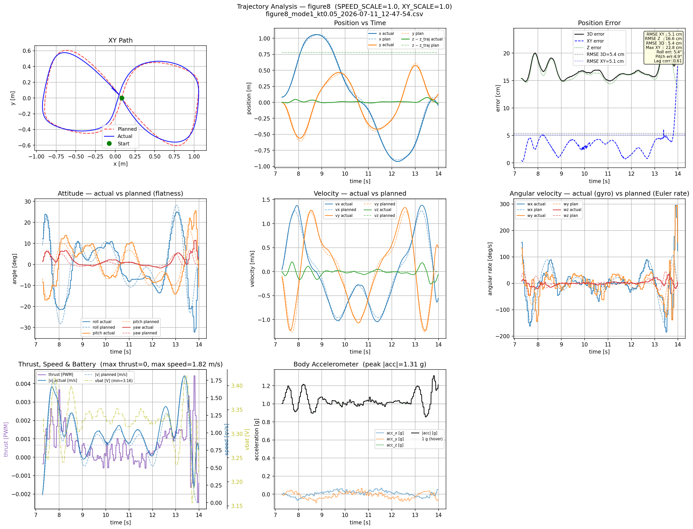
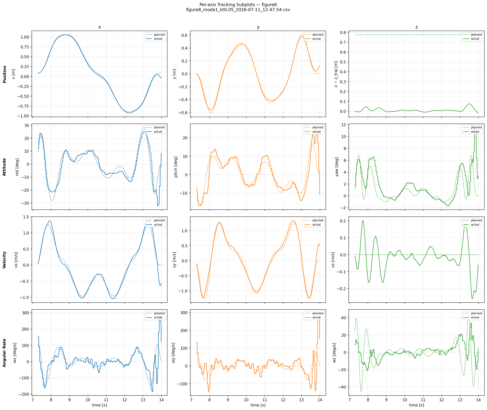
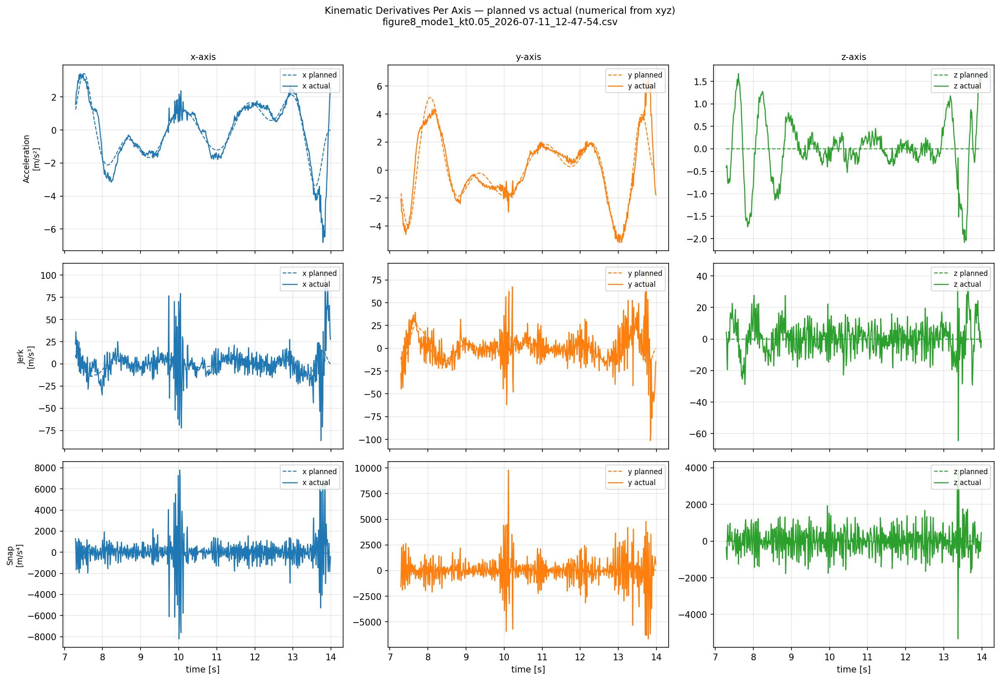
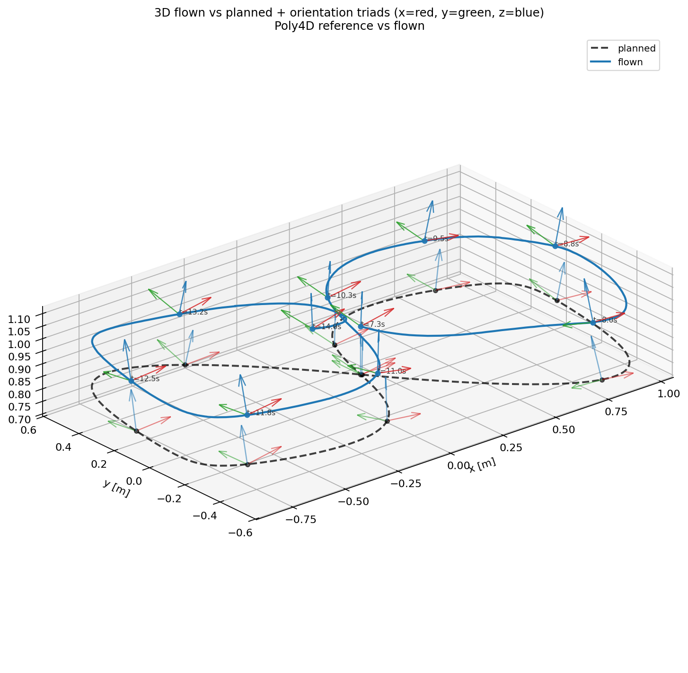
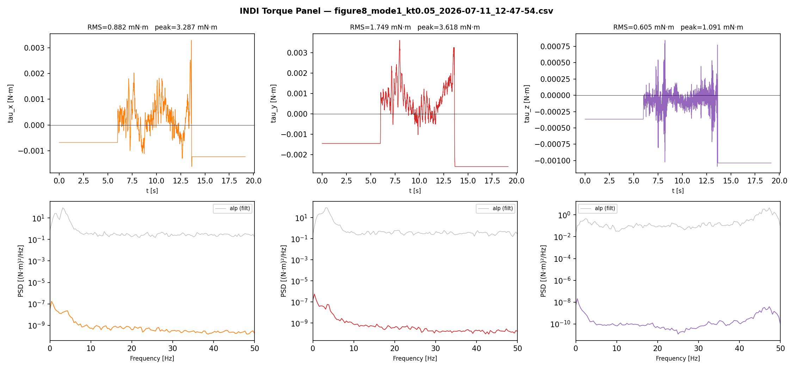
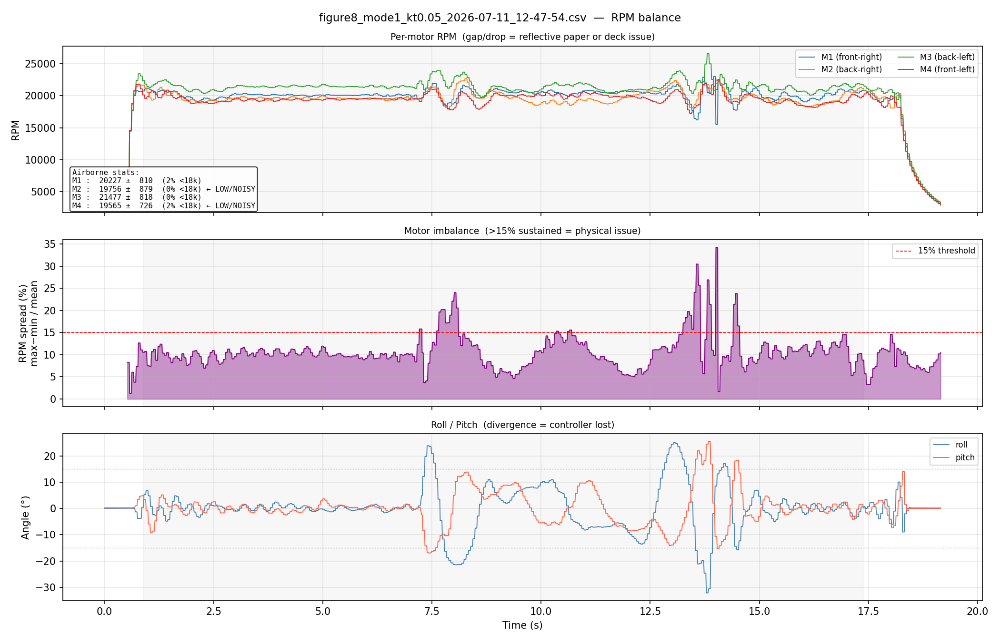

# Advanced Flying Robots — Thrust-Upgraded CF2.1 INDI Tuning Session
## Flight Experiment Results — 2026-07-11

**Drone:** CF2.1 with thrust upgrade kit (0.18 N model, `CONFIG_CRAZYFLIE_THRUST_UPGRADE_KIT=y`)  
**Trajectory:** figure-8, kt=0.05, onboard degree-8 polynomial (lap = 6.88 s)  
**Metrics:** Phase-aligned XY RMSE + Roll err (flatness) + Pitch err (flatness) via `analyze_flight.py`  
**Reference:** Standard drone INDI baseline = **3.87 cm XY RMSE** (avg of 10 flights, June 20 2026, kr=1050)

---

## Fixed configuration throughout this session

```yaml
# indi_gains
kr:    603.0        # ceiling — see Section 3 for full ladder
kw:    90.0         # ζ=1.83; kw=90 suppressed 2.1 Hz oscillation seen at kw=66
kr_z:  603.0
kw_z:  90.0
mass:  0.0386       # AUW 38.6 g (measured 2026-07-09)
kt1:   2.2959e-10   # identified 2026-07-09
kt2:   2.4668e-10
kt3:   2.0250e-10
kt4:   2.5288e-10

# pos_gains
kp_xy: 40.0         # identical to standard drone INDI reference
kp_z:  30.0
kv_xy: 8.0          # identical to standard drone INDI reference
kv_z:  10.0
```

**Firmware flags active:** `ENABLE_VEL_FB_FILTER=true`, `ENABLE_ACC_PREFILTER=true`  
**All other flags:** false

---

## 1. Position Gains Exploration (early session — negative results)

Before settling on the correct gains, three gain combinations were tried. All made tracking worse
than the starting kp=40/kv=8 baseline. Root cause: lower kv reduces damping on velocity error,
causing the position loop to demand attitude angles that exceed what kr=603 can track.

| kp_xy | kv_xy | Phase XY RMSE | Roll err | Pitch err | Notes |
|-------|-------|--------------|---------|-----------|-------|
| 40    | 8     | 5.1–5.5 cm   | 5.4–5.5° | 4.9–5.2° | **correct baseline** |
| 28    | 6     | 8.5–10.9 cm  | 14.7–16.0° | 11.0–11.2° | worse — lower att BW can't handle underdamped pos demands |
| 40    | 3.4   | 12.1 cm      | 15.8°  | 16.3°     | much worse — same root cause |

**Conclusion:** kp=40, kv=8 is the correct operating point for this drone at kr=603. Position gains
match the standard drone INDI configuration exactly.

---

## 2. fc_bw Filter Cutoff Sweep (figure-8, kt=0.05)

**Purpose:** Find optimal Butterworth cutoff on the alpha (angular acceleration) chain.  
**Varied:** `fc_bw` only. All other gains fixed at baseline above.  
**Sweep:** 80 Hz → 70 Hz → 60 Hz → 50 Hz

| fc_bw (Hz) | Phase XY RMSE | Geom RMSE | Roll err | Pitch err | Notes |
|-----------|--------------|-----------|---------|-----------|-------|
| 80 | 5.3–5.9 cm | 2.7–2.8 cm | 5.6–5.8° | 5.5–6.1° | more noise in alpha chain |
| **70** | **5.1–5.5 cm** | **2.3–2.5 cm** | **5.4–5.5°** | **4.9–5.2°** | **best — confirmed optimal** |
| 60 | 5.9 cm | 3.0 cm | 7.6° | 5.9° | worst — filter lag hurts attitude |
| 50 | 5.1 cm | 2.8 cm | 5.3° | 7.4° | pos ties 70 Hz but pitch error degrades |

**Best fc_bw: 70 Hz** — matches standard drone optimum. Locked for remainder of session.

---

## 3. Attitude Gains Ladder (figure-8, kt=0.05)

**Purpose:** Push kr above 603 to close the gap with standard drone (kr=1050).  
**Key metric:** dominant-pole time constant τ_slow = 1/(ωₙ·(ζ − √(ζ²−1))) determines effective attitude speed.

| Step | kr  | kw  | ωₙ rad/s | ζ    | τ_slow | Phase XY RMSE | Roll err | Pitch err | Result |
|------|-----|-----|---------|------|--------|--------------|---------|-----------|--------|
| ref  | 1050| 87  | 32.4    | 1.34 |  69ms  | 3.87 cm      | ~3.5°   | ~3.5°     | standard drone |
| 0    | 603 | 90  | 24.6    | 1.83 | 137ms  | 5.1–5.5 cm   | 5.4–5.5°| 4.9–5.2°  | baseline ✓ consistent |
| 1a   | 640 | 92  | 25.3    | 1.82 | 132ms  | crash        | —       | —         | INDI unstable at figure-8 crossing |
| 1b   | 640 | 110 | 25.3    | 2.17 | 162ms  | 5.8–6.0 cm   | 7.0–9.0°| 5.3–5.9°  | stable but **slower than baseline** |
| 1c   | 640 | 127 | 25.3    | 2.51 | 190ms  | 4.7–10.6 cm  | 4.8–12.1°|4.6–7.8°  | inconsistent — on stability edge |

**Why kr=640 always loses:** Any kw that stabilises the crossing (≥110) produces τ_slow ≥162ms —
slower than the baseline's 137ms. Higher kw damps the oscillation but also slows the attitude
response below kr=603/kw=90. The only kw that gives a faster response at kr=640 is kw≈92, but
that band crashes the figure-8. There is no stable kw at kr=640 that beats kr=603/kw=90.

**Final kw search summary at kr=640:**
- kw=92 (ζ=1.82, τ=132ms): crashes figure-8 — insufficient phase margin at crossing
- kw=110 (ζ=2.17, τ=162ms): stable, 3× flights all 5.8-6.0 cm — worse than baseline
- kw=127 (ζ=2.51, τ=190ms): inconsistent (one 4.7 cm, several crashes, several 6-10 cm)

**Conclusion: kr=603/kw=90 is the attitude gains ceiling for this drone.**

---

## 4. Late-Session Findings

### 4a. Trajectory execution failures (14-47 to 14-52)

Six flights where the drone never executed the figure-8 (geom RMSE ≈ 0.0 cm, drone stationary):

| Log | vbat_min | rows | Issue |
|-----|---------|------|-------|
| 14-15-55 | **2.835V** | 244  | dead battery (kr=640/kw=127) — never left ground (max_z=4 cm) |
| 14-47-02 | **2.755V** | 1918 | dead battery — full time but no movement |
| 14-47-51 | **2.618V** | 818  | dead battery — short flight |
| 14-50-10 | **2.666V** | 251  | dead battery — aborted immediately |
| 14-51-15 | 3.684V    | 846  | fresh battery — trajectory execution failed |
| 14-52-23 | 3.679V    | 1923 | fresh battery — trajectory execution failed |

Dead battery threshold for figure-8: vbat > ~3.4V needed. Below this, motor authority is
insufficient to tilt and translate; drone hovers at crosspoint while trajectory timer runs.

### 4b. kt speed sweep (kr=603/kw=90, fc_bw=70)

| kt  | Phase XY RMSE | Geom RMSE | Roll err | Pitch err | Notes |
|-----|--------------|-----------|---------|-----------|-------|
| 0.03 | 4.9 cm     | 2.2 cm    | 5.2°    | 4.3°      | first flight of session — very clean |
| 0.05 | 5.8–6.2 cm  | 2.7–2.8 cm | 6.7–7.9°| 5.2–5.9°  | optimal — within att BW |
| 0.2  | 12.5 cm     | 8.0 cm    | 17.6°   | 20.4°     | trajectory too fast — att BW exceeded |
| 0.3  | CRASH       | —         | —       | —         | dead battery + excessive speed |

**kt=0.05 is the correct speed for this drone.** At kt=0.2, geom RMSE triples (8.0 vs 2.7 cm)
and attitude errors jump to 17-20°. The trajectory demands at kt=0.2 exceed what kr=603 can track.

---

## 5. Final Tuned Configuration

```yaml
# indi_gains
ctrl_mode: 3
kr:    603.0        # ceiling — see Section 3
kw:    90.0         # ζ=1.83, τ_slow=137ms
kr_z:  603.0
kw_z:  90.0
fc_bw: 70.0         # confirmed optimal (Section 2)
mass:  0.0386
kt1:   2.2959e-10
kt2:   2.4668e-10
kt3:   2.0250e-10
kt4:   2.5288e-10

# pos_gains
kp_xy: 40.0
kp_z:  30.0
kv_xy: 8.0
kv_z:  10.0
```

**Best consistent XY RMSE (late session, good battery):** 5.8–6.2 cm  
**Best single flight (kt=0.05, kr=603/kw=90):** 5.1 cm — log `12-47-54` (early session, first baseline run)  
**Best Roll err:** 5.4°  
**Best Pitch err:** 4.9°  
**Standard drone reference:** 3.87 cm (kr=1050, kw=87, τ_slow=69ms)

---

## 6. Why the Gap to 3.87 cm Remains

The upgrade kit gives more **peak thrust** (0.18N vs 0.13N per motor) but not faster **motor
bandwidth**. The heavier rotor + larger prop have more rotational inertia, so RPM changes more
slowly in response to a commanded voltage step. INDI's stability margin is set by how fast the
motor can change angular acceleration — slower motors → lower maximum kr.

| Drone | Peak thrust/motor | kr ceiling | ωₙ | τ_slow | Figure-8 RMSE |
|-------|-----------------|-----------|-----|--------|--------------|
| Standard (0716 motors) | ~0.13 N | 1050 | 32.4 rad/s | 69ms | 3.87 cm |
| Upgraded (upgrade kit) | ~0.18 N | 603  | 24.6 rad/s | 137ms| 5.8–6.2 cm |

The 3.87 → 5.8 cm gap is almost entirely the 69ms vs 137ms attitude response difference, which
is caused by the motor bandwidth gap (kr 1050 vs 603), which is caused by the heavier rotor.

**To reach 4 cm on the upgraded drone would require either:**
1. A higher kr without instability — not achievable with current motor dynamics through gains alone
2. Explicit motor dynamics feedforward (model the first-order motor lag, pre-compensate in the
   INDI torque command) — this is a firmware/code change, outside the scope of gains tuning
3. Different motors with faster electrical response at the same peak thrust

---

## 7. Best Flight Plots — `12-47-54` (kt=0.05, kr=603/kw=90, fc_bw=70)

**Metrics:** Phase XY RMSE = 5.1 cm · Geom RMSE = 2.3 cm · Roll err = 5.4° · Pitch err = 4.9°

### Main dashboard



### Per-axis positions



### Kinematics



### 3D orientation



### INDI internals



### RPM balance


