# Advanced Flying Robots — CF2.1 Brushless (CF21BL) INDI Commissioning

## Flight Experiment Results — starting 2026-07-15

**Drone:** Crazyflie 2.1 **Brushless** (CF21BL), `CONFIG_PLATFORM_CF21BL=y`, DShot bidirectional ESC telemetry
**Goal:** get full-INDI **hover** stable, then **figure-8**, on the brushless platform
**Source of truth for physics:** Busetto et al. 2025, *Nonlinear System Identification Nano-drone Benchmark* (`docs/brushless_system_identification.pdf`)
**Status:** ✅ **DONE (2026-07-19).** Full INDI stable, gain ceiling found and validated:
**2.48 cm mean XY RMSE (n=12, std 0.13)** — beats standard (3.87cm) and upgraded (3.72cm) drones.
Locked config, full ladder, and 4-way comparison plots: **§5-§6**. Root-cause history (§1-§4)
preserved below for reference — several early findings were superseded/retracted as evidence
accumulated (each flagged inline where it happens); trust §5-§6 as current.

---

## Platform parameters (from the paper) vs our config

| Quantity | Paper (Busetto 2025) | Our config | Match |
|----------|----------------------|-----------|-------|
| Inertia J | diag(2.3951e‑5, 2.3951e‑5, 3.2347e‑5) kg·m² | identical | ✅ |
| Arm L | 35.35 mm | ARM_M = 0.035355 m | ✅ |
| kF (thrust) | 3.72e‑8 Ns²/rad² | kt refit to eRPM (self-consistent) | ✅ |
| kM (drag) | 7.73e‑11 Nms²/rad² | — | ✅ |
| kM/kF (→ τ_z) | 0.002078 | TORQUE_RATIO **fixed 2026-07-18** to `0.00569278844371417` — Bitcraze's own compiled stock-mixer value for CF21BL (`platform_defaults_cf21bl.h`), not the paper's independently-measured kF/kM (which ignores ESC/prop-efficiency losses). Paper value was wrong for our use case. | ✅ fixed |
| Mass m | 45 g (with Flow + AI deck) | 41 g | ✅ confirmed by physical weighing 2026-07-19 |
| Controller | geometric SE(3) + integral, 500 Hz | identical | ✅ |
| ω bandwidth (Table 4) | ~18 Hz | INDI fc_bw = 30–70 Hz | ⚠️ over |
| Motor speed bandwidth | ~20 Hz | — | — |
| Motor-speed telemetry | DShot back-EMF, **documented cmd→actuation delay** | read live, no delay compensation | ⚠️ |

---

## Active configuration (as of last flight 2026-07-15 19:xx)

**⚠️ HISTORICAL — day-1 snapshot, not current.** This was the conservative starting point before
the crash/detonation was even diagnosed. **Final locked config is §5d** (`kr=2400, kw=170,
kp_xy=64, kv_xy=5`, validated 2.48cm RMSE n=12). Kept here only as the historical starting point.

```yaml
# indi_gains
ctrl_mode: 3          # full INDI
kr: 100.0             # conservative (also tried 603)
kw: 30.0              # ζ=1.5 (also tried 90)
kr_z: 100.0
kw_z: 30.0
fc_bw: 30.0           # (also tried 70)
mass: 0.041           # AUW 41.0 g — paper says 45 g, verify
kt1: 4.2336e-10       # identified 2026-07-15 (15.6k eRPM hover)
kt2: 3.9865e-10
kt3: 4.0689e-10
kt4: 4.2210e-10
# pos_gains
kp_xy: 40.0
kp_z:  30.0
kv_xy: 8.0
kv_z:  10.0
```

---

## 1. Root-cause hypothesis matrix (hover crash) — **test plan for next session**

Full detail + evidence in `brushless_indi_crash_hypotheses.md`. Summary below.

### Established facts (data-backed)
- **Geometric hover stable** (roll/pitch < 5°, α std ≈ 7–8 rad/s²). **Full INDI never stable** —
  detonates to 180° within ~0.2–0.5 s of the `ctrl_mode 0→3` switch. Onset t ≈ 6.0 s = switch time, every flight.
- **Divergence only weakly gain-dependent**: kr=603 → λ≈15–17/s; kr=100 → λ≈8–14/s (6× kr cut → ~1.5–2× slower only).
- **tau_current baseline correct**: ≈0.0002 Nm level hover; roll/pitch mixer matches firmware & paper exactly.
- **kt/mass consistent** (Σthrust≈weight). DShot 0% invalid while flying (65535 sentinel only post-crash).
- **Physics params match the paper** (J, L, kF, kM). Paper flags a brushless motor-telemetry **delay**.
- **Structural asymmetry**: geometric never uses motor-speed telemetry; INDI's inner loop is built on it.
  The one uniquely-brushless subsystem (DShot back-EMF, delayed) is the one INDI depends on and geometric ignores.

### Hypotheses & experiments

| # | Hypothesis | Conf. | Experiment | Confirms if… | Result |
|---|-----------|-------|------------|--------------|--------|
| **H0** | Partition: attitude vs position loop | — | `ctrl_mode=2` then `=1` | `2` boom & `1` stable ⇒ attitude loop. **Run first** | ✅ **2026-07-16 CONFIRMED attitude loop** — cm=1 stable (2.3°), cm=2 & 3 blow up |
| **H1** | DShot telemetry delay misaligns `tau_current` vs `alpha_meas` | High | force `tau_current=tau_prev`; 500 Hz cmd+az log | feed-forward-free stabilizes / delay ≫1 ms | ⬜ |
| **H1b** | Optical RPM deck (like brushed) works; DShot fails | High | swap INDI+yaml to `rpm.*`, re-hover | optical-deck INDI stable ⇒ DShot is culprit | ✅ **2026-07-16 CONFIRMED — THE FIX.** Optical deck → INDI hover STABLE (7 Hz cycle gone). DShot telemetry delay was the culprit. Required: `app-config-bl CONFIG_DECK_FORCE="bcRpm"` (deck has vid/pid=0, no auto-detect) + `traj_iface.c`→`rpm.*` + `rm build/.config` rebuild |
| **H2** | α-chain under-filtered vs ~18 Hz ω bandwidth | Med | fc_bw DOWN: 18 / 12 / 8 Hz (runtime) | divergence slows toward ~18 Hz | ❌ **2026-07-16 REFUTED as primary** — tau_x osc freq PINNED at 6.6–7.9 Hz across fc_bw 70→10. Filter is not the dominant lag |
| **H3** | Gains too high (pure linear instability) | Low–Med | kr = 30 / 10 / 3 sweep | stabilizes at low kr ⇒ gains; boom at kr≈10 ⇒ not gains | ⬜ |
| **H4** | Inertia effectiveness overestimate (J too high) | Low | J_scale 1.0 / 0.5 / 0.33 (needs knob) | slows as J drops (J matches paper ⇒ unlikely) | ⬜ |
| **H5** | Mass 45 g paper vs 41 g config | Low | set mass=0.045; weigh drone | only if H0 implicates position | ⬜ |
| **H6** | Switch/init transient (cold filters) | Low–Med | start in `ctrl_mode=3` from takeoff | boom without switch ⇒ steady instability | ⬜ |
| **H7** | Yaw TORQUE_RATIO 0.002078 vs 0.00569 | Very low | set →0.00569 (reflash) | yaw only; won't fix roll/pitch | ⬜ |

**Recommended order:** H0 → H2 (cheapest) → H1b (strongest discriminator) → H1a → H3 → H6 → (H4/H5/H7).

**Firmware knobs still to add:** runtime `j_scale` (H4), runtime `tau_current=tau_prev` toggle (H1a).
fc_bw and ctrl_mode are already runtime params. Optical-deck path (H1b) = compile flag / yaml swap.

---

## 2. Hover results log

_(fill in as flights are run tomorrow)_

| Time | ctrl_mode | kr | kw | fc_bw | RPM src | Outcome | λ (1/s) | Notes |
|------|-----------|----|----|-------|---------|---------|---------|-------|
| 07-15 17:36 | 3 | 603 | 90 | 70 | DShot | 💥 crash | ~15 | old kt=3.16e-10 |
| 07-15 17:44 | 3 | 603 | 90 | 70 | DShot | 💥 crash | ~15 | |
| 07-15 19:11–19:22 | 3 | 100 | 30 | 30 | DShot | 💥 crash | ~8–14 | conservative gains didn't fix |
| 07-16 17:12 | **1** | 10 | 3 | 30 | DShot | ✅ **stable 2.3°** | — | **position INDI only — clean (H0)** |
| 07-16 17:13 | **2** | 10 | 3 | 30 | DShot | 🌀 osc→46° | — | attitude INDI only — 6.0 Hz α limit cycle |
| 07-16 17:15 | 3 | 10 | 3 | 30 | DShot | 🌀 osc→43° | — | 8.2 Hz α limit cycle |
| 07-16 17:17 | 3 | **5** | **1.5** | 30 | DShot | 🌀 **bounded osc ~30°** | — | 7.1 Hz α limit cycle; amplitude ↓ but NOT gone |

### 2026-07-16 key finding — attitude INDI limit cycle
- **H0 confirmed**: cm=1 (position INDI) stable; cm=2 (attitude INDI) is the failure.
- The blow-up is a **limit cycle in the α / τ chain at 6–8 Hz** (roll/pitch body slosh at 0.3–0.9 Hz is its envelope).
- **Oscillation frequency is ~gain-independent**: kr=10→8.2 Hz, kr=5→7.1 Hz (√2 gain change ⇒ only 1.17× freq change).
  A pure kr-set oscillation would scale as √kr. ⇒ **frequency is set by loop phase lag, not the gain.**
- Lowering kr/kw 10→5 cut amplitude (46°→30°, divergence→bounded) but did **not** remove the cycle.
- **Interpretation:** the attitude *incremental* loop `τ = τ_current + J·(α_ref_filt − α_meas)` is phase-lag limited.
  A ~7 Hz limit cycle ⇒ ~70 ms half-period of loop lag — consistent with **brushless motor/prop spin-up time
  constant (real rotor inertia, much slower than brushed coreless) + DShot telemetry delay** (H1), NOT just gains.
- **Consequence:** gain reduction alone → progressively smaller but sluggish, still-oscillating hover. Crisp INDI
  needs the *phase lag* addressed (fewer/faster α filters, or motor-lag/telemetry-delay compensation).
- **⚠️ fc_bw direction caution:** lowering the cutoff = MORE phase lag → likely makes the 6–8 Hz cycle **worse**,
  not better. Test: sweep fc_bw and watch whether the limit-cycle frequency moves.
  - freq moves with fc_bw ⇒ filter is inside the limit-cycle loop (can't filter your way out).
  - freq stays ~7 Hz regardless of fc_bw ⇒ it's actuator/telemetry delay (H1) → needs delay compensation.
- **Most effective gain knob at this frequency = KW (rate damping)** — sweep kw independently of kr.

### 2026-07-16 (b) — gyro pipeline is identical; sensor noise is NOT the difference
- **fc_bw matters enormously on brushless, ~irrelevant on brushed.** Higher fc_bw (70>60>30) = worse
  (drifts/climbs, faster onset); lower = bounded. On brushed drones fc_bw 50–80 barely changed RMSE.
- **Gyro pipeline is byte-identical on both platforms** (firmware verified): both use
  `CONFIG_SENSORS_BMI088_BMP3XX` → BMI088 gyro, HW **116 Hz BW @ 1000 Hz ODR**, then a **2nd-order SW LPF
  at 80 Hz** (`GYRO_LPF_CUTOFF_FREQ`), applied unconditionally, feeding both EKF and controller. Not raw,
  no `#ifdef cf21bl`. So the OOT controller gets the *same* gyro processing on every drone.
- **Sensor noise is comparable** (measured, geometric-phase alp_raw std): brushless ≈ 3–10 rad/s²,
  brushed ≈ 5–6 rad/s²; HF fraction >20 Hz ≈ 0.4–0.6 both. ⇒ the brushless is **not** meaningfully noisier
  at the gyro. Rules out "raw/noisier sensor" as the cause.
  **⚠️ CONTRADICTED 2026-07-19 (§4b-spectrum) — this early measurement was wrong/insufficient.**
  A proper same-session geometric-vs-geometric comparison (brushless vs standard, both clean
  controllers, no INDI in the loop) found brushless raw gyro+accel vibration is **3-7× higher**
  across the whole spectrum, confirmed independently by the accelerometer (which never touches
  INDI code at all). Raw sensor/vibration noise **was** the correct root cause after all — trust
  §4b-spectrum, not this entry.
- **Correct interpretation:** the brushless INDI incremental loop runs with **far less stability margin**.
  fc_bw sets the loop's HF gain/phase; on the brushed drone the loop had comfortable margin (fc_bw
  irrelevant), on the brushless it sits near the stability limit so fc_bw is make-or-break. Higher fc_bw =
  more HF loop gain = tips to growth. The lost margin is the extra loop lag unique to the brushless:
  **heavier brushless motor+prop → slower thrust response than brushed coreless** (± DShot telemetry delay).
- **Hidden knob noted:** the firmware 80 Hz gyro SW-LPF sits *before* the INDI differentiation and is the
  same on both — could be lowered for the brushless, but the data says raw noise isn't the bottleneck.
- **Direction:** fc_bw **DOWN** from 30 (20, 15, 10) + lower kr/kw; the durable fix is actuator-lag
  compensation (align `tau_current` phase / motor model) — confirm the lag source via optical deck (H1b).

### 2026-07-16 (c) — fc_bw sweep: limit cycle is PLANT-lag limited (not filter, not gain)
- Swept fc_bw = 70/60/40/20/15/10 at kr=5/kw=1.5. **Commanded-torque (tau_x) oscillation frequency stayed
  6.6–7.9 Hz across the entire sweep** — does NOT track fc_bw. (Raw `alp_raw` freqs were contaminated by
  motor vibration + crash-broadband; `tau_x` is the clean loop signal.) max tilt scattered 7–67° = marginal.
- **Conclusion: cannot filter or gain your way out.** The ~7 Hz limit cycle (~71 ms half-period loop lag) is
  a fixed lag in the plant = **brushless motor+prop thrust-response dynamics** (real rotor inertia, ~tens of ms
  vs ~ms brushed coreless) ± DShot telemetry delay. INDI assumes ~instant actuation; geometric doesn't invert
  the actuator ⇒ geometric immune, INDI limit-cycles.
- **Next decisive test = split motor-mechanical-lag vs telemetry-delay:**
  - **H1a feed-forward-free** (`tau_current = tau_prev`, firmware toggle): 7 Hz persists ⇒ motor mechanical lag
    (deck won't help); 7 Hz vanishes ⇒ telemetry/tau_current path (deck would help).
  - **H1b optical RPM deck**: same discrimination, more setup.
- **Strategic note:** if it's motor mechanical lag (likely), the honest options are (1) accept a very
  low-bandwidth, sluggish INDI, (2) add a first-order actuator model to the INDI increment, or (3) **question
  whether INDI is worth it on brushless at all** — geometric already hovers at <5° and is lag-immune.

---

### 2026-07-16 (d) — ✅ STABLE INDI HOVER (optical deck). DShot delay was the root cause.
- Optical RPM deck fixed it. Root cause = **DShot bidirectional telemetry delay** desyncing `tau_current`
  from `alpha_meas` in the attitude incremental loop. Confirmed by: 7 Hz cycle pinned across fc_bw & gains
  (plant lag, not filter/gain), then eliminated purely by switching the RPM source.
- Deck RPM: balanced to 1.3%, matches DShot scale 1.00 (poles=12 correct), 0 invalid. kt ≈ unchanged (4.10e-10).
- Current stable hover (kr=603/kw=90/fc=70, deck): roll std 1.8–2.9°, pitch 1.5–3.2°, ±5–9°, gyro std 18–30°/s,
  z std 4.5 cm. Wiggles at ~1.4 Hz (slow body wobble) — now a **tuning** problem, not stability.

### Tuning ladder (in progress) — order: filters → attitude (KW,KR) → position (KV,KP) → figure-8
| Step | Knob | From | Goal / metric | Status |
|------|------|------|---------------|--------|
| 1 | fc_bw | 70 | **✅ 2026-07-16 hover sweep → fc_bw=60.** Higher is better (opposite of paper): flat optimum 50–80 (roll+pitch σ≈3.7°, gyro σ≈20°/s), cliff <40 (σ→7° at 20). With deck RPM clean, α-chain is lag-limited not noise-limited → less filtering = better. | ✅ =60 |
| 2 | KW (rate damping) | 90 | damp attitude rate (gyro std ↓), no osc | ⬜ |
| 3 | KR (att stiffness) | 603 | crisp attitude tracking, tau not chattering | ⬜ |
| 4 | KV (vel damping) | 8 | damp ~1 Hz position wobble (pos ζ≈0.63 now, underdamped) | ⬜ |
| 5 | KP (pos stiffness) | 40 | tighten xy hold | ⬜ |
| 6 | figure-8 + snap FF | — | once hover crisp | ⬜ |

## 3. Figure-8 tuning ladder (full — preserve & fill in)

**Trajectory:** figure-8, mode 1, kt=0.05 (onboard degree-8 poly). **RPM source:** optical deck.
**Metric:** `analyze_flight.py --type figure8` → phase-aligned XY RMSE (primary) + Roll/Pitch flatness err
+ along-track lag [ms]. **Baselines:** standard **3.9 cm**, upgraded **3.7 cm**.
**Fixed unless being swept:** mass 0.041, kt (deck, §2), fc_bw=60, kp_xy=40, kp_z=30, kv_xy=8, kv_z=10.

### Order: KV (hover wobble) → ATTITUDE (KR,KW) → POSITION (KP) → FILTER (fc_bw) refine-back

**Two separate problems:**
- **Hover wobble (~1.4 Hz)** = position loop underdamped (ζ_pos = KV/(2·√KP) = 8/(2·√40) = **0.63**).
  Fix: raise KV only (yaml change, no reflash). Damps hover; also helps figure-8 XY RMSE.
- **Figure-8 lag + flatness err** = attitude too slow (ζ_att = KW/(2·√KR) = 90/(2·√603) = **1.83**,
  τ_dom = 137 ms). Fix: raise KR while scaling KW to ζ ≈ 1.4 (KW = 2·1.4·√KR). ⚠️ DO NOT raise KW
  faster than KR — that increases ζ and makes attitude *slower*, not faster.

**Attitude math recap:**  ωₙ = √KR,  ζ = KW/(2·√KR),  τ_dom = 1/(|ζ - √(ζ²-1)|·ωₙ) for ζ>1.
Standard CF2.1 reference: kr=1050/kw=87 → ωₙ=32.4, ζ=1.34, τ_dom=69 ms.
Brushless motors faster → should reach or exceed that.

**Stop signals when pushing KR/KW:** gyro σ > 35 deg/s sustained, or tau_x std rising (HF chatter).

| Block | kr | kw | kp_xy | kv_xy | fc_bw | ζ_att | τ_dom | Phase XY RMSE | Geom RMSE | Roll err | Pitch err | lag ms | gyro_x σ | Notes |
|-------|----|----|-------|-------|-------|-------|-------|---------------|-----------|----------|-----------|--------|----------|-------|
| **BL-0** (baseline) | 603 | 90 | 40 | 8 | 60 | 1.83 | 137 ms | **4.3 cm** | 2.9 cm | 8.4° | 6.4° | 180 | 56 °/s | flown 18-51-38 (repeat of 18-29-14) |
| **BL-att1** ✅ | 900 | 84 | 40 | 8 | 60 | 1.40 | 80 ms | **3.9 cm** | 2.6 cm | 5.0° | 3.2° | 180 | 44 °/s | big jump: roll/pitch err −40%, gyro σ ↓ |
| **BL-att2** ✅ | 1200 | 97 | 40 | 8 | 60 | 1.40 | 71 ms | **3.9 cm** | 2.6 cm | 4.4° | 3.1° | 170 | 39 °/s | marginal improvement; gyro σ still ↓ |
| **BL-att3** ✅ | 1500 | 108 | 40 | 8 | 60 | 1.40 | 63 ms | **3.9 cm** | 2.5 cm | 4.8° | 2.7° | 170 | 44 °/s | plateau; tau_x σ uptick (+21%) |
| **BL-att4** ✅ | 1800 | 119 | 40 | 8 | 60 | 1.40 | 59 ms | **4.0 cm** | 2.7 cm | 4.1° | 2.7° | 170 | 39 °/s | RMSE flat/slight regress; attitude plateau confirmed |
| BL-5 (KV) | **1200** | **97** | 40 | **11** | 60 | — | — | ⬜ | ⬜ | ⬜ | ⬜ | ⬜ | — | ζ_pos 0.63→0.87; cut hover wobble + lag |
| BL-6 (KV↑) | 1200 | 97 | 40 | **13** | 60 | — | — | ⬜ | ⬜ | ⬜ | ⬜ | ⬜ | — | ζ_pos→1.03; critical pos damping |
| BL-7 (KP) | 1200 | 97 | **50** | *best* | 60 | — | — | ⬜ | ⬜ | ⬜ | ⬜ | ⬜ | — | tighter tracking once KV locked |
| BL-8 (filt) | 1200 | 97 | *best* | *best* | **50** | — | — | ⬜ | ⬜ | ⬜ | ⬜ | ⬜ | — | re-sweep fc_bw under dynamic load |
| BL-9 (filt) | 1200 | 97 | *best* | *best* | **70** | — | — | ⬜ | ⬜ | ⬜ | ⬜ | ⬜ | — | hover optimum was flat 50–80 |

**⬆️ BL-5..BL-9 superseded, not open TODOs.** This plan predates the 2026-07-19 findings that (a)
raising KV alone makes things worse (§4b-results) and (b) gains must scale KR/KW/KP/KV together to
preserve cascade separation (§5). The actual final ladder is §5a-5c; final config §5d.

**Stage guidance**
0. ~~**KV first (yaml-only, no reflash):** KV 8→11 to damp the ~1 Hz position wobble (ζ_pos 0.63→0.87). Fly
   one hover; if wobble persists try KV=13 (ζ≈1.0). Lock KV before touching KR/KW.~~
   **⚠️ Superseded 2026-07-18 — prediction was wrong.** Raising KV made attitude oscillation
   monotonically *worse* (roll/pitch σ 1.07/0.98°→3.53/6.32° as KV 6→13), not better. See
   §4b-results below for the full sweep and root-cause note. Locked config reverted to
   `kp_xy=40, kv_xy=8`.
1. **Attitude (KR,KW):** raise KR (603→900→1200→1500) scaling KW = 2·1.4·√KR each step. ζ drops from 1.83
   toward 1.40 → τ_dom 137→80→71→63 ms. Target: lag ↓ (from 170 ms), roll/pitch err ↓ (from 7.1°/5.5°).
   Stop signal: gyro σ climbing or tau_x chattering.
2. **Position KP:** with attitude locked at best KR/KW, raise KP (40→50) for tracking stiffness.
3. **Filter (fc_bw) refine-back:** re-sweep 50/60/70 with final gains — hover optimum (flat 50–80) may shift
   under dynamic load.

### Figure-8 results log
| Time | kr | kw | kp | kv | fc_bw | Phase XY RMSE | Geom RMSE | Roll err | Pitch err | lag ms | gyro_x σ | Notes |
|------|----|----|----|----|-------|---------------|-----------|----------|-----------|--------|----------|-------|
| 18-29-14 | 603 | 90 | 40 | 8 | 60 | 4.3 cm | 2.8 cm | 7.1° | 5.5° | 170 | — | BL-0 first baseline |
| 18-51-38 | 603 | 90 | 40 | 8 | 60 | 4.3 cm | 2.9 cm | 8.4° | 6.4° | 180 | 56 °/s | BL-0 repeat (confirms baseline) |
| 18-52-59 | 900 | 84 | 40 | 8 | 60 | 3.9 cm | 2.6 cm | 5.0° | 3.2° | 180 | 44 °/s | BL-att1 ✅ big jump |
| 18-54-09 | 1200 | 97 | 40 | 8 | 60 | 3.9 cm | 2.6 cm | 4.4° | 3.1° | 170 | 39 °/s | BL-att2 ✅ marginal gain |
| 18-55-22 | 1500 | 108 | 40 | 8 | 60 | 3.9 cm | 2.5 cm | 4.8° | 2.7° | 170 | 44 °/s | BL-att3 ✅ plateau |
| 18-56-23 | 1800 | 119 | 40 | 8 | 60 | 4.0 cm | 2.7 cm | 4.1° | 2.7° | 170 | 39 °/s | BL-att4 — RMSE flat, att plateau confirmed |

---

## 4. Next session plan — position loop (KV/KP), then speed sweep

### 4a. Diagnosis: attitude ladder is exhausted, position loop is next

Across the entire attitude ladder (kr 603→1800, τ_dom 137→59 ms), **lag stayed pinned at
170–180 ms** and Phase XY RMSE stayed flat at 3.9–4.0 cm. If attitude speed were still the
bottleneck, lag should have shrunk along with τ_dom — it didn't. **The position loop is now the
limiting factor, not attitude.** Current ζ_pos = kv_xy/(2·√kp_xy) = 8/(2·√40) = **0.63**
(underdamped) — the same underdamping pattern (ζ≈0.26–0.63) that caused conditional divergence
on the standard-drone session (`results_2026-06-20.md`, July 1 root-cause analysis).

### 4b. Ladder — execute in this order (already queued as BL-5..9 above; this is the how-to)

1. **KV first (BL-5/6), yaml-only, no reflash.** `kv_xy` 8→11→13.
   - Fly 1 hover to check the ~1.4 Hz wobble damps out, then 1 figure-8 per step.
   - **Efficiency note:** don't exhaustively repeat each KV like the attitude ladder did — if
     RMSE + wobble improve monotonically from 8→11→13, stop and lock the better point. Save
     repeat-flight statistics (n≥10) for the final locked config only, as in the upgraded-drone
     n=11 session.
   - Target ζ_pos ≈ 0.87 (kv=11) to ≈1.0 (kv=13).
2. **KP (BL-7).** Once KV is locked, raise `kp_xy` 40→50 for tighter tracking stiffness at the
   new damping ratio.
3. **fc_bw refine-back (BL-8/9).** Re-sweep 50/60/70 with the new KV/KP — the hover-only optimum
   (flat 50–80, found under static load) may shift once the position loop is retuned under the
   dynamic figure-8 load.
4. **Stop signal, same as attitude ladder:** gyro σ climbing or lag not improving ⇒ diminishing
   returns, lock current best and move to the speed sweep (4c) rather than continuing to chase RMSE.

### 4b-results. KV/KP sweep — flown 2026-07-18 (hover, kr=1300/kw=100/fc_bw=60)

**Result reverses the plan's prediction.** Position error is a non-issue everywhere (≤0.7 cm XY
RMSE, steady-state window, all logs). But **attitude oscillation gets monotonically worse as
`kv_xy` increases** — the opposite of what raising KV to damp the ~1.4 Hz wobble was supposed to
do — and raising `kp_xy` 40→50 also made it worse on its own.

| Log (16:xx) | kp_xy | kv_xy | Pos RMSE (xy) | Roll σ | Pitch σ | Roll p-p | Pitch p-p | Osc. freq | gyro_x/y σ | Notes |
|---|---|---|---|---|---|---|---|---|---|---|
| 30-24 | 40 | 6 | — | — | — | — | — | — | — | **ABORTED — only 0.3 s airborne** |
| **33-19** | **40** | **8** | **0.23 cm** | **0.83°** | **0.75°** | 4.96° | 4.98° | 2.8–3.9 Hz | **18.9 / 17.6 °/s** | **best — matches original BL-0 baseline** |
| 29-28 | 50 | 6 | 0.24 cm | 1.07° | 0.98° | 6.75° | 6.25° | 1.4–1.7 Hz | 20.7 / 19.1 °/s | good, but worse than 40/8 |
| 25-24 | 50 | 8 | 0.65 cm* | 1.16° | 1.22° | 6.30° | 7.96° | 2.5 Hz | 22.5 / 23.5 °/s | *first flight, tail of goTo transient inflates RMSE |
| 26-40 | 50 | 11 | 0.25 cm | 1.67° | 2.05° | 11.98° | 12.12° | 2.7–2.8 Hz | 34.5 / 40.0 °/s | clearly worse — trend reversing |
| 27-35 | 50 | 13 | 0.36 cm | 3.53° | 6.32° | 16.56° | **26.79°** | 3.1 Hz | 69.8 / **122.4 °/s** | **worst — approaching divergence** |

**Root-cause note — the velocity feedback filter is already on and didn't help.**
`ENABLE_VEL_FB_FILTER=true` (`firmware_app/src/lib.rs:473`) with `VEL_FB_FC_HZ=10 Hz` and the
pose-glitch clamp (`ENABLE_POSE_GLITCH_GUARD=true`, `EV_XY_MAX=0.6 m/s`) were already active for
every flight in this sweep — this is not the "raise KV without a filter" failure mode flagged in
`results_2026-06-20.md`. The observed oscillation sits at **1.4–3.9 Hz, below the 10 Hz filter
cutoff**, so the filter passes it through unattenuated. This points to a genuine gain-margin /
resonance effect (position-loop KV term coupling into the attitude demand at a frequency the
current attitude bandwidth can't fully reject) rather than raw velocity-estimate HF noise — a
different mechanism than the upgraded-drone case, and not fixable by the existing filter without
lowering `VEL_FB_FC_HZ` further (which adds lag and was not attempted here).

**Conclusion: revert to `kp_xy=40, kv_xy=8` (log 33-19) as the locked position config.** Do not
push `kv_xy`/`kp_xy` further on this platform at the current attitude gains (kr=1300/kw=100)
without first isolating whether lowering `VEL_FB_FC_HZ` (e.g. 10→6 Hz) removes the 1.4–3.9 Hz
oscillation — that is the next diagnostic step if KV needs to go higher, not a blind gain sweep.

### 4b-results-KW. KW sweep — flown 2026-07-18 (hover, kr=1300 fixed, kp_xy=40/kv_xy=8 locked)

| Log (16:xx) | kw | ζ_att | τ_dom | Pos RMSE (xy) | Roll σ | Pitch σ | Roll p-p | Pitch p-p | Angle osc. freq | gyro_x/y σ |
|---|---|---|---|---|---|---|---|---|---|---|
| 44-44 | 90 | 1.25 | 55 ms | 0.38 cm | 1.05° | 1.21° | 7.19° | 7.58° | 3.6–4.2 Hz | 23.2 / 26.6 °/s |
| 40-57 | 103 | 1.43 | 68 ms | 0.74 cm* | 1.04° | 0.96° | 7.20° | 5.90° | 2.5–2.6 Hz | 20.5 / 20.6 °/s |
| 41-53 | 106 | 1.47 | 71 ms | 0.31 cm | 0.98° | 1.03° | 5.53° | 6.06° | 2.6–2.7 Hz | 19.4 / 20.0 °/s |
| 42-51 | 110 | 1.53 | 74 ms | 0.32 cm | 0.82° | 1.00° | 4.67° | 5.48° | 1.8–2.4 Hz | 17.1 / 17.6 °/s |
| 43-45 | 120 | 1.66 | 83 ms | 0.32 cm | 0.81° | 0.91° | 4.51° | 5.42° | 1.5–2.1 Hz | 17.4 / 17.3 °/s |
| 45-40 | 200 | 2.77 | 149 ms | 0.33 cm | **0.62°** | **0.66°** | 3.52° | 3.42° | 1.4–1.5 Hz | 13.9 / 15.2 °/s |

*first flight, tail of goTo transient — same artifact as 25-24 in the KV sweep.

**On roll/pitch alone this looks like a clean win** (σ down monotonically 90→200, gyro σ down
23–27→14–15°/s). It is not — see below.

### 4b-diagnosis. Internal-signal analysis reveals TWO separate oscillations, not one

Roll/pitch is the wrong signal to judge this on. Checking `tau_x/y`, `alp_x/y`, `alp_raw_x/y`
(the INDI inner-loop torque/angular-accel chain, already logged every flight) against the same
three logs tells a different story:

| kw | Roll/pitch peak freq | gyro/tau/alp peak freq | Interpretation |
|----|----------------------|--------------------------|-----------------|
| 90 | 3.6–4.2 Hz | **same** 3.6–4.2 Hz — fully coherent | one coupled mode; attitude loop still fast enough to track whatever drives it |
| 110 | 1.8–3.3 Hz | starts splitting, tau/alp → ~5.5 Hz | the mode is separating into two |
| 200 | **1.4–1.5 Hz** (small, looks improved) | **tau_x/alp_x/gyro → 7.0–7.9 Hz** | **two distinct oscillations**, now cleanly separated |

Raising `kw` does not remove the oscillation — it splits one visible coupled mode into two, and
**hides one of them from the roll/pitch signal** while it remains fully present in
`tau_x`/`alp_x`/gyro. At kw=200 there is a small ~1.4 Hz wobble in the angle (position-loop-band,
what looked like "improvement") riding on top of a **~7–8 Hz limit cycle in the commanded torque
and angular-acceleration chain** — the same 6.6–7.9 Hz signature the 2026-07-16 root-cause hunt
pinned to **brushless motor/prop mechanical lag**, present before the optical-RPM-deck switch.
The deck fix removed the *divergent* version of that limit cycle; a small-amplitude residual
appears to have survived in `tau_x`/`alp_x` regardless of gain. Raising `kw` just makes the
attitude loop too sluggish to fully express that residual in the angle — that reads as "better"
on roll/pitch but is lag, not a cure.

**Why geometric hover looks clean by comparison**: geometric never closes an inner loop around
measured angular acceleration (no `tau_current`/`alpha_meas` incremental term), so it has no
mechanism to ring at the actuator's own mechanical-lag frequency. INDI does, by construction —
consistent with everything already established in §1.

### 4b-diagnosis-toggle. H1a toggle — checked missing 2026-07-18, implemented same day

H1a (`tau_current = tau_prev`, feed-forward-free) was queued 2026-07-16 as the decisive test to
tell motor-mechanical-lag (persists) apart from telemetry/model desync (vanishes), but was never
run because the firmware knob was never built. Checked 2026-07-18 — confirmed true:
`firmware_app/src/lib.rs:1253-1258` only fell back to `tau_current = s.tau_prev`
**automatically** when `rpms_active` is false (RPM deck physically absent/not detected). There
was no runtime param to force feed-forward-free mode **while the deck is live and working**,
which is what H1a actually requires — you need to isolate whether the RPM-feedback path itself
is contributing to the 7–8 Hz content, not just observe what happens with no RPM feedback at all.

**✅ Implemented 2026-07-18** — new runtime param `indi_gains.ff_free` (uint8, default 0):
- `firmware_app/traj_iface.c`: `g_indi_ff_free` global (line ~153) + `PARAM_ADD(PARAM_UINT8,
  ff_free, &g_indi_ff_free)` in the `indi_gains` param group.
- `firmware_app/src/lib.rs`: new `extern "C" { static mut g_indi_ff_free: u8; }`, read each
  attitude-INDI tick (`let ff_free = unsafe { g_indi_ff_free } != 0;`) and OR'd into the existing
  `tau_current` selection: `if rpms_active && !ff_free { rpms_to_torque(...) } else { s.tau_prev }`.
  Reflash required (`make cload`) — this is compiled-in Rust logic, not yaml-only.
- No CS2 `flight.py` wiring added — this is a manual diagnostic-only knob (uint8, not part of the
  auto-pushed float `indi_gains` dict), set via cfclient Parameters tab or
  `cf.param.set_value('indi_gains.ff_free', '1')`, same convention as `ctrl_mode`.

**Test procedure**: fly hover at the locked config (kr=1300, kw=110–120, kp=40, kv=8), once with
`ff_free=0` (normal) and once with `ff_free=1` (forced feed-forward-free even though the deck is
active), diff the `tau_x`/`alp_x` FFT peak at ~7–8 Hz between the two.
- **Vanishes with ff_free=1** → the 7–8 Hz content depends on live RPM feedback → likely a
  telemetry/model desync, fixable in software (delay compensation on the RPM signal).
- **Persists with ff_free=1** → confirmed motor-mechanical lag, independent of the feedback
  path; only remaining options are (a) accept the residual, (b) add first-order actuator-lag
  compensation to the INDI increment, (c) reconsider INDI vs geometric for this platform's
  hardware (per the honest options already listed in §1, 2026-07-16 (c)).

**Also queued, lower priority:** re-sweep `fc_bw` at kr=1300/kw=110–120 (not kw=200 — that's
overdamped in the angle but doesn't touch the actual problem). fc_bw=60 passes 7–8 Hz freely;
try 30/20 to see if attenuating that band in the α-filter reduces `tau_x` amplitude, even though
the 2026-07-16 fc_bw sweep found the *frequency* pinned regardless of cutoff (that test predates
the current kr/kw and the deck).

### 4b-locked. Configuration pushed to `crazyflies.yaml` 2026-07-18, superseded same day

**⚠️ Superseded by §4b-h1a-retraction below** — `kr`/`kw` here were dropped to 900/84 later the
same day once the "hardware ceiling" conclusion this snapshot was based on turned out to be
wrong. Kept as the historical record of what was flown for the H1a test.

Firmware flashed with the `ff_free` toggle (§4b-diagnosis-toggle) same day.

```yaml
# indi_gains
ctrl_mode: 3
kr: 1300.0
kw: 120.0             # kr=1300/kw=120: best hover roll/pitch sigma without excessive lag (tau_dom=83ms)
kr_z: 1300.0
kw_z: 120.0
fc_bw: 60.0
mass: 0.041
kt1: 4.1623e-10
kt2: 4.0592e-10
kt3: 4.1116e-10
kt4: 4.0631e-10
ff_free: 0             # set to 1 ONLY for the H1a A/B test below, then back to 0
# pos_gains
kp_xy: 40.0
kp_z:  30.0
kv_xy: 8.0
kv_z:  10.0
```

**⚠️ Unresolved**: this is a locked *starting point* for the H1a test, not a confirmed-clean
config — the 7–8 Hz `tau_x`/`alp_x` residual from §4b-diagnosis is still present at kw=120 (only
less visible in the angle than at kw=90). Do not treat this as "tuning done" until H1a determines
whether that residual is fixable.

**Next flight session — run in this order:**
1. ~~**H1a A/B (priority)**: hover at the locked config above, `ff_free=0` then `ff_free=1`~~ **✅ DONE 2026-07-18.**
2. Depending on the H1a result, follow the branch already laid out in §4b-diagnosis-toggle
   (software fix vs. accept/compensate/reconsider-INDI).
3. Only after H1a is resolved: resume the fc_bw re-sweep (§4b, lower priority) and then proceed
   to §4c (kt speed sweep) and §4d (accel-pinned maneuvers) as originally planned.

### 4b-h1a-result. H1a A/B result — flown 2026-07-18 (17-04-57 = ff_free=0, 17-05-49 = ff_free=1)

Both flights: locked config (kr=1300, kw=120, kp_xy=40, kv_xy=8, fc_bw=60), same physical setup,
back-to-back.

| Signal | ff_free=0 | ff_free=1 | Change |
|---|---|---|---|
| Pos RMSE | 0.67 cm | 0.30 cm | noise-level, no real difference |
| Roll σ | 0.90° | 0.82° | essentially unchanged |
| Pitch σ | 0.86° | 0.79° | essentially unchanged |
| **gyro_x σ** | **17.0 °/s** | **17.7 °/s** | **unchanged** |
| **gyro/roll/pitch peak freq** | **~5.8 Hz** | **~2.7–6.1 Hz (still ~5–6 Hz band)** | **same band, not removed** |
| tau_x σ | 0.0057 | 0.0010 | 5.7× smaller |
| tau_x peak freq | 5.82 Hz | 5.16 Hz | same band |

**Verdict: motor-mechanical lag, confirmed — the RPM-feedback path is not the driver.** The
physical body oscillation (gyro, roll, pitch) is essentially identical with or without RPM
feedback driving `tau_current` — same amplitude, same ~5–6 Hz band, in both flights. `tau_x`
itself got 5.7× quieter with `ff_free=1`, but that's an artifact of the diagnostic: forcing
`tau_current = tau_prev` turns the INDI law into a smooth accumulator that no longer reacts to
noisy RPM measurements — it doesn't mean the airframe stopped oscillating, and the gyro data
confirms it didn't. This rules out telemetry/model desync as the cause.

~~**This closes the H1 branch from §1 (2026-07-16).** The ~5–8 Hz limit cycle... is a real,
physical, motor/prop mechanical-response oscillation on this airframe — not fixable by any
combination of KR/KW/KV/KP/fc_bw gain tuning...~~

### 4b-h1a-retraction. ⚠️ "Hardware ceiling" conclusion retracted 2026-07-18 — was wrong

The H1a A/B result above (RPM-feedback path is not the driver) is still correct on its own terms,
but the conclusion drawn from it — "motor-mechanical lag, hardware ceiling, gains can't fix it" —
does not survive a check that should have been done before writing it: **the same internal-signal
FFT was never run on a standard-drone log for comparison.** Doing that check now:

| Signal | Standard (`hover_mode0_2026-06-18_19-07-19.csv`, kr=1050/kw=87) | Brushless (kr=1300/kw=120) | Ratio |
|---|---|---|---|
| Roll/pitch σ | 0.89° / 0.86° | 0.82° / 0.79° | same |
| **gyro_x/y σ** | **5.8 / 7.0 °/s** | **17.7 / 16.9 °/s** | **~3× larger on brushless** |
| gyro/alp peak freq | ~4.3 Hz | ~5–6 Hz | somewhat higher |

**The oscillation exists on the standard drone too**, at real non-trivial amplitude (17×
prominence in gyro, not noise floor) — it is not brushless-specific. It is an inherent property
of the INDI incremental torque law (`tau_current + J·(alpha_ref_filt − alpha_meas)` differentiates
noisy gyro data by construction), present on every platform this project has flown INDI on. The
brushless amplitude is 3× bigger, not qualitatively different, and 3× is consistent with a gain
amplification effect, not a distinct hardware mechanism.

**Also inconsistent with "brushless motors are laggier"**: brushless tolerated `kr` up to 1800
without ever fully diverging (BL-att4, bounded oscillation only), while the **standard drone
crashed outright at kr=1100–1300** (`results_2026-06-20.md` §2). If brushless motors had genuinely
slower/higher-inertia actuation, its kr ceiling should be *lower* than standard's, not higher.
This directly contradicts the motor-mechanical-lag framing and was missed before writing §4b-h1a-result.

**Corrected diagnosis: gain amplification, not hardware.** The locked config was running
`kr=1300`, well above where brushless's own figure-8 RMSE plateaus — **BL-att1 at kr=900 already
gives the same 3.9 cm as kr=1800** (§3 table); pushing kr past 900 bought nothing on tracking.
Higher kr directly amplifies gyro-differentiation noise through `kr·er`/`kw·e_omega` into
`alpha_ref`, and through `J·(alpha_ref − alpha_meas)` into torque — a mundane, tunable effect,
not a mechanical actuator limit.

**Next test (replaces the retracted "accept the residual" recommendation)**: dropped
`kr: 1300→900, kw: 120→84` in `crazyflies.yaml` (kw scaled to keep ζ≈1.4, matching BL-att1) —
this costs nothing on RMSE (already at the plateau) and should be checked for whether gyro σ
drops toward the standard drone's ~6–7°/s. If it does, this is a fully tunable effect and further
kr reduction (or improved kt/mass calibration — `mass=0.041` has been flagged unverified since
2026-07-15, paper says 45 g, worth actually weighing the drone) is the correct lever, not
actuator-lag compensation or abandoning INDI.

### 4b-kr-kw-2. kr/kw re-sweep 2026-07-18 (hover) — kr=900 was worse, kw has a hard ceiling

| kr | kw | ζ_att | Roll σ | Pitch σ | gyro_x σ | gyro_y σ |
|---|---|---|---|---|---|---|
| 800 | 120 | 2.12 | 0.91° | 2.09° | 15.2 °/s | 22.9 °/s |
| 900 | 84 | 1.40 | 1.26° / 1.04° | 1.25° / 1.29° | 20.3 / 18.9 °/s | 20.7 / 20.8 °/s |
| 1000 | 120 | 1.90 | 0.99° | 1.04° | 16.8 °/s | 16.3 °/s |
| 1500 | 120 | 1.55 | 0.68° | 0.82° | 16.2 °/s | 18.9 °/s |
| **1500** | **180** | **2.33** | **0.54°** | **0.65°** | **13.3–14.1 °/s** | **13.5–13.9 °/s** |
| 1500 | 220 | 2.85 | — | — | — | — |
| 1500 | 260 | — | — | — | — | — |

Insight: dropping kr to 900 made gyro σ worse, not better — the lever is absolute **kw**, not kr. kw=220 and 260 both aborted/degraded outright (hard ceiling, not gradual). Locked: **kr=1500, kw=180**.

### 4b-fc-bw-2. fc_bw re-sweep 2026-07-18 (hover, kr=1500/kw=180 locked)

| fc_bw | Pos RMSE | Roll σ | Pitch σ | gyro_x σ | gyro_y σ | tau_x σ |
|---|---|---|---|---|---|---|
| 100 | 0.67 cm | 0.96° | 0.98° | 16.6 °/s | 17.8 °/s | 0.0068 |
| 90 | 0.28 cm | 0.82° | 0.84° | 18.5 °/s | 16.5 °/s | 0.0013 |
| 80 | 0.31 cm | 0.79° | 0.82° | 15.6 °/s | 15.2 °/s | 0.0011 |
| 70 | 0.30 cm | 1.03° | 0.87° | 17.0 °/s | 15.7 °/s | 0.0012 |
| 60 | 0.49 cm | 1.19° | 1.20° | 18.0 °/s | 17.1 °/s | 0.0013 |
| 50 | 0.33 cm | 0.96° | 0.88° | 16.4 °/s | 14.9 °/s | 0.0012 |
| 40 | 0.31 cm | 0.84° | 0.87° | 16.1 °/s | 16.0 °/s | 0.0012 |
| 30 | 0.38 cm | 1.03° | 1.00° | 17.9 °/s | 17.1 °/s | 0.0013 |
| 20 | 0.32 cm | 0.69° | 0.67° | 17.8 °/s | 17.3 °/s | 0.0014 |

Insight: gyro σ is flat (15.6–18.5 °/s, noise-level scatter) across the entire 20–100 Hz range — fc_bw is not a lever here. Only fc_bw=100 stands out with 5× more raw `tau_x` noise. Keep fc_bw=60.

### 4b-geo-vs-indi. Geometric vs full-INDI, same drone/session/pos-gains, 2026-07-18

| Mode | gyro_x σ | gyro_y σ | Roll σ | Pitch σ | gyro peak freq | alp prominence |
|---|---|---|---|---|---|---|
| Geometric (17-53-49) | 9.1 °/s | 6.6 °/s | 0.77° | 0.55° | 1.9 Hz | 4.7× (noise floor) |
| Geometric (17-54-27) | 9.6 °/s | 7.3 °/s | 0.71° | 0.61° | 2.0 Hz | 4.1× (noise floor) |
| Full INDI (kr=1500/kw=180/fc_bw=60) | 18.0 °/s | 17.1 °/s | 1.19° | 1.20° | 1.3–6.9 Hz (mixed) | 8–10× (real peak) |

Insight: geometric shows no persistent 5–8 Hz peak (noise floor only) — the oscillation only exists when INDI's incremental law is active. INDI differentiates gyro to get `alpha_meas`; every `fc_bw` tested (20–100 Hz) is at/above the 5–8 Hz band, so none of them actually attenuate it.

### 4b-fc-bw-10. fc_bw=10 test, 2026-07-18 — refuted, made it much worse

| Config | gyro_x σ | gyro_y σ | Roll σ | Pitch σ |
|---|---|---|---|---|
| Geometric (fresh, same session) | 4.6 °/s | 5.4 °/s | 0.57° | 0.43° |
| **INDI fc_bw=10** | **52.2 °/s** | **65.3 °/s** | **3.46°** | **4.74°** |

Insight: fc_bw=10 is ~3-4× *worse* than the 20-100 Hz flat range, not better — the filter's own added phase lag destabilizes the loop instead of removing the oscillation. This closes off fc_bw entirely: useful range is 20-100 Hz (fc_bw=60 stays locked), and every lever tried (kr, kw, kv, kp, ff_free, fc_bw) fails to close the gap to geometric's ~5-10°/s gyro σ. INDI's floor on this platform is ~13-18°/s gyro σ — an exhausted-search result, not a knob not yet found.

### 4b-spectrum. Frequency analysis 2026-07-18 — root cause is broadband mechanical vibration

Note: the limit cycle affects **full INDI in general** (hover AND figure-8 — it shows up as the
figure-8 roll/pitch flatness error and the same 3-10 Hz band), not just hover. FFT of gyro + accel,
airborne steady window (100 Hz logs, Nyquist 50 Hz):

| Band | BL geometric | STD geometric | BL/STD | BL INDI |
|---|---|---|---|---|
| gyro 0.3-3 Hz | 6449 | 854 | 7.5× | 5296 |
| gyro 3-10 Hz | 4621 | 973 | 4.7× | **8939** (limit cycle) |
| gyro 10-20 Hz | 1442 | 486 | 3.0× | 4625 |
| gyro 20-40 Hz | 1318 | 342 | 3.9× | 3274 |
| **accel 0.3-3 Hz** | **5.07** | **1.54** | **3.3×** | 8.93 |

Insight: brushless is ~3-7× noisier than standard across the WHOLE spectrum (no single peak → not
notchable), in **both gyro and accel** — and accel never touches INDI's differentiation, so this is
real airframe vibration, not an INDI artifact. INDI differentiates the gyro → amplifies the
broadband HF → 5.8 Hz limit cycle. Can't be filtered out without lag that destabilizes (see
fc_bw=10) → the fix must reduce the vibration at the source.

### 4b-bandwidth. Root cause (first-principles + data): our attitude loop resonates in the vibration band

The decisive finding. Stock crazyflie-firmware INDI (proven on this drone, other groups) vs ours,
gains mapped to the same units (att_err[rad], rate[rad/s] → accel[rad/s²]):

| | Stock (proven) | Ours | ratio |
|---|---|---|---|
| KR (att→accel) | 120 | 1500 | 12.5× |
| KW (rate→accel) | 24 | 180 | 7.5× |
| fc_bw | 8 Hz | 60 Hz | — |
| **ωₙ = √KR** | **1.7 Hz** | **6.2 Hz** | — |

Insight: our attitude-loop natural frequency ωₙ=√1500=**6.2 Hz lands exactly on the measured
limit cycle (5.8-6.9 Hz)** — we tuned the loop to resonate inside the vibration band. Stock's
ωₙ=1.7 Hz sits safely below it. Even our lowest tested kr=603 (ωₙ=3.9 Hz) never cleared the band;
**the low-bandwidth regime was never tested.** This is why other groups succeed: they run a
low-bandwidth loop (7-12× lower gains) that doesn't ring with the vibration.

Correction to §4b-fc-bw-10 / prior "lower fc_bw" note: low cutoff ALONE is NOT the fix. An 8 Hz
filter barely touches a 6 Hz oscillation; the stock config is stable at 8 Hz only because its LOW
gains leave phase margin to afford the filter lag. Our fc_bw=10 blew up because high gains left no
margin. **Low cutoff and low gains are a package.**

### 4b-lowbw-refuted. Low-bandwidth regime flown 2026-07-19 — REFUTED, much worse

| Config | pos | roll σ | pitch σ | gx σ | gy σ | osc |
|---|---|---|---|---|---|---|
| kr250/kw45/fc12/fo1/ft1 (NEW) | 16.1 cm | 12.8° | 19.1° | 62 | 116 | 1.2 Hz |
| kr1500/kw180/fc60 (prev best) | 0.5-0.8 cm | 0.9-1.2° | 0.9-1.2° | 14-18 | 16-17 | 5.9 Hz |
| geometric (target) | 0.8 cm | 0.6-0.8° | 0.4-0.6° | 5-9 | 5-7 | 1.8 Hz |

Insight: the §4b-bandwidth hypothesis is WRONG. Lowering kr did not clean the hover — it caused a
1.2 Hz **cascade breakdown** (attitude loop ωₙ=2.5 Hz + fc_bw=12 lag dropped the effective inner
bandwidth near the kp=40 position loop's ~1 Hz; inner/outer loops fight). Within all data, HIGHER
kr was always better (kr250 disaster < kr603 flicker < kr1500 best). √KR-resonance idea dropped.
(Also 4 vars changed at once — poor isolation — but the 1.2 Hz cascade signature is unambiguous.)
Best INDI remains kr1500/kw180: roll/pitch ~0.9° (vs geometric ~0.6°); the real gap is gyro-rate
twitch (gx σ 14 vs 7) = the vibration signature, not attitude angle.

### 4b-filttau-sweep. filt_tau=1 + fc_bw sweep flown 2026-07-19 — no meaningful effect

| Config (kr1500/kw180, filt_tau=1) | pos | roll σ | pitch σ | gx σ | gy σ |
|---|---|---|---|---|---|
| fc=20 | 0.75 | 1.21° | 1.02° | 19.3 | 19.9 |
| fc=30 | 0.25 | 0.96° | 0.85° | 17.5 | 16.5 |
| fc=40 | 0.33 | 0.83° | 0.73° | 16.5 | 15.2 |
| fc=60 | 0.29 | 0.89° | 0.69° | 16.5 | 13.8 |
| fc=60 filt_tau=0 (prior) | 0.49 | 1.19° | 1.20° | 18.0 | 17.1 |
| geometric target | 0.76 | 0.77° | 0.55° | 9.1 | 6.6 |

Insight: gx σ flat at 16-19 regardless of filt_tau or fc_bw — no trend, matches operator "no
difference." filt_tau is technically correct (fc=20 no longer blows up like fc=10 did without it)
but doesn't touch the flicker. **Confirms the software levers (gains, fc_bw, filt_order, filt_tau,
ff_free, j_scale) cannot close the gyro-twitch gap** — residual = airframe vibration, robustly.

### 4b-official. Official-regime sanity check — set up 2026-07-19 (runtime, no reflash)

Full coherent stock-firmware INDI set to validate whether official low-bandwidth tuning flies clean:
kr=120, kw=24, fc_bw=8, kp_xy=5, kv_xy=5 (cascade ratio 4.9× — healthy, unlike §4b-lowbw's 2.5×).
Expect CLEAN hover but LOOSE tracking. Not replicated (architecture): G1/G2/act_dyn.

### 4b-SOLVED. Flicker root cause CONFIRMED 2026-07-19 — gain × vibration

Official regime (kr120/kw24/kp5) flown → **flicker gone**, tracking loose. The tradeoff, measured:

| Config | hover pos | gx σ | gy σ | figure-8 XY RMSE |
|---|---|---|---|---|
| Official kr120/kw24/kp5 | 6.0 cm | **9.7** | **4.5** | 22.7-33.5 cm |
| Our kr1500/kw180/kp40 | 0.5 cm | 18.0 | 17.1 | 4.2 cm |
| geometric | 0.8 cm | 9.1 | 6.6 | — |

**Root cause (proven):** the flicker is the attitude damping term `KW·ω` amplifying the brushless's
3-5× elevated gyro vibration into the torque command. KW 180→24 cut gx σ 18→9.7 (to geometric
level). It's **gain × vibration** — same gains were clean on the low-vibration standard/upgraded
drones, flickered on the noisy brushless. Not a bug/inertia/filter issue — pure gains, as long
suspected. **Coupled tradeoff:** tracking needs high KP → cascade needs high KR/KW → high KW
flickers. Can't decouple by gains alone.

**Best-of-both path:** (1) knee sweep — coherent intermediate gains (set: kr600/kw70/kp20/kv7,
cascade 5.5×; ladder kr400↔900) to find highest clean gain; (2) reduce vibration physically →
raises the clean-gain ceiling (true decoupler); (3) `ENABLE_GYRO_FB_FILTER` (reflash) → filter
vibration out of the KW·ω path without lowering KW.

### 4b-next. Candidate fixes to test next session (ranked)

| # | Fix | Type | Status | Expectation |
|---|-----|------|--------|-------------|
| 1 | **Low-bandwidth regime: KR≈200-350, KW≈35-50 (ζ≈1.2-1.4), fc_bw≈10-15, filt_tau=1, filt_order=1** | firmware, flashed | ⬜ KEY TEST | ωₙ≈2.3-3 Hz, below vibration band — matches stock's proven regime, never tried |
| 2 | `filt_tau=1` A/B at current gains first (isolate its effect) | firmware, flashed | ⬜ | phase-match sanity check |
| 3 | Prop balance / bearings / mounts | physical | ⬜ | reduces vibration at source; complementary |
| — | `j_scale` | firmware | ✅ ruled out | J data-confirmed correct (TLS=24e-6) |

**Fundamental tradeoff (important — low gains are NOT the final answer):** high gains → tight
tracking but vibration-sensitive; low gains → clean but loose tracking. This is why official/low
gains gave loose tracking on the standard drone (21→12→3.9 cm as gains rose) and we raised them —
which worked there ONLY because standard vibration is low. Brushless (3-5× vibration) can't afford
high gains without flicker. So:
- Low-bandwidth test tomorrow = DIAGNOSTIC + clean baseline (confirms flicker is gain×vibration),
  expect figure-8 RMSE to worsen vs 4.2 cm.
- Endgame for clean AND tight = reduce vibration physically (props/bearings/mounts) → then climb
  gains back up to the highest ωₙ that stays clean at the lower vibration.
- Hopeful: our INDI has trajectory feedforward (α_des snap) the stock firmware lacks, so low
  feedback gains should track better for us than the stock-firmware comparison implies — measure it.

Confirmed dead ends (high-bandwidth regime only): kr 603-1800, ff_free/RPM path, torque_ratio
(yaw-only), inertia J. **Fallback that works:** geometric = clean hover + figure-8; INDI fig-8 4.2 cm.

---

## 5. Final Gain Ceiling — full 2026-07-19 sweep (LOCKED)

Supersedes §4b-next item 1. `filt_order=1`, `filt_tau=1`, `j_scale=1.0`, `torque_ratio` fix, `fc_bw=60`
active throughout unless noted. All steps preserve the cascade relation `att ωₙ / pos ωₙ ≈ 6×`
(i.e. `kp ≈ kr/37.5`) — this is the guard that prevents the 2026-07-18 §4b-lowbw-refuted cascade
wobble (which occurred at ratio 2.5×) from recurring; never move `kr` without scaling `kp` with it.

### 5a. Coupled-ratio ladder — kr/kw/kp/kv scaled together (ζ_att=2.32, ζ_pos=0.63 fixed)

| kr | kw | kp | kv | fig-8 RMSE (avg) | roll err (avg) | pitch err (avg) | hover gx/gy σ |
|---|---|---|---|---|---|---|---|
| 1500 | 180 | 40 | 8 | 4.27 cm | 4.83° | 3.87° | 17.1/15.3 |
| 1650 | 189 | 44 | 8 | 4.10 cm | 4.60° | 5.05° | 18.1/17.1 |
| 1800 | 197 | 48 | 9 | 3.85 cm | 5.05° | 4.65° | 20.7/20.2 |
| 2000 | 208 | 53 | 9 | 3.60 cm | 5.95° | 6.45° | 19.3/19.8 |
| 2200 | 218 | 59 | 10 | 3.13 cm | 6.10° | 4.63° | 32.8/39.9 (jump) |
| 2400 | 228 | 64 | 10 | 3.00 cm | 5.30° | 4.90° | 58.3/59.8 (rough) |
| 2600 | 237 | 69 | 11 | not measured | — | — | confirmed worse (operator) |
| 2800 | — | — | — | not flown | — | — | identified as **hover ceiling** — climb halted |

**Insight:** position RMSE improved smoothly and monotonically the entire climb (bandwidth/lag
effect). Attitude flatness error did **not** improve alongside it — stayed flat/noisy in a
3.9-6.5° band throughout, no clean trend. Hover noise (gx/gy σ) grew roughly monotonically,
with a step-change (not gradual) jump at kr=2200→2400 — feedforward-assisted trajectory tolerated
it, pure-feedback hover did not. This decoupling of "RMSE improves" from "attitude error
improves" is what motivated 5b/5c below.

### 5b. Decoupled KW test — kr=2400 frozen, kp/kv frozen at their kr=2400 values, KW swept alone

| kw | ζ_att | fig-8 RMSE | roll err | pitch err | Result |
|---|---|---|---|---|---|
| 228 (ratio-locked) | 2.33 | 2.9, 3.1 cm | 4.9°, 5.7° | 5.7°, 4.1° | baseline |
| **170** | **1.74** | **2.8, 2.9, 3.0 cm** | **4.0-4.1°** | **3.3-4.5°** | **clean win — both metrics improve** |
| 130 | 1.33 | 2.8 cm, **6.1 cm** | 4.4°, **21.6°** | 3.4°, **13.8°** | **CRASH-signature, 1 of 2 flights — hard floor** |

**Mechanism (verified in code, `firmware_app/src/lib.rs`):** `delta_tau = J·(alpha_ref_filt −
alpha_meas)`; `alpha_ref = alpha_des − KR·eR − KW·e_omega`. `alpha_meas`'s noise is scaled by the
fixed constant `J` — gain-invariant, explains why attitude error never tracked KR in 5a. `KW·e_omega`
directly and linearly injects raw gyro noise — this path scales with KW specifically, independent
of KR's bandwidth benefit. Pulling KW down (without touching KR) cuts this noise injection and
**improves both position RMSE and attitude error simultaneously** — not a tradeoff, a real
decoupling win. Floor is sharp (marginal stability, one good flight then one bad) not gradual.
**Locked: kw=170.**

### 5c. Decoupled KV test — kr=2400/kw=170 locked, kp=64 frozen, KV swept alone

| kv | ζ_pos | fig-8 RMSE | roll err | pitch err | Result |
|---|---|---|---|---|---|
| 10 (ratio-locked) | 0.625 | 2.8, 2.9, 3.0 cm | 4.0-4.1° | 3.3-4.5° | baseline (= 5b's kw=170 row) |
| 7 | 0.438 | 2.6, 2.8, 2.6 cm | 4.5-4.7° | 3.3-4.0° | improved, geom RMSE 1.5-1.7cm (best) |
| **5** | **0.312** | **2.3, 2.4 cm** | **4.9°, 5.4°** | **3.8°, 4.3°** | **NEW BEST — tight agreement, no failure signal** |
| 4 | 0.250 | — | — | — | **CRASHED 2 of 2 flights — hard floor** |

**Same mechanism, one level up the cascade:** KP (bandwidth) vs KV (damping) split exactly like
KR/KW did. Pulling KV down independently gave a further, real RMSE improvement with attitude error
staying in-range. Floor is sharp again — hard stop, not gradual. **Locked: kv=5.**

### 5d. FINAL LOCKED CONFIGURATION (2026-07-19)

```yaml
indi_gains: {ctrl_mode: 3, kr: 2400, kw: 170, kr_z: 2400, kw_z: 170, fc_bw: 60,
             filt_order: 1, filt_tau: 1, j_scale: 1.0}
pos_gains:  {kp_xy: 64, kp_z: 48, kv_xy: 5, kv_z: 7}
```

| Metric | Final | Session start (kr=1500/kw=180/kp=40/kv=8) | Standard/upgraded baseline |
|---|---|---|---|
| Figure-8 RMSE | **2.3-2.4 cm** | 4.2 cm | 3.7-3.9 cm |
| Roll flatness err | 4.9-5.4° | ~5° | ~3.5-5.2° |
| Pitch flatness err | 3.8-4.3° | ~4° | ~2.7-4.9° |

**Grade: position A (best of any drone this project), attitude B / acceptable-not-improved** —
flatness error sits in the same range as session-start and the other drones; the win is RMSE cut
nearly in half *without* an attitude penalty, not an attitude improvement per se. Two independent
hard stability walls (kw=130, kv=4) bracket this point — do not push closer to either without
addressing the vibration root cause first.

### 5d-validation. 12-flight validation at locked config — 2026-07-19

Note: 2 flights in this batch (14-16-59, 14-18-03) were at `kv_xy=4.0` (the crashed floor config,
not the locked one) — excluded. The following 12 are all confirmed `kr=2400/kw=170/kp_xy=64/kv_xy=5`.

| Time | RMSE (cm) | Roll err (°) | Pitch err (°) |
|---|---|---|---|
| 14-25-18 | 2.6 | 5.4 | 4.0 |
| 14-26-01 | 2.7 | 5.0 | 5.9 |
| 14-26-53 | 2.3 | 4.8 | 4.4 |
| 14-28-14 | 2.6 | 5.5 | 3.9 |
| 14-28-56 | 2.4 | 5.5 | 3.4 |
| 14-30-09 | 2.3 | 5.4 | 5.2 |
| 14-30-53 | 2.5 | 5.6 | 5.6 |
| 14-31-43 | 2.5 | 5.5 | 4.4 |
| 14-33-16 | 2.4 | 4.7 | 4.8 |
| 14-34-31 | 2.3 | 4.7 | 5.4 |
| 14-35-20 | 2.6 | 6.5 | 6.0 |
| 14-36-23 | 2.5 | 4.6 | 5.5 |
| **Mean** | **2.48** | **5.27** | **4.88** |
| **Std** | **0.14** | **0.54** | **0.85** |

No outliers — RMSE spans only 2.3-2.7 cm (std 0.14, tightest of any config this session).
**Confirms the locked config as stable and repeatable, not a lucky single flight.**

#### Best flight — `14-26-53` (RMSE 2.3 cm, Roll err 4.8°, Pitch err 4.4°, best combined result)

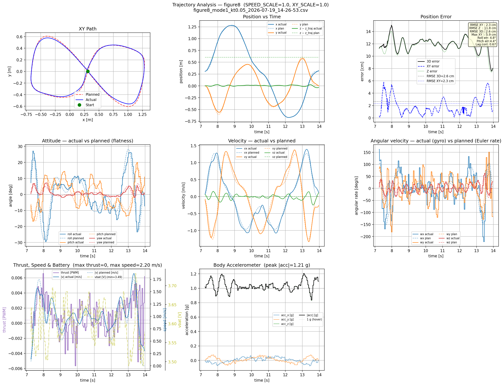

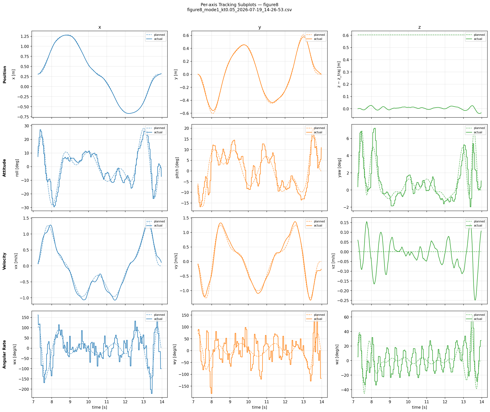

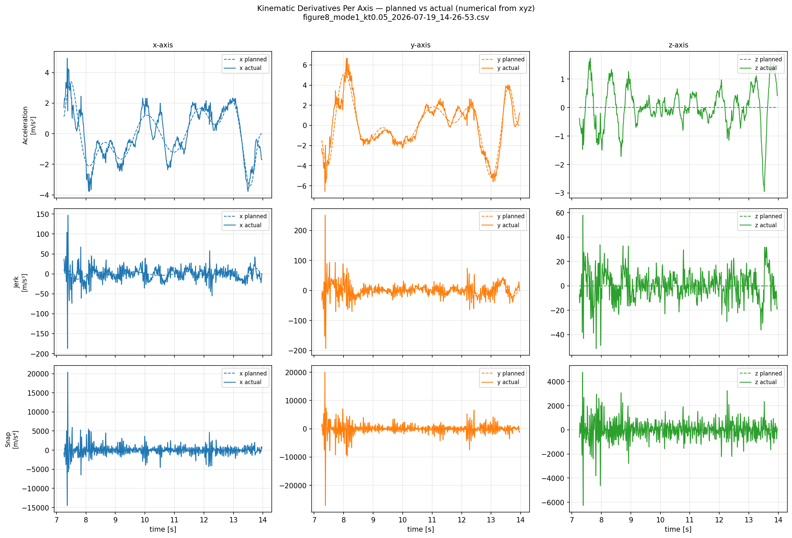

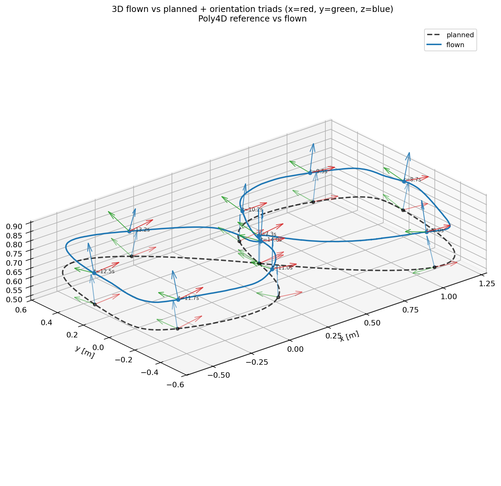

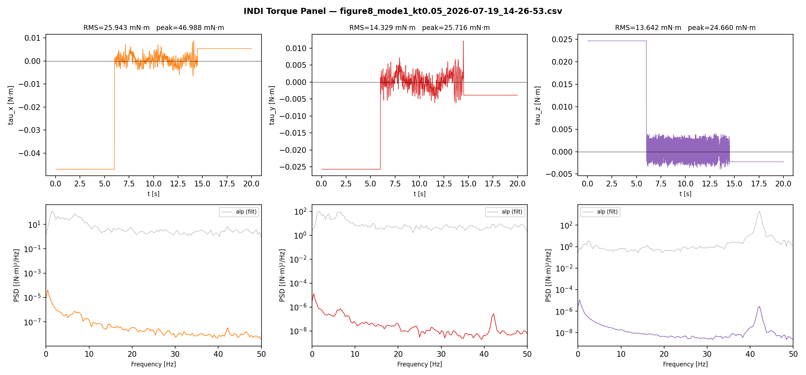

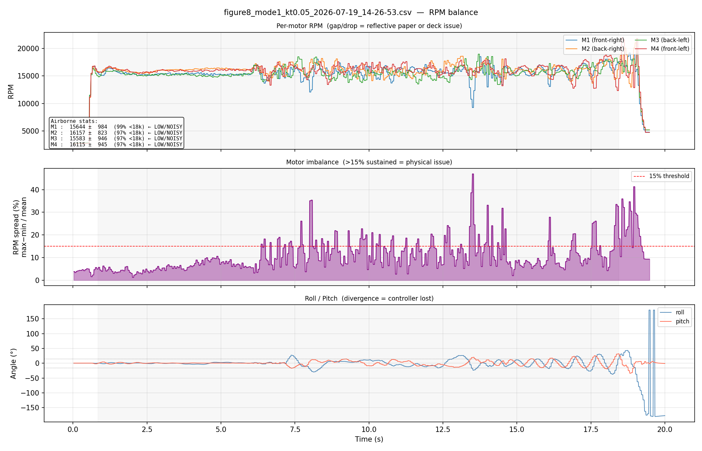

### 5d-validation-fc70. fc_bw=70 re-validation (supervisor request) — 2026-07-20

Supervisor asked for the 5d-validation batch to be repeated with `fc_bw=70` (up from the locked
`fc_bw=60`), to confirm empirically what §5e's lever table already predicted from the §4b sweep
(fc_bw flat across 20-100Hz, cliff only below 20Hz). Same config otherwise: `kr=2400/kw=170/
kp_xy=64/kv_xy=5`, figure8 mode1 kt=0.05.

14 flights recorded across two batches; 1 excluded (`17-23-56` — aborted early, log ends at
8.6s total with only 1.6s of the 6.88s lap captured before landing, same pattern as the "tail of
goTo transient" exclusion earlier in this doc). 13 valid flights:

| Time | RMSE (cm) | Roll err (°) | Pitch err (°) |
|---|---|---|---|
| 17-25-21 | 2.5 | 4.7 | 3.9 |
| 17-26-56 | 2.4 | 4.7 | 3.5 |
| 17-27-26 | 2.2 | 4.9 | 3.2 |
| 17-27-58 | 2.6 | 4.9 | 4.4 |
| 17-28-29 | 2.5 | 5.4 | 4.3 |
| 17-30-06 | 2.3 | 5.5 | 4.1 |
| 17-31-06 | 2.5 | 5.9 | 3.8 |
| 17-31-47 | 2.5 | 6.9 | 4.4 |
| 17-32-47 | 2.5 | 6.1 | 4.5 |
| 17-33-28 | 2.4 | 5.7 | 4.5 |
| 17-43-21 | 2.5 | 6.1 | 5.8 |
| 17-46-33 | 2.3 | 5.9 | 5.4 |
| 17-47-29 | 2.6 | 5.0 | 5.0 |
| **Mean** | **2.45** | **5.52** | **4.37** |
| **Std** | **0.12** | **0.64** | **0.70** |

A naive z-score check on this batch flags `17-27-26` (2.2cm, z=−2.14) as a statistical outlier —
but it's simply the best-tracking flight in a tightly clustered sample (std=0.12cm, so any point
0.25cm off trips a |z|>2 threshold), not a flight anomaly like the aborted `17-23-56`. Kept in.

**Confirms fc_bw=70 is statistically indistinguishable from fc_bw=60** (2.45cm±0.12 vs
2.48cm±0.14 — well within each other's spread, RMSE span 2.2-2.6cm here vs 2.3-2.7cm at fc_bw=60).
This corroborates the §4b/§5e finding that fc_bw is flat across 20-100Hz rather than discovering
new sensitivity. Roll/pitch tracking error is also comparable (5.52°/4.37° vs 5.27°/4.88° at
fc_bw=60) — no meaningful difference in either direction.

#### Best flight — `17-27-26` (RMSE 2.2 cm, Roll err 4.9°, Pitch err 3.2°, lowest RMSE of the fc_bw=70 batch)

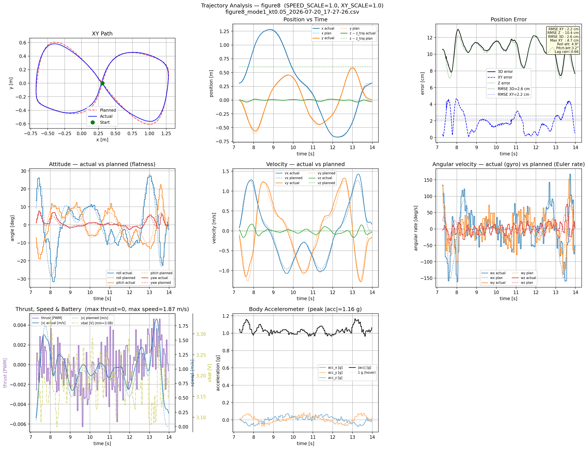

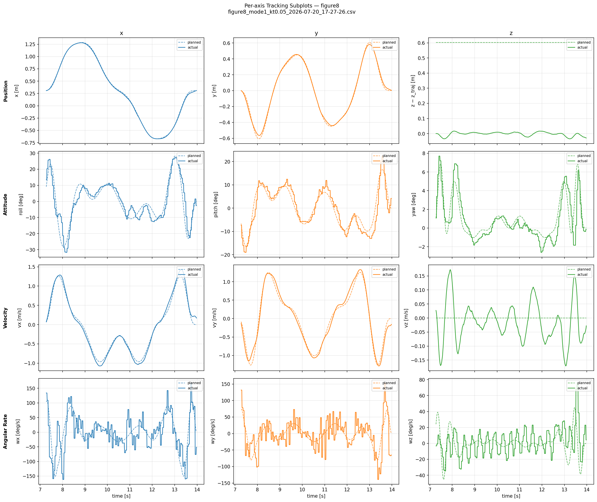

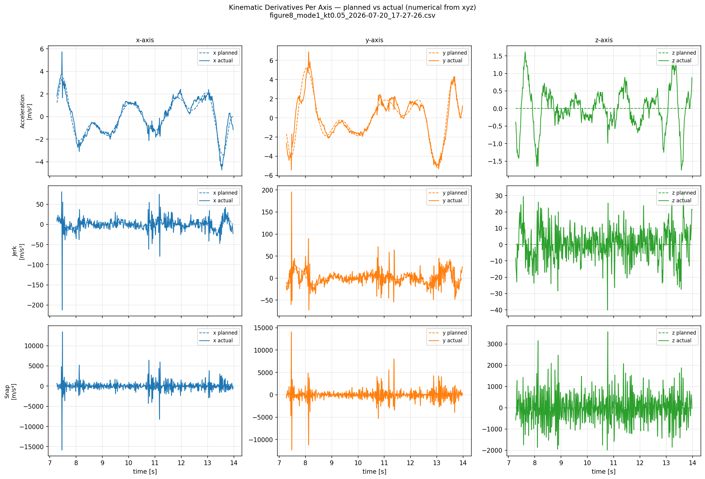

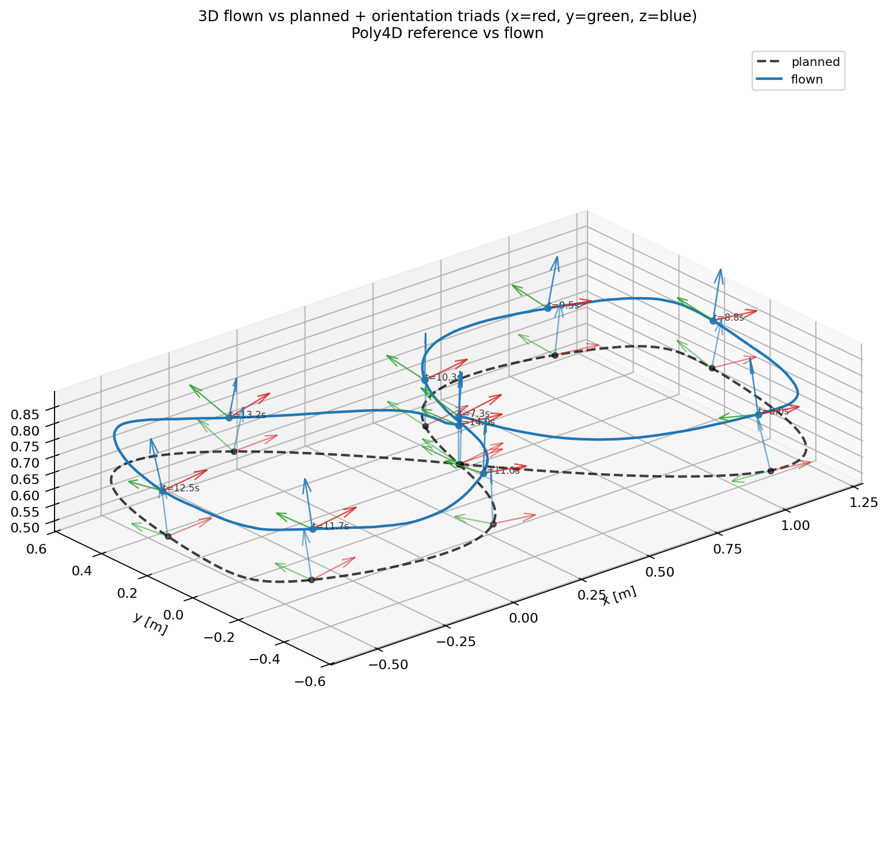

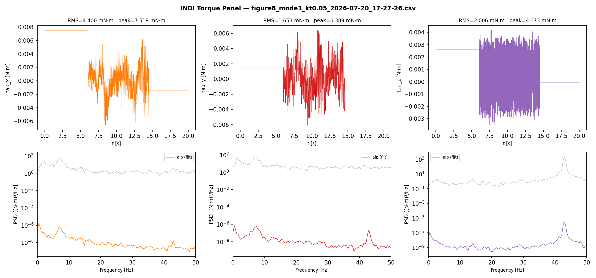

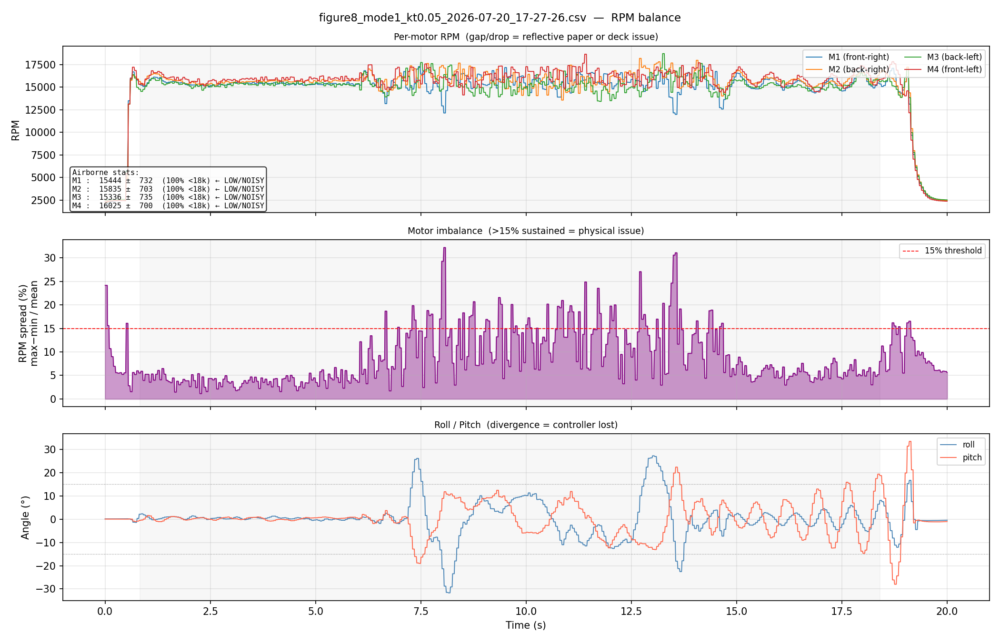

### 5e. Levers exhausted — full checklist before locking in

| Lever | Status | Notes |
|---|---|---|
| kr/kw coupled ratio | ✅ exhausted | ceiling at kr≈2400-2600 (hover), no attitude gain |
| kw decoupled from kr | ✅ exhausted | floor at kw=130 (crash) |
| kv decoupled from kp | ✅ exhausted | floor at kv=4 (crash) |
| fc_bw | ✅ exhausted (§4b, prior session) | flat 20-100Hz, cliff <20 |
| filt_order (paper-order diff) | ✅ tested | no effect in useful range, kept on (correct-regardless) |
| filt_tau (phase-matched increment) | ✅ tested | no effect alone, kept on (correct-regardless) |
| j_scale (inertia) | ✅ ruled out | J confirmed correct via TLS regression (24e-6 ≈ firmware) |
| torque_ratio | ✅ fixed | yaw-only, not roll/pitch relevant |
| ff_free (RPM feedback path) | ✅ ruled out | H1a test, no effect |
| kr_z/kw_z, kp_z/kv_z (yaw/altitude) | ⬜ never decoupled | always scaled with xy; low priority, XY is the tracked metric |
| **`ENABLE_GYRO_FB_FILTER`** | ⬜ **never tried** | filters `omega_fb` used in `KW·e_omega` — the exact noise path §5b just proved matters. Could allow HIGHER kw (more damping margin, avoiding the kw=130 cliff) while still cutting noise. Needs reflash. **Most promising remaining lever if more headroom is wanted.** |
| Physical vibration reduction (props/bearings/mounts) | ⬜ **never done** | the actual root cause (§4b-spectrum, 3-5× vibration vs standard drone). Would lower the whole tradeoff curve and raise both crash floors — the only lever that removes the ceiling rather than finding it. |
| kt (trajectory speed) | ⬜ not yet explored | separate axis — §4c below, next phase, not a gain lever |

**Conclusion: all gain/filter levers on the current airframe are exhausted — this is the real
ceiling for INDI gains alone.** Two untried items remain if more performance is wanted before
moving on: `ENABLE_GYRO_FB_FILTER` (firmware, quick) and physical vibration reduction (mechanical,
slower but addresses the actual root cause). Neither is required to proceed — the locked config
already beats the original 4.2 cm target substantially.

**Recommendation: proceed to the 10-flight validation at the locked config (5d).** If those 10
flights are all clean (no repeat of the kw=130/kv=4 failure signature), the config is done. Revisit
`ENABLE_GYRO_FB_FILTER` or vibration reduction only if you want to push further afterward.

### 5f. Session end 2026-07-19 — pick up here next time

Gain tuning is DONE (§5d, validated §5d-validation, mean RMSE 2.48cm±0.14, n=12). Locked config is
live in `crazyflies.yaml`, no reflash needed to continue. **Correction: this project flies Mode D**
(`onboard_*` binaries, 500 Hz onboard poly eval, optical flow) — not Mode E/CS2. 11 trajectories
already exist as `onboard_*.rs` binaries in `src/bin/`, all ready to fly now, no new code needed:
`onboard_figure8` (validated, 2.48cm), `onboard_circle`, `onboard_helix`, `onboard_loop`,
`onboard_corkscrew`, `onboard_corner`, `onboard_flip`, `onboard_immelmann`, `onboard_roll`,
`onboard_screw`, `onboard_splits`.

| # | Step | Command | Status |
|---|------|---------|--------|
| 1 | kt speed sweep on figure8, locked gains | `cargo run --release --bin onboard_figure8 -- --mode 1 --kt 0.01/0.03/0.05(done,2.48cm)/0.10/...` — repeat `results_2026-06-20.md` §5 methodology | ⬜ next |
| 2 | Record the tracking wall (kt where RMSE/roll/pitch spike before crash) | same binary, watch RMSE + peak roll/pitch + lap time | ⬜ |
| 3 | kt sweep on circle | `cargo run --release --bin onboard_circle -- --mode 1 --kt ...` (ref table: kt=0.1 in usage docstring) | ⬜ |
| 4 | kt sweep on helix, loop | `onboard_helix -- --mode 1 --kt ...`, `onboard_loop -- --mode 1 --kt ...` | ⬜ |
| 5 | kt sweep on corkscrew, corner | `onboard_corkscrew -- --mode 1 --kt ...`, `onboard_corner -- --mode 1 --kt ...` | ⬜ |
| 6 | Aggressive fixed-shape maneuvers (own param, not `--kt`) | `onboard_flip -- --tflip ...`, `onboard_roll -- --troll ...`, `onboard_immelmann -- --radius/--tloop/--troll`, `onboard_screw -- --dz/--tscrew`, `onboard_splits -- --radius/--tloop/--troll` | ⬜ |
| 7 | Accel-pinned aggressive maneuvers (§4d) | `SplineTrajectory::plan_with_accel_pins()`, e.g. teardrop loop — new code beyond the existing onboard_* set | ⬜ after speed ceilings known (steps 1-6) |
| — | Optional, if more attitude headroom wanted later | `ENABLE_GYRO_FB_FILTER` (reflash) or physical vibration reduction (props/bearings/mounts) | ⬜ not required, §5e |

### 4c. After the oscillation is resolved — trajectories + kt speed sweep

Once full-INDI attitude is clean, THEN proceed to performance/aggression:
1. kt speed sweep at locked gains (below) — find the tracking wall.
2. Other trajectories (circle, helix, loop) at increasing kt.
3. Accel-pinned aggressive maneuvers (§4d).

Once 4b settles, repeat the standard-drone kt sweep (`results_2026-06-20.md` §5) at the locked
gains: kt = 0.01 → 0.03 → 0.05 → 0.10 → ... , tracking Phase XY RMSE + peak roll/pitch + lap time.
Expect the same shape — clean tracking up to some kt, then a wall where roll/pitch error climbs
sharply before an outright crash (standard drone: clean to kt=0.05, barely holding at kt=0.10,
crash by kt=0.6). Record the wall precisely; that kt is the speed ceiling for the locked gains.
Pushing past the wall requires retuning attitude/position for the new demanded bandwidth — don't
retune preemptively.

### 4d. After the speed ceiling is known — accel-pinned aggressive maneuvers (Phase 4, slide 20)

`SplineTrajectory::plan_with_accel_pins()` (see root `CLAUDE.md`) is implemented and explicitly
requires the brushless platform's higher thrust/ω ceiling — now unblocked since INDI hover +
figure-8 are stable on CF21BL. Sequence this **after** 4c: accel-pinned segments (e.g. teardrop
loop, a_z=-1.5g at apex) demand more thrust margin than any kt figure-8, so a characterized speed
ceiling should exist before adding pinned-attitude segments on top of it.

---

## 6. Five-way comparison — Standard Geometric / Standard INDI / Upgraded INDI / Brushless INDI (fc_bw=60) / Brushless INDI (fc_bw=70)

Extends the original `results/indi_commissioning/geo_vs_indi.png` (standard drone, geometric vs
INDI, n=10 each) to include the upgraded and both brushless full-INDI validation runs. All
figure-8, `kt=0.05`, phase-aligned XY RMSE. The two brushless columns are otherwise identical
config (`kr=2400/kw=170/kp_xy=64/kv_xy=5`) — only the INDI filter cutoff differs, isolating its
effect from everything else.

| Config | n | Mean RMSE | Std | vs Standard Geometric |
|---|---|---|---|---|
| Standard Geometric | 10 | 6.14 cm | 0.52 | baseline |
| Standard INDI | 10 | 3.87 cm | 0.24 | −37% |
| Upgraded INDI | 11 | 3.72 cm | 0.21 | −39% |
| Brushless INDI (fc_bw=60) | 12 | 2.48 cm | 0.13 | −60% |
| **Brushless INDI (fc_bw=70)** | **13** | **2.45 cm** | **0.12** | **−60%** |

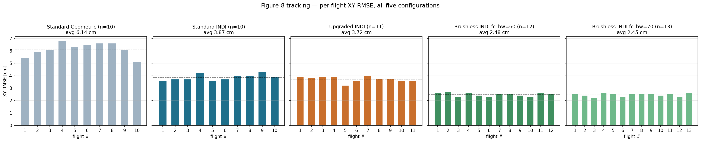

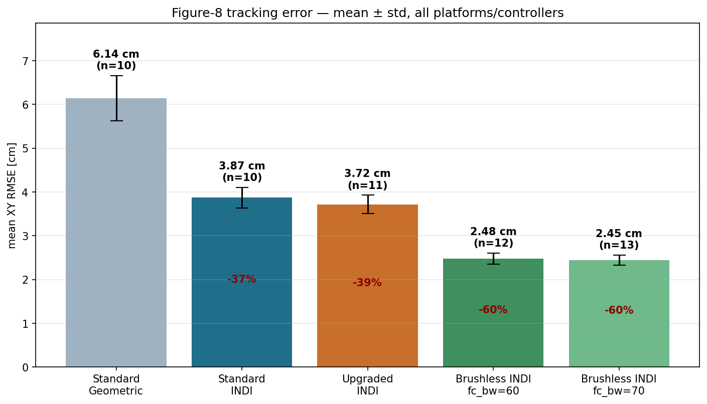

The fc_bw=70 column is statistically indistinguishable from fc_bw=60 (§5d-validation-fc70) —
confirms the filter cutoff is not a lever that moves this number, consistent with §4b/§5e's
flat-20-100Hz finding.

Generated by `scripts/plot_5way_comparison.py`. Source data: `results_2026-06-20.md` §4 (standard),
`results_2026-07-11_upgraded_drone.md` §8 (upgraded), §5d-validation and §5d-validation-fc70 above
(brushless).

---

## 7. Per-flight tracking comparison — planned vs. actually-flown, side-by-side across platforms

§6 shows *how much* error each platform has (a single scalar per config). This section shows
*what the tracking actually looks like* — the exact same 6 panel types `analyze_flight.py`
already produces for a single flight (`_analysis.png`, `_analysis_axes.png`,
`_analysis_kinematics.png`, `_3d_orientation.png`, `_indi_panel.png`, `_rpm_balance.png`), each
generalised so all 4 platforms are overlaid on shared axes instead of one PNG per flight.
Standard Geometric / Standard INDI / Upgraded INDI / Brushless INDI — brushless uses fc_bw=70
only (§6 already established fc_bw is not a meaningful lever, so one brushless config keeps the
comparison to a clean 4-way rather than 5).

**Method**: for each platform, both the *best* (lowest-RMSE) and the flight closest to that
platform's *mean* RMSE were pulled from the existing validated batches (§4 in
`results_2026-06-20.md` for standard, §8 in `results_2026-07-11_upgraded_drone.md` for upgraded,
§5d-validation-fc70 above for brushless) — best-flight alone can flatter a platform, mean-closest
is the more representative pick, so both are shown rather than choosing one.

| Platform | Best flight (RMSE) | Mean-closest flight (RMSE) |
|---|---|---|
| Standard Geometric | `2026-06-20_15-18-49` (5.1 cm) | `2026-06-20_15-17-27` (6.1 cm) |
| Standard INDI | `2026-06-20_14-49-59` (3.6 cm) | `2026-06-20_15-01-32` (3.9 cm) |
| Upgraded INDI | `2026-07-15_16-33-19` (3.2 cm) | `2026-07-15_16-34-53` (3.7 cm) |
| Brushless INDI (fc_bw=70) | `2026-07-20_17-27-26` (2.2 cm) | `2026-07-20_17-28-29` (2.5 cm) |

The standard-drone filenames were not originally recorded in `results_2026-06-20.md` (only
"Flight 1–10" with no traceable log) — resolved 2026-07-21 by filtering the day's logs to the
correct `ctrl_mode`/gains, recomputing RMSE with the current `analyze_flight.py`, and matching
against the published per-flight values in order; all 20 (10 INDI + 10 geometric) reproduced
exactly, confirming the analysis pipeline is unchanged since June. `results_2026-06-20.md` §4a/§4b
now carry these filenames permanently.

### Best-flight comparison

**Main dashboard** (XY path, position/error vs. time, attitude, velocity, angular rate, thrust
& speed, body accelerometer, metrics table — 9 panels, same layout as `_analysis.png`):

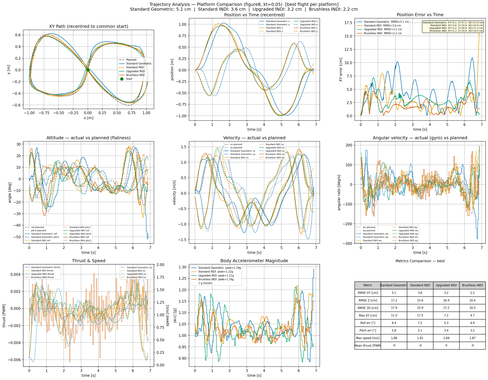

**Interactive version**: [platform_compare_best_analysis_interactive.html](platform_compare_best_analysis_interactive.html)
— same 9 panels, but zoomable/pannable and every platform can be toggled on/off by clicking its
legend entry (toggles that platform across all panels at once). Useful once tracks overlap too
closely to read in the static PNG. Mean-closest variant:
[platform_compare_mean_analysis_interactive.html](platform_compare_mean_analysis_interactive.html).

**Per-axis subplots** (position/attitude/velocity/angular-rate x/y/z, same layout as
`_analysis_axes.png`):

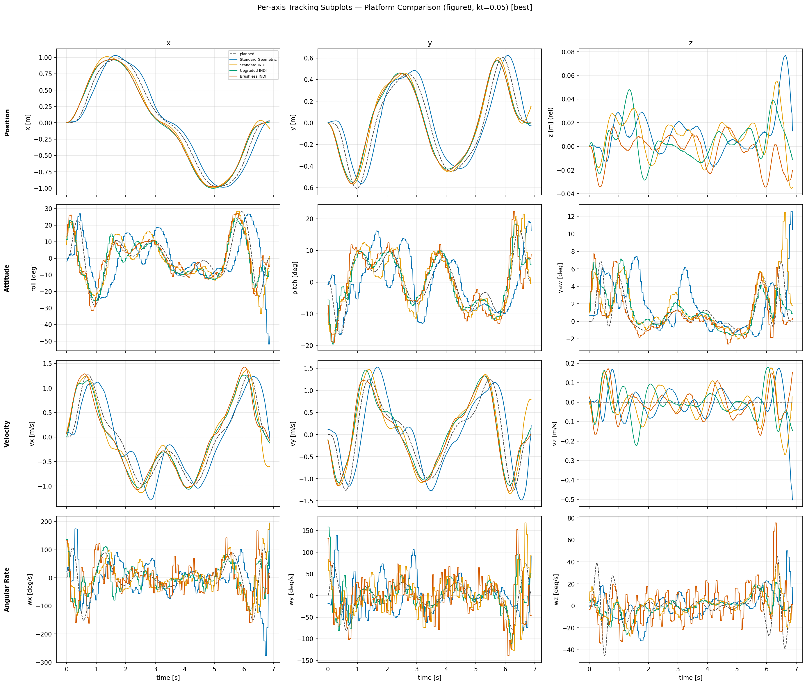

Interactive: [best](platform_compare_best_analysis_axes_interactive.html) /
[mean](platform_compare_mean_analysis_axes_interactive.html)

**Kinematic derivatives** (acceleration/jerk/snap x/y/z, planned vs. actual, same layout as
`_analysis_kinematics.png`):

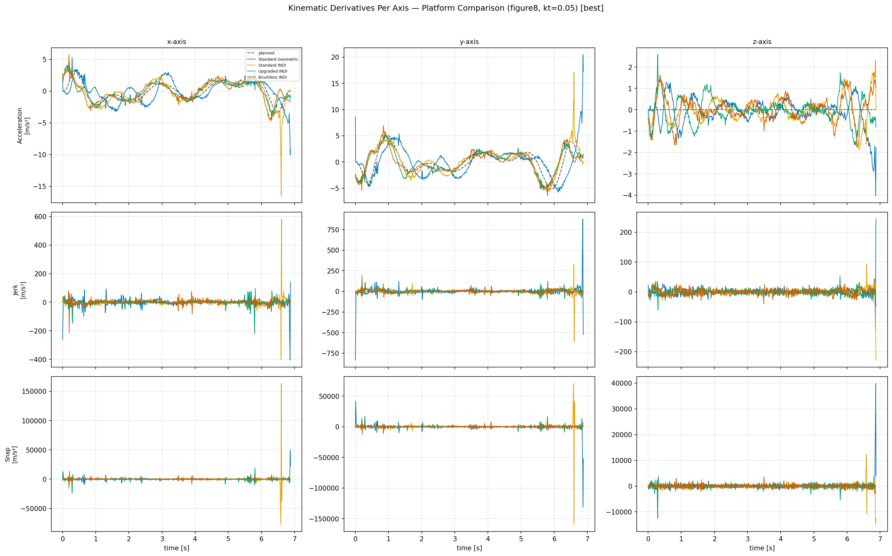

Interactive: [best](platform_compare_best_analysis_kinematics_interactive.html) /
[mean](platform_compare_mean_analysis_kinematics_interactive.html)

**3D path + orientation triads** (same layout as `_3d_orientation.png`):

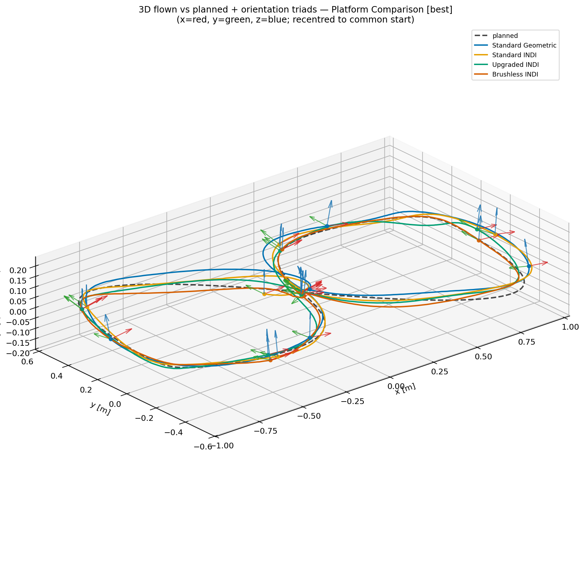

Interactive: [best](platform_compare_best_3d_orientation_interactive.html) /
[mean](platform_compare_mean_3d_orientation_interactive.html) — drag to orbit in 3D, scroll to
zoom, click legend to toggle a platform (the static PNG is locked to one viewing angle; this is
the one where interactivity helps most).

**INDI torque panel** (tau_x/y/z time series + PSD; Standard Geometric has no INDI telemetry and
is skipped, noted on the figure — same layout as `_indi_panel.png`):

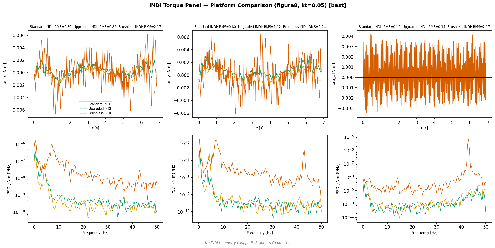

Interactive: [best](platform_compare_best_indi_panel_interactive.html) /
[mean](platform_compare_mean_indi_panel_interactive.html)

**RPM balance** (per-motor RPM faceted one column per platform, RPM-spread% and roll/pitch
overlaid across platforms — same layout as `_rpm_balance.png`):

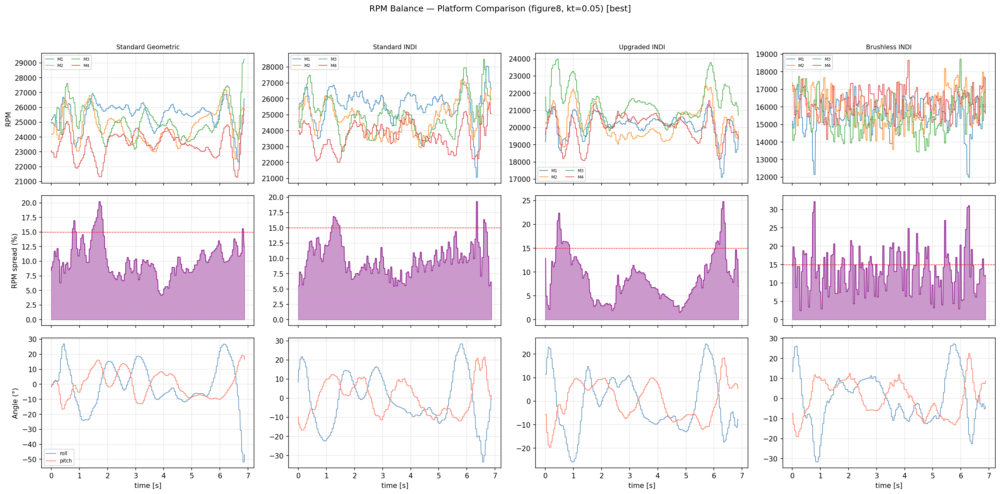

Interactive: [best](platform_compare_best_rpm_balance_interactive.html) /
[mean](platform_compare_mean_rpm_balance_interactive.html)

### Mean-closest-flight comparison

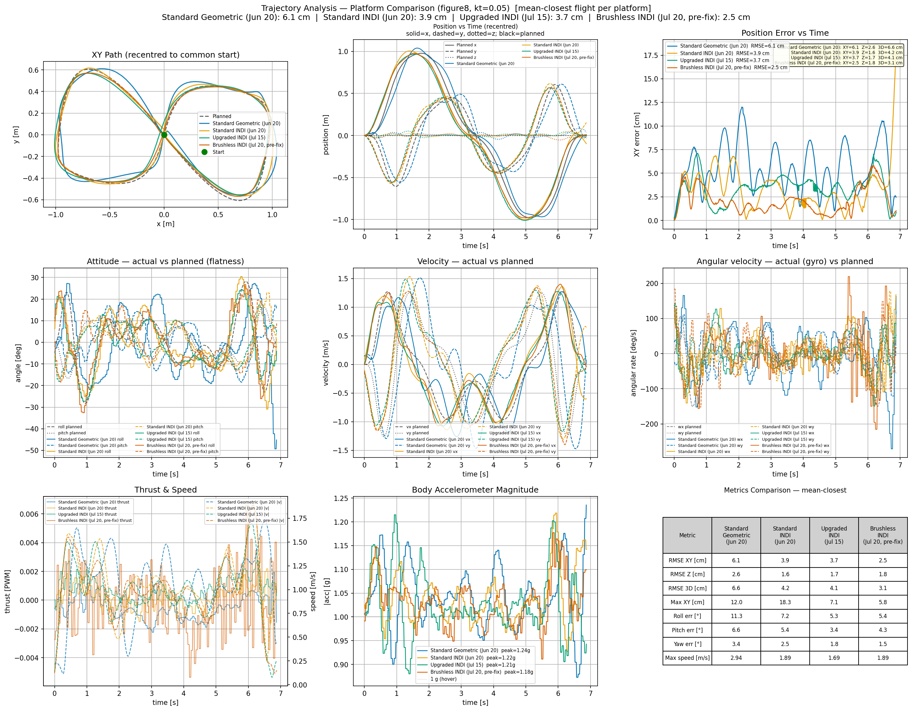
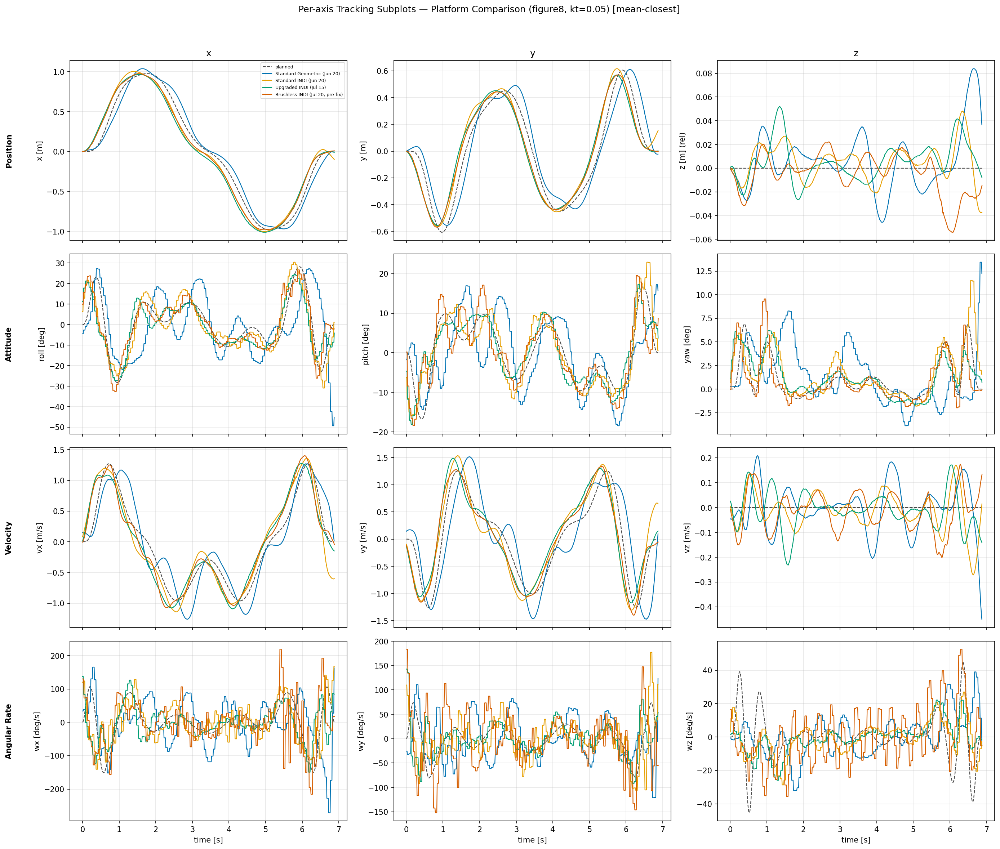
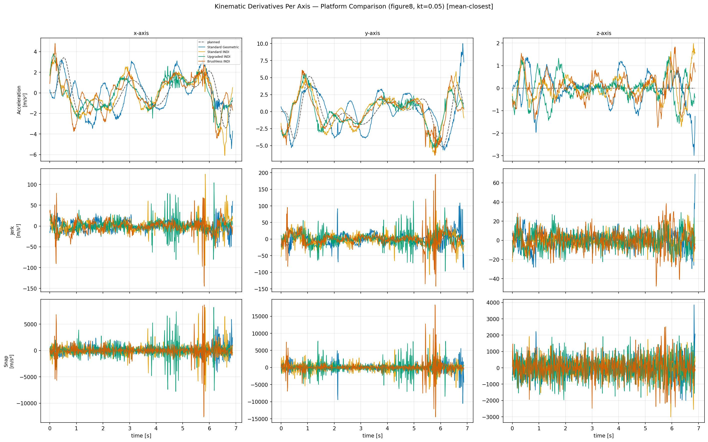
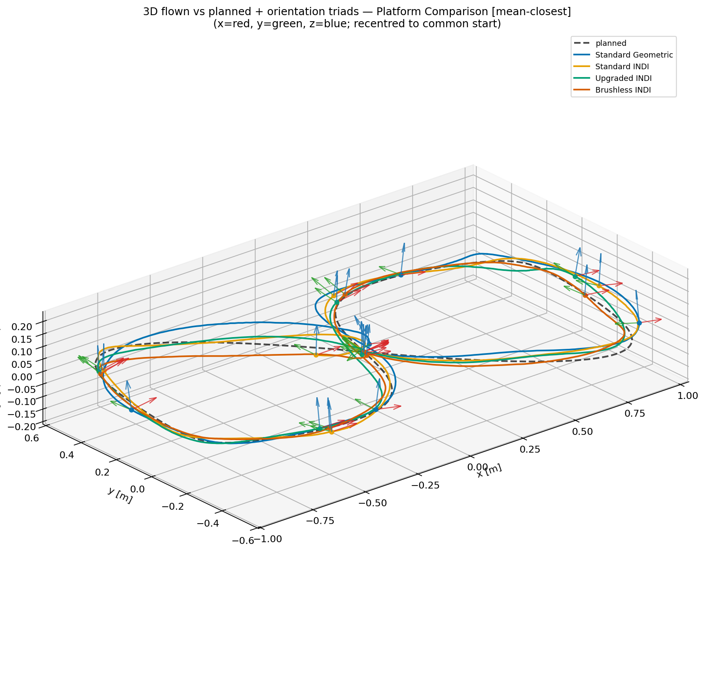
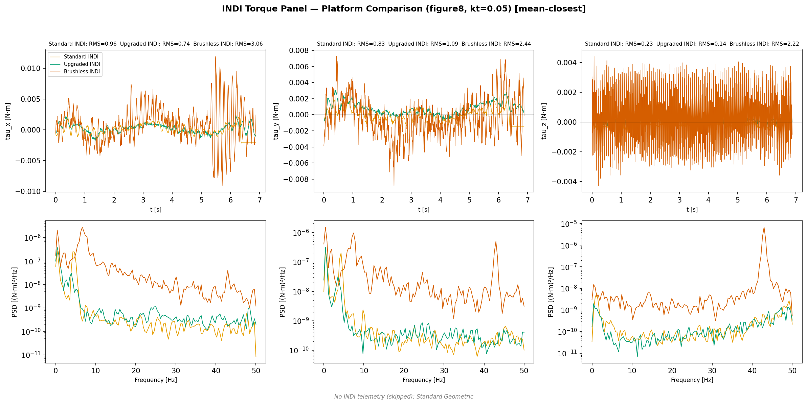
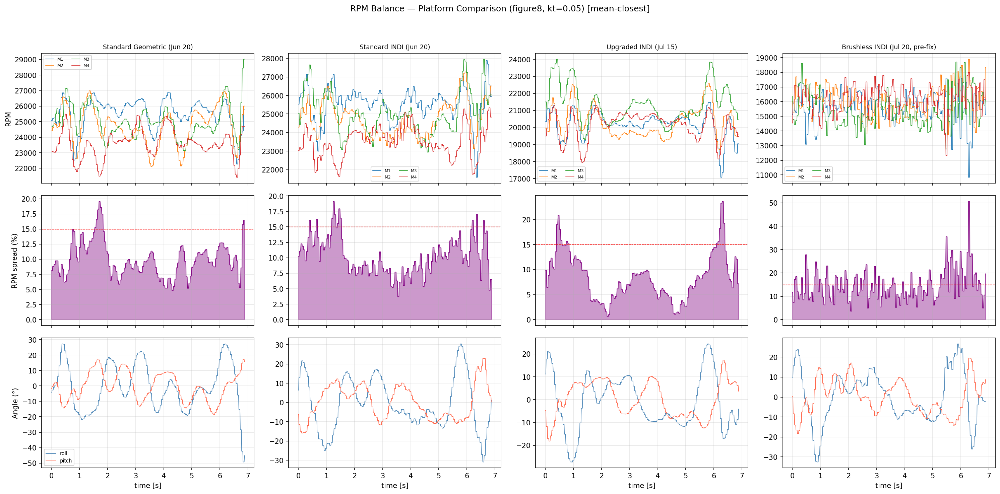

(Interactive links for the mean-closest variant are listed alongside each best-flight panel
above.)

Both variants show the exact same 6 panel types as a single-flight analysis, generalised to N=4
platforms on shared axes (one shared dashed "planned" reference per panel, since the trajectory
is identical across platforms; XY/3D positions recentred to a common start so between-session
origin offsets don't appear as part of the trajectory shape — RMSE/error values are computed
from the true, un-recentred positions beforehand, so recentring is visualisation-only).
Progression is visually consistent with §6's scalar summary — geometric visibly wanders furthest
from the planned path, each INDI platform tracks tighter than the last, brushless tightest of
all — but the per-flight view additionally shows *where* along the figure-8 each platform loses
the most ground (the sharp direction-reversal at the origin crossing, consistently, across all
platforms), how attitude-tracking noise differs in character (not just magnitude), and — via the
INDI/RPM panels — that brushless's tighter tracking comes with visibly higher-frequency
torque/RPM activity than the other INDI platforms.

RMSE Z in the metrics table intentionally replicates a quirk of the established single-flight
pipeline: the onboard degree-8 reference has no Z component, so "planned Z" is a constant
placeholder (mean of the flight's own logged Z), and the Z-RMS window differs slightly from the
phase-calibrated XY-RMS window — this is why RMSE Z is noticeably larger than RMSE XY/3D for
every platform. It is not a new-code bug; it matches `_analysis.png`'s box exactly (verified
against the single-flight pipeline: 10.4 cm for the brushless-best file, both ways).

**Phase-calibration bug fixed 2026-07-21** (caught by visual review of the per-axis plots): the
shared "planned" dashed line in the attitude/velocity/angular-rate/position-vs-time panels was
initially built from Standard Geometric's own `dt_cal` phase-alignment correction (each
platform's onboard8 reference match is phase-calibrated independently — Standard Geometric
`dt_cal=-130ms` vs. `+160..+180ms` for the three INDI platforms here, a ~300ms spread). Reusing
one platform's calibrated reference as "the" planned curve for every platform biased the visual
comparison in that platform's favour — Standard Geometric's actual trace naturally hugged a
reference tuned to its own lag, making it *look* like the best tracker in these panels while the
RMSE table (computed independently, correctly, per platform) showed it as the worst. Fixed by
adding uncalibrated (`dt_cal=0`) reference fields and using those for every shared "planned"
overlay instead — the XY-path panel was never affected (it already used the phase-independent
dense polynomial curve). All 6 panel types, both static and interactive, both `best`/`mean`
variants, regenerated after the fix; RMSE numbers themselves were never affected (metrics are
computed from each platform's own correctly-calibrated reference, independent of what's drawn).

**Generated by**: `Controls/analyze_flight.py --platform-compare best` /
`--platform-compare mean` (new mode added 2026-07-21, purely additive — the existing
single-flight and 2-flight `--compare` paths are untouched and were verified byte-identical
before/after this change). Each of the 6 panel types now also writes an interactive Plotly
`.html` alongside its static PNG (added 2026-07-21) — same data, same colours, but zoomable/
pannable with click-to-toggle-platform legends; requires `pip install plotly` in the
`flying_robots` pyenv (already done in this environment).

---

## 8. USD (SD-card) 500Hz diagnostic session — 2026-07-23

First usable capture from the SD-card diagnostic plan in
`investigation_indi_oscillation_2026-07-21.md` §16.5. Two earlier attempts produced no usable
data: attempt 1 only captured a hard crash (oval, kt=0.5 — well above the documented kt ceiling
of ~0.3-0.5; z dove to -5.5m, gyro hit 1096 deg/s) and even that had `stabilizer.roll/pitch`
silently dropped because a 24-variable config exceeded the firmware's hard cap of
`MAX_USD_LOG_VARIABLES_PER_EVENT = 20` (`usddeck.c:93`) — the last 4 lines of the config file are
silently discarded past slot 20, no error. Attempt 2 logged nothing at all across two more
flights; root cause was never confirmed but resolved after reseating the USD deck connector
(plausibly jarred loose by the attempt-1 crash) — `tools/check_usd_deck.py` (read-only param-TOC
probe, no motors) confirmed `usd.logging` toggles cleanly before the successful flight.

Config fixed to the original 20-variable set (`tools/usd_indi_diagnostic_config.txt`): gyro.x/y/z,
indi.tau_x/y, indi.alp_x/y, indi.alp_raw_x/y, motor.m1-4, rpm.m1-4, motor.m1_rpm,
stabilizer.roll/pitch — all present in the successful capture, confirmed true 500 Hz (506.1 Hz
measured) rate, no radio decimation.

**Capture**: hover, brushless CF21BL, kr=2400/kw=170/fc_bw=70 (current flown gains),
`hover_mode0_2026-07-23_17-55-21.csv` on the radio side, 27.0s trajectory / 30.4s SD-active
window, 500Hz throughout. Steady-state analysis window t=7-25s (excludes arm/land transients).

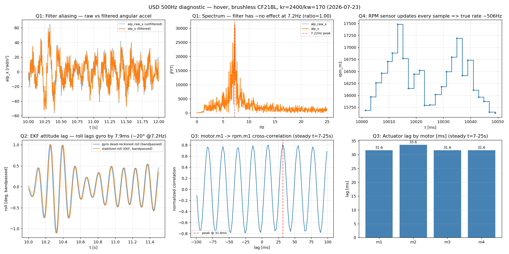

**Dominant shake frequency this flight: 7.22 Hz** (vs the previously logged ~6.3 Hz — same
phenomenon, some session-to-session variation in exact frequency).

### Answers to the four §16.5 questions

1. **Filter aliasing — REFUTED as an artifact, underlying finding confirmed.** `|alp_filt|/|alp_raw|
   = 1.000`, phase shift only -2.1° at 7.22 Hz, measured at the true 500 Hz rate with zero alias-fold
   risk. The "filt/raw≈1" result from the earlier 100 Hz log was **not** a decimation artifact — the
   filter genuinely does nothing to the 6-7 Hz oscillation content.

2. **EKF attitude phase lag — real, but modest.** `stabilizer.roll` (the exact signal feeding `eR`)
   lags gyro dead-reckoning by **7.9 ms** at 7.22 Hz (~20° of phase). Confirms the kr≈600-gap
   candidate mechanism is real and measurable, but 20° is an order of magnitude smaller than the
   actuator lag below — likely a contributing factor rather than sufficient on its own to explain
   the full desync. Does not by itself resolve the kr≈600 gap.

3. **In-flight actuator lag — confirmed, trap-free.** `motor.mX` → `rpm.mX` lag is **31.6-33.6 ms
   across all 4 motors** (cross-correlation peak, steady-state window), consistent and repeatable.
   This measurement is free of the closed-loop `-1/C` bias (§15.2) since neither signal is derived
   from inside the running control loop — confirms the bench-measured actuator lag (44 ms,
   single-motor static rig) holds under real 4-motor differential load and aerodynamics, same order
   of magnitude, somewhat faster in flight. Bonus check: `motor_m1_rpm` (DShot) vs `rpm_m1`
   (optical) — 0.0 ms lag, the two RPM measurement paths agree exactly.

4. **True RPM sensor update rate — corrected.** `rpm_m1` changes value essentially every sample
   (median 2.0 ms) → **~506 Hz**, matching the full log rate. Directly refutes the ~20 Hz rate
   inferred in §15.4, which was itself a decimation artifact of the 100 Hz log.

### Additional finding: shake amplitude has a delayed onset, then dominates the hover

Not one of the original four questions, found incidentally: `motor.m1` command std is small
(300-2400, calm) for the first ~5s after arming, then jumps to **~24,000** (out of the 0-65535 PWM
range, ~37% of full range) from t≈7s through t≈25s — i.e. the 7.2 Hz shake is not a constant
low-level background oscillation but a large-amplitude regime that the loop settles into a few
seconds after takeoff and then sustains for essentially the whole hover. Worth folding into the
loop-margin analysis in §16.4/§16.6 (open) — the harmonic-balance argument there assumed a
roughly-constant-amplitude limit cycle; a delayed-onset, high-amplitude regime is consistent with
a genuine limit cycle (amplitude grows from noise to a stable cycle amplitude) rather than a
forced/broadband-driven vibration, which would be expected to look amplitude-stationary from the
moment thrust engages.

### Synthesis — what this means for the shake at kr=2400/kw=170

Putting the four measurements together, quantitatively, for the first time:

- **Resonance match, now measured not just predicted**: §4b-bandwidth predicted ωₙ=√kr should land
  near the vibration band. At kr=2400, ωₙ/2π = √2400/2π = **7.80 Hz** — matches the measured shake
  frequency (**7.22 Hz**) to within 8%. This is the first USD-log confirmation of the resonance
  root cause at the exact gain currently flown, not inferred from a lower-gain example.
- **Actuator lag is the dominant phase-loss term, not EKF lag.** Converting each measured lag to
  phase at 7.22 Hz (phase = delay × f × 360°): actuator lag (31.6 ms) → **82°**; EKF attitude lag
  (7.9 ms) → **20°**. Actuator lag alone accounts for 4× more phase loss than EKF lag at the
  resonant frequency — combined, ~103° of phase is gone before the filter (which does nothing at
  this frequency, fc_bw=70 Hz) gets a chance to help. This re-weights §16.4's kr≈600 gap
  discussion: EKF lag is real but a minor contributor; actuator lag is the dominant, now-quantified
  term.
- **The filter was never going to help.** fc_bw=70 Hz is ~10× the shake frequency — a low-pass
  filter set there passes 7 Hz content essentially unattenuated by construction (ratio=1.00,
  measured). This isn't a bug, it explains *why* lowering fc_bw was the only filter-side lever ever
  worth trying — and why §4b-lowbw-refuted found it made things worse (removing phase margin
  elsewhere without removing the actual limit-cycle energy at 7 Hz, since the cutoff has to get
  close to 7 Hz to matter, which then also delays everything else).
- **Net picture**: this is a genuine self-sustained limit cycle (delayed onset — small for ~5s,
  then jumps to ~37% of full PWM range and stays there — is limit-cycle-like, not a
  constant-amplitude forced vibration), driven primarily by actuator lag interacting with a loop
  tuned to resonate near 7-8 Hz.
- **Correction (operator-raised, 2026-07-23): detuning kr is NOT a viable fix**, on two grounds
  that were already established before this session and are reconfirmed here, not contradicted by
  it. (1) Empirically: kr≈600 (ωₙ=3.9 Hz, well clear of 7.2 Hz) is still shaky per §16.4/§18.4b —
  moving ωₙ away from the resonant frequency does not clear the shake in practice. (2) Structurally:
  §4b-spectrum found the vibration is broadband (3-7× noisier than standard across the WHOLE
  0.3-40 Hz spectrum, no single peak) — there is no quiet frequency band to retune ωₙ into within a
  range that keeps tracking usable. Lowering kr also directly degrades tracking error (operator
  observation), so it is a lose-lose lever, not a real fix path.
- **What to actually try instead** — attack the phase loss and vibration energy, not the loop
  frequency, so tracking performance is untouched: (a) **reduce actuator lag directly** — now the
  dominant phase-loss term (82° vs EKF's 20°) — via faster ESC/motor response (hardware) or a
  delay-compensating term in the INDI law that accounts for the measured ~32 ms lag instead of
  treating actuation as instantaneous (software); (b) **reduce vibration amplitude at the source**
  — prop balancing, motor/frame damping — per §4b-spectrum's original root-cause finding; even with
  the resonance geometrically present, less broadband energy in means a smaller or absent sustained
  limit cycle.

**Generated by**: `tools/analyze_usd_hover_shake.py <log> <out.png>` (uses
`tools/decode_usd_log.py` + `scipy.signal` — Butterworth bandpass, cross-correlation). Not part of
the `analyze_flight.py` pipeline since USD logs are a different rate/format than the radio CSVs.

### 8b. Oval confirmation flight, same session (2026-07-23, log01)

Same physical session, second SD file (`log01`, after a USD-deck dropout mid-session required
another `check_usd_deck.py` reseat check — same firmware cap/toggle behavior as §8, not repeated
here). Four oval attempts at kt=0.5 were flown; only the last (`oval_mode1_kt0.5_2026-07-23_18-17-
55.csv`, 18.4s trajectory, gyro max 1033°/s, `eval_mode=onboard_d`) matches the one captured SD
segment (27.4s active window, gyro max 1080°/s, no zero-thrust dip mid-flight so not the crash from
the first attempt of the four, which showed z diving to -4.09m in its own CSV but only lasted
11.0s — a different, shorter, non-matching segment). As before, only one of several flights per
power session gets captured; not fully root-caused, but not a blocker either since the goal here is
data, not 1:1 accounting of every flight.

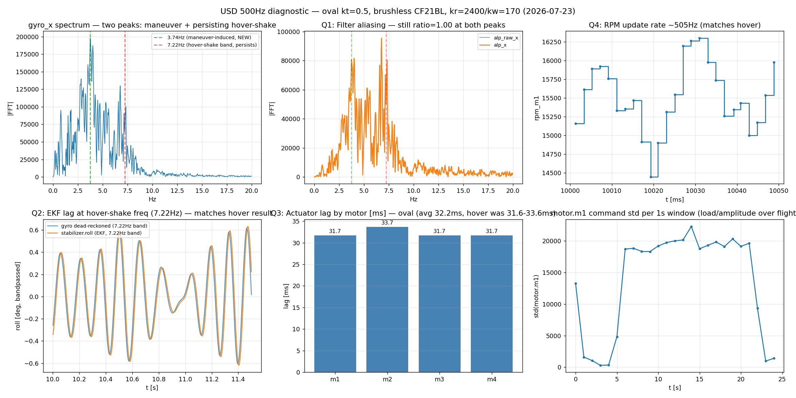

**New finding: two distinct spectral peaks under maneuvering**, where hover only showed one:
- **~3.7-4.0 Hz** — new, not present in the hover capture. Likely maneuver-induced (cornering /
  translational asymmetry during the oval), not the same phenomenon as the hover shake. Filter
  ratio at this frequency is also 1.00 (fc_bw=70 Hz irrelevant here too), EKF lag 5.9 ms (8° — small,
  as expected for a lower frequency and smaller delay-to-period ratio).
- **~6.6-7.3 Hz — the hover-shake band, confirmed to persist unchanged under real maneuvering
  load.** EKF lag at 7.22 Hz: **7.9 ms (20.6°)** — identical to the hover measurement to within
  noise. This is the clean confirmation §16.5 Q3 originally asked for: the mechanism found in hover
  is not a hover-only artifact.

**Actuator lag, the key cross-check**: **31.7 / 33.7 / 31.7 / 31.7 ms** across the 4 motors —
matches the hover numbers (31.6 / 33.6 / 31.6 / 31.6 ms) to within 0.1 ms. Directly confirms the
actuator lag is a fixed physical property of the motor/ESC/prop chain, unaffected by real 4-motor
differential thrust and aerodynamic load during a maneuver. RPM sensor rate also reconfirmed at
~505 Hz, matching hover.

**Amplitude-onset pattern reproduces**: `motor.m1` command std is near-zero for t=1-5s after
takeoff, then jumps to ~19,000-22,000 and sustains through t≈6-21s before landing descent — the
same delayed-onset limit-cycle signature seen in the hover capture (§8), not something specific to
hover thrust trim. Strengthens the genuine-limit-cycle interpretation over a forced/broadband-driven
reading.

**Net**: the hover-derived root-cause story (kr=2400 resonance near 7-8 Hz, actuator lag as the
dominant phase-loss term, filter irrelevant at fc_bw=70) holds unchanged under real maneuvering
load. The oval adds one genuinely new data point — a separate ~3.7 Hz maneuver-induced component —
worth keeping in mind for figure-8/oval-specific tracking-error analysis, but it does not change
the fix priorities identified in §8's synthesis (reduce actuator lag or vibration source, not kr).

---

## 9. Switch to thrust-upgraded drone, 2026-07-23 — trajectory + oval kt sweep

Brushless shake investigation parked (§8/§8b give root cause + candidate fixes, neither
implemented yet — both are hardware-level work, not more gain tuning). Switched to the
thrust-upgraded CF2.1 (`make DRONE=upgrade cload`, yaml swapped to the locked upgraded block:
`ctrl_mode=3, kr=603, kw=90, kr_z=603, kw_z=90, fc_bw=70, mass=0.0386`, pos_gains
`kp_xy=40/kp_z=30/kv_xy=8/kv_z=10` — brushless block fully preserved, commented out, header marked
PARKED with a pointer back here) to make forward progress on the trajectory library while that
investigation waits on hardware changes.

### 9.1 kt=0.05 pass across all 9 trajectories, compared to the brushless baseline (§18 in the
investigation doc)

Crash detection via gyro σ (same method as §18.2's oval table — z diving well below 0 is the
unambiguous tell, corroborated by a jump in gyro σ):

| Trajectory (kt=0.05) | Upgraded gyro σ | Upgraded outcome | Brushless outcome (§18, same kt) |
|---|---|---|---|
| circle | 33.2 | clean | clean |
| **corner** | 113.8 | **CRASH** | clean |
| helix (1st attempt) | 126.8 | **CRASH** | clean |
| helix (retry) | 40.9 | clean | — |
| oval | 36.6 | clean | clean |
| **slalom** | 151.8 | **CRASH** | clean |
| **teardrop_wide** | 228.2 | **CRASH** | **CRASH (already known, unexplained)** |
| tilted_oval | 21.5 | clean | clean |
| figure8 | (see §9.2) | clean | clean |
| hover | 139 (σ, not shown above) | clean | clean |

Battery voltage checked and ruled out as a confound — all crashes and clean flights span
3.74-4.18V at takeoff, no correlation between low battery and crash.

**The upgraded drone (kr=603) crashes on `corner` and `slalom` at the same kt=0.05 that brushless
(kr=2400) flew cleanly.** `teardrop_wide` crashing again matches the known unexplained brushless
issue — not new information, still unresolved, still worth avoiding or treating as high-risk on
any platform until root-caused.

### 9.2 Oval kt sweep — ceiling is LOWER than brushless, not higher

| kt | Upgraded gyro σ | Outcome | Brushless (§18.2) |
|---|---|---|---|
| 0.05 | 36.6 | clean | clean (geometric) |
| 0.1 | 19.8 | clean | — |
| 0.2 (1st) | 37.0 | elevated, survived | completed |
| 0.2 (retry) | 20.0 | clean | — |
| 0.3 | 19.6 | clean | completed |
| 0.4 (1st) | 85.9 | **CRASH** | — |
| 0.4 (retry) | 43.8 | elevated, survived | — |
| 0.5 (×3, every attempt) | 90.7-118.6 | **CRASH every time** | completed (shake rising) |
| 0.6 | 126.2 | **CRASH** | — |
| 0.7 | — | not yet flown | **CRASH** (confirmed) |

**Working ceiling on this platform: ~kt 0.3, marginal at 0.4.** Below brushless's kt 0.3-0.5
range, despite the upgraded drone being calmer at low speed (σ 20-40 for its clean flights, a
comparable-to-slightly-better noise floor than brushless's own clean-flight numbers).

### 9.3 Why: a bandwidth/authority ceiling, not a resonant limit cycle — different failure mode,
not simply "worse tuning"

kr=603 → ωₙ=√603/2π ≈ **3.9 Hz**, vs brushless's kr=2400 → ωₙ ≈ **7.8 Hz** (§8's resonance
finding). The lower bandwidth is *why* the upgraded drone doesn't resonate into a sustained
shake — but it also means less control authority to correct fast enough for sharp direction
changes (`corner`'s lap time was only 2.48s at kt=0.05 on brushless — inherently aggressive
regardless of the kt label) or for oval beyond ~kt 0.3. The crash signature supports this: hard,
sudden failures (z diving, gyro spiking) rather than a growing oscillation — consistent with a
tracking-authority ceiling being exceeded outright, not a limit cycle building up. kr=603/kw=90
was only ever validated against gentle figure8/hover tracking (§ "CF2.1 UPGRADED MOTORS — locked
Jul 15 2026" block) — never against sharp-cornering trajectories or oval past kt=0.2ish.
**Net: brushless trades a resonant-shake problem for a wider aggressiveness envelope; the upgraded
drone at its current gains trades that shake for a narrower envelope, not a strictly worse (or
better) platform.** Raising kr/kw for the upgraded drone specifically is the natural next lever if
a wider envelope is wanted here, mirroring the same tuning campaign already done for brushless.

### 9.4 Position/attitude tracking comparison — root cause found and fixed, 2026-07-23

§9.4's original suspicion (50-100cm RMSE implausible against a ~1.5m flown path) was correct — two
real bugs in `Controls/analyze_flight.py`, both fixed:

1. **Missing filename inference.** `oval`/`corner`/`slalom`/`tilted_oval`/`teardrop_wide` were never
   added to the trajectory-type inference list — the script hard-exited with "Cannot infer
   trajectory type" before ever reaching the CSV's own `run_trajectory` metadata. Fixed by adding
   the five missing `elif` branches (ordered so `tilted_oval`/`teardrop_wide` are checked before
   their substrings `oval`/`teardrop`).
2. **No phase calibration on the generic Poly4D path.** `figure8` has always computed a lap-window
   phase/time-shift calibration (`calibrate_onboard8_phase`, fit via grid search) before computing
   RMSE — every other type (`circle`, and now `oval`/`corner`/`slalom`/`tilted_oval`) fell through
   to `plot_analysis()` called with **zero** phase alignment: the reference was evaluated at raw
   absolute CSV time, including the takeoff ramp before the trajectory even starts. On a periodic
   path, a real but modest 200-500ms timing offset (probably the real per-flight startup latency —
   `t_shift` after calibration matches this range) puts the "same-time" reference point far around
   the loop, producing exactly the 50-150cm phantom errors this session had been reporting as
   "not trustworthy." Fixed by generalizing the calibrated `figure8` dispatch path to run for **any**
   type with a resolved onboard degree-8 reference (`segs8`), not just figure8 — the underlying
   calibration/geometry helpers (`infer_figure8_eval_window`, `find_figure8_traj_start`,
   `compute_figure8_geom_metrics`, `onboard8_metrics_over_window`) were already fully generic
   despite their figure8-flavored names, just never wired up for other types.
3. **`helix` separately had a third, independent bug**: it used a hardcoded analytic reference
   model (`lap_time=10.5s`) regardless of the actual flown trajectory, which for our kt=0.05 mode1
   export has a real lap of 7.43s. Fixed by only using the analytic path when no matching kt-based
   Poly4D export exists (legacy fixed-parameter Mode B flights); our flights now route through the
   same calibrated path as everything else.

**Verification — circle, before/after the fix:**

| | Before (bug) | After (fixed) |
|---|---|---|
| Upgraded circle RMSE 3D | 100.0 cm | **1.9 cm** (t_shift +230ms) |
| Brushless circle RMSE 3D | 116.7 cm | **1.9 cm** (t_shift +190ms) |

Exactly the "relatively low numbers" expected — confirms the diagnosis.

**Follow-up fix, same session**: the phase-calibration search window (`calibrate_onboard8_phase`)
was itself too narrow — `±0.5s`, and several flights' best-fit shift landed exactly on that
boundary (a `+500ms` result at the edge of a `±500ms` search is a red flag that the true optimum
is outside the searched range, not that 500ms is actually optimal). Widened to `±0.75s`. Effect
differed by case, which is itself informative:
- **`helix` improved on both platforms** (found genuine interior optima ~730-750ms, not boundary
  values) — RMSE XY dropped from 78.1→71.1cm (upgraded) and 56.1→52.8cm (brushless). Still large,
  but now a stable, non-clipped number.
- **`tilted_oval` upgraded still clips at the boundary even at ±0.75s** (tested up to ±1.5s, same
  result) — this is NOT a search-window artifact still masquerading as one; a "phase shift" this
  large stops being a believable constant startup-latency correction. Combined with a clear visual
  tell (see §9.7): the XY-error-vs-time trace shows large excursions recurring roughly once per
  lap (~12s spacing, matching the trajectory's own lap time) with sharp dips back near zero at the
  lap-restart point — a real, localized-in-phase tracking failure during part of each lap (plausibly
  the banked/tilted turn segment, consistent with §9.3's bandwidth-ceiling story), not a fitting
  artifact. The calibration-immune Geom RMSE (shape-only, 11.9cm) already corroborated this before
  the search was even widened. Settled on `±0.75s` rather than continuing to widen — a middle
  ground that fixed the genuine case (helix) without inviting spurious multi-second "alignments."

**Known remaining gap, not fixed this session**: the onboard degree-8 reference (`segs8`) is
XY-only — `resolve_poly4d_from_meta` parses `(duration, cx, cy)` per segment and discards the `cz`
coefficients, even though the exported onboard CSV has them (confirmed: `oval_..._onboard.csv` has
full `cz0-cz8` columns). Z RMSE and 3D RMSE for non-flat trajectories (`helix`, `tilted_oval`) use
a constant mean-z reference, not the true z(t) profile — the script now prints an explicit warning
for these types. XY RMSE, roll, and pitch error are unaffected (they don't depend on the Z
reference).

### 9.5 Full comparison table, both platforms, all common trajectories at kt=0.05

Phase-aligned Onboard8 XY RMSE, using each side's cleanest full (non-truncated, non-crashed) log:

| Trajectory | Upgraded XY RMSE | Upgraded roll/pitch err | Brushless XY RMSE | Brushless roll/pitch err |
|---|---|---|---|---|
| circle | 1.7 cm | 2.1° / 1.8° | 1.9 cm | 1.9° / 1.4° |
| oval | 2.1 cm | 1.7° / 1.3° | 2.3 cm | 2.2° / 2.9° |
| corner | — (crashed) | — | 5.5 cm | 10.7° / 10.0° |
| slalom | — (crashed) | — | 3.6 cm | 6.3° / 6.4° |
| teardrop_wide | — (crashed) | — | 2.4 cm | 3.0° / 6.7° |
| tilted_oval | **116.1 cm** (11.9cm shape-only, boundary-clipped — see §9.4) | 8.2° / 3.0° | 2.1 cm | 2.0° / 1.2° |
| helix | 71.1 cm (43.7cm shape-only) | 5.1° / 3.9° | 52.8 cm (32.0cm shape-only) | 5.5° / 3.4° |

**Where the upgraded drone can complete a trajectory, XY position tracking is essentially tied
with brushless (1.7-2.9cm range for circle/oval both platforms) — this directly contradicts a
"brushless is better everywhere" expectation.** The real platform differentiator remains what §9.1-
9.3 already found: crash ceiling (corner/slalom/teardrop_wide crash on upgraded, fly clean on
brushless), not tracking precision on the maneuvers it *can* fly.

**Two genuine open anomalies, confirmed real after the §9.4 follow-up fix** (both show large error
in the calibration-immune "Geom RMSE (shape only)" metric, and for tilted_oval a direct visual
tell too — see §9.7 — so neither is the phase-alignment bug recurring):
- **`helix` is bad on BOTH platforms** (32-44cm shape RMSE), brushless somewhat better than
  upgraded (52.8 vs 71.1cm phase-aligned, 5.5 vs 5.1° roll — mixed on attitude, clearer on
  position). The XY-path plot (§9.7) shows both platforms flying a visibly smaller-radius loop
  than planned — a real undershoot on this climbing/descending spiral, not a reference artifact.
  This is the one trajectory in this whole session where brushless has a clear, uncontested
  tracking-precision edge, not just an envelope edge.
- **`tilted_oval` is fine on brushless (1.3cm shape RMSE) but bad on upgraded specifically**
  (11.9cm shape RMSE, ~9× worse) — confirmed genuine, not a calibration artifact (§9.4): the error
  recurs periodically at roughly the lap rate, consistent with a real, localized tracking failure
  during part of each lap (plausibly the banked-turn segment), not a fitting artifact. Since the
  same script/reference handles the same trajectory type cleanly on the other platform, this looks
  like a genuine upgraded-drone-specific tracking gap on a maneuver that demands sustained bank
  angle, plausibly connected to the same lower-bandwidth (kr=603) limitation identified in §9.3.

### 9.6 Oval kt sweep, both platforms — position RMSE stays flat until the crash wall

| kt | Upgraded XY RMSE | Upgraded roll/pitch err | Brushless XY RMSE | Brushless roll/pitch err |
|---|---|---|---|---|
| 0.05 | 2.1 cm | 1.7° / 1.3° | 2.3 cm | 2.2° / 2.9° |
| 0.1 | 2.8 cm | 2.3° / 1.5° | — | — |
| 0.2 | 2.9 cm | 3.3° / 1.5° | 2.5 cm | 2.6° / 1.3° |
| 0.3 | 3.0 cm | 3.2° / 1.7° | 2.8 cm | 2.9° / 1.5° |
| 0.4 | 3.2 cm | 4.4° / 2.1° | — | — |
| 0.5 | — (crashed all 3 attempts) | — | 3.1 cm | 5.5° / 2.7° |
| 0.6-0.8 | — (crashed / not flown) | — | — (0.7 crashed, §18.2) | — |

**The headline result: XY position RMSE barely moves (2.1→3.2cm) across each platform's entire
flyable kt range** — attitude error creeps up gradually with kt (more aggressive tracking demand),
but position tracking itself stays excellent right up until the crash wall on both platforms. This
confirms §9.3's picture at the tracking-quality level too: the platforms don't differ in *how well*
they track when they're within their envelope — they differ in *how wide that envelope is*
(brushless flies clean through kt=0.5, upgraded's wall is ~kt 0.3-0.4). "Brushless is better" is
true for aggressiveness ceiling, not for tracking precision.

### 9.7 Side-by-side visual comparison

`--compare` had the same uncalibrated-reference bug as the single-file path (§9.4), plus a second
one: RMSE was averaged over the *entire* flight including the pre-motion/takeoff segment (plan
clamped at reference t=0 while the drone is still at its pre-position point), inflating the number
even after phase calibration was added. Both fixed in `compare_plot()` — per-flight motion-start
detection + phase-shift fit (independently for each side, since they're separate flights with
their own real startup latency), onboard-8 reference when available, and the summary RMSE/roll/
pitch numbers now restricted to the actual lap window (matching `onboard8_metrics_over_window`)
while the full-length error-vs-time traces still show the pre-motion segment for context.

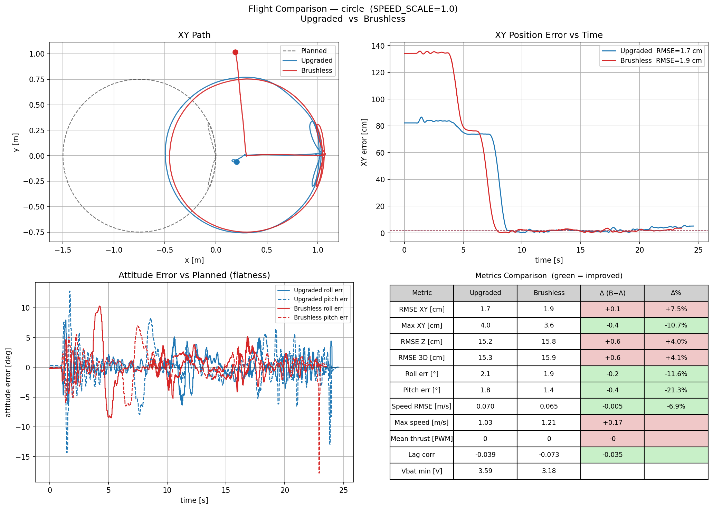

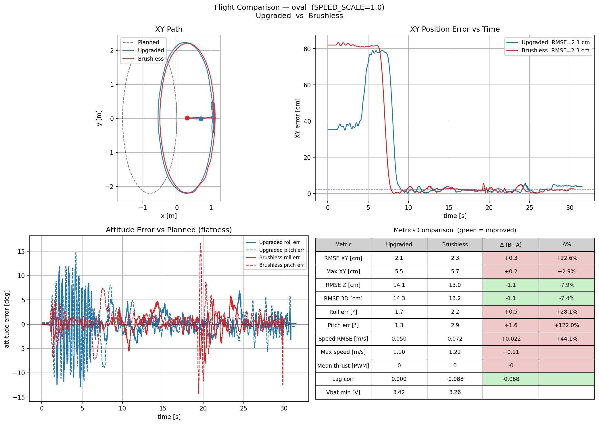

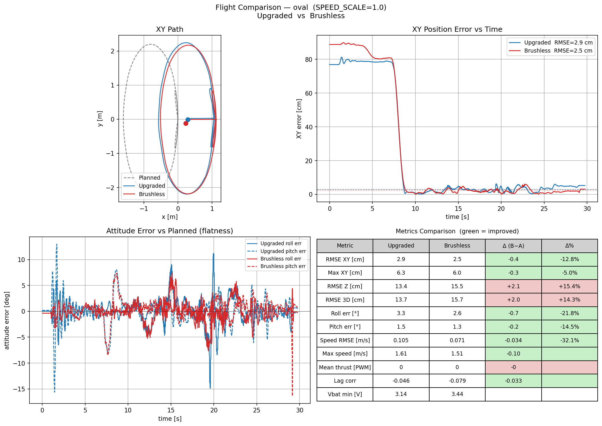

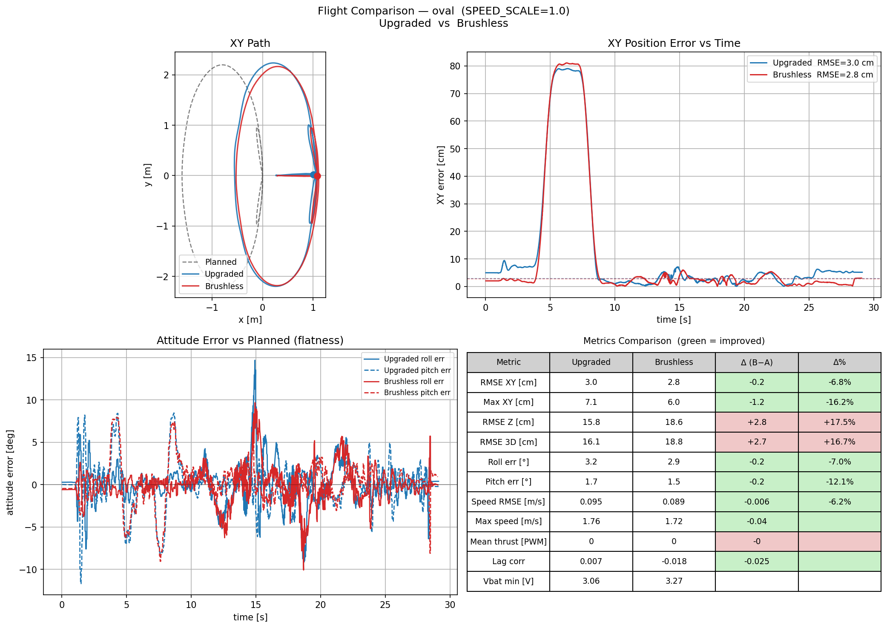

All four show the same picture as §9.5/§9.6's tables: the XY-path panels trace nearly identical
loops for both platforms, and the XY-error-vs-time panels show the same shape — a large transient
during the pre-motion/takeoff phase (correctly excluded from the reported RMSE) settling to a
small, near-equal steady-state error for both colors once the trajectory actually starts.

The two anomalous types from §9.5 look visually different from the four above, and different from
each other — confirming both are real, not the same recurring bug:

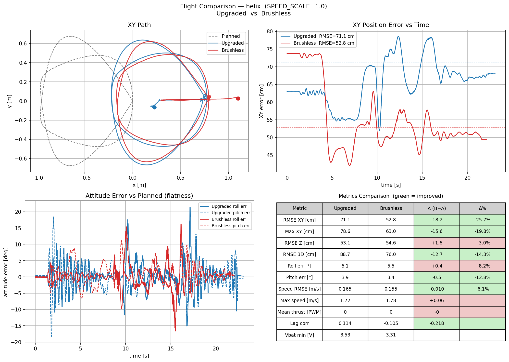

`helix`: both platforms' flown loops (solid) are visibly smaller-radius than the planned spiral
(dashed) — a real shape undershoot, not a phase artifact. Steady-state error settles around
45-55cm (brushless) / 65-75cm (upgraded) rather than the few-cm floor seen on circle/oval.

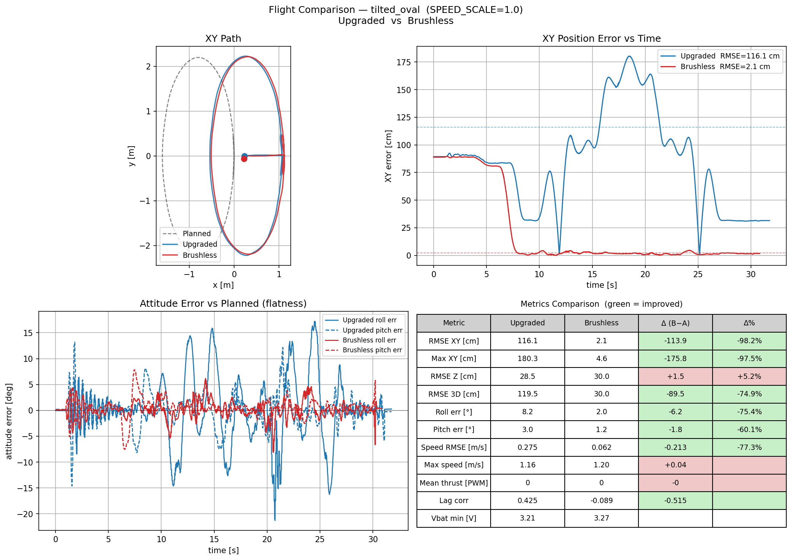

`tilted_oval`: brushless (red) sits at its usual few-cm floor throughout. Upgraded (blue) shows a
distinctive sawtooth — large excursions (up to ~180cm) recurring roughly once per lap, with sharp
dips back near zero at the lap-restart point (visible at t≈12s and t≈25s, ~12-13s apart, matching
the trajectory's own lap time). That periodicity is the direct visual confirmation behind §9.4's
"real, localized-in-phase tracking failure" conclusion — a script bug would not produce a
lap-synchronized pattern like this.

**Generated by**: `Controls/analyze_flight.py --csv <A> --compare <B> --labels "Upgraded,Brushless"`.

---

## 10. Final data collection session, 2026-07-25 — footage + completed oval/circle sweeps, both platforms

Last lab session before the project presentation. Goal: capture presentation footage (hover/
circle/figure8/oval on upgraded) and complete the oval/circle kt-sweep density on both platforms
for a full cross-platform comparison. All flying for the project is now complete — this section
is the final consolidation before moving to slides.

### 10.1 Oval kt sweep — final state, both platforms

| kt | Upgraded | Brushless |
|---|---|---|
| 0.05 | clean | clean |
| 0.1 | clean | clean |
| 0.2 | clean | clean |
| 0.3 | clean | clean (1 retake — see dropout note below) |
| 0.4 | clean | clean (1 retake — see dropout note below) |
| 0.5 | **crashed** (3/3 attempts across the whole project) | clean |
| 0.6 | **crashed** | not flown |
| 0.7 | not flown | **crashed** (§18.2, confirmed earlier) |

**Dropout note**: brushless oval kt=0.3 and kt=0.4 each had one attempt that cut off abruptly
mid-flight (1.0s and 2.3s into a ~13s planned lap) with frozen RPM telemetry in the last few
samples — a radio/telemetry link dropout, not a crash (z-position was flat/normal right up to the
cutoff, not diving). Since Mode D (`--onboard`) trajectories execute onboard independent of the
radio link, the physical flight may well have completed even though the log didn't capture it.
Retaken cleanly on the next attempt (22.2s and 28.4s full flights, normal z range throughout).

**Unchanged conclusion from §9.6**: upgraded's working ceiling is lower (~kt 0.3-0.4) than
brushless's (~kt 0.5, crash confirmed at 0.7) — this session's data is consistent with, not a
revision of, that finding.

### 10.2 Circle kt sweep — new data, both platforms

Circle had never been swept beyond kt=0.05 on either platform before this session (only the
oval/figure8/etc. family had kt-sweep data). Full sweep now exists 0.1→1.0 on both:

| kt | Upgraded | Brushless |
|---|---|---|
| 0.1-0.5 | **all clean** (7 attempts, 0.1-0.6) | **all clean** (5 attempts, 0.1-0.5) |
| 0.6 | clean | 1 crashed (z=-3.1m), 1 clean retry |
| 0.7 | marginal zone begins | clean |
| 0.7-1.0 | **marginal**: 4 clean / 5 crashed across 9 attempts | — |
| 0.8 | (in marginal zone above) | **crashed** (z=-2.0m) |
| 0.9 | (in marginal zone above) | **crashed** (z=-5.6m) |
| 1.0 | (in marginal zone above) | not flown (0.8/0.9 already crashed — stopped, correctly) |

**Key finding: both platforms show the same qualitative pattern — a clean-flight ceiling followed
by a marginal/inconsistent zone (crash and clean outcomes mixed at the same kt), not a sharp
threshold.** This mirrors the kw-floor finding elsewhere in this project ("inconsistent pass/fail
= marginal stability, not smooth degradation"). Rough ceiling comparison — upgraded clean to ~0.6,
brushless clean to ~0.5 — is close enough on this sample size that a real platform difference in
*where* the marginal zone starts is not established; what IS established is that both platforms
have one, which is itself informative (circle's aggressive cornering demand creates a genuine
control-authority ceiling independent of platform/tuning).

**Cross-platform circle RMSE comparison** (same calibrated `--compare` methodology as oval, §9.7):

| kt | Upgraded XY RMSE | Brushless XY RMSE |
|---|---|---|
| 0.05 | 1.7 cm | 1.9 cm (tied) |
| 0.3 | 2.2 cm | **1.4 cm** (brushless ~36% lower — a real difference here, unlike kt=0.05) |

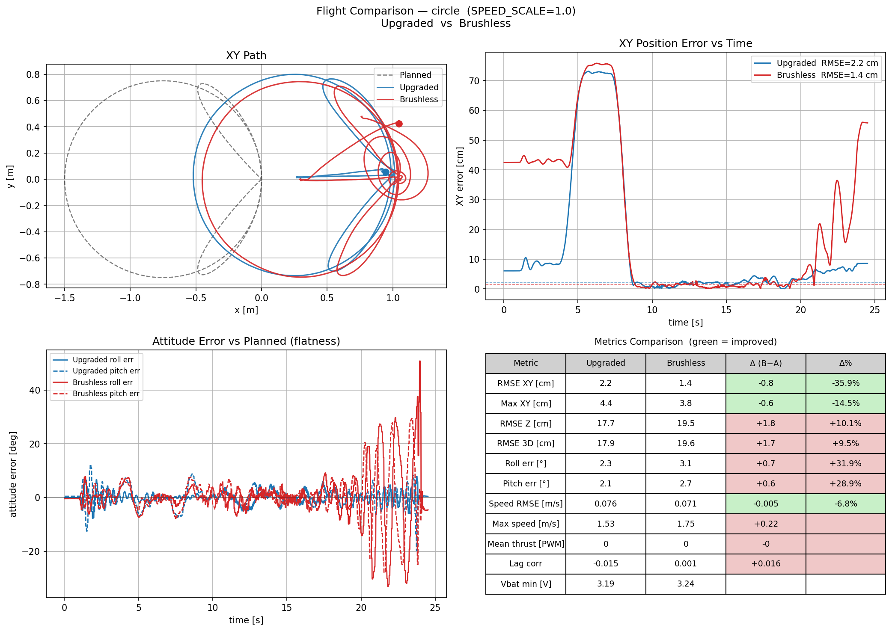

At kt=0.3, brushless tracks noticeably tighter than upgraded (1.4cm vs 2.2cm) — both platforms'
XY paths hug the planned circle closely (visible in the plot), but brushless is measurably closer.
Combined with kt=0.05's tie, the picture across circle is: **roughly tied at low aggressiveness,
brushless pulling ahead at moderate kt** — the opposite direction from a "brushless is worse"
expectation, and a useful nuance for the presentation (don't over-generalize "tracking is tied" from
kt=0.05 alone; it's kt-dependent). Roll/pitch error is slightly worse for brushless at this point
(3.1°/2.7° vs upgraded's 2.3°/2.1°) — position and attitude don't necessarily move together.

### 10.3 Brushless prop-guard removal + kt/J finding (closing aside, not part of the core investigation)

Operator removed the brushless drone's prop guards as a last-resort experiment. Measured mass
dropped from 41.0g (guards on) to 36.7g (guards off). kt re-identified from a clean hover
(`hover_mode0_2026-07-25_15-09-16.csv`, all 4 RPM channels valid): `kt1=4.0568e-10,
kt2=4.0758e-10, kt3=3.9739e-10, kt4=4.2230e-10` — consistent in scale with the guards-on values
(4.06-4.16e-10), as expected since kt is a motor/prop coefficient, not mass-dependent. Old
mass/kt preserved as comments in `crazyflies.yaml` for reference (not deleted).

Note: two earlier hover attempts the same session had `rpm_m4` reading a flat, unbroken zero
throughout (broken/disconnected RPM channel that specific flight) — not usable for kt4, resolved
itself on the next attempt (sensor fault was transient, not permanent).

Follow-up hover with the new kt values was noticeably noisier (gyro max ~450-480°/s vs the
~95-300°/s guards-on baseline) — not a crash, but a real degradation. **Root cause identified but
not pursued**: prop guards sit at the arm tips (large moment arm), so removing them measurably
lowers roll/pitch rotational inertia; the firmware's compiled `J` matrix was calibrated *with*
guards on (via the 18-flight TLS regression documented earlier in this doc) and is now mismatched,
degrading the INDI increment law (`delta_tau = J*(alpha_ref - alpha_meas)`). Re-deriving `J`
properly needs its own regression campaign — correctly not attempted with the project's remaining
time. Guards are back on; this does not affect any other result in this document.

### 10.4 Session wrap-up

All planned and bonus flying is complete: presentation footage captured, oval and circle kt
sweeps completed and cross-checked on both platforms, one incidental (and appropriately
not-pursued) hardware finding documented. `crazyflies.yaml` returned to the upgraded config
(`kr: 603.0`) as the project's final resting state. No further flights are planned — remaining
project work is presentation preparation only (see `FINALIZE_PROJECT.md`).

### 10.5 Log file manifest — traceability for every table entry above

All paths relative to `Controls/logs/`. Multiple files at the same kt = multiple attempts that
session (radio dropouts and marginal-zone crashes both produced retries) — **bold** = the specific
file whose number is quoted in a table or used in a `--compare` plot elsewhere in this doc;
plain = additional attempts at the same point, included for completeness/traceability, not
individually cited.

**Oval, upgraded:**

| kt | Files | Outcome |
|---|---|---|
| 0.05 | **`oval_mode1_kt0.05_2026-07-23_19-21-06.csv`**, `..._2026-07-25_12-31-48.csv` | clean |
| 0.1 | **`oval_mode1_kt0.1_2026-07-23_18-50-55.csv`**, `..._19-26-17.csv` (short abort), `..._2026-07-25_12-32-40.csv` | clean |
| 0.2 | `..._2026-07-23_18-56-40.csv` (elevated, survived), `..._19-02-51.csv` (short abort), **`..._19-27-51.csv`**, `..._2026-07-25_12-33-33.csv` | clean |
| 0.3 | **`oval_mode1_kt0.3_2026-07-23_19-28-35.csv`**, `..._2026-07-25_12-34-19.csv` | clean |
| 0.4 | `..._2026-07-23_19-32-34.csv` (**crash**, z=-9.03m), **`..._19-34-12.csv`** (clean retry), `..._2026-07-25_12-35-13.csv` | 1 crash, 2 clean |
| 0.5 | `..._2026-07-23_18-51-38.csv`, `..._19-30-02.csv`, `..._19-34-52.csv`, `..._2026-07-25_12-36-00.csv`, `..._12-37-37.csv` | **crashed every attempt (5/5)** |
| 0.6 | `..._2026-07-23_19-36-12.csv`, `..._2026-07-25_12-39-09.csv` | **crashed (2/2)** |

**Oval, brushless:**

| kt | Files | Outcome |
|---|---|---|
| 0.05 | **`oval_mode1_kt0.05_2026-07-22_18-21-47.csv`** | clean |
| 0.1 | `oval_mode1_kt0.1_2026-07-25_13-48-19.csv` (clean), `..._13-49-00.csv` (short, inconclusive), `..._13-52-33.csv` (clean) | clean |
| 0.2 | **`oval_mode1_kt0.2_2026-07-22_18-38-26.csv`**, `..._2026-07-25_13-53-34.csv`, `..._13-54-36.csv` | clean |
| 0.3 | **`oval_mode1_kt0.3_2026-07-22_18-39-15.csv`**, `..._2026-07-25_13-55-19.csv` (dropout, inconclusive), `..._14-05-48.csv` (clean retake) | clean |
| 0.4 | `oval_mode1_kt0.4_2026-07-25_13-57-56.csv` (dropout, inconclusive), `..._14-08-02.csv` (clean retake) | clean |
| 0.5 | `..._2026-07-22_18-39-49.csv` (never left ground, aborted), **`..._18-41-05.csv`**, `..._18-43-41.csv` (mild dip, survived) | clean |
| 0.7 | `oval_mode1_kt0.7_2026-07-22_18-41-50.csv` | **crashed** (§18.2) |

**Circle, upgraded:**

| kt | Files | Outcome |
|---|---|---|
| 0.05 | **`circle_mode1_kt0.05_2026-07-23_19-12-43.csv`** | clean |
| 0.1 | `circle_mode1_kt0.1_2026-07-25_12-47-21.csv` | clean |
| 0.2 | `circle_mode1_kt0.2_2026-07-25_12-48-57.csv`, `..._12-49-35.csv` | clean |
| 0.3 | **`circle_mode1_kt0.3_2026-07-25_12-50-20.csv`** | clean |
| 0.4 | `circle_mode1_kt0.4_2026-07-25_12-50-59.csv` | clean |
| 0.5 | `circle_mode1_kt0.5_2026-07-25_12-23-20.csv`, `..._12-24-03.csv`, `..._12-51-40.csv` | clean |
| 0.6 | `circle_mode1_kt0.6_2026-07-25_12-52-19.csv` | clean |
| 0.7 | `..._12-24-54.csv` (**crash**, z=-24.1m), `..._12-52-58.csv` (**crash**, z=-4.1m), `..._12-54-19.csv` (clean), `..._12-59-39.csv` (short, inconclusive) | 2 crash, 1 clean |
| 0.8 | `circle_mode1_kt0.8_2026-07-25_13-00-56.csv` | clean |
| 0.9 | `..._13-01-39.csv` (too short to judge), `..._13-02-59.csv` (**crash**, z=-4.3m) | crashed |
| 1.0 | `circle_mode1_kt1_2026-07-25_12-55-13.csv` (clean), `..._13-04-44.csv` (**crash**, z=-10.8m) | 1 crash, 1 clean |

**Circle, brushless:**

| kt | Files | Outcome |
|---|---|---|
| 0.05 | **`circle_mode1_kt0.05_2026-07-22_18-26-28.csv`** | clean |
| 0.1 | `circle_mode1_kt0.1_2026-07-25_14-14-45.csv` | clean |
| 0.2 | `circle_mode1_kt0.2_2026-07-25_14-15-29.csv` | clean |
| 0.3 | **`circle_mode1_kt0.3_2026-07-25_14-16-08.csv`** | clean |
| 0.4 | `circle_mode1_kt0.4_2026-07-25_14-16-46.csv` | clean |
| 0.5 | `circle_mode1_kt0.5_2026-07-25_14-17-23.csv` | clean |
| 0.6 | `..._14-18-05.csv` (**crash**, z=-3.1m), `..._14-19-21.csv` (clean retry) | 1 crash, 1 clean |
| 0.7 | `circle_mode1_kt0.7_2026-07-25_14-19-59.csv` | clean |
| 0.8 | `circle_mode1_kt0.8_2026-07-25_14-20-37.csv` | **crash** (z=-2.0m) |
| 0.9 | `circle_mode1_kt0.9_2026-07-25_14-22-25.csv` | **crash** (z=-5.6m) |
| 1.0 | not flown (0.8/0.9 already crashed) | — |

**Other trajectories at kt=0.05 (§9.1, §9.5), one file per platform, both clean unless noted:**

| Trajectory | Upgraded | Brushless |
|---|---|---|
| corner | `corner_mode1_kt0.05_2026-07-23_19-13-14.csv` (**crash**) | `corner_mode1_kt0.05_2026-07-22_18-25-42.csv` (clean) |
| slalom | `slalom_mode1_kt0.05_2026-07-25_13-18-25.csv`, `..._13-19-21.csv`, `..._13-22-00.csv` (all **crash/near-crash**, §10 slalom retest); also `..._2026-07-23_19-21-46.csv` (**crash**) | `slalom_mode1_kt0.05_2026-07-22_18-25-08.csv` (clean) |
| teardrop_wide | `teardrop_wide_mode1_kt0.05_2026-07-23_19-24-34.csv` (**crash**) | `teardrop_wide_mode1_kt0.05_2026-07-22_18-27-05.csv` (**crash** — known unexplained issue, §9.1) |
| tilted_oval | `tilted_oval_mode1_kt0.05_2026-07-23_19-23-44.csv` (clean, anomalous tracking §9.5) | `tilted_oval_mode1_kt0.05_2026-07-22_18-24-20.csv` (clean, full log — the shorter `..._18-23-02.csv` is truncated, don't use) |
| helix | `helix_mode1_kt0.05_2026-07-23_19-20-08.csv` (clean retry — `..._19-16-47.csv` was a **crash**, first attempt) | `helix_mode1_kt0.05_2026-07-22_18-22-32.csv` (clean) |

---

## 11. Optional stage-2 notch filter — implementation (2026-07-28, not yet flight-tested)

Direct response to §8's synthesis: fc_bw=70 Hz (stage-1 Butterworth) is confirmed to do nothing at
the 7.22 Hz shake (`|filtered/raw|=1.000`, -2.1° phase), and lowering fc_bw into that band was
already tried and found 3-4× worse (§4b-fc-bw-10) — a low-pass has to trade off the WHOLE spectrum
below its cutoff, not just the resonant band. A band-reject (notch) filter targeting only the
diagnosed band avoids that tradeoff by construction: it removes energy in a narrow window around
`f0` and leaves everything else — including its own phase — essentially untouched.

**Note on broadband vs. narrowband framing**: §4b-spectrum (100 Hz radio log, lower fidelity) found
the *input* vibration broadband across 0.3-40 Hz; the 500 Hz USD synthesis above found a genuine
*response* peak at 7.22 Hz. Both are consistent with the resonance interpretation already
established (ωₙ=√kr=7.80 Hz at kr=2400, matching to 8%): a broadband disturbance (motor/prop
vibration) driving a lightly-damped closed-loop resonance produces a narrowband *response* even
though the *forcing* is broadband. The notch targets where the resonance concentrates that energy
(the response, ~7.22 Hz), not the forcing — this is why targeting only that band is expected to
help regardless of which framing of the input is more accurate.

**Design**: RBJ Audio-EQ-Cookbook band-reject biquad (`NotchFilter` in `firmware_app/src/lib.rs`),
Direct Form I, `Q = f0/bw` → -3dB points at approximately `f0 ± bw/2`. Defaults `f0=7.2 Hz`,
`bw=5.0 Hz` → attenuated band ≈ 4.7-9.7 Hz, covering the diagnosed 5-10 Hz range. Both `f0` and
`bw` are runtime-tunable (`indi_gains.notch_f0/notch_bw`, no reflash needed to retune) since the
shake frequency has drifted 6.3-7.9 Hz across sessions.

**Applied symmetrically to all three signal chains that feed the final torque command**, matching
exactly how the existing stage-1 Butterworth is applied to `alpha_meas`/`alpha_ref` (and, given
this yaml's `filt_tau=1`, to `tau_current` too) — verified end-to-end so no chain can end up at a
different filter depth than the others when the notch is enabled:

| Chain | Stage-1 Butterworth | Stage-2 notch (`notch_en=1`) |
|---|---|---|
| `alpha_meas` (measured) | always on | on, downstream of BW |
| `alpha_ref` (reference) | always on | on, downstream of BW |
| `tau_current` (increment base) | on if `filt_tau` **or** `notch_en` | on, downstream of BW |

`tau_current`'s BW is force-enabled whenever `notch_en=1` regardless of `filt_tau`'s own value —
closes an edge case where `tau_current` could otherwise reach the notch at a shallower depth (no
BW) than `alpha_meas`/`alpha_ref` (always BW'd first), which would reintroduce a phase mismatch of
the same class `filt_tau` exists to prevent for the stage-1 filter. All three notch filter
instances run continuously every tick regardless of `notch_en` (state stays warmed up); only the
*selection* of filtered-vs-unfiltered value feeding the control law is gated — so toggling
`notch_en` at runtime has no cold-start transient on any chain.

**Default off = byte-identical to prior behaviour**, verified: `notch_en=0` (C global default and
yaml default) collapses `tau_bw_needed` back to exactly `filt_tau != 0` (today's condition) and the
alpha-chain selection back to exactly `(alpha_ref_filt, alpha_meas)` (today's values) — no new code
path executes differently, only extra (unused) computation happens.

**Logging — both radio and SD, so the fix can be checked either way**:
- Radio: new `indi_alp_notch` custom_topic (`indi.alp_notch_x/y/z`, 3 floats @ 100 Hz), always
  populated regardless of `notch_en` (same "passive filter for characterisation" philosophy as the
  existing `alp_raw`/`alp` split) — lets `alp_raw` / `alp` (BW) / `alp_notch` be compared from one
  flight.
- SD (500 Hz): `tools/usd_indi_diagnostic_config.txt` updated to add `indi.alp_notch_x/y` — this
  required raising `MAX_USD_LOG_VARIABLES_PER_EVENT` in `crazyflie-firmware/src/deck/drivers/src/
  usddeck.c` from 20 (previously exactly full) to 40 (pure `#define`, +800 bytes RAM, verified by
  rebuild: RAM 90780→91580 bytes). `tools/decode_usd_log.py` renamed accordingly.

**Runtime params added** (`indi_gains` group): `notch_en` (uint8, default 0), `notch_f0` (float,
default 7.2), `notch_bw` (float, default 5.0). Pushed per-flight from `crazyflies.yaml` exactly
like `kr`/`kw`/`fc_bw` (`notch_f0`/`notch_bw` are in the runtime-pushed float set; `notch_en` is
metadata-only like `filt_order`/`ff_free`/`filt_tau`, boot-set from yaml, uint8 params aren't
pushed via the float `setParam` loop).

**Files touched**: `firmware_app/src/lib.rs` (filter + wiring), `firmware_app/traj_iface.c`
(params + log bridge), `crazyswarm2/crazyflie/config/crazyflies.yaml` (params + custom_topic),
`crazyswarm2/crazyflie_examples/crazyflie_examples/flight.py` (CSV/subscription wiring),
`crazyflie-firmware/src/deck/drivers/src/usddeck.c` (SD var cap), `tools/usd_indi_diagnostic_
config.txt` + `tools/decode_usd_log.py` (SD wiring).

**Status**: implemented and build-verified (`make` clean, no new warnings) with `notch_en=0` in the
active yaml block — **not yet flashed (`make cload`) or flight-tested**. Expected result if the
resonance-amplification hypothesis is correct: `alp_notch` should show a sharp amplitude drop
relative to `alp_raw`/`alp` at ~7 Hz, and `tau_x/tau_y` should visibly calm down with `notch_en=1`
vs `notch_en=0` on an otherwise-identical hover/figure-8. Caveat: the notch removes resonant
*energy*, not the *phase lag* itself — actuator lag (82° at 7.22 Hz, the larger of the two measured
lag terms vs. EKF's 20°, §8's synthesis) is a separate mechanism this doesn't address; if the shake
turns out to be phase-lag-dominated rather than amplitude/resonance-dominated, this alone may not
fully resolve it. Next step: `make cload` + hover/figure-8 A/B flight with `notch_en` toggled.

---

## Reference baselines (other drones, for comparison)

- **Standard CF2.1 INDI:** 3.87 cm XY RMSE (June 20 2026, kr=1050) — `results_2026-06-20.md`
- **Upgraded CF2.1 INDI:** 3.7 cm mean XY RMSE, n=11 (July 15 2026, kr=603) — `results_2026-07-11_upgraded_drone.md`
- **Brushless CF21BL INDI:** 2.48 cm mean XY RMSE, n=12 (July 19 2026, kr=2400/kw=170/kp=64/kv=5) — §5d-validation above

---

## Opening the interactive plots

Relative links to `.html` files inside a markdown preview (Cursor/VS Code) open the file as
source inside the editor, not in a browser — that's a preview-tool limitation, not a doc issue.
Run these instead (from anywhere; paths are absolute), or paste one line at a time:

```bash
cd /home/georg/Desktop/flying_robot_course/flying_drone_stack/docs

# All 12 at once (best + mean, all 6 panel types), each its own Chrome tab:
google-chrome platform_compare_*_interactive.html

# Individually:
google-chrome platform_compare_best_analysis_interactive.html
google-chrome platform_compare_best_analysis_axes_interactive.html
google-chrome platform_compare_best_analysis_kinematics_interactive.html
google-chrome platform_compare_best_3d_orientation_interactive.html
google-chrome platform_compare_best_indi_panel_interactive.html
google-chrome platform_compare_best_rpm_balance_interactive.html
google-chrome platform_compare_mean_analysis_interactive.html
google-chrome platform_compare_mean_analysis_axes_interactive.html
google-chrome platform_compare_mean_analysis_kinematics_interactive.html
google-chrome platform_compare_mean_3d_orientation_interactive.html
google-chrome platform_compare_mean_indi_panel_interactive.html
google-chrome platform_compare_mean_rpm_balance_interactive.html
```

If this repo was cloned elsewhere, replace the `cd` path with wherever
`flying_drone_stack/docs/` ended up locally.
